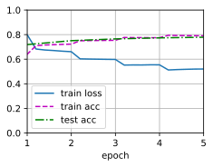

# 7 Natural Language Inference: Fine-Tuning BERT

:label:`sec_natural-language-inference-bert`

- 我们可以针对下游应用对预训练的BERT模型进行微调，例如在SNLI数据集上进行自然语言推断。
- 在微调过程中，BERT模型成为下游应用模型的一部分。仅与训练前损失相关的参数在微调期间不会更新。

In earlier sections of this chapter, we have designed an attention-based architecture (in [5_natural_language_inference_attention.md](5_natural_language_inference_attention.md)) for the NLI task on the SNLI dataset (as described in [4_natural-language-inference-and-dataset.md](4_natural-language-inference-and-dataset.md)). Now we revisit this task by fine-tuning BERT. As discussed in [6_bert_apply.md](6_bert_apply.md), NLI is a sequence-level text pair classification problem, and fine-tuning BERT only requires an additional MLP-based architecture, as illustrated in [Fig. 15.7.1](https://d2l.ai/chapter_natural-language-processing-applications/natural-language-inference-bert.html#fig-nlp-map-nli-bert).

<center>
    
    <br>
    <div style="color:orange; border-bottom: 1px solid #d9d9d9;
    display: inline-block;
    color: #999;
    padding: 2px;">
      Fig. 15.7.1 This section feeds pretrained BERT to an MLP-based architecture for natural language inference.
  	</div>
</center>

In this section, we will download a pretrained small version of BERT, then fine-tune it for NLI on the SNLI dataset.

```python
import json
import multiprocessing
import os
import torch
from torch import nn
from d2l import torch as d2l
```

## 7.1. Loading Pretrained BERT

We have explained how to pretrain BERT on the WikiText-2 dataset in [9_bert_dataset.md](../diy_bert_pre/9_bert_dataset.md) and [10_bert_pretraining.md](../diy_bert_pre/10_bert_pretraining.md) (note that the original BERT model is pretrained on much bigger corpora). As discussed in [10_bert_pretraining.md](../diy_bert_pre/10_bert_pretraining.md), the original BERT model has hundreds of millions of parameters.

In the following, we provide two versions of pretrained BERT:

- “bert.base” is about as big as the original BERT base model that requires a lot of computational resources to fine-tune,
- while “bert.small” is a small version to facilitate demonstration.

```python
d2l.DATA_HUB['bert.base'] = (d2l.DATA_URL + 'bert.base.torch.zip',
                             '225d66f04cae318b841a13d32af3acc165f253ac')
d2l.DATA_HUB['bert.small'] = (d2l.DATA_URL + 'bert.small.torch.zip',
                              'c72329e68a732bef0452e4b96a1c341c8910f81f')
```

Either pretrained BERT model contains a "vocab.json" file that defines the vocabulary set and a "pretrained.params" file of the pretrained parameters. We implement the following `load_pretrained_model` function to load pretrained BERT parameters.

(读取Bert的vocab、以及加载Bert模型的预训练parameter)

```python
def load_pretrained_model(pretrained_model, num_hiddens, ffn_num_hiddens,
                          num_heads, num_layers, dropout, max_len, devices):
    data_dir = d2l.download_extract(pretrained_model)
    # Define an empty vocabulary to load the predefined vocabulary
    vocab = d2l.Vocab()
    vocab.idx_to_token = json.load(open(os.path.join(data_dir, 'vocab.json')))
    vocab.token_to_idx = {token: idx for idx, token in enumerate(
        vocab.idx_to_token)}
    bert = d2l.BERTModel(len(vocab), num_hiddens, norm_shape=[256],
                         ffn_num_input=256, ffn_num_hiddens=ffn_num_hiddens,
                         num_heads=4, num_layers=2, dropout=0.2,
                         max_len=max_len, key_size=256, query_size=256,
                         value_size=256, hid_in_features=256,
                         mlm_in_features=256, nsp_in_features=256)
    # Load pretrained BERT parameters
    bert.load_state_dict(torch.load(os.path.join(data_dir,
                                                 'pretrained.params')))
    return bert, vocab
```

To facilitate demonstration on most of machines, we will load and fine-tune the small version ("bert.small") of the pretrained BERT in this section. In the exercise, we will show how to fine-tune the much larger "bert.base" to significantly improve the testing accuracy.

```python
devices = d2l.try_all_gpus()
bert, vocab = load_pretrained_model(
    'bert.small', num_hiddens=256, ffn_num_hiddens=512, num_heads=4,
    num_layers=2, dropout=0.1, max_len=512, devices=devices)
```

Downloading ../data/bert.small.torch.zip from http://d2l-data.s3-accelerate.amazonaws.com/bert.small.torch.zip...

## 7.2 The Dataset for Fine-Tuning BERT

For the downstream task NLI on the SNLI dataset, we define a customized dataset class `SNLIBERTDataset`. In each example, the premise and hypothesis form a pair of text sequence and is packed into one BERT input sequence as depicted in [Fig. 15.6.2](6_bert_apply.md). Recall [8_bert.md](8_bert.md) that segment IDs are used to distinguish the premise and the hypothesis in a BERT input sequence. With the predefined maximum length of a BERT input sequence (`max_len`), the last token of the longer of the input text pair keeps getting removed until `max_len` is met.(最大长度max_len, 移除超过该长度的句子的后面的单词)

To accelerate generation of the SNLI dataset for fine-tuning BERT, we use 4 worker processes to generate training or testing examples in parallel.

```python
class SNLIBERTDatset(torch.utils.data.Dataset):
    def __init__(self, dataset:Tuple[list, list, list], max_len, vocab=None):
        """

        :param dataset:   a Tuple[list, list, list] =  (premises, hypotheses, labels)
        :param max_len:
        :param vocab:
        """ 
        # zip() 将可迭代的对象作为参数，将对象中对应的元素打包成一个个元组。
        # 如果各个迭代器的元素个数不一致，则返回列表长度与最短的对象相同，
        # 利用 zip(*) 即 * 号操作符（逆运算），可以将元组解压为列表。
        # 注意，两者返回的都是一个对象
        all_premise_hypothesis_tokens = [
            [p_tokens, h_tokens] for p_tokens, h_tokens in zip(*[
                tokenize([s.lower() for s in sentences]) for sentences in dataset[:2]
            ])
        ] # List[List[list, list], List[list, list], ...] = [[p_tokens, h_tokens], [p_tokens, h_tokens],..,] 
        self.labels = torch.tensor(dataset[2])
        self.vocab = vocab
        self.max_len = max_len
        (self.all_token_ids, self.all_segments, self.valid_lens) = self._preprocess(all_premise_hypothesis_tokens)
        print("read " + str(len(self.all_token_ids)) + " examples")

    def _preprocess(self, all_premise_hypothesis_tokens):
        pool = multiprocessing.Pool(4) # Use 4 worker processses (多进程)
        out = pool.map(self._mp_worker, all_premise_hypothesis_tokens) # 就是一个循环
        all_token_ids = [
            token_ids for token_ids, segments, valid_len in out
        ]
        all_segments = [segments for token_ids, segments, valid_len in out]
        valid_len = [valid_len for token_ids, segments, valid_len in out]
        return (torch.tensor(all_token_ids, dtype=torch.long),
                torch.tensor(all_segments, dtype=torch.long),
                torch.tensor(valid_len))

    def _mp_worker(self, premise_hypothesis_tokens: List[list, list]):
        """ 将 p 与 h合并成一个 bert pair input
    
        :param premise_hypothesis_tokens: [p_tokens, h_tokens]
        :return: token_ids, segments, valid_len
        """
        p_tokens, h_tokens = premise_hypothesis_tokens
        self._truncate_pair_of_tokens(p_tokens, h_tokens)
        tokens, segments = get_tokens_and_segments(p_tokens, h_tokens)
        token_ids = self.vocab[tokens] + [self.vocab["<pad>"]] * (self.max_len - len(tokens))
        segments = segments + [0] * (self.max_len - len(tokens))
        valid_len = len(tokens)
        return token_ids, segments, valid_len

    def _truncate_pair_of_tokens(self, p_tokens, h_tokens):
        # Reserve slots (保留位置) for '<CLS>', '<SEP>', and '<SEP>' tokens for the BERT input
        while len(p_tokens) + len(h_tokens) > self.max_len - 3:
            if len(p_tokens) > len(h_tokens):
                p_tokens.pop()
            else:
                h_tokens.pop()
```

After downloading the SNLI dataset, we generate training and testing examples by instantiating the `SNLIBERTDataset` class. Such examples will be read in minibatches during training and testing of NLI.

```python
# Reduce `batch_size` if there is an out of memory error. In the original BERT
# model, `max_len` = 512
batch_size, max_len, num_workers = 512, 128, d2l.get_dataloader_workers()
data_dir = d2l.download_extract('SNLI')
train_set = SNLIBERTDataset(d2l.read_snli(data_dir, True), max_len, vocab)
test_set = SNLIBERTDataset(d2l.read_snli(data_dir, False), max_len, vocab)
train_iter = torch.utils.data.DataLoader(train_set, batch_size, shuffle=True,
                                   num_workers=num_workers)
test_iter = torch.utils.data.DataLoader(test_set, batch_size,
                                  num_workers=num_workers)
```

read 549367 examples
read 9824 examples

## 7.3 Fine-Tuning BERT

As [Fig. 15.6.2](6_bert_apply.md) indicates, fine-tuning BERT for NLI requires only an extra MLP consisting of two fully-connected layers (see `self.hidden` and `self.output` in the following `BERTClassifier` class). This MLP transforms the BERT representation of the special “&lt;cls&gt;” token, which encodes the information of both the premise and the hypothesis, into three outputs of NLI: (分类)

- entailment,
- contradiction, and
- neutral.

```python
class BERTClassifier(nn.Module):
    def __init__(self, bert):
        super(BERTClassifier, self).__init__()
        self.encoder = bert.encoder # 微调参数
        self.hidden = bert.hidden # bert 的 线性层，微调，只用到了这两个，mlm、nsp未用
        self.output = nn.Linear(256, 3) # 直接训练

    def forward(self, inputs):
        tokens_X, segments_X, valid_lens_x = inputs
        encoded_X = self.encoder(tokens_X, segments_X, valid_lens_x)
        return self.output(self.hidden(encoded_X[:, 0, :]))
```

In the following, the pretrained BERT model `bert` is fed into the `BERTClassifier` instance `net` for the downstream application.

- In common implementations of BERT fine-tuning, only the parameters of the output layer of the additional MLP (`net.output`) will be learned from scratch (从0开始学习).
- All the parameters of the pretrained BERT encoder (`net.encoder`) and the hidden layer of the additional MLP (`net.hidden`) will be fine-tuned（微调）.

```python
net = BERTClassifier(bert)
```

Recall that in [8_bert.md](../diy_bert_pre/8_bert.md) both the `MaskLM` class and the `NextSentencePred` class have parameters in their employed MLPs. These parameters are part of those in the pretrained BERT model `bert`, and thus part of parameters in `net`. **However**, such parameters are only for computing the MLM loss and the NSP loss during pretraining. These two loss functions are irrelevant to fine-tuning downstream applications (与微调任务无关), **thus** the parameters of the employed MLPs in `MaskLM` and `NextSentencePred` **are not updated (staled)** when BERT is fine-tuned.

- （我们只微调 BERT encoder部分的参数，对于MLM、NSP任务所添加的 `self.mlm, self.nsp` 的参数实际上与微调任务无关，因此不会用到它们，它们的参数也将不会变化）

To allow parameters with stale gradients （自定义训练方式，允许这种stale gradient的训练方式）, the flag `ignore_stale_grad=True` is set in the `step` function of `d2l.train_batch_ch13`. We use this function to train and evaluate the model `net` using the training set (`train_iter`) and the testing set (`test_iter`) of SNLI. Due to the limited computational resources, the training and testing accuracy can be further improved: we leave its discussions in the exercises.

```python
lr, num_epochs = 1e-4, 5
trainer = torch.optim.Adam(net.parameters(), lr=lr)
# 注意，这里的net.parameters()不包括bert.mlm, bert.nsp参数
loss = nn.CrossEntropyLoss(reduction="none")
d2l.train_epoch_ch3(net, train_iter, loss, trainer, num_epochs, devices)
```

loss 0.520, train acc 0.791, test acc 0.779
11043.0 examples/sec on [device(type='cuda', index=0), device(type='cuda', index=1)]


## Summary

* We can fine-tune the pretrained BERT model for downstream applications, such as natural language inference on the SNLI dataset.
* During fine-tuning, the BERT model becomes part of the model for the downstream application. Parameters that are only related to pretraining loss will not be updated during fine-tuning.

## Exercises

1. Fine-tune a much larger pretrained BERT model that is about as big as the original BERT base model if your computational resource allows. Set arguments in the `load_pretrained_model` function as: replacing 'bert.small' with 'bert.base', increasing values of `num_hiddens=256`, `ffn_num_hiddens=512`, `num_heads=4`, and `num_layers=2` to 768, 3072, 12, and 12, respectively. By increasing fine-tuning epochs (and possibly tuning other hyperparameters), can you get a testing accuracy higher than 0.86?
2. How to truncate a pair of sequences according to their ratio of length? Compare this pair truncation method and the one used in the `SNLIBERTDataset` class. What are their pros and cons?

[Discussions](https://discuss.d2l.ai/t/1526)
