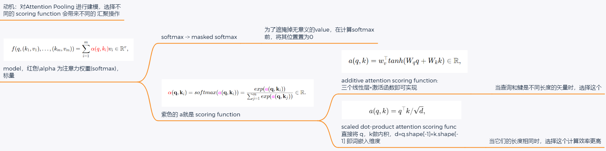

# 3. Attention Scoring Functions



## 总结

将注意力汇聚的输出计算可以作为值的加权平均，选择不同的注意力评分函数会带来不同的注意力汇聚操作。

1. 当查询和键是不同长度的矢量时，可以使用**additive attention scoring function**。
2. 当它们的长度相同时，使用缩放的**scaled dot-product attention scoring function**的**计算效率更高**。

* additive attention scoring function：将query和key合并起来进入一个单输出单隐藏层的感知机
* **scaled dot-product attention scoring function**：将query和key直接做内积

## 正文

In [Section 1](./1_Attention_Cues_and_Pooling.md), we used a `Gaussian kernel` to model interactions between `queries` and `keys`. Treating the exponent of the `Gaussian kernel` in [(2.6)]() as an **attention scoring function** (or *scoring function* for short), the results of this function were essentially fed into a `softmax` operation. As a result, we obtained a **probability distribution** (attention weights) over `values` that are paired with `keys`. In the end, the output of the attention pooling is simply a **weighted sum** of the values based on these attention weights.

At a high level, we can use the above algorithm to instantiate (实例化) the framework of attention mechanisms in [Fig. 1.3](). Denoting an attention scoring function by a, [Fig. 3.1]() illustrates **how the output of attention pooling can be computed as a weighted sum of values.** Since attention weights are a probability distribution, the weighted sum is essentially a weighted average.

<center>
    
    <br>
    <div style="color:orange; border-bottom: 1px solid #d9d9d9;
    display: inline-block;
    color: #999;
    padding: 2px;">
      Fig 3.1 Computing the output of attention pooling as a weighted average of values.
  	</div>
</center>

Mathematically, suppose that we have a query $q\in \mathbb{R}^q$ and $m$ `key-value` pairs $(k_1,v_1),…,(k_m,v_m)$, where any $k_i\in \mathbb{R}^k$ and any $v_i\in \mathbb{R}^v$. The attention pooling $f$ is instantiated as a weighted sum of the values:

$$
f(q,(k_1,v_1),…,(k_m,v_m))=\sum_{i=1}^m {\color{red}α(q,k_i)}v_i\in \mathbb{R}^v, \tag{3.1}

$$

where $\color{red}\text{the attention weight (scalar) } α(q,k_i)$ for the `query` $q$ and `key` $k_i$ is computed by the `softmax operation` of an **attention scoring function ${\color{magenta}a}$** that maps two vectors to a scalar:

$$
{\color{red}α}(\textbf{q},\textbf{k}_i)=softmax({\color{magenta}a}(\textbf{q},\textbf{k}_i))=\frac{exp⁡({\color{magenta}a}(\textbf{q},\textbf{k}_i))}{\sum_{j=1}^m exp⁡({\color{magenta}a}(\textbf{q},\textbf{k}_j))}\in \mathbb{R}. \tag{3.2}

$$

As we can see, different choices of the a**ttention scoring function** ${\color{red}a}$ lead to different behaviors of attention pooling. In this section, we introduce two popular scoring functions that we will use to develop more sophisticated attention mechanisms later.

## 3.1. Masked Softmax Operation

As we just mentioned, a `softmax operation` is used to output a probability distribution as attention weights. In some cases, **not all the values** should be fed into attention pooling. For instance, for efficient minibatch processing in [Section 9.5](https://d2l.ai/chapter_recurrent-modern/machine-translation-and-dataset.html#sec-machine-translation), some text sequences are padded with special tokens that do not carry meaning.(有些values实际上是没有意义的)

To get an attention pooling over **only meaningful tokens as values**, we can specify a valid sequence length (in number of tokens) to filter out those beyond this specified range when computing `softmax`. In this way, we can implement such a **masked softmax operation** in the following `masked_softmax` function, where any value beyond the valid length is masked as **zero.**

To demonstrate how this function works, consider a minibatch of two $2×4$ matrix examples, where the valid lengths for these two examples are two and three, respectively. As a result of the `masked softmax operation`, values beyond the valid lengths are all masked as zero.

## 3.2. Additive Attention 这个是求$a$的

In general, when `queries` and `keys` are vectors of **different lengths**, we can use additive attention as the scoring function. 使用线性层将二者维度变为一致。

Given a `query` $q\in \mathbb{R}^q$ and a `key` $k\in \mathbb{R}^k$, the **additive attention scoring function**

$$
a(q,k)=w_v^⊤tanh(W_q q + W_k k)\in \mathbb{R},\tag{3.3}

$$

where learnable parameters $W_q\in \mathbb{R}^{h×q}$, $W_k\in \mathbb{R}^{h×k}$, and $w_v\in \mathbb{R}^h$. Equivalent to [(3.3)](), the `query` and the `key` are concatenated and fed into an `MLP` with a single `hidden layer` whose number of hidden units is $h$, a hyperparameter. By using `tanh` as the activation function and disabling bias terms, we implement additive attention in the following.

```python
class AdditiveAttention(nn.Module):
    """Additive attention"""
    def __init__(self, key_size, query_size, num_hiddens, dropout, **kwargs):
        super(AdditiveAttention, self).__init__(**kwargs)
        self.W_k = nn.Linear(key_size, num_hiddens, bias=False)
        self.W_q = nn.Linear(query_size, num_hiddens, bias=False)
        self.W_v = nn.Linear(num_hiddens, 1, bias=False)
        self.dropout = nn.Dropout(dropout)
    def forward(self, queries, keys, values, valid_lens):
        queries, keys = self.W_q(queries), self.W_k(keys)
        features = queries.unsqueeze(2) + keys.unsqueeze(1)
        # After dimension expansion, 将queries与keys的维度错开
        # shape of "queries": ("batch_size", queries 的数量, 1, "num_hiddens") and
        # shape of "keys": ("batch_size", 1, key-value pairs 的数量 , "num_hiddens").
        # Sum them up with broadcasting
        features = torch.tanh(features)
        # There is only one output of `self.w_v`, so we remove the last
        # one-dimensional entry from the shape.
        scores = self.W_v(features).squeeze(-1) # 去掉 shape=1 的 axis,
        # score.shape = (`batch_size`, no. of queries, no. of key-value pairs)
        self.attention_weights = masked_softmax(scores, valid_lens)
        # Shape of `values`:
        # (`batch_size`, no. of key-value pairs, value dimension)
        return torch.bmm(self.dropout(self.attention_weights), values)
```

## 3.3. Scaled Dot-Product Attention

A **more computationally efficient design** for the `scoring function` can be simply dot product. **However**, the dot product operation requires that both the `query` and the `key` have the same vector length, say $d$. Assume that all the elements of the query and the key are independent random variables with zero mean and unit variance. The dot product of both vectors has zero mean and a variance of $d$. (a，b服从0均值，1的方差，那么$a\cdot b$也服从该分布）  To ensure that the variance of the dot product still remains one regardless of vector length, the **scaled dot-product attention** scoring function。 (a，b服从0均值，1的方差，那么$a\cdot b$也服(0, d)的分布，如果想使得也服从(0,1)则需要把该函数除以 $\sqrt{d}$）

$$
a(q,k)=q^⊤ k/ \sqrt{d}, \tag{3.4}

$$

divides the dot product by $d$. In practice, we often think in minibatches for efficiency, such as computing attention for $n$ `queries` and $m$ `key-value` pairs, where `queries` and `keys` are of length $d$ and `values` are of length $v$. The scaled dot-product attention of `queries` $Q∈\mathbb{R}^{n×d}$, `keys` $K\in \mathbb{R}^{m×d}$, and `values` $V\in \mathbb{R}^{m×v}$ is

$$
softmax(\frac{QK^⊤}{\sqrt{d}})V\in \mathbb{R}^{n×v}. \tag{3.5}

$$

In the following implementation of the scaled dot product attention, we use dropout for model regularization.

```python
#@save
class DotProductAttention(nn.Module):
    """缩放点积注意力"""
    def __init__(self, dropout, **kwargs):
        super(DotProductAttention, self).__init__(**kwargs)
        self.dropout = nn.Dropout(dropout)

    # queries的形状：(batch_size，查询的个数，d)
    # keys的形状：(batch_size，“键－值”对的个数，d)
    # values的形状：(batch_size，“键－值”对的个数，值的维度)
    # valid_lens的形状:(batch_size，)或者(batch_size，查询的个数)
    def forward(self, queries, keys, values, valid_lens=None):
        d = queries.shape[-1]
        # 设置transpose_b=True为了交换keys的最后两个维度
        scores = torch.bmm(queries, keys.transpose(1,2)) / math.sqrt(d)
        self.attention_weights = masked_softmax(scores, valid_lens)
        return torch.bmm(self.dropout(self.attention_weights), values)
```

To demonstrate the above `DotProductAttention` class, we use the same `keys`, `values`, and valid lengths from the earlier toy example for additive attention. For the dot product operation, we make the feature size of queries the same as that of keys.

```python
queries = torch.normal(0, 1, (2, 1, 2))
attention = DotProductAttention(dropout=0.5)
attention.eval()
attention(queries, keys, values, valid_lens)
```

Same as in the **additive attention** demonstration, since `keys` contains the same element that cannot be differentiated by any query, uniform attention weights are obtained.
