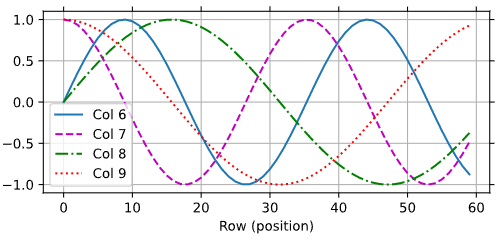
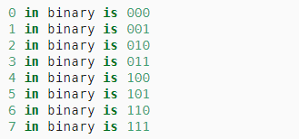

# 6. Self-Attention and Positional Encoding

- 在self-attention中，query、key、value都来自同一输入
- CNNs与Self-Attention都有并行计算的优势，且Self-Attention的最大路径长度最短。但是因为其计算复杂度是关于序列长度的二次方，所以在长序列中的计算会很慢
- 为了使用序列的顺序信息，我们可以通过在输入表示中添加位置编码Positional Encoding，来注入绝对或者相对位置信息

In deep learning, we often use CNNs or RNNs to encode a sequence. Now with attention mechanisms, imagine that we feed a sequence of tokens into attention pooling so that the same set of tokens act as `queries`, `keys`, and `values`. Specifically, each `query` attends to all the `key-value` pairs and generates one attention output. Since the `queries`, `keys`, and `values` come from the same place, this performs **self-attention** [[Lin et al., 2017b]](https://d2l.ai/chapter_references/zreferences.html#lin-feng-santos-ea-2017)[[Vaswani et al., 2017]](https://d2l.ai/chapter_references/zreferences.html#vaswani-shazeer-parmar-ea-2017), which is also called *intra-attention* [[Cheng et al., 2016]](https://d2l.ai/chapter_references/zreferences.html#cheng-dong-lapata-2016)[[Parikh et al., 2016]](https://d2l.ai/chapter_references/zreferences.html#parikh-tackstrom-das-ea-2016)[[Paulus et al., 2017]](https://d2l.ai/chapter_references/zreferences.html#paulus-xiong-socher-2017). In this section, we will discuss sequence encoding using self-attention, including using additional information for the sequence order.

## 6.1. Self-Attention

Given a sequence of input tokens $x_1,…,x_n$ where any $x_i\in \mathbb{R}^d (1≤i≤n)$, its self-attention outputs a sequence of the same length $y_1,…,y_n$, where

$$
y_i=f(x_i,(x_1,x_1),…,(x_n,x_n))\in \mathbb{R}^d, \tag{6.1}

$$

according to the definition of attention pooling $f$ in [(2.4)](./1_Attention_Cues_and_Pooling.md). Using multi-head attention, the following code snippet (片段) computes the self-attention of a tensor with shape `(batch size, number of time steps or sequence length in tokens, d)`. The output tensor has the same shape.

## 6.2. Comparing CNNs, RNNs, and Self-Attention

Let us compare architectures for **mapping** a sequence of $n$ tokens **to** another sequence of equal length, where each input or output token is represented by a $d$-dimensional vector. Specifically, we will consider `CNNs`, `RNNs`, and `self-attention`. We will compare their **computational complexity**, **sequential operations**, and **maximum path lengths**. Note that sequential operations prevent parallel computation, **while** a shorter path between any combination of sequence positions makes it easier to learn long-range dependencies within the sequence [[Hochreiter et al., 2001]](https://d2l.ai/chapter_references/zreferences.html#hochreiter-bengio-frasconi-ea-2001).

<center>
    
    <br>
    <div style="color:orange; border-bottom: 1px solid #d9d9d9;
    display: inline-block;
    color: #999;
    padding: 2px;">
      Fig 6.1 Comparing CNN (padding tokens are omitted), RNN, and self-attention architectures
  	</div>
</center>

Consider a convolutional layer whose kernel size is $k$. We will provide more details about sequence processing using `CNNs` in later chapters. For now, we only need to know that since the sequence length is $n$, the numbers of input and output channels are both $d$, the computational complexity of the convolutional layer is $\mathcal{O}(knd^2)$. As [Fig. 6.1]() shows, `CNNs` are hierarchical so there are $\mathcal{O}(1)$ sequential operations and the maximum path length is $\mathcal{O}(n/k)$. For example, $x_1$ and $x_5$ are within the receptive field of a two-layer `CNN` with kernel size $3$ in [Fig. 6.1]().

When updating the hidden state （隐状态） of `RNNs`, multiplication of the $d×d$ weight matrix and the $d$-dimensional hidden state has a computational complexity of $\mathcal{O}(d^2)$. Since the sequence length is $n$, the computational complexity of the recurrent layer is $\mathcal{O}(nd^2)$. According to [Fig. 6.1](), there are $\mathcal{O}(n)$ sequential operations that **cannot be parallelized** and the maximum path length is also $\mathcal{O}(n)$.

In `self-attention`, the `queries`, `keys`, and `values` are all $n×d$ matrices.  Consider the **scaled dot-product attention** in [(3.5)](./3_Attention_Scoring_Functions.md), where a $n×d$ matrix is multiplied by a $d×n$ matrix, then the output $n×n$ matrix is multiplied by a $n×d$ matrix. As a result, the `self-attention` has a $\mathcal{O}(n^2d)$ computational complexity. As we can see in [Fig. 6.1](), each token is directly connected to any other token via self-attention. Therefore, computation can be parallel with $\mathcal{O}(1)$ sequential operations and the maximum path length is also $\mathcal{O}(1)$.


| method         | computational complexity | sequential operations | maximum path length |
| ---------------- | -------------------------- | ----------------------- | --------------------- |
| CNNs           | $\mathcal{O}(knd^2)$     | $\mathcal{O}(1)$      | $\mathcal{O}(n/k)$  |
| RNNs           | $\mathcal{O}(nd^2)$      | $\mathcal{O}(n)$      | $\mathcal{O}(n)$    |
| self-Attention | $\mathcal{O}(n^2d)$      | $\mathcal{O}(1)$      | $\mathcal{O}(1)$    |

- the sequence length is $n$;
- the word2vec's dim of token is $d$;
- CNNs kernel size is $k$.

All in all, both `CNNs` and `self-attention` enjoy **parallel computation** and `self-attention` has the shortest maximum path length. **However**, the quadratic computational complexity with respect to the sequence length makes `self-attention` prohibitively slow for very long sequences. (卷积与自注意力都可以并行计算，并且自注意力的最大路径长度最短。但是由于计算复杂度是关于序列长度的二次方，所以不适合在长序列中计算)

## 6.3. Positional Encoding

Unlike `RNNs` that recurrently process tokens of a sequence one by one, `self-attention` ditches sequential operations in favor of **parallel computation**.

由于transformer的全对称性，这里假设$f(\cdot)$ 表示transformer，则对于一个句子$x = (...,x_m, ...,x_n,...)$ 有：

$$
f(...,x_m, ...,x_n,...)=f(...,x_n, ...,x_m,...)

$$

即函数天然满足$f(x,y)=f(y,x)$，以至于我们无法从结果是区分输入到底是$[x,y]$还是 $[y,x]$ 。因此我们需要打破这种对称性，此时就需要位置编码

一种好的位置编码方式，需要满足以下几条要求：

- 它能为每个时间步（句子中的单词位置）输出一个独一无二的编码
- 不同长度的句子之前，任何两个时间步之间的距离应该保持一致
- 模型能泛化到更长的句子
- 它的值应该是有界的

例如，在每个位置上都加一个不同的编码向量：

$$
\hat{f}(...,x_m, ...,x_n,...)) = f(...,x_m+p_m, ...,x_n+p_n,...))

$$

因此，只要每个位置的编码向量不同，那么这种全对称性就被打破了。

为简单起见，仅考虑$m$, $n$ 两个位置的函数，对其泰勒展开有：

$$
\begin{aligned}
\hat{f} &= f + \left(p_m^T \frac{\partial f}{\partial x_m} + p_n^T \frac{\partial f}{\partial x_n} + \frac{1}{2}p_m^T \frac{\partial^2 f}{\partial x_m^2} p_m + \frac{1}{2}p_n^T \frac{\partial^2 f}{\partial x_n^2} p_n \right) + p_m^T \frac{\partial^2 f}{\partial x_m \partial x_n} p_n \\
&= f + A + B
\end{aligned}

$$

其中，$A$ 包含了单词的绝对位置信息， $B$ 包含了单词的相对位置信息.

**一种好的位置编码方式，需要满足以下几条要求：**

- 它能为每个时间步（句子中的单词位置）输出一个独一无二的编码
- 不同长度的句子之前，任何两个时间步之间的距离应该保持一致
- 模型能泛化到更长的句子
- 它的值应该是有界的

**加入位置编码后，原本输入的embedding不就全部改变了吗，这样不会影响原始输入的特征吗？**

- 位置编码肯定要影响词嵌入的，但不见得是干扰。
- 神经网络中的参数不能当作单纯的数字(primitive)看待。词嵌入是可以学习的，不管是使用非参数化的位置编码，还是参数化的位置嵌入，词嵌入都是需要根据损失函数来调整自身的，因此这里位置特征对词嵌入的影响，至少不会是消极的(考虑到位置编码引入了大量对任务有用的信息)。

**To use the sequence order information**, we can inject absolute or relative positional information by adding **positional encoding** to the input representations. Positional encodings can be either learned or fixed. In the following, we describe a fixed positional encoding based on sine and cosine functions [[Vaswani et al., 2017]](https://d2l.ai/chapter_references/zreferences.html#vaswani-shazeer-parmar-ea-2017).

Suppose that the input representation $X\in \mathbb{R}^{n×d}$ contains the $d$-dimensional embeddings for $n$ tokens of a sequence (一个句子有n个词向量，词向量维度为d). The positional encoding outputs $X+P$ using a positional embedding matrix $P\in \mathbb{R}^{n×d}$ of the same shape, whose element on the $i^{th}$ row and the $(2j)^{th}$ or the $(2j+1)^{th}$ column is:

$$
p_{i,2j}=\sin⁡ \left( \frac{1}{10000^{2j/d}}\cdot i \right),\\ \tag{6.2}
p_{i,2j+1}=\cos \left(\frac{1}{10000^{2j/d}}\cdot i \right).

$$

注意，$i$ 是单词在句子中的顺序位置，$(2j)^{th}$ 与 $(2j+1)^{th}$ 是词向量的奇数和偶数维度，三角函数的频率为：$\mathcal{w}_i = \frac{1}{10000^{2j/d}}$。

At first glance, this trigonometric-function (三角函数) design looks weird. Before explanations of this design, let us first implement it in the following `PositionalEncoding` class.

```python
class PositionalEncoding(nn.Module):
    def __init__(self, num_hiddens, dropout, max_len=1000):
        super(PositionalEncoding, self).__init__()
        self.dropout = nn.Dropout(dropout)
        # Create a long enough 'P'
        self.P = torch.zeros((1, max_len, num_hiddens))
        X = torch.arange(max_len, dtype=torch.float32).reshape(-1, 1
                ) / torch.pow(10000, torch.arange(
                        0, num_hiddens, 2, dtype=torch.float32)/num_hiddens
                    )
        self.P[:, :, 0::2] = torch.sin(X)
        self.P[:, :, 1::2] = torch.cos(X)
  
    def forward(self, X):
        X = X + self.P[:, :X.shape[1], :].to(X.device)
        return self.dropout(X)
```

In the positional embedding matrix $P$, **rows** correspond to positions within a sequence and **columns** represent different positional encoding dimensions.

In the example below, we can see that the $6^{th}$ and the $7^{th}$ columns of the positional embedding matrix **have a higher frequency than** the $8^{th}$ and the $9^{th}$ columns. The offset （偏移量）between the $6^{th}$ and the 7th (same for the $8^{th}$ and the $9^{th}$) columns is due to **the alternation of sine and cosine functions**.

```dpython
def test_6_2():
    encoding_dim, num_steps = 32, 60
    pos_encoding = PositionalEncoding(encoding_dim, 0)
    pos_encoding.eval()
    X = pos_encoding(torch.zeros((1, num_steps, encoding_dim)))
    P = pos_encoding.P[:, :X.shape[1], :]
    d2l.plot(torch.arange(num_steps), P[0, :, 6:10].T, xlabel='Row (position)',
             figsize=(6, 2.5), legend=["Col %d" % d for d in torch.arange(6, 10)])
    d2l.plt.show()
```



### 6.3.1. Absolute Positional Information

To see how the monotonically decreased frequency along the encoding dimension relates to absolute positional information, let us print out the binary representations of $0,1,…,7$. As we can see, the lowest bit, the second-lowest bit, and the third-lowest bit alternate on every number, every two numbers, and every four numbers, respectively.



In binary representations, a higher bit has a lower frequency than a lower bit. (低位1的交替频率高于高位) Similarly, as demonstrated in the heat map below, the **positional encoding** decreases frequencies along the encoding dimension **by using trigonometric functions**. Since the outputs are float numbers, such continuous representations are more space-efficient than binary representations.

记$P=(p_0, ...,p_i,...,p_{n-1})^T$对于每一个位置的$p_i = \left[ sin⁡(ω_1\cdot i),  cos⁡(ω_1\cdot i) , sin⁡(ω_2\cdot i), cos⁡(ω_2\cdot i) ,\cdots, sin⁡(ω_{d/2}\cdot i) ,cos⁡(ω_{d/2}\cdot i)\right]$, 由于$w_i$ 单调递减，导致随着维度的增加，函数**角频率**也是单调递减的，这样就可以保证对于任意不同的位置$i，j$ ,  都有 $p_i \ne p_j$

### 6.3.2. Relative Positional Information

Besides capturing absolute positional information, the above positional encoding also allows a model to easily learn to attend by relative positions. This is because for any fixed position offset $δ$, the positional encoding at position $i+δ$ can be represented by a linear projection of that at position $i$.

This projection can be explained mathematically. Denoting $ω_j=1/10000^{2j/d}$, any pair of $(p_{i,2j},p_{i,2j+1})$ in [(6.2)]() can be linearly projected to $(p_{i+δ,2j},p_{i+δ,2j+1})$ for any fixed offset $δ$:

$$
\begin{aligned}
&\begin{pmatrix}
	 cos⁡(δω_j) & sin⁡(δω_j)  \\
	−sin⁡(δω_j) & cos⁡(δω_j) \\
\end{pmatrix} 
\begin{pmatrix}
	 p_{i,2j}  \\
	p_{i,2j+1} \\
\end{pmatrix}\\
=&\begin{pmatrix}
	 cos⁡(δωj)sin⁡(iωj)+sin⁡(δωj)cos⁡(iωj)  \\
	−sin⁡(δωj)sin⁡(iωj)+cos⁡(δωj)cos⁡(iωj) \\
\end{pmatrix}\\
=&\begin{pmatrix}
	 sin⁡((i+δ)ωj)  \\
	cos⁡((i+δ)ωj) \\
\end{pmatrix}\\
=&\begin{pmatrix}
	p_{i+δ,2j}  \\
	p_{i+δ,2j+1} \\
\end{pmatrix}，\tag{6.3} 
\end{aligned}

$$

where the $2×2$ projection matrix does not depend on any position index $i$.
