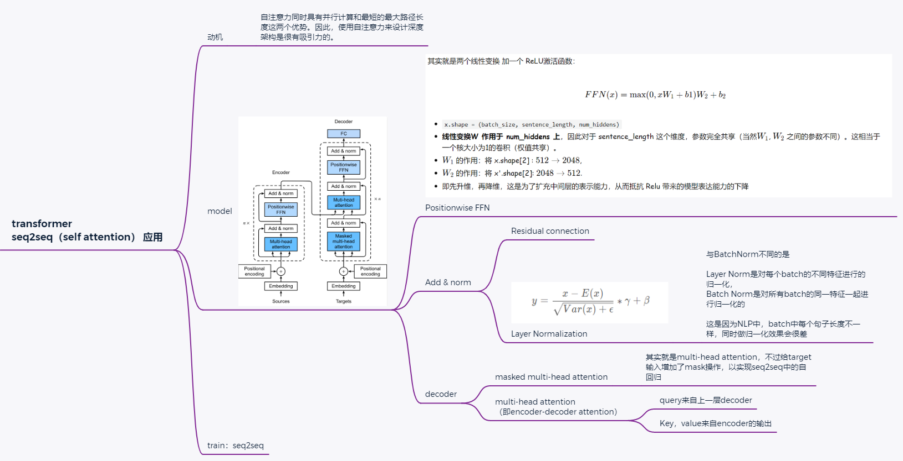

# 7. Transformer




- transformer是**编码器－解码器**架构的一个实践，尽管在实际情况中编码器或解码器可以**单独使用**。
- 在transformer中，多头自注意力用于表示输入序列和输出序列，不过解码器必须通过**掩蔽机制**来保留**自回归属性**。
- transformer中的**残差连接**和**层规范化**是训练非常深度模型的重要工具。
- transformer模型中**基于位置的前馈网络**使用**同一个多层感知机**，作用是对所有序列位置的表示进行转换

We have compared CNNs, RNNs, and self-attention in [Section 6.2](6_Self_Attention_Positional_Encoding.md). Notably, **self-attention** enjoys **both** parallel computation **and** the shortest maximum path length. Therefore natually, it is appealing to design deep architectures by using self-attention. Unlike earlier self-attention models that still rely on RNNs for input representations [[Cheng et al., 2016]](https://d2l.ai/chapter_references/zreferences.html#cheng-dong-lapata-2016)[[Lin et al., 2017b]](https://d2l.ai/chapter_references/zreferences.html#lin-feng-santos-ea-2017)[[Paulus et al., 2017]](https://d2l.ai/chapter_references/zreferences.html#paulus-xiong-socher-2017), the **transformer** model is solely based on attention mechanisms **without** any convolutional or recurrent layer [[Vaswani et al., 2017]](https://d2l.ai/chapter_references/zreferences.html#vaswani-shazeer-parmar-ea-2017). Though originally proposed for sequence to sequence learning on text data, transformers have been pervasive (蔓延) in a wide range of modern deep learning applications, such as in areas of language, vision, speech, and reinforcement learning.

## 7.1. Model

总体介绍：As an instance of the encoder-decoder architecture, the overall architecture of the transformer is presented in [Fig. 7.1](). As we can see, the transformer is composed of an encoder and a decoder. Different from **Bahdanau attention (RNN base)** for sequence to sequence learning in [Fig. 4.1](4_Bahdanau_Attention.md), the input (source) and output (target) sequence embeddings are added with positional encoding before being fed into the encoder and the decoder that stack modules based on self-attention.

<center>
    
    <br>
    <div style="color:orange; border-bottom: 1px solid #d9d9d9;
    display: inline-block;
    color: #999;
    padding: 2px;">
      Fig 7.1 The transformer architecture.
  	</div>
</center>

Now we provide an overview of the transformer architecture in [Fig. 7.1](). On a high level (宏观角度),

- **the transformer encoder** is a stack of multiple identical （相同的） layers, where each layer has two sublayers (either is denoted as sublayer). The first is a multi-head self-attention pooling and the second is a positionwise feed-forward network. Specifically, in the encoder self-attention, queries, keys, and values are all from the the outputs of the previous encoder layer. Inspired by the ResNet design in [Section 7.6](https://d2l.ai/chapter_convolutional-modern/resnet.html#sec-resnet), a residual connection is employed around both sublayers. In the transformer, for any input $x\in \mathbb{R}^d$ at any position of the sequence, we require that $\text{sublayer}(x) \in \mathbb{R}^d$ so that the **residual connection** $x+\text{sublayer}(x) \in \mathbb{R}^d$ is feasible. This addition from the residual connection is immediately followed by **layer normalization** [[Ba et al., 2016]](https://d2l.ai/chapter_references/zreferences.html#ba-kiros-hinton-2016). As a result, the transformer encoder outputs a $d$-dimensional vector representation for each position of the input sequence.
- **The transformer decoder** is also a stack of multiple identical layers with residual connections and layer normalizations. Besides the two sublayers described in the encoder, the decoder inserts a third sublayer, known as the encoder-decoder attention, between these two.
  - **In the encoder-decoder attention**, `queries` are from the outputs of the previous decoder layer, and the `keys` and `values` are from the transformer encoder outputs.
  - **In the decoder self-attention**, `queries`, `keys`, and `values` are all from the the outputs of the previous decoder layer. **However**, each position in the decoder is allowed to only attend to all positions in the decoder up to that position.(位置信息只考虑该位置之前的所有位置，后面的位置全部被mask了) This *masked* attention preserves the **auto-regressive property**, ensuring that the prediction only depends on those output tokens that have been generated.

We have already described and implemented multi-head attention based on scaled dot-products in [Section 5](5_Multi_Head_Attention.md) and positional encoding in [Section 6.3](6_Self_Attention_Positional_Encoding.md). In the following, we will implement the rest of the transformer model.

## 7.2. Positionwise Feed-Forward Networks

The positionwise feed-forward network transforms the representation at all the sequence positions **using the same MLP**. This is why we call it  **positionwise** . In the implementation below, the input `X` with shape (`batch size`, `number of time steps or sequence length in tokens`, `number of hidden units or feature dimension`) will be transformed by a two-layer MLP into an output tensor of shape (`batch size`, `number of time steps`, `ffn_num_outputs`).

其实就是两个线性变换 加一个 ReLU激活函数：

$$
FFN(x) = \max(0, xW_1+b1)W_2 + b_2

$$

- `x.shape = (batch_size, sentence_length, num_hiddens)`
- **线性变换W 作用于 num_hiddens 上**，因此对于 sentence_length 这个维度，参数完全共享（当然$W_1$, $W_2$ 之间的参数不同）。这相当于一个核大小为1的卷积（权值共享）。
- $W_1$ 的作用：将 x.shape[2] : $512\rightarrow 2048$,
- $W_2$ 的作用：将 x'.shape[2]: $2048\rightarrow 512$.
- 即先升维，再降维，这是为了扩充中间层的表示能力，从而抵抗 Relu 带来的模型表达能力的下降

```python
#@save
class PositionWiseFFN(nn.Module):
    """Positionwise feed-forward network."""
    def __init__(self, ffn_num_input, ffn_num_hiddens, ffn_num_outputs,
                 **kwargs):
        super(PositionWiseFFN, self).__init__(**kwargs)
        self.dense1 = nn.Linear(ffn_num_input, ffn_num_hiddens)
        self.relu = nn.ReLU()
        self.dense2 = nn.Linear(ffn_num_hiddens, ffn_num_outputs)

    def forward(self, X):
        return self.dense2(self.relu(self.dense1(X)))
```

The following example shows that the innermost (最里层) dimension of a tensor changes to the number of outputs in the positionwise feed-forward network. Since **the same MLP** transforms at all the positions, when the inputs at all these positions are the same, their outputs are also identical. 当相同位置输入相同时，相同位置的输出也会相同

## 7.3. Residual Connection and Layer Normalization

Now let us focus on the “`add & norm`” component in [Fig. 7.1](). As we described at the beginning of this section, this is a `residual connection` immediately followed by `layer normalization`. Both are key to effective deep architectures. ( residual 与 layer norm 都是构建深度架构的关键)

In [Section 7.5](https://d2l.ai/chapter_convolutional-modern/batch-norm.html#sec-batch-norm), we explained how `batch normalization` recenters and rescales across the examples within a minibatch. `Layer normalization` is the same as `batch normalization` except that the former normalizes across the **feature dimension**. Despite its pervasive applications in computer vision, `batch normalization` is usually empirically less effective than `layer normalization` in natural language processing tasks, whose inputs are often variable-length sequences. (NLP 中使用Layer-Norm效果好于Batch-Norm)

与BatchNorm不同的是

- Layer  Norm 是对 $\color{red}一个batch$ 的 $\color{green}不同特征$ 进行的归一化，
- Batch Norm  是对 $\color{red}所有batch$ 的 $\color{green}同一特征$ 进行归一化的

这是因为NLP中，batch中每个句子长度不一样，同时做归一化效果会很差.

The following code snippet compares the normalization across different dimensions by layer normalization and batch normalization.

Now we can implement the `AddNorm` class using a `residual connection` followed by `layer normalization`. Dropout is also applied for regularization.

```python
#@save
class AddNorm(nn.Module):
    """Residual connection followed by layer normalization."""
    def __init__(self, normalized_shape, dropout, **kwargs):
        super(AddNorm, self).__init__(**kwargs)
        self.dropout = nn.Dropout(dropout)
        self.ln = nn.LayerNorm(normalized_shape)

    def forward(self, X, Y):
        return self.ln(self.dropout(Y) + X)
```

## 7.4. Encoder

With all the essential components to assemble the transformer encoder, let us start by implementing a single layer within the encoder. The following `EncoderBlock` class contains **two sublayers**: `multi-head self-attention` and `positionwise feed-forward networks`, where a `residual connection` followed by `layer normalization` is employed **around both sublayers**.

```python
class EncoderBlock(nn.Module):
    """Transformer encoder block."""
    def __init__(self, key_size, query_size, value_size, num_hiddens, normalized_shape,
                 ffn_num_input, ffn_num_hiddens,  num_heads,
                 dropout, use_bias=False, **kwargs):
        super(EncoderBlock, self).__init__(**kwargs)
        self.attention = MultiHeadAttention( key_size, query_size, value_size, num_hiddens, num_heads, dropout, use_bias)
        self.addNorm1 = AddNorm(normalized_shape, dropout)
        self.ffn = PositionWiseFFN(ffn_num_input, ffn_num_hiddens, num_hiddens) # 因为我们需要与输入相同形状的输出，所以输出设置为了num_hiddens
        self.addNorm2 = AddNorm(normalized_shape, dropout)

    def forward(self, X, valid_lens):
        Y = self.attention(X, X, X, valid_lens)
        Y = self.addNorm1(X, Y)
        output = self.addNorm2(Y, self.ffn(Y))
        return output
```

As we can see, any layer in the transformer encoder does **not change** the shape of its input.

```python
X = torch.ones((2, 100, 24))
valid_lens = torch.tensor([3, 2])
encoder_blk = EncoderBlock(24, 24, 24, 24, [100, 24], 24, 48, 8, 0.5)
encoder_blk.eval()

print(f"the shape of X is {X.shape }, and valid lens are {valid_lens}")
print(f"the output of Encoder is {encoder_blk(X, valid_lens).shape}")
```

In the following `transformer encoder` implementation, we stack `num_layers`instances of the above `EncoderBlock`classes. Since we use the `fixed positional encoding` whose values are always between -1 and 1, we **multiply** values of the learnable input embeddings **by** the square root of the embedding dimension **to rescale** before **summing up** the `input embedding`**and** the `positional encoding`.

- the square root of the embedding dimension `num hiddens` (即 $q, k, v$ 的权重矩阵 $W$ 的行维度（等于词向量维度），注意区分[第三章-Scaled Dot-Product Attention](3_Attention_Scoring_Functions.md) 中 `DotProductAttention`中的 $d$=`词向量维度/num_heads`，**二者不一样，但数量上有这个关系，这是为了GPU加速运算**)

```python
class TransformerEncoder(d2l.Encoder):
    """Transformer encoder."""
    def __init__(self, vocab_size, key_size, query_size, value_size,
                 num_hiddens, norm_shape, ffn_num_input, ffn_num_hiddens, 
                 num_heads, num_layers, dropout, use_bias=False, **kwargs):
        super(TransformerEncoder, self).__init__(**kwargs)
        self.num_hiddens = num_hiddens
        self.embedding = nn.Embedding(vocab_size, num_hiddens)
        self.pos_encoding =PositionalEncoding(num_hiddens, dropout)
        self.blks = nn.Sequential()
        for i in range(num_layers):
            self.blks.add_module("block"+str(i),
                EncoderBlock( key_size, query_size, value_size, num_hiddens, norm_shape,
                              ffn_num_input,  ffn_num_hiddens, num_heads, dropout, use_bias)
            )

    def forward(self, X, valid_lens, *args):
        """ Since positional encoding values are between -1 and 1, the embedding
         values are multiplied by the square root of the embedding dimension
         to rescale before they are summed up

        :param X:
        :param valid_lens:
        :param args:
        :return:
        """
        X = self.pos_encoding(self.embedding(X) * math.sqrt(self.num_hiddens))
        self.attention_weight = [None] * len(self.blks)
        for i, block in enumerate(self.blks):
            X = block(X, valid_lens)
            self.attention_weight[i] = block.attention.attention.attention_weights
        return X
```

Below we specify hyperparameters to create a two-layer transformer encoder. The shape of the transformer encoder output is (`"batch size"`, `"number of time steps"`, `num_hiddens`).

## 7.5. Decoder

As shown in [Fig. 7.1](), the `transformer decoder` is composed of multiple identical layers. Each layer is implemented in the following `DecoderBlock` class, which contains **three sublayers**: `decoder self-attention`, `encoder-decoder attention`, and `positionwise feed-forward networks`. These sublayers employ a `residual connection` around them followed by `layer normalization`.

As we described earlier in this section, in the `masked multi-head decoder self-attention` (the first sublayer), `queries`, `keys`, and `values` all come from the outputs of the previous decoder layer.

- When **training** **sequence-to-sequence models**, tokens at all the positions (time steps) of the output sequence are known.
- **However**, during **prediction** the output sequence is generated token by token;（讲解了Seq2Seq中，训练与预测的不同）
- **thus**, at any decoder time step only the generated tokens can be used （只有生成的token才能被decoder使用） in the **decoder** self-attention.

To preserve auto-regression in the decoder, its **masked self-attention** specifies `dec_valid_lens` so that any query only attends to all positions in the decoder up to the query position. (Decoder里面的第一层Multi-attention，使用的是masked Multi attention，为什么呢？因为**预测**单词时，我们只能看到已经预测过的单词，未来的单词看不到，因此使用了mask。本部分参考[7_seq2seq.md sequence mask 函数](../diy_mrnn/7_seq2seq.md))

```python
class DecoderBlock(nn.Module):
    """ The `i`-th block in the decoder, 这里的 i 是个标识符"""
    def __init__(self, key_size, query_size, value_size, num_hiddens, norm_shape,
                 ffn_num_input, ffn_num_hiddens, num_heads, dropout, i, **kwargs):
        super(DecoderBlock, self).__init__(**kwargs)
        self.i = i

        self.attention1 = MultiHeadAttention(key_size, query_size, value_size, num_hiddens, num_heads, dropout)
        self.addNorm1 = AddNorm(norm_shape, dropout)
        self.attention2 = MultiHeadAttention(key_size, query_size, value_size, num_hiddens, num_heads, dropout)
        self.addNorm2 = AddNorm(norm_shape, dropout)
        self.ffn = PositionWiseFFN(ffn_num_input, ffn_num_hiddens, num_hiddens)
        self.addNorm3 = AddNorm(norm_shape, dropout)

    def forward(self, X, state):
        """
        - In the encoder-decoder attention,
                queries are from the outputs of the previous decoder layer,
                and the keys and values are from the transformer encoder outputs.
        - In the decoder self-attention,
                queries, keys, and values are all from the the outputs of the previous decoder layer

        During 训练阶段, all the tokens of any output sequence are processed at 同一时刻处理,
        so `state[2][self.i]` is `None` as initialized.
        during 预测阶段, 输出序列时通过次元一个接着一个解码的，
        因此 `state[2][self.i]` 包含着until 当前时间步第 i 个块解码的输出表示

        :param X: X.shape = (batch size, 句子长度, attention矩阵的维度)
        :param state: [the output of EncoderBlock, valid_lens, [None]]
        :return:
        """
        enc_outputs, enc_valid_lens = state[0], state[1] # 存来自Transformer encoder的结果
        if (state[2][self.i] is None):
            key_values = X
        else:
            key_values = torch.cat((state[2][self.i], X), axis=1)
        state[2][self.i] = key_values

        if self.training:
            batch_size, num_steps, _ = X.shape
            # dec_valid_lens就是掩码 ，
            # Shape of `dec_valid_lens`: (`batch_size`, `num_steps`),
            # where every row is [1, 2, ..., `num_steps`]  每行都是一个从1增加到`num_steps`的数组
            dec_valid_lens = torch.arange(
                1, num_steps+1, device=X.device
            ).repeat(batch_size, 1) # 对批次中的每个句子都重复该掩码操作
        else:
            dec_valid_lens = None

        # self-attention, dec_valid_lens会使得后面的输出都变成
        X2 = self.attention1(X, key_values, key_values, dec_valid_lens)
        Y = self.addNorm1(X, X2)
        #  Encoder-decoder attention. Shape of `enc_outputs`:  (`batch_size`, `num_steps`, `num_hiddens`)
        Y2 = self.attention2(Y, enc_outputs, enc_outputs, enc_valid_lens)
        Z = self.addNorm2(Y, Y2)
        return self.addNorm3(Z, self.ffn(Z)), state
```

To facilitate **scaled dot-product operations** in the `encoder-decoder attention`and **addition operations** in the `residual connections`, the feature dimension (`num_hiddens`) of the decoder is the same as that of the encoder. 编码器、解码器的维度都是num_hiddens

Now we construct the entire `transformer decoder` composed of `num_layers`instances of `DecoderBlock`. In the end, a `fully-connected layer` computes the prediction for all the `vocab_size` possible output tokens. Both of the **decoder self-attention weights** and the **encoder-decoder attention weights** are stored for later visualization.

```python
class TransformerDecoder(AttentionDecoder):
    def __init__(self, vocab_size, key_size, query_size, value_size,
                 num_hiddens, norm_shape, ffn_num_input, ffn_num_hiddens,
                 num_heads, num_layers, dropout, **kwargs):
        super(TransformerDecoder, self).__init__(**kwargs)
        self.num_hiddens = num_hiddens
        self.num_layers = num_layers
        self.embedding = nn.Embedding(vocab_size, num_hiddens)
        self.pos_encoding = PositionalEncoding(num_hiddens, dropout)
        self.blks = nn.Sequential()
        for i in range(num_layers):
            self.blks.add_module("block"+str(i),
                DecoderBlock(key_size, query_size, value_size, num_hiddens, norm_shape, ffn_num_input, ffn_num_hiddens, num_heads, dropout, i)
            )
        self.dense = nn.Linear(num_hiddens, vocab_size)

    def init_state(self, enc_outputs, enc_valid_lens, *args):
        return [enc_outputs, enc_valid_lens, [None] * self.num_layers]

    def forward(self, X, state):
        X = self.pos_encoding(self.embedding(X) * math.sqrt(self.num_hiddens))
        self._attention_weights = [[None] * len(self.blks) for _ in range(2)]
        for i, blk in enumerate(self.blks):
            X, state = blk(X, state)
            # Decoder self-attention weights
            self._attention_weights[0][i] = blk.attention1.attention.attention_weights
            # Encoder self-attention weights
            self._attention_weights[1][i] = blk.attention2.attention.attention_weights
        return self.dense(X), state

    @property
    def attention_weights(self):
        return self._attention_weights
```

## 7.6. Training

Let us instantiate an encoder-decoder model by following the transformer architecture. Here we specify that both the transformer encoder and the transformer decoder have 2 layers using 4-head attention. Similar to [Section 9.7.4](https://d2l.ai/chapter_recurrent-modern/seq2seq.html#sec-seq2seq-training), we train the transformer model for sequence to sequence learning on the English-French machine translation dataset.

```python
num_hiddens, num_layers, dropout, batch_size, num_steps = 32, 2, 0.1, 64, 10
lr, num_epochs, device = 0.005, 200, d2l.try_gpu()
ffn_num_input, ffn_num_hiddens, num_heads = 32, 64, 4
key_size, query_size, value_size = 32, 32, 32
norm_shape = [32]

train_iter, src_vocab, tgt_vocab = d2l.load_data_nmt(batch_size, num_steps)

encoder = TransformerEncoder(
    len(src_vocab), key_size, query_size, value_size, num_hiddens,
    norm_shape, ffn_num_input, ffn_num_hiddens, num_heads,
    num_layers, dropout)
decoder = TransformerDecoder(
    len(tgt_vocab), key_size, query_size, value_size, num_hiddens,
    norm_shape, ffn_num_input, ffn_num_hiddens, num_heads,
    num_layers, dropout)
net = d2l.EncoderDecoder(encoder, decoder)
d2l.train_seq2seq(net, train_iter, lr, num_epochs, tgt_vocab, device)
```

After training, we use the transformer model to [ **translate a few English sentences** ] into French and compute their BLEU scores.

```python
engs = ['go .', "i lost .", 'he\'s calm .', 'i\'m home .']
fras = ['va !', 'j\'ai perdu .', 'il est calme .', 'je suis chez moi .']
for eng, fra in zip(engs, fras):
    translation, dec_attention_weight_seq = d2l.predict_seq2seq(
        net, eng, src_vocab, tgt_vocab, num_steps, device, True)
    print(f'{eng} => {translation}, ',
          f'bleu {d2l.bleu(translation, fra, k=2):.3f}')
```

Let us [ **visualize the transformer attention weights** ] when translating the last English sentence into French. The shape of the encoder self-attention weights is (number of encoder layers, number of attention heads, `num_steps` or number of queries, `num_steps` or number of key-value pairs).

```python
enc_attention_weights = torch.cat(net.encoder.attention_weights, 0).reshape((num_layers, num_heads,
    -1, num_steps))
enc_attention_weights.shape
```

In the **encoder self-attention**, both queries and keys come from the same input sequence. Since padding tokens do not carry meaning, with specified valid length of the input sequence, no query attends to positions of padding tokens. In the following, two layers of multi-head attention weights are presented row by row. Each head independently attends based on a separate representation subspaces of queries, keys, and values.

```python
d2l.show_heatmaps(
    enc_attention_weights.cpu(), xlabel='Key positions',
    ylabel='Query positions', titles=['Head %d' % i for i in range(1, 5)],
    figsize=(7, 3.5))
```

[ **To visualize both the decoder self-attention weights and the encoder-decoder attention weights, we need more data manipulations.** ] For example, we fill the masked attention weights with zero. (用 0 填充被mask的注意力权重) Note that the decoder self-attention weights and the encoder-decoder attention weights both have the same queries: the beginning-of-sequence token `"<BOS>"` followed by the output tokens.

```python
dec_attention_weights_2d = [head[0].tolist()
                            for step in dec_attention_weight_seq
                            for attn in step for blk in attn for head in blk]
dec_attention_weights_filled = torch.tensor(
    pd.DataFrame(dec_attention_weights_2d).fillna(0.0).values)
dec_attention_weights = dec_attention_weights_filled.reshape((-1, 2, num_layers, num_heads, num_steps))
dec_self_attention_weights, dec_inter_attention_weights = \
    dec_attention_weights.permute(1, 2, 3, 0, 4)
dec_self_attention_weights.shape, dec_inter_attention_weights.shape
```

Due to the **auto-regressive** property of the **decoder** self-attention, no query attends to key-value pairs **after** the query position （查询不会对**当前位置之后**的key-value进行注意力计算）.

```python
# Plus one to include the beginning-of-sequence token
d2l.show_heatmaps(
    dec_self_attention_weights[:, :, :, :len(translation.split()) + 1],
    xlabel='Key positions', ylabel='Query positions',
    titles=['Head %d' % i for i in range(1, 5)], figsize=(7, 3.5))
```

Similar to the case in the encoder self-attention, via the specified valid length of the input sequence, [ **no query from the output sequence attends to those padding tokens from the input sequence.** ]

```python
d2l.show_heatmaps(
    dec_inter_attention_weights, xlabel='Key positions',
    ylabel='Query positions', titles=['Head %d' % i for i in range(1, 5)],
    figsize=(7, 3.5))
```

Although the transformer architecture was originally proposed for sequence-to-sequence learning, as we will discover later in the book, either the transformer encoder or the transformer decoder is **often individually used** for different deep learning tasks.
