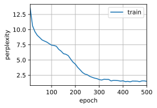

# 5 Implementation of Recurrent Neural Networks from Scratch

:label:`sec_rnn_scratch`

* 我们可以训练一个基于RNN的 character-level language model，根据用户提供的文本的前缀生成后续文本。
* 一个简单的 RNN Language Model 包括:
  * input encoding,
  * RNN modeling, and
  * output generation.
* RNN 模型在训练以前需要初始化状态，不过 random sampling 和 sequential partitioning 使用初始化方法不同。
* 当使用 sequential partitioning 时，我们需要 detach the gradient 以减少计算量。
* 在进行任何预测之前，模型通过 warm-up period 进行自我更新（例如，获得比初始值更好的隐状态）。
* Gradient clipping 可以防止梯度爆炸，但不能应对梯度消失。

在本节中，我们将根据 [4_rnn.md](4_rnn.md) 中的描述， 从头开始基于循环神经网络实现字符级语言模型。 这样的模型将在H.G.Wells的时光机器数据集上训练。 和前面 [3_language_models_and_dataset.md](3_language_models_and_dataset.md) 中介绍过的一样， 我们先读取数据集。

```python
%matplotlib inline
import math
import torch
from torch import nn
from torch.nn import functional as F
from d2l import torch as d2l
```

```python
batch_size, num_steps = 32, 35
train_iter, vocab = d2l.load_data_time_machine(batch_size, num_steps)
```

## 5.1 [**One-Hot Encoding**]

Recall that each token is represented as a numerical index in `train_iter`. Feeding these indices directly to a neural network might make it hard to learn.

我们通常将每个词元表示为更具表现力的特征向量。 最简单的表示称为 *独热编码* （one-hot encoding）， 它在 [3_4_softmax_regression.md](../diy_torch/C3_linear_networks/3_4_softmax_regression.md) 中介绍过。

简言之，将每个索引映射为相互不同的单位向量： 假设词表中不同词元的数目为 $N$（即`len(vocab)`）， 词元索引的范围为 $0$ 到 $N−1$。 如果词元的索引是整数 $i$， 那么我们将创建一个长度为 $N$ 的全 $0$ 向量， 并将第 $i$ 处的元素设置为 $1$。 此向量是原始词元的一个独热向量。 索引为 $0$ 和 $2$ 的独热向量如下所示：

```python
F.one_hot(torch.tensor([0, 2]), len(vocab))
```

tensor([[1, 0, 0, 0, 0, 0, 0, 0, 0, 0, 0, 0, 0, 0, 0, 0, 0, 0, 0, 0, 0, 0, 0, 0,
0, 0, 0, 0],
[0, 0, 1, 0, 0, 0, 0, 0, 0, 0, 0, 0, 0, 0, 0, 0, 0, 0, 0, 0, 0, 0, 0, 0,
0, 0, 0, 0]])
(**The shape of the minibatch**) that we sample each time (**is (batch size, number of time steps).
The `one_hot` function transforms such a minibatch into a three-dimensional tensor with the last dimension equals to the vocabulary size (`len(vocab)`).**)

- input: (batch size, number of time steps)
- output: (batch size, number of time steps, vocabulary size)

我们经常转换输入的维度 (0, 1) -> (1, 0)，以便获得形状为 （时间步数，批量大小，词表大小）的输出. 这将使我们能够更方便地通过最外层的维度， 一步一步地更新小批量数据的隐状态。

```python
X = torch.arange(10).reshape((2, 5))
F.one_hot(X.T, 28).shape
```

torch.Size([5, 2, 28])

## 5.2 Initializing the Model Parameters

接下来，我们初始化循环神经网络模型的模型参数。 隐藏单元数`num_hiddens`是一个可调的超参数。 当训练语言模型时，输入和输出来自 $\text{\colorbox{black}{\color{yellow}相同的词表}}$。 因此，它们具有相同的维度，即词表的大小。

```python
def get_params(vocab_size, num_hiddens, device):
    num_inputs = num_outputs = vocab_size

    def normal(shape):
        return torch.randn(size=shape, device=device) * 0.01

    # Hidden layer parameters
    W_xh = normal((num_inputs, num_hiddens))
    W_hh = normal((num_hiddens, num_hiddens))
    b_h = torch.zeros(num_hiddens, device=device)
    # Output layer parameters
    W_hq = normal((num_hiddens, num_outputs))
    b_q = torch.zeros(num_outputs, device=device)
    # Attach gradients
    params = [W_xh, W_hh, b_h, W_hq, b_q]
    for param in params:
        param.requires_grad_(True)
    return params
```

## 5.3 RNN Model

To define an RNN model, we first need [**an `init_rnn_state` function to return the hidden state at initialization.**]
这个函数的返回是一个张量，张量全用0填充， 形状为（batch size，num_hiddens）。 在后面的章节中我们将会遇到隐状态包含多个变量的情况， 而使用元组可以更容易地处理些。

```python
def init_rnn_state(batch_size, num_hiddens, device):
    return (torch.zeros((batch_size, num_hiddens), device=device), )
```

下面的`rnn`函数定义了如何在一个时间步内计算隐状态和输出。 循环神经网络模型通过`inputs`最外层的维度实现循环， 以便逐时间步更新小批量数据的隐状态`H`。 此外，这里使用 $\text{tanh}$ 函数作为激活函数。 如 [4.1节](https://zh.d2l.ai/chapter_multilayer-perceptrons/mlp.html#sec-mlp)所述， 当元素在实数上满足均匀分布时，$\text{tanh}$ 函数的平均值为 $0$。

```python
def rnn(inputs, state, params):
    # Here `inputs` shape: (`num_steps`, `batch_size`, `vocab_size`)
    W_xh, W_hh, b_h, W_hq, b_q = params
    H, = state
    outputs = []
    # Shape of `X`: (`batch_size`, `vocab_size`)
    for X in inputs:
        H = torch.tanh(torch.mm(X, W_xh) + torch.mm(H, W_hh) + b_h)
        Y = torch.mm(H, W_hq) + b_q
        outputs.append(Y)
    return torch.cat(outputs, dim=0), (H,)
```

定义了所有需要的函数之后，接下来我们创建一个 Class 来包装这些函数， 并存储从零开始实现的循环神经网络模型的参数。

```python
class RNNModelScratch: #@save
    """A RNN Model implemented from scratch."""
    def __init__(self, vocab_size, num_hiddens, device,
                 get_params, init_state, forward_fn):
        self.vocab_size, self.num_hiddens = vocab_size, num_hiddens
        self.params = get_params(vocab_size, num_hiddens, device)
        self.init_state, self.forward_fn = init_state, forward_fn

    def __call__(self, X, state):
        X = F.one_hot(X.T, self.vocab_size).type(torch.float32)
        return self.forward_fn(X, state, self.params)

    def begin_state(self, batch_size, device):
        return self.init_state(batch_size, self.num_hiddens, device)
```

让我们检查输出是否具有正确的形状。 例如，隐状态的维数是否保持不变。

```python
num_hiddens = 512
net = RNNModelScratch(len(vocab), num_hiddens, d2l.try_gpu(), get_params,
                      init_rnn_state, rnn)
state = net.begin_state(X.shape[0], d2l.try_gpu())
Y, new_state = net(X.to(d2l.try_gpu()), state)
Y.shape, len(new_state), new_state[0].shape
```

```
(torch.Size([10, 28]), 1, torch.Size([2, 512]))
```

We can see that the output shape is (number of time steps $\times$ batch size, vocabulary size),

while the hidden state shape remains the same, i.e., (batch size, number of hidden units).

## 5.4 Prediction 预测

Let us [**first define the prediction function to generate new characters following the user-provided `prefix`**], which is a string containing several characters.

在循环遍历`prefix`中的开始字符时， 我们不断地将隐状态传递到下一个时间步，但是不生成任何输出。 This is called the $\text{\colorbox{white}{\color{red}warm-up}}$ period, 因为在此期间模型会自我更新（例如，更新隐状态）， 但不会进行预测。

$\text{\colorbox{black}{\color{yellow}After}}$ the warm-up period, the $\text{\colorbox{black}{\color{red}hidden state}}$ $\text{\colorbox{black}{\color{yellow}is generally better than}}$ its initialized value at the beginning. So we generate the predicted characters and emit them.

```python
def predict_ch8(prefix, num_preds, net, vocab, device):
    """ 在 prefix 后面，生成新的字符

    :param prefix:  a string containing several characters
    :param num_preds:    单词长度（字符级别）
    :param net:
    :param vocab: 字符级别的 vocab，len(vocab) = 28
    :param device:
    :return:
    """
    state = net.begin_state(batch_size=1, device=device)
    outputs = [vocab[prefix[0]]]
    get_input = lambda : torch.tensor([outputs[-1]], device=device).reshape(1, 1)
    for y in prefix[1:]:                        # warm up period
        _, state = net(get_input(), state)
        outputs.append(vocab[y])
    for _ in range(num_preds):          # 预测 num_preds step
        y, state = net(get_input(), state)
        outputs.append(int(y.argmax(dim=1).reshape(1)))
    return ' '.join([vocab.idx_to_token[i] for i in outputs])
```

Now we can test the `predict_ch8` function. We specify the prefix as `"time traveller"` and have it generate 10 additional characters. 鉴于我们还没有训练网络，它会生成荒谬的预测结果。

```python
predict_ch8('time traveller ', 10, net, vocab, d2l.try_gpu())
```

```
'time traveller gqsjl<unk>wzl<unk>'
```

## 5.5 [**Gradient Clipping**] 梯度裁剪

For $\text{\colorbox{black}{\color{yellow}a sequence}}$ of length $T$, we compute the gradients over these $T$ time steps in an iteration, which results in a chain of matrix-products （矩阵乘法链条） with length  $\mathcal{O}(T)$ $\text{\colorbox{black}{\color{yellow}during backpropagation}}$.
如 [4_rnn.md](4_rnn.md) 所述， 当 $T$ 较大时，它可能导致数值不稳定， 例如可能导致 $\text{\colorbox{black}{\color{red}梯度爆炸}}$ 或 $\text{\colorbox{black}{\color{red}梯度消失}}$。 因此，循环神经网络模型往往需要额外的方式来支持稳定训练。

Generally speaking, when solving an optimization problem, we take update steps for the model parameter, say in the vector form $\mathbf{x}$, in the direction of the negative gradient $\mathbf{g}$ on a minibatch. (负梯度小批量优化)
For example, with $\eta > 0$ as the learning rate, in one iteration we update $\mathbf{x}$ as $\mathbf{x} - \eta \mathbf{g}$. Let us further assume that the objective function $f$ is well behaved, say, $\text{\colorbox{black}{\color{red}Lipschitz continuous}}$ with constant $L$. That is to say, for any $\mathbf{x}$ and $\mathbf{y}$ we have

$$
|f(\mathbf{x}) - f(\mathbf{y})| \leq L \|\mathbf{x} - \mathbf{y}\|.

$$

In this case we can safely assume that if we update the parameter vector by $\eta \mathbf{g}$, then

$$
|f(\mathbf{x}) - f(\mathbf{x} - \eta\mathbf{g})| \leq L \eta\|\mathbf{g}\|,

$$

which means that we will not observe a change by more than $L \eta \|\mathbf{g}\|$. 这既是坏事也是好事。

- 坏的方面，它限制了取得进展的速度；
- 好的方面，它限制了事情变糟的程度，尤其当我们朝着错误的方向前进时。

Sometimes the $\text{\colorbox{black}{\color{yellow}gradients can be quite large}}$ and the optimization algorithm may $\text{\colorbox{black}{\color{yellow}fail to converge}}$. We could address this by reducing the learning rate $\eta$.

But what if we $\text{\colorbox{black}{\color{magenta}only rarely}}$ get large gradients (即，梯度很小)? In this case such an approach may appear entirely unwarranted （此时减少学习率就没什么用了）. One popular alternative is to $\text{\colorbox{black}{\color{magenta}clip the gradient}}$ $\mathbf{g}$ by projecting them back to a ball of a given radius (半径), say $\theta$ via

$$
\mathbf{g} \leftarrow \min\left(1, \frac{\theta}{\|\mathbf{g}\|}\right) \mathbf{g}.

$$

通过这样做，我们知道梯度范数永远不会超过 $θ$， 并且更新后的梯度完全与 $g$ 的原始方向对齐。 它还有一个值得拥有的副作用， 即限制 any given minibatch（以及其中任何给定的样本）对参数向量的影响， 这赋予了模型一定程度的稳定性。 $\text{\colorbox{black}{\color{magenta}Gradient clipping}}$ 提供了一个快速修复梯度爆炸的方法， 虽然它并不能完全解决问题，但它是众多有效的技术之一。

Below we define a function to clip the gradients of a model that is implemented from scratch or a model constructed by the high-level APIs.
Also note that we compute the gradient norm (梯度范数) over all the model parameters.

```python
def grad_clipping(net, theta):
    """
  
    :param net: a class 引用传入
    :param theta: 
    :return: 
    """
    if isinstance(net, nn.Module):
        params = [p for p in net.parameters() if p.requires_grad]
    else:
        params = net.paramas
    norm = torch.sqrt(sum(torch.sum((p.grad ** 2)) for p in params))
    if norm > theta:
        for param in params:
            param.grad[:] *= theta/norm
```

## 5.6 Training

在训练模型之前，让我们定义一个函数在 in one epoch 内训练模型。 它与我们训练 [3_6_softmax_regression_scratch.md](../diy_torch/C3_linear_networks/3_6_softmax_regression_scratch.md) 模型的方式有三个不同之处：

1. $\text{\colorbox{black}{\color{red}Different sampling methods}}$ for sequential data ($\text{\colorbox{white}{\color{red}random sampling}}$ and $\text{\colorbox{white}{\color{red}sequential partitioning}}$) will result in differences in the initialization of hidden states (将导致隐状态初始化的差异).
2. We $\text{\colorbox{black}{\color{red}clip the gradients}}$ $\text{\colorbox{black}{\color{yellow}before updating}}$ the model parameters. This ensures that the model does not diverge (发散) even when gradients blow up （爆炸） at some point during the training process.
3. We use $\text{\colorbox{black}{\color{red}perplexity}}$ to $\text{\colorbox{black}{\color{yellow}evaluate the model}}$. As discussed in [4_rnn.md](4_rnn.md), this ensures that sequences of different length are comparable.

Specifically, when $\text{\colorbox{white}{\color{red}sequential partitioning}}$ is used, we $\text{\colorbox{black}{\color{yellow}initialize}}$ the hidden state $\text{\colorbox{black}{\color{yellow}only at the beginning}}$ of each epoch. Since the $i^\mathrm{th}$ subsequence example  in the $\text{\colorbox{black}{\color{yellow}next}}$ minibatch $\text{\colorbox{black}{\color{yellow}is adjacent to}}$ the $\text{\colorbox{black}{\color{yellow}current}}$ $i^\mathrm{th}$ subsequence example, 因此 $\text{\colorbox{black}{\color{yellow}current}}$ 小批量数据最后一个样本的隐状态， 将用于初始化 $\text{\colorbox{black}{\color{yellow}next}}$ 小批量数据第一个样本的隐状态。这样，存储在隐状态中的序列的历史信息 可以在一个迭代周期内流经相邻的子序列。

然而，在任何一点隐状态的计算， 都依赖于同一迭代周期中前面所有的小批量数据， 这使得梯度计算变得复杂。 为了降低计算量，在处理任何一个小批量数据之前， 我们先 $\text{\colorbox{black}{\color{red}detach the gradient}}$，使得隐状态的梯度计算总是限制在一个小批量数据的时间步内。（该方法称为：常规截断梯度计算）


When using the ($\text{\colorbox{white}{\color{red}random sampling}}$, we need to $\text{\colorbox{black}{\color{yellow}re-initialize}}$ the hidden state for each iteration since each example is sampled $\text{\colorbox{black}{\color{yellow}with a random position}}$.
与 [3.6节](https://zh.d2l.ai/chapter_linear-networks/softmax-regression-scratch.html#sec-softmax-scratch)中的 `train_epoch_ch3`函数相同， `updater`是更新模型参数的常用函数。 它既可以是从头开始实现的`d2l.sgd`函数， 也可以是深度学习框架中内置的优化函数。

```python
#@save
def train_epoch_ch8(net, train_iter, loss, updater, device, use_random_iter):
    """Train a net within one epoch (defined in Chapter 8)."""
    state, timer = None, d2l.Timer()
    metric = d2l.Accumulator(2)  # Sum of training loss, no. of tokens
    for X, Y in train_iter:
        if state is None or use_random_iter:
            # Initialize `state` when either it is the first iteration or
            # using random sampling
            state = net.begin_state(batch_size=X.shape[0], device=device)
        else:
            if isinstance(net, nn.Module) and not isinstance(state, tuple):
                # `state` is a tensor for `nn.GRU`
                state.detach_()
            else:
                # `state` is a tuple of tensors for `nn.LSTM` and
                # for our custom scratch implementation
                for s in state:
                    s.detach_()
        y = Y.T.reshape(-1)
        X, y = X.to(device), y.to(device)
        y_hat, state = net(X, state)
        l = loss(y_hat, y.long()).mean()
        if isinstance(updater, torch.optim.Optimizer):
            updater.zero_grad()
            l.backward()
            grad_clipping(net, 1)
            updater.step()
        else:
            l.backward()
            grad_clipping(net, 1)
            # Since the `mean` function has been invoked
            updater(batch_size=1)
        metric.add(l * y.numel(), y.numel())
    return math.exp(metric[0] / metric[1]), metric[1] / timer.stop()
```

[**The training function supports an RNN model implemented either from scratch or using high-level APIs.**]

```python
#@save
def train_ch8(net, train_iter, vocab, lr, num_epochs, device,
              use_random_iter=False):
    """Train a model (defined in Chapter 8)."""
    loss = nn.CrossEntropyLoss()
    animator = d2l.Animator(xlabel='epoch', ylabel='perplexity',
                            legend=['train'], xlim=[10, num_epochs])
    # Initialize
    if isinstance(net, nn.Module):
        updater = torch.optim.SGD(net.parameters(), lr)
    else:
        updater = lambda batch_size: d2l.sgd(net.params, lr, batch_size)
    predict = lambda prefix: predict_ch8(prefix, 50, net, vocab, device)
    # Train and predict
    for epoch in range(num_epochs):
        ppl, speed = train_epoch_ch8(
            net, train_iter, loss, updater, device, use_random_iter)
        if (epoch + 1) % 10 == 0:
            print(predict('time traveller'))
            animator.add(epoch + 1, [ppl])
    print(f'perplexity {ppl:.1f}, {speed:.1f} tokens/sec on {str(device)}')
    print(predict('time traveller'))
    print(predict('traveller'))
```

现在，我们训练循环神经网络模型。 因为我们在数据集中只使用了10000个词元， 所以模型需要更多的迭代周期来更好地收敛。

```python
num_epochs, lr = 500, 1
train_ch8(net, train_iter, vocab, lr, num_epochs, d2l.try_gpu())
```

```
perplexity 1.0, 69604.6 tokens/sec on cuda:0
time travelleryou can show black is white by argument said filby
travelleryou can show black is white by argument said filby
```


[**Finally, let us check the results of using the $\text{\colorbox{white}{\color{red}random sampling}}$ method.**]

```python
net = RNNModelScratch(len(vocab), num_hiddens, d2l.try_gpu(), get_params,
                      init_rnn_state, rnn)
train_ch8(net, train_iter, vocab, lr, num_epochs, d2l.try_gpu(),
          use_random_iter=True)
```

```
perplexity 1.5, 68624.1 tokens/sec on cuda:0
time travellerit s against reason said filbywhat i umuntable thi
travellerit s against reason said filbywhat i umuntable thi
```



从零开始实现上述循环神经网络模型， 虽然有指导意义，但是并不方便。 在下一节中，我们将学习如何改进循环神经网络模型。 例如，如何使其实现地更容易，且运行速度更快。

## Summary

* We can train an RNN-based character-level language model to generate text following the user-provided text prefix.
* A simple RNN language model consists of input encoding, RNN modeling, and output generation.
* RNN models need state initialization for training, though random sampling and sequential partitioning use different ways.
* When using sequential partitioning, we need to detach the gradient to reduce computational cost.
* A warm-up period allows a model to update itself (e.g., obtain a better hidden state than its initialized value) before making any prediction.
* Gradient clipping prevents gradient explosion, but it cannot fix vanishing gradients.

## Exercises

1. Show that one-hot encoding is equivalent to picking a different embedding for each object.
2. Adjust the hyperparameters (e.g., number of epochs, number of hidden units, number of time steps in a minibatch, and learning rate) to improve the perplexity.
   * How low can you go?
   * Replace one-hot encoding with learnable embeddings. Does this lead to better performance?
   * How well will it work on other books by H. G. Wells, e.g., [*The War of the Worlds*](http://www.gutenberg.org/ebooks/36)?
3. Modify the prediction function such as to use sampling rather than picking the most likely next character.
   * What happens?
   * Bias the model towards more likely outputs, e.g., by sampling from $q(x_t \mid x_{t-1}, \ldots, x_1) \propto P(x_t \mid x_{t-1}, \ldots, x_1)^\alpha$ for $\alpha > 1$.
4. Run the code in this section without clipping the gradient. What happens?
5. Change sequential partitioning so that it does not separate hidden states from the computational graph. Does the running time change? How about the perplexity?
6. Replace the activation function used in this section with ReLU and repeat the experiments in this section. Do we still need gradient clipping? Why?

[Discussions](https://discuss.d2l.ai/t/486)
