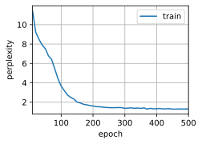

# 6 Concise Implementation of Recurrent Neural Networks

:label:`sec_rnn-concise`

* 深度学习框架的高级API提供了循环神经网络层的实现。
* 高级API的循环神经网络层返回一个输出和一个更新后的隐状态，我们$\color{red}还需要计算$整个模型的输出层。
* 相比从零开始实现的循环神经网络，使用高级API实现可以加速训练。

虽然 [5_rnn_scratch.md](5_rnn_scratch.md) 对了解循环神经网络的实现方式具有指导意义，但并不方便。 本节将展示如何使用深度学习框架的高级API提供的函数更有效地实现相同的语言模型。 我们仍然从读取时光机器数据集开始。

```python
import torch
from torch import nn
from torch.nn import functional as F
from d2l import torch as d2l

batch_size, num_steps = 32, 35
train_iter, vocab = d2l.load_data_time_machine(batch_size, num_steps)
```

## 6.1 [**Defining the Model**]

High-level APIs provide implementations of recurrent neural networks. We construct the recurrent neural network layer `rnn_layer` with a single hidden layer and 256 hidden units.

In fact, we have not even discussed yet what it means to have multiple layers---this will happen in [9.3节](https://zh.d2l.ai/chapter_recurrent-modern/deep-rnn.html#sec-deep-rnn)。现在，你仅需要将多层理解为一层循环神经网络的输出被用作下一层循环神经网络的输入就足够了。

```python
num_hiddens = 256
rnn_layer = nn.RNN(len(vocab), num_hiddens)
```

We (**use a tensor to $\text{\colorbox{black}{\color{yellow}initialize}}$ the hidden state**), whose shape is (`number of hidden layers`, `batch size`, `number of hidden units`).

```python
state = torch.zeros((1, batch_size, num_hiddens))
state.shape

```

```
torch.Size([1, 32, 256])
```

通过一个隐状态和一个输入，我们就可以用更新后的隐状态计算输出。
It should be emphasized that the "output" (`Y`) of `rnn_layer` does $\text{\colorbox{black}{\color{yellow}not involve}}$ computation of output layers: it refers to the hidden state at *each* time step, and they can be used as the input to the subsequent output layer.

```python
X = torch.rand(size=(num_steps, batch_size, len(vocab)))
Y, state_new = rnn_layer(X, state)
Y.shape, state_new.shape
```

```
(torch.Size([35, 32, 256]), torch.Size([1, 32, 256]))
```

与 [5_rnn_scratch.md](5_rnn_scratch.md) 类似， 我们为一个完整的循环神经网络模型定义了一个`RNNModel`类。 注意，`rnn_layer`只包含 the hidden recurrent layers，我们还需要创建 a separate output layer。

```python
#@save
class RNNModel(nn.Module):
    """ The RNN model"""
    def __init__(self, rnn_layer, vocab_size, **kwargs):
        super(RNNModel, self).__init__(**kwargs)
        self.rnn = rnn_layer
        self.vocab_size = vocab_size
        self.num_hiddens = self.rnn.hidden_size
        # 如果RNN是双向的（之后将介绍），num_directions应该是2，否则应该是1
        if not self.rnn.bidirectional:
            self.num_directions = 1
            self.linear = nn.Linear(self.num_hiddens, self.vocab_size)
        else:
            self.num_directions = 2
            self.linear = nn.Linear(self.num_hiddens*2, self.vocab_size)

    def forward(self, inputs, state):
        X = F.one_hot(inputs.T.long(), self.vocab_size)
        X = X.to(torch.float32)
        Y, state = self.rnn(X, state)
        # 全连接层首先将Y的形状改为(时间步数*批量大小,隐藏单元数)
        # 它的输出形状是(时间步数*批量大小,词表大小)
        output = self.linear(Y.reshape((-1, Y.shape[-1])))
        return output, state

    def begin_state(self, device, batch_size=1):
        if not isinstance(self.rnn, nn.LSTM):
            # nn.GRU 以 tensor 作为 hidden state
            return torch.zeros(
                (
                    self.num_directions * self.rnn.num_layers, batch_size, self.num_hiddens
                ), 
                device=device
            )
        else:
            # nn.LSTM 以 tuple 作为 hidden state
            return (torch.zeros(
                (
                    self.num_directions * self.rnn.num_layers, batch_size, self.num_hiddens
                ), 
                device=device
            ))
```

## 6.2 Training and Predicting

训练模型之前，让我们基于一个具有随机权重的模型进行预测。

```python
device = d2l.try_gpu()
net = RNNModel(rnn_layer, vocab_size=len(vocab))
net = net.to(device)
d2l.predict_ch8('time traveller', 10, net, vocab, device)
```

```
'time travellerfrf pff f '
```

很明显，这种模型根本不能输出好的结果。 接下来，我们使用 [5_rnn_scratch.md](5_rnn_scratch.md) 中 定义的超参数调用`train_ch8`，并且使用高级API训练模型。

```python
num_epochs, lr = 500, 1
d2l.train_ch8(net, train_iter, vocab, lr, num_epochs, device)
```

```
perplexity 1.3, 298788.1 tokens/sec on cuda:0
time traveller held in his hand was a glitteringmetans lived dit
traveller afoer a wommertale mave at boub in the foree me b
```



与上一节相比，由于深度学习框架的高级API对代码进行了更多的优化， 该模型在较短的时间内达到了较低的困惑度。

## Summary

* High-level APIs of the deep learning framework provides an implementation of the RNN layer.
* The RNN layer of high-level APIs returns an output and an updated hidden state, where the output does not involve output layer computation.
* Using high-level APIs leads to faster RNN training than using its implementation from scratch.

## Exercises

1. Can you make the RNN model overfit using the high-level APIs?
2. What happens if you increase the number of hidden layers in the RNN model? Can you make the model work?
3. Implement the autoregressive model of :numref:`sec_sequence` using an RNN.

[Discussions](https://discuss.d2l.ai/t/1053)
