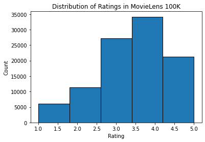

# 2 The MovieLens Dataset

- MovieLens 数据集广泛用于推荐研究。它是公开的并且可以免费使用。
- 我们定义了用于下载和预处理 MovieLens 100k 数据集的函数，以便在后面的部分中进一步使用。

There are a number of $\text{\color{red}\colorbox{white}{datasets}}$ that are available for recommendation research. Amongst them, the [MovieLens](https://movielens.org/) dataset is probably one of the more popular ones. $\text{\color{red}\colorbox{black}{MovieLens}}$ is a non-commercial $\text{\color{red}\colorbox{white}{web-based movie recommender system}}$. It is created in 1997 and run by GroupLens, a research lab at the University of Minnesota, in order to gather movie rating data for research purposes.  MovieLens data has been critical for several research studies including personalized recommendation and social psychology.

## 2.1 Getting the Data

The MovieLens dataset is hosted by the [GroupLens](https://grouplens.org/datasets/movielens/) website. Several versions are available. We will use the MovieLens 100K dataset [[Herlocker et al., 1999](https://d2l.ai/chapter_references/zreferences.html#id112 "Herlocker, J. L., Konstan, J. A., Borchers, A., & Riedl, J. (1999). An algorithmic framework for performing collaborative filtering. 22nd Annual International ACM SIGIR Conference on Research and Development in Information Retrieval, SIGIR 1999 (pp. 230–237).")].

This dataset is comprised of 100,000 ratings, ranging from 1 to 5 stars, from 943 users on 1682 movies. It has been cleaned up so that each user has rated at least 20 movies. Some simple demographic information such as $\text{\color{red}\colorbox{white}{age, gender, genres}}$ for the users and items are also available. We can download the [ml-100k.zip](http://files.grouplens.org/datasets/movielens/ml-100k.zip) and extract the `u.data` file, which contains all the $100,000$ ratings in the csv format. There are many other files in the folder, a detailed description for each file can be found in the [README](http://files.grouplens.org/datasets/movielens/ml-100k-README.txt) file of the dataset.

To begin with, let us import the packages required to run this section's experiments.

```python
import os
import pandas as pd
from mxnet import gluon, np
from d2l import mxnet as d2l
```

Then, we download the MovieLens 100k dataset and load the interactions as `DataFrame`.

```python
#@save
d2l.DATA_HUB['ml-100k'] = (
    'https://files.grouplens.org/datasets/movielens/ml-100k.zip',
    'cd4dcac4241c8a4ad7badc7ca635da8a69dddb83')

#@save
def read_data_ml100k():
    data_dir = d2l.download_extract('ml-100k')
    names = ['user_id', 'item_id', 'rating', 'timestamp']
    data = pd.read_csv(os.path.join(data_dir, 'u.data'), '\t', names=names,
                       engine='python')
    num_users = data.user_id.unique().shape[0]
    num_items = data.item_id.unique().shape[0]
    return data, num_users, num_items
```

## 2.2 Statistics of the Dataset

Let us load up the data and inspect the first five records manually. It is an effective way to learn the data structure and verify that they have been loaded properly.

```python
data, num_users, num_items = read_data_ml100k()
sparsity = 1 - len(data) / (num_users * num_items)
print(f'number of users: {num_users}, number of items: {num_items}')
print(f'matrix sparsity: {sparsity:f}')
print(data.head(5))
```

```
number of users: 943, number of items: 1682
matrix sparsity: 0.936953
user_id  item_id  rating  timestamp
0      196      242       3  881250949
1      186      302       3  891717742
2       22      377       1  878887116
3      244       51       2  880606923
4      166      346       1  886397596
```

We can see that each line consists of $\text{\color{red}\colorbox{white}{four columns}}$, including

- "user id" 1-943,
- "item id" 1-1682,
- "rating" 1-5 and
- "timestamp".

We can construct an $\text{\color{red}\colorbox{black}{interaction matrix}}$ of size $n \times m$, where $\color{red}n$ and $\color{green}m$ are the number of $\color{red}users$ and the number of $\color{green}items$ respectively. This dataset only records the existing ratings, so we can also call it $\text{\color{red}\colorbox{black}{rating matrix}}$ and we will use interaction matrix and rating matrix interchangeably in case that the values of this matrix represent exact ratings. 评分矩阵中的大多数值都是未知的，因为用户没有对大多数电影进行评分。**我们还展示了这个数据集的稀疏性。The sparsity is defined as `1 - number of nonzero entries / ( number of users * number of items)`. 显然，交互矩阵非常稀疏（即稀疏度 = 93.695%）。现实世界的数据集可能会遭受更大程度的稀疏性，并且一直是构建推荐系统的长期挑战。一个可行的解决方案是使用额外的辅助信息（例如用户/项目特征）来缓解稀疏性。

然后，我们绘制不同评级计数的分布。正如预期的那样，它似乎是一个正态分布，大多数评级集中在 3-4 之间。

```python
d2l.plt.hist(data['rating'], bins=5, ec='black')
d2l.plt.xlabel('Rating')
d2l.plt.ylabel('Count')
d2l.plt.title('Distribution of Ratings in MovieLens 100K')
d2l.plt.show()
```



## 2.3 Splitting the dataset

We split the dataset into training and test sets. The following function provides two split modes including `random` and `seq-aware`.

- In the `random` mode, the function splits the 100k interactions rand omly without considering timestamp and uses the 90% of the data as $\text{\color{red}\colorbox{white}{training samples}}$ and the rest 10% as $\text{\color{blue}\colorbox{white}{test samples}}$ by default.
- In the `seq-aware` mode, we leave out the item that a user rated most recently for $\text{\color{blue}\colorbox{white}{test}}$, and users' historical interactions as $\text{\color{red}\colorbox{white}{training set}}$.  User historical interactions are $\text{\color{yellow}\colorbox{black}{sorted from}}$ oldest $\text{\color{yellow}\colorbox{black}{to}}$ newest based on timestamp. This mode will be used **in the sequence-aware recommendation section**.

```python
#@save
def split_data_ml100k(data, num_users, num_items,
                      split_mode='random', test_ratio=0.1):
    """Split the dataset in random mode or seq-aware mode."""
    if split_mode == 'seq-aware':
        train_items, test_items, train_list = {}, {}, []
        for line in data.itertuples():
            u, i, rating, time = line[1], line[2], line[3], line[4]
            train_items.setdefault(u, []).append((u, i, rating, time))
            if u not in test_items or test_items[u][-1] < time:
                test_items[u] = (i, rating, time)
        for u in range(1, num_users + 1):
            train_list.extend(sorted(train_items[u], key=lambda k: k[3]))
        test_data = [(key, *value) for key, value in test_items.items()]
        train_data = [item for item in train_list if item not in test_data]
        train_data = pd.DataFrame(train_data)
        test_data = pd.DataFrame(test_data)
    else:
        mask = [True if x == 1 else False for x in np.random.uniform(
            0, 1, (len(data))) < 1 - test_ratio]
        neg_mask = [not x for x in mask]
        train_data, test_data = data[mask], data[neg_mask]
    return train_data, test_data
```

请注意，除了仅使用测试集外，在实践中使用验证集是一种很好的做法。但是，为了简洁起见，我们将其省略。**在这种情况下，我们的测试集可以被视为我们的保留验证集。**

## 2.4 Loading the data

数据集拆分后，为了方便起见，我们会将训练集和测试集转换为列表和字典/矩阵。以下函数逐行读取数据帧并从零开始枚举用户/项目的索引。然后该函数返回用户、项目、评级和记录交互的字典/矩阵的列表。 We can specify the type of feedback to either `explicit` or `implicit`.

```python
#@save
def load_data_ml100k(data, num_users, num_items, feedback='explicit'):
    users, items, scores = [], [], []
    inter = np.zeros((num_items, num_users)) if feedback == 'explicit' else {}
    for line in data.itertuples():
        user_index, item_index = int(line[1] - 1), int(line[2] - 1)
        score = int(line[3]) if feedback == 'explicit' else 1
        users.append(user_index)
        items.append(item_index)
        scores.append(score)
        if feedback == 'implicit':
            inter.setdefault(user_index, []).append(item_index)
        else:
            inter[item_index, user_index] = score
    return users, items, scores, inter
```

Afterwards, we put the above steps together and it will be used in the next section. The results are wrapped with `Dataset` and `DataLoader`. Note that the `last_batch` of `DataLoader` for training data is set to the `rollover` mode (The remaining samples are rolled over to the next epoch.) and orders are shuffled.

```python
#@save
def split_and_load_ml100k(split_mode='seq-aware', feedback='explicit',
                          test_ratio=0.1, batch_size=256):
    data, num_users, num_items = read_data_ml100k()
    train_data, test_data = split_data_ml100k(
        data, num_users, num_items, split_mode, test_ratio)
    train_u, train_i, train_r, _ = load_data_ml100k(
        train_data, num_users, num_items, feedback)
    test_u, test_i, test_r, _ = load_data_ml100k(
        test_data, num_users, num_items, feedback)
    train_set = gluon.data.ArrayDataset(
        np.array(train_u), np.array(train_i), np.array(train_r))
    test_set = gluon.data.ArrayDataset(
        np.array(test_u), np.array(test_i), np.array(test_r))
    train_iter = gluon.data.DataLoader(
        train_set, shuffle=True, last_batch='rollover',
        batch_size=batch_size)
    test_iter = gluon.data.DataLoader(
        test_set, batch_size=batch_size)
    return num_users, num_items, train_iter, test_iter
```

## Summary

* MovieLens datasets are widely used for recommendation research. It is public available and free to use.
* We define functions to download and preprocess the MovieLens 100k dataset for further use in later sections.

## Exercises

* What other similar recommendation datasets can you find?
* Go through the [https://movielens.org/](https://movielens.org/) site for more information about MovieLens.

[Discussions](https://discuss.d2l.ai/t/399)
