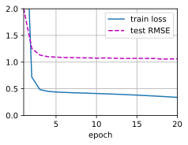

# 3 Matrix Factorization 矩阵因子分解

- 矩阵分解模型广泛用于推荐系统。**它可用于预测用户可能对项目的评分。**
- 我们可以为推荐系统实现和训练矩阵分解。

$\text{\color{red}\colorbox{black}{Matrix Factorization}}$ [[Koren et al., 2009](https://d2l.ai/chapter_references/zreferences.html#id148 "Koren, Y., Bell, R., & Volinsky, C. (2009). Matrix factorization techniques for recommender systems. Computer, pp. 30–37.")] is a well-established algorithm in the recommender systems literature. 矩阵分解模型的第一个版本是由 Simon Funk 在一篇著名的 [blog post](https://sifter.org/~simon/journal/20061211.html) 中提出的，他在其中描述了对交互矩阵进行因式分解的思想。随后，由于 2006 年举行的 Netflix 竞赛而广为人知。当时，流媒体和视频租赁公司 Netflix 宣布了一项改进其推荐系统性能的竞赛。能够将 Netflix 基准（即 Cinematch）提高 10% 的最佳团队将赢得 100 万美元的奖金。因此，本次大赛引起了推荐系统研究领域的广泛关注。随后，大奖由 BellKor 的 Pragmatic Chaos 团队获得，该团队是 BellKor、Pragmatic Theory 和 BigChaos 的组合团队（你现在不需要担心这些算法）。尽管最终得分是集成解决方案（即许多算法的组合）的结果，但矩阵分解算法在最终混合中发挥了关键作用。The technical report of the Netflix Grand Prize solution [[Toscher et al., 2009](https://d2l.ai/chapter_references/zreferences.html#id278 "Töscher, A., Jahrer, M., & Bell, R. M. (2009). The bigchaos solution to the netflix grand prize. Netflix prize documentation, pp. 1–52.")] provides a detailed introduction to the adopted model. In this section, we will dive into the details of the matrix factorization model and its implementation.

## 3.1 The Matrix Factorization Model

Matrix factorization is a class of $\text{\color{red}\colorbox{white}{collaborative filtering models}}$. Specifically, the model $\text{\color{yellow}\colorbox{black}{factorizes}}$ the user-item interaction matrix (e.g., rating matrix) $\text{\color{yellow}\colorbox{black}{into}}$ the product of two $\text{\color{magenta}\colorbox{white}{lower-rank matrices}}$, capturing the low-rank structure of the user-item interactions.

Let $\mathbf{R} \in \mathbb{R}^{m \times n}$ denote the interaction matrix with $m$ users and $n$ items, and the values of $\mathbf{R}$ represent explicit ratings. The user-item interaction will $\text{\color{yellow}\colorbox{black}{be factorized into}}$ a $\color{magenta}\text{{user latent matrix }} \mathbf{P} \in \mathbb{R}^{m \times k}$ and an $\color{green}\text{{item latent matrix }} \mathbf{Q} \in \mathbb{R}^{n \times k}$, where $k \ll m, n$, is the latent factor size. Let $\color{magenta}\mathbf{p}_u$ denote the $\color{magenta}u^\mathrm{th} \text{ row}$ of $\color{magenta}\mathbf{P}$ and $\color{green}\mathbf{q}_i$ denote the $\color{green}i^\mathrm{th} \text{ row}$ of $\color{green}\mathbf{Q}$.

- For a given item $\color{green}i$, the elements of $\color{green}\mathbf{q}_i$ measure the extent to which the item possesses those characteristics such as the genres and languages of a movie.
- For a given user $\color{magenta}u$, the elements of $\color{magenta}\mathbf{p}_u$ measure the extent of interest the user has in items' corresponding characteristics.

These latent factors might measure obvious dimensions as mentioned in those examples or are completely uninterpretable. The predicted ratings can be estimated by

$$
\hat{\mathbf{R}} = \mathbf{{\color{magenta}P}{\color{green}Q}}^\top

$$

where $\hat{\mathbf{R}}\in \mathbb{R}^{m \times n}$ is the predicted rating matrix which has the same shape as $\mathbf{R}$. $\text{\color{yellow}\colorbox{black}{One major problem}}$ of this prediction rule is that $\text{\color{red}\colorbox{white}{users/items biases}}$ can not be modeled. For example, some users tend to give higher ratings or some items always get lower ratings due to poorer quality.(例如，一些用户倾向于给出更高的评分，或者某些项目由于质量较差而总是得到较低的评分。) These biases are commonplace in real-world applications. $\text{\color{yellow}\colorbox{black}{To capture these biases}}$, user specific and item specific $\text{\color{red}\colorbox{white}{bias terms}}$ are introduced. Specifically, the predicted rating user $u$ gives to item $i$ is calculated by

$$
\hat{\mathbf{R}}_{ui} = \mathbf{p}_u\mathbf{q}^\top_i + b_u + b_i

$$

Then, we train the $\text{\color{red}\colorbox{black}{matrix factorization model}}$ by minimizing the mean squared error (MSE) between predicted rating scores and real rating scores.  The objective function is defined as follows:

$$
\underset{\mathbf{P}, \mathbf{Q}, b}{\mathrm{argmin}} \sum_{(u, i) \in \mathcal{K}} \| \mathbf{R}_{ui} -
\hat{\mathbf{R}}_{ui} \|^2 + \lambda (\| \mathbf{P} \|^2_F + \| \mathbf{Q}
\|^2_F + b_u^2 + b_i^2 )

$$

where

- $\lambda$ denotes the regularization rate.
- The regularizing term $\lambda (\| \mathbf{P} \|^2_F + \| \mathbf{Q}\|^2_F + b_u^2 + b_i^2 )$ is used to avoid over-fitting by penalizing the magnitude of the parameters.
- The $(u, i)$  pairs for which $\mathbf{R}_{ui}$ is known are stored in the set
  $\mathcal{K}=\{(u, i) \mid \mathbf{R}_{ui} \text{ is known}\}$.

The model parameters can be learned with an optimization algorithm, such as Stochastic Gradient Descent and Adam.

An intuitive illustration of the matrix factorization model is shown below:


<center>
    
    <br>
    <div style="color:orange; border-bottom: 1px solid #d9d9d9;
    display: inline-block;
    color: #999;
    padding: 2px;">
     Fig. 17.3.1 Illustration of matrix factorization model
  	</div>
</center>


In the rest of this section, we will explain the implementation of matrix factorization and train the model on the MovieLens dataset.

```python
import mxnet as mx
from mxnet import autograd, gluon, np, npx
from mxnet.gluon import nn
from d2l import mxnet as d2l

npx.set_np()
```

## 3.2 Model Implementation

First, we implement the matrix factorization model described above. The user and item latent factors can be created with the `nn.Embedding`. The `input_dim` is the number of items/users and the (`output_dim`) is the dimension of the latent factors ($k$).  We can also use `nn.Embedding` to create the user/item biases by setting the `output_dim` to one. In the `forward` function, user and item ids are used to look up the embeddings.

```python
class MF(nn.Block):
    def __init__(self, num_factors, num_users, num_items, **kwargs):
        super(MF, self).__init__(**kwargs)
        self.P = nn.Embedding(input_dim=num_users, output_dim=num_factors)
        self.Q = nn.Embedding(input_dim=num_items, output_dim=num_factors)
        self.user_bias = nn.Embedding(num_users, 1)
        self.item_bias = nn.Embedding(num_items, 1)

    def forward(self, user_id, item_id):
        P_u = self.P(user_id)
        Q_i = self.Q(item_id)
        b_u = self.user_bias(user_id)
        b_i = self.item_bias(item_id)
        outputs = (P_u * Q_i).sum(axis=1) + np.squeeze(b_u) + np.squeeze(b_i)
        return outputs.flatten()
```

## 3.3 Evaluation Measures

We then implement the RMSE (root-mean-square error) measure, which is commonly used $\text{\color{yellow}\colorbox{black}{to measure the differences}}$ $\text{\color{yellow}\colorbox{black}{between}}$ rating scores predicted by the model $\text{\color{yellow}\colorbox{black}{and}}$ the actually observed ratings (ground truth) [[Gunawardana &amp; Shani, 2015](https://d2l.ai/chapter_references/zreferences.html#id97 "Gunawardana, A., & Shani, G. (2015). Evaluating recommender systems. Recommender systems handbook (pp. 265–308). Springer.")]. RMSE is defined as:

$$
\mathrm{RMSE} = \sqrt{\frac{1}{|\mathcal{T}|}\sum_{(u, i) \in \mathcal{T}}(\mathbf{R}_{ui} -\hat{\mathbf{R}}_{ui})^2}

$$

where $\mathcal{T}$ is the set consisting of pairs of users and items that you want to evaluate on. $|\mathcal{T}|$ is the size of this set. We can use the RMSE function provided by `mx.metric`.

```python
def evaluator(net, test_iter, devices):
    rmse = mx.metric.RMSE()  # Get the RMSE
    rmse_list = []
    for idx, (users, items, ratings) in enumerate(test_iter):
        u = gluon.utils.split_and_load(users, devices, even_split=False)
        i = gluon.utils.split_and_load(items, devices, even_split=False)
        r_ui = gluon.utils.split_and_load(ratings, devices, even_split=False)
        r_hat = [net(u, i) for u, i in zip(u, i)]
        rmse.update(labels=r_ui, preds=r_hat)
        rmse_list.append(rmse.get()[1])
    return float(np.mean(np.array(rmse_list)))
```

## 3.4 Training and Evaluating the Model

In the training function, we adopt the $L_2$ loss with weight decay. The weight decay mechanism has the same effect as the $L_2$ regularization.

```python
#@save
def train_recsys_rating(net, train_iter, test_iter, loss, trainer, num_epochs,
                        devices=d2l.try_all_gpus(), evaluator=None,
                        **kwargs):
    timer = d2l.Timer()
    animator = d2l.Animator(xlabel='epoch', xlim=[1, num_epochs], ylim=[0, 2],
                            legend=['train loss', 'test RMSE'])
    for epoch in range(num_epochs):
        metric, l = d2l.Accumulator(3), 0.
        for i, values in enumerate(train_iter):
            timer.start()
            input_data = []
            values = values if isinstance(values, list) else [values]
            for v in values:
                input_data.append(gluon.utils.split_and_load(v, devices))
            train_feat = input_data[0:-1] if len(values) > 1 else input_data
            train_label = input_data[-1]
            with autograd.record():
                preds = [net(*t) for t in zip(*train_feat)]
                ls = [loss(p, s) for p, s in zip(preds, train_label)]
            [l.backward() for l in ls]
            l += sum([l.asnumpy() for l in ls]).mean() / len(devices)
            trainer.step(values[0].shape[0])
            metric.add(l, values[0].shape[0], values[0].size)
            timer.stop()
        if len(kwargs) > 0:  # It will be used in section AutoRec
            test_rmse = evaluator(net, test_iter, kwargs['inter_mat'],
                                  devices)
        else:
            test_rmse = evaluator(net, test_iter, devices)
        train_l = l / (i + 1)
        animator.add(epoch + 1, (train_l, test_rmse))
    print(f'train loss {metric[0] / metric[1]:.3f}, '
          f'test RMSE {test_rmse:.3f}')
    print(f'{metric[2] * num_epochs / timer.sum():.1f} examples/sec '
          f'on {str(devices)}')
```

Finally, let us put all things together and train the model. Here, we set the latent factor dimension to 30.

```python
devices = d2l.try_all_gpus()
num_users, num_items, train_iter, test_iter = d2l.split_and_load_ml100k(
    test_ratio=0.1, batch_size=512)
net = MF(30, num_users, num_items)
net.initialize(ctx=devices, force_reinit=True, init=mx.init.Normal(0.01))
lr, num_epochs, wd, optimizer = 0.002, 20, 1e-5, 'adam'
loss = gluon.loss.L2Loss()
trainer = gluon.Trainer(net.collect_params(), optimizer,
                        {"learning_rate": lr, 'wd': wd})
train_recsys_rating(net, train_iter, test_iter, loss, trainer, num_epochs,
                    devices, evaluator)
```

train loss 0.064, test RMSE 1.061
50699.6 examples/sec on [gpu(0), gpu(1)]


Below, we use the trained model to predict the rating that a user (ID 20) might give to an item (ID 30).

```python
scores = net(np.array([20], dtype='int', ctx=devices[0]),
             np.array([30], dtype='int', ctx=devices[0]))
scores
```
array([3.3714643], ctx=gpu(0))
## Summary

* The matrix factorization model is widely used in recommender systems.  It can be used to predict ratings that a user might give to an item.
* We can implement and train matrix factorization for recommender systems.

## Exercises

* Vary the size of latent factors. How does the size of latent factors influence the model performance?
* Try different optimizers, learning rates, and weight decay rates.
* Check the predicted rating scores of other users for a specific movie.

[Discussions](https://discuss.d2l.ai/t/400)
