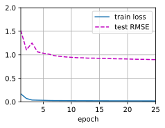

# 4 AutoRec: Rating Prediction with Autoencoders

- 我们可以使用自动编码器 (两层FC，先降维，后升维) 构建矩阵分解算法，同时集成非线性层和 dropout 正则化。
- 属于协同过滤（CF）模型。
- 在 MovieLens 100K 数据集上的实验表明，AutoRec 的性能优于矩阵分解。

Although the $\color{red}\text{matrix factorization model}$ achieves decent performance on the rating prediction task, it is essentially a $\color{red}\text{\colorbox{white}{linear model}}$. Thus, such models are not capable of capturing complex nonlinear and intricate relationships that may be predictive of users' preferences.

In this section, we introduce a $\color{red}\text{\colorbox{white}{nonlinear}}$ neural network collaborative filtering model, $\color{red}\text{AutoRec}$ ([Sedhain  *et al.* , 2015](https://d2l.ai/chapter_references/zreferences.html#id248 "Sedhain, S., Menon, A. K., Sanner, S., & Xie, L. (2015). Autorec: autoencoders meet collaborative filtering. Proceedings of the 24th International Conference on World Wide Web (pp. 111–112).")). It identifies collaborative filtering (CF) with an $\color{red}\text{\colorbox{white}{autoencoder architecture}}$ and $\color{yellow}\text{\colorbox{black}{aims to}}$ integrate nonlinear transformations $\color{yellow}\text{\colorbox{black}{into}}$ CF on the basis of $\color{magenta}\text{\colorbox{white}{explicit feedback}}$. Neural networks have been proven to be capable of approximating any continuous function, making it suitable to address the limitation of matrix factorization and enrich the expressiveness of matrix factorization.

- 相同之处：On one hand, $\color{red}\text{AutoRec}$ has the same structure as an autoencoder which consists of an input layer, a hidden layer, and a reconstruction (output) layer.  An autoencoder is a neural network that learns to copy its input to its output $\color{yellow}\text{\colorbox{black}{in order to}}$ code the inputs into the hidden (and usually low-dimensional) representations. In $\color{red}\text{AutoRec}$, $\color{yellow}\text{\colorbox{black}{instead of}}$ explicitly embedding users/items into low-dimensional space, $\color{yellow}\text{\colorbox{black}{it uses}}$ the column/row of the interaction matrix as the input, then reconstructs the interaction matrix in the output layer.
- 不同之处：On the other hand, $\color{red}\text{AutoRec}$ differs from a traditional autoencoder: $\color{yellow}\text{\colorbox{black}{rather than}}$ learning the hidden representations, AutoRec $\color{yellow}\text{\colorbox{black}{focuses on}}$ learning/reconstructing the output layer. It uses a $\color{red}\text{\colorbox{white}{partially}}$ observed interaction matrix as the input, $\color{yellow}\text{\colorbox{black}{aiming to}}$ reconstruct a $\color{red}\text{\colorbox{white}{completed}}$ rating matrix. In the meantime, the missing entries of the input are filled in the output layer via reconstruction for the purpose of recommendation.

There are two variants of AutoRec: $\color{red}\text{user-based}$ and $\color{red}\text{item-based}$. For brevity, here we only introduce the item-based AutoRec. User-based AutoRec can be derived accordingly.

## 4.1 Model

Let $\mathbf{R}_{*i}$ denote the $i^\mathrm{th}$ column of the rating matrix, where $\color{red}\text{\colorbox{white}{unknown ratings}}$ are set to zeros by default. The neural architecture is defined as:

$$
h(\mathbf{R}_{*i}) = f(\mathbf{W} \cdot g(\mathbf{V} \mathbf{R}_{*i} + \mu) + b)
$$

where $f(\cdot)$ and $g(\cdot)$ represent activation functions, $\mathbf{W}$ and $\mathbf{V}$ are weight matrices, $\mu$ and $b$ are biases. Let $h( \cdot )$ denote the whole network of AutoRec. The output $h(\mathbf{R}_{*i})$ is the reconstruction of the $i^\mathrm{th}$ column of the rating matrix.

The following objective function $\color{yellow}\text{\colorbox{black}{aims to}}$ minimize the reconstruction error:

$$
\underset{\mathbf{W},\mathbf{V},\mu, b}{\mathrm{argmin}} \sum_{i=1}^M{\parallel \mathbf{R}_{*i} - h(\mathbf{R}_{*i})\parallel_{\mathcal{O}}^2} +\lambda(\| \mathbf{W} \|_F^2 + \| \mathbf{V}\|_F^2)
$$

where $\| \cdot \|_{\mathcal{O}}$ means $\color{yellow}\text{\colorbox{black}{only}}$ the contribution of $\color{red}\text{\colorbox{white}{observed ratings}}$ are considered, that is, only weights that are associated with observed inputs $\color{yellow}\text{\colorbox{black}{are updated}}$ during back-propagation.

```python
import torch
from torch import autograd, nn
from torch.utils.data import DataLoader
from utilts import try_gpu
from C17_2_ml_dataset import read_data_ml100k, split_data_ml100k, load_data_ml100k
from C17_3_matrix_factorization import train_recsys_rating
```

## 4.2 Implementing the Model

A typical autoencoder $\color{yellow}\text{\colorbox{black}{consists of}}$ an encoder and a decoder.

- The $\color{red}\text{encoder}$ projects the input to hidden representations and
- the $\color{red}\text{decoder}$ maps the hidden layer to the reconstruction layer.

We follow this practice and create the encoder and decoder with dense layers. The activation of encoder is set to `sigmoid` by default and no activation is applied for decoder. Dropout is included after the encoding transformation to reduce over-fitting. The gradients of unobserved inputs are masked out to ensure that only observed ratings contribute to the model learning process.

```python
class AutoRec(nn.Module):
    def __init__(self, input_size, num_hidden, num_users, dropout=0.05):
        super(AutoRec, self).__init__()
        self.encoder = nn.Linear(input_size, num_hidden, bias=True)
        self.decoder = nn.Linear(num_hidden, num_users, bias=True)
        self.dropout = nn.Dropout(dropout)

    def forward(self, input:torch.Tensor):
        hidden = self.dropout(torch.sigmoid(self.encoder(input.to(dtype=torch.float32))))
        pred = self.decoder(hidden)
        if input.requires_grad: # Mask the gradient during training
            return pred*torch.sign(input)
        else:
            return pred
```

## 4.3 Reimplementing the Evaluator

Since the input and output have been changed, we need to reimplement the evaluation function, while we still use RMSE as the accuracy measure.

```python
def evaluator(network, inter_matrix, test_data, devices):
    scores = None
    test_data = torch.from_numpy(test_data).to(devices)
    for values in inter_matrix:
        feat = values.to(devices)
        # scores.extend([network(i) for i in feat])
        if scores is not None:
            scores = torch.cat((scores, network(feat)), dim=0)
        else:
            scores = network(feat)
    # recons = torch.Tensor([item for sublist in scores for item in sublist])
    recons = scores
    # Calculate the test RMSE
    rmse = torch.sqrt(
        torch.sum(
            torch.square(test_data-torch.sign(test_data)*recons)
        )/torch.sum(torch.sign(test_data))
    )
    return float(rmse)
```

## 4.4 Training and Evaluating the Model

Now, let us train and evaluate AutoRec on the MovieLens dataset. We can clearly see that the test RMSE is lower than the matrix factorization model, confirming the effectiveness of neural networks in the rating prediction task.

```python
devices = d2l.try_all_gpus()
# Load the MovieLens 100K dataset
df, num_users, num_items = d2l.read_data_ml100k()
train_data, test_data = d2l.split_data_ml100k(df, num_users, num_items)
_, _, _, train_inter_mat = d2l.load_data_ml100k(train_data, num_users,
                                                num_items)
_, _, _, test_inter_mat = d2l.load_data_ml100k(test_data, num_users,
                                               num_items)
train_iter = gluon.data.DataLoader(train_inter_mat, shuffle=True,
                                   last_batch="rollover", batch_size=256,
                                   num_workers=d2l.get_dataloader_workers())
test_iter = gluon.data.DataLoader(np.array(train_inter_mat), shuffle=False,
                                  last_batch="keep", batch_size=1024,
                                  num_workers=d2l.get_dataloader_workers())
# Model initialization, training, and evaluation
net = AutoRec(500, num_users)
net.initialize(ctx=devices, force_reinit=True, init=mx.init.Normal(0.01))
lr, num_epochs, wd, optimizer = 0.002, 25, 1e-5, 'adam'
loss = gluon.loss.L2Loss()
trainer = gluon.Trainer(net.collect_params(), optimizer,
                        {"learning_rate": lr, 'wd': wd})
d2l.train_recsys_rating(net, train_iter, test_iter, loss, trainer, num_epochs,
                        devices, evaluator, inter_mat=test_inter_mat)
```

train loss 0.000, test RMSE 0.898
26944453.6 examples/sec on [gpu(0), gpu(1)]


## Summary

* We can frame the matrix factorization algorithm with autoencoders, while integrating non-linear layers and dropout regularization.
* Experiments on the MovieLens 100K dataset show that AutoRec achieves superior performance than matrix factorization.

## Exercises

* Vary the hidden dimension of AutoRec to see its impact on the model performance.
* Try to add more hidden layers. Is it helpful to improve the model performance?
* Can you find a better combination of decoder and encoder activation functions?

[Discussions](https://discuss.d2l.ai/t/401)
