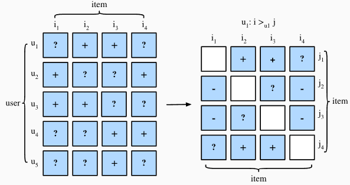

# 5 Personalized Ranking for Recommender Systems

In the former sections, only $\color{red}\text{\colorbox{white}{explicit feedback}}$ was considered and models were trained and tested on observed ratings.  There are two $\color{yellow}\text{\colorbox{black}{demerits}}$ of such methods:

- First, most feedback is $\color{magenta}\text{not explicit but implicit}$ in real-world scenarios, and explicit feedback can be more expensive to collect.
- Second, non-observed user-item pairs which may be predictive for users' interests are totally ignored, making these methods unsuitable for cases where ratings are not missing at random but because of users' preferences.

Non-observed user-item pairs are a  mixture of real negative feedback (users are not interested in the items) and missing values (the user might interact with the items in the future). We simply ignore the non-observed pairs in $\text{\color{red}\colorbox{black}{matrix factorization}}$ and $\text{\color{red}\colorbox{black}{AutoRec}}$. Clearly, these models are $\color{yellow}\text{\colorbox{black}{incapable of distinguishing}}$ between observed and non-observed pairs and are usually not suitable for personalized ranking tasks.

To this end, a class of recommendation models targeting at $\color{yellow}\text{\colorbox{black}{generating}}$ ranked recommendation lists $\color{yellow}\text{\colorbox{black}{from}}$ $\color{red}\text{\colorbox{white}{implicit feedback}}$ have gained popularity. In general, $\color{red}\text{\colorbox{black}{personalized ranking models}}$ can be optimized with $\color{magenta}pointwise$, $\color{magenta}pairwise$ or $\color{magenta}listwise$ approaches.

- $\color{magenta}\text{Pointwise}$ approaches consider a single interaction at a time and train a classifier or a regressor to predict individual preferences. $\text{\color{red}\colorbox{black}{Matrix factorization}}$ and $\text{\color{red}\colorbox{black}{AutoRec}}$ are optimized with pointwise objectives.
- $\color{magenta}\text{Pairwise}$ approaches consider a pair of items for each user and aim to approximate the optimal ordering for that pair. Usually, pairwise approaches are $\color{yellow}\text{\colorbox{black}{more suitable}}$ for the ranking task because predicting relative order is reminiscent to the nature of ranking.
- $\color{magenta}\text{Listwise}$ approaches approximate the ordering of the entire list of items, for example, direct optimizing the ranking measures such as Normalized Discounted Cumulative Gain ([NDCG](https://en.wikipedia.org/wiki/Discounted_cumulative_gain)). However, listwise approaches are $\color{yellow}\text{\colorbox{black}{more}}$ complex and compute-intensive $\color{yellow}\text{\colorbox{black}{than}}$ pointwise or pairwise approaches.

In this section, we will introduce two pairwise objectives/losses, Bayesian Personalized Ranking loss and Hinge loss, and their respective implementations.

## Bayesian Personalized Ranking Loss and its Implementation

$\text{\color{red}\colorbox{black}{Bayesian personalized ranking (BPR)}}$ :cite:`Rendle.Freudenthaler.Gantner.ea.2009` is a pairwise personalized ranking loss that is derived from the maximum posterior estimator (最大后验估计). It has been widely used in many existing recommendation models. The training data of BPR consists of both positive and negative pairs (missing values). It assumes that the user $\color{yellow}\text{\colorbox{black}{prefers}}$ the positive item $\color{yellow}\text{\colorbox{black}{over}}$ all other non-observed items.

In formal, the training data is constructed by tuples in the form of $(u, i, j)$, which represents that the $\color{red}\text{\colorbox{white}{user}}$ $\color{red}u$ $\color{yellow}\text{\colorbox{black}{prefers}}$ the $\color{magenta}\text{\colorbox{white}{item}}$ $\color{magenta}i$ $\color{yellow}\text{\colorbox{black}{over}}$ the $\color{blue}\text{\colorbox{white}{item}}$ $\color{blue}j$. The Bayesian formulation of BPR which aims to maximize the posterior probability is given below:

$$
p(\Theta \mid >_u )  \propto  p(>_u \mid \Theta) p(\Theta)

$$

Where $\Theta$ represents the parameters of an arbitrary recommendation model, $>_u$ represents the desired personalized total ranking of all items for user $u$ (用户 u 所渴望的所有商品的个性化总排名). We can formulate the maximum posterior estimator to derive the generic optimization criterion for the personalized ranking task.

$$
\begin{aligned}
\text{BPR-OPT} : &= \ln p(\Theta \mid >_u) \\
         & \propto \ln p(>_u \mid \Theta) p(\Theta) \\
         &= \ln \prod_{(u, i, j \in D)} \sigma(\hat{y}_{ui} - \hat{y}_{uj}) p(\Theta) \\
         &= \sum_{(u, i, j \in D)} \ln \sigma(\hat{y}_{ui} - \hat{y}_{uj}) + \ln p(\Theta) \\
         &= \sum_{(u, i, j \in D)} \ln \sigma(\hat{y}_{ui} - \hat{y}_{uj}) - \lambda_\Theta \|\Theta \|^2
\end{aligned}

$$

where $D := \{(u, i, j) \mid i \in I^+_u \wedge j \in I \backslash I^+_u \}$ is the training set, with $I^+_u$ denoting the items the user $u$ liked, $I$ denoting all items, and $I \backslash I^+_u$ indicating all other items excluding （排除掉 u 喜欢的商品） items the user liked. $\hat{y}_{ui}$ and $\hat{y}_{uj}$ are the predicted scores of the user $u$ to item $i$ and $j$, respectively. The prior $p(\Theta)$ is a normal distribution with zero mean and variance-covariance matrix $\Sigma_\Theta$. Here, we let $\Sigma_\Theta = \lambda_\Theta I$.





We will implement the base class  `mxnet.gluon.loss.Loss` and override the `forward` method to construct the Bayesian personalized ranking loss. We begin by importing the Loss class and the np module.

```python
from mxnet import gluon, np, npx

npx.set_np()
```

The implementation of BPR loss is as follows.

```python
#@save
class BPRLoss(gluon.loss.Loss):
    def __init__(self, weight=None, batch_axis=0, **kwargs):
        super(BPRLoss, self).__init__(weight=None, batch_axis=0, **kwargs)

    def forward(self, positive, negative):
        distances = positive - negative
        loss = - np.sum(np.log(npx.sigmoid(distances)), 0, keepdims=True)
        return loss
```

## Hinge Loss and its Implementation

The Hinge loss for ranking has different form to the [hinge loss](https://mxnet.incubator.apache.org/api/python/gluon/loss.html#mxnet.gluon.loss.HingeLoss) provided within the gluon library that is often used in classifiers such as SVMs.  The loss used for ranking in recommender systems has the following form.

$$
\sum_{(u, i, j \in D)} \max( m - \hat{y}_{ui} + \hat{y}_{uj}, 0)

$$

where $m$ is the safety margin size. It aims to push negative items away from positive items. Similar to BPR, it aims to optimize for relevant distance between positive and negative samples instead of absolute outputs, making it well suited to recommender systems.

```python
#@save
class HingeLossbRec(gluon.loss.Loss):
    def __init__(self, weight=None, batch_axis=0, **kwargs):
        super(HingeLossbRec, self).__init__(weight=None, batch_axis=0,
                                            **kwargs)

    def forward(self, positive, negative, margin=1):
        distances = positive - negative
        loss = np.sum(np.maximum(- distances + margin, 0))
        return loss
```

These two losses are interchangeable for personalized ranking in recommendation.

## Summary

- There are three types of ranking losses available for the personalized ranking task in recommender systems, namely, pointwise, pairwise and listwise methods.
- The two pairwise loses, Bayesian personalized ranking loss and hinge loss, can be used interchangeably.

## Exercises

- Are there any variants of BPR and hinge loss available?
- Can you find any recommendation models that use BPR or hinge loss?

[Discussions](https://discuss.d2l.ai/t/402)
