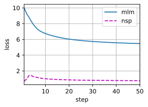

# 10. Pretraining BERT

:label:`sec_bert-pretraining`


- 原始的BERT有两个版本，其中基本模型有1.1亿个参数，大模型有3.4亿个参数。

- 在预训练BERT之后，我们可以用它来表示单个文本、文本对或其中的任何词元。

- 在实验中，同一个词元在不同的上下文中具有不同的BERT表示。这支持BERT表示是上下文敏感的。


With the BERT model implemented in [8_bert.md](8_bert.md) and the pretraining examples generated from the WikiText-2 dataset in [9_bert_dataset.md](9_bert_dataset.md), we will pretrain BERT on the WikiText-2 dataset in this section.

```python
import torch
from torch import nn
from d2l import torch as d2l
```

To start, we load the WikiText-2 dataset as minibatches of pretraining examples for MLM and NSP. The batch size is 512 and the maximum length of a BERT input sequence is 64. Note that in the original BERT model, the maximum length is 512.

```python
batch_size, max_len = 512, 64
train_iter, vocab = d2l.load_data_wiki(batch_size, max_len)
```

Downloading ../data/wikitext-2-v1.zip from https://s3.amazonaws.com/research.metamind.io/wikitext/wikitext-2-v1.zip...

## 10.1 Pretraining BERT

The original BERT has two versions of different model sizes [[Devlin et al., 2018]](https://d2l.ai/chapter_references/zreferences.html#devlin-chang-lee-ea-2018). The base model (**BERT**BASEBERTBASE) uses 12 layers (transformer encoder blocks) with 768 hidden units (hidden size) and 12 self-attention heads. The large model (**BERT**LARGEBERTLARGE) uses 24 layers with 1024 hidden units and 16 self-attention heads. Notably, the former has 110 million parameters while the latter has 340 million parameters.

For demonstration with ease, we define a small BERT, using 2 layers, 128 hidden units, and 2 self-attention heads.

```python
net = d2l.BERTModel(len(vocab), num_hiddens=128, norm_shape=[128],
                    ffn_num_input=128, ffn_num_hiddens=256, num_heads=2,
                    num_layers=2, dropout=0.2, key_size=128, query_size=128,
                    value_size=128, hid_in_features=128, mlm_in_features=128,
                    nsp_in_features=128)
devices = d2l.try_all_gpus()
loss = nn.CrossEntropyLoss()
```

Before defining the training loop, we define a helper function `_get_batch_loss_bert`. Given the shard (碎片) of training examples, this function computes the loss for both the MLM and NSP tasks. Note that the final loss of BERT pretraining is just the sum of both the MLM loss and the NSP loss.

```python
#@save
def _get_batch_loss_bert(net, loss, vocab_size, tokens_X,
                         segments_X, valid_lens_x,
                         pred_positions_X, mlm_weights_X,
                         mlm_Y, nsp_y):
    # Forward pass
    _, mlm_Y_hat, nsp_Y_hat = net(tokens_X, segments_X,
                                  valid_lens_x.reshape(-1),
                                  pred_positions_X)
    # Compute masked language model loss
    mlm_l = loss(mlm_Y_hat.reshape(-1, vocab_size), mlm_Y.reshape(-1)) *\
    mlm_weights_X.reshape(-1, 1)
    mlm_l = mlm_l.sum() / (mlm_weights_X.sum() + 1e-8)
    # Compute next sentence prediction loss
    nsp_l = loss(nsp_Y_hat, nsp_y)
    l = mlm_l + nsp_l
    return mlm_l, nsp_l, l
```

Invoking the two aforementioned helper functions, the following `train_bert` function defines the procedure to pretrain BERT (`net`) on the WikiText-2 (`train_iter`) dataset. Training BERT can take very long.

Instead of specifying the number of epochs for training as in the `train_ch13` function(see [Section 13.1](https://d2l.ai/chapter_computer-vision/image-augmentation.html#sec-image-augmentation)), the input `num_steps` of the following function specifies the number of iteration steps for training. `nums teps`是指训练迭代步数，而不是CV中的训练epoch数

```python
def train_bert(train_iter, net, loss, vocab_size, devices, num_steps):
    net = nn.DataParallel(net, device_ids=devices).to(devices[0])
    trainer = torch.optim.Adam(net.parameters(), lr=0.01)
    step, timer = 0, d2l.Timer()
    animator = d2l.Animator(xlabel='step', ylabel='loss',
                            xlim=[1, num_steps], legend=['mlm', 'nsp'])

    # Sum of masked language modeling losses, sum of next sentence prediction
    # losses, no. of sentence pairs, count
    metric = d2l.Accumulator(4)
    num_steps_reached = False
    while step < num_steps and not num_steps_reached:
        for tokens_X, segments_X, valid_lens_x, pred_positions_X,\
            mlm_weights_X, mlm_Y, nsp_y in train_iter:
            tokens_X = tokens_X.to(devices[0])
            segments_X = segments_X.to(devices[0])
            valid_lens_x = valid_lens_x.to(devices[0])
            pred_positions_X = pred_positions_X.to(devices[0])
            mlm_weights_X = mlm_weights_X.to(devices[0])
            mlm_Y, nsp_y = mlm_Y.to(devices[0]), nsp_y.to(devices[0])
            trainer.zero_grad()
            timer.start()
            mlm_l, nsp_l, l = _get_batch_loss_bert(
                net, loss, vocab_size, tokens_X, segments_X, valid_lens_x,
                pred_positions_X, mlm_weights_X, mlm_Y, nsp_y)
            l.backward()
            trainer.step()
            metric.add(mlm_l, nsp_l, tokens_X.shape[0], 1)
            timer.stop()
            animator.add(step + 1,
                         (metric[0] / metric[3], metric[1] / metric[3]))
            step += 1
            if step == num_steps:
                num_steps_reached = True
                break

    print(f'MLM loss {metric[0] / metric[3]:.3f}, '
          f'NSP loss {metric[1] / metric[3]:.3f}')
    print(f'{metric[2] / timer.sum():.1f} sentence pairs/sec on '
          f'{str(devices)}')
```

We can plot both the masked language modeling loss and the next sentence prediction loss during BERT pretraining.

```python
train_bert(train_iter, net, loss, len(vocab), devices, 50)
```

MLM loss 5.468, NSP loss 0.763
4614.3 sentence pairs/sec on [device(type='cuda', index=0), device(type='cuda', index=1)]


## 10.2. Representing Text with BERT

After pretraining BERT, we can use it to represent single text, text pairs, or any token in them.

The following function returns the BERT (`net`) representations for all tokens in `tokens_a` and `tokens_b`.

```python
def get_bert_encoding(net, tokens_a, tokens_b=None):
    """
  
    :param net: 
    :param tokens_a: 
    :param tokens_b: 
    :return: Bert编码后的 句子
    """
    tokens, segments = get_tokens_and_segments(tokens_a, tokens_b)
    token_ids = torch.tensor(vocab[tokens], device=devices[0]).unsqueeze(0)
    segments = torch.tensor(segments, device=devices[0]).unsqueeze(0)
    valid_len = torch.tensor(len(tokens), device=devices[0]).unsqueeze(0)
    encoded_X, _, _ = net(token_ids, segments, valid_len)
    return encoded_X
```

**举例1：单个句子**

Consider the sentence "a crane is flying". Recall the input representation of BERT as discussed in [8_bert.md](8_bert.md). After inserting special tokens “&lt;cls&gt;” (used for classification) and “&lt;sep&gt;” (used for separation), the BERT input sequence has **a length of six** (1 + 4 + 1 个单词).

Since zero is the index of the “&lt;cls&gt;” token, `encoded_text[:, 0, :]` (shape[0]是batch， shape[1] 是单词在句子中的位置，shape[2] 是词向量) is the BERT representation of the entire input sentence. To evaluate the polysemy （一次多义） token "crane", we also print out the first three elements of the BERT representation of the token.

```python
tokens_a = ['a', 'crane', 'is', 'flying']
encoded_text = get_bert_encoding(net, tokens_a)
# Tokens: '<cls>', 'a', 'crane', 'is', 'flying', '<sep>'
encoded_text_cls = encoded_text[:, 0, :]
encoded_text_crane = encoded_text[:, 2, :]
encoded_text.shape, encoded_text_cls.shape, encoded_text_crane[0][:3]
```

```
(torch.Size([1, 6, 128]),
torch.Size([1, 128]),
tensor([-1.7630, -0.1749,  0.6695], device='cuda:0', grad_fn=<SliceBackward0>))
```

**举例2：句子对**

Now consider a sentence pair "a crane driver came" and "he just left".

Similarly, `encoded_pair[:, 0, :]` is the encoded result of the entire sentence pair from the pretrained BERT. Note that the first three elements of the polysemy token "crane" are different from those when the context is different. （还是对于 token ”crane“ 来说，此时的 crane 的含义已经与单个句子的 crane 含义不一样了，bert 给出的词向量也是不同的）

This supports that BERT representations are **context-sensitive**.

```python
tokens_a, tokens_b = ['a', 'crane', 'driver', 'came'], ['he', 'just', 'left']
encoded_pair = get_bert_encoding(net, tokens_a, tokens_b)
# Tokens: '<cls>', 'a', 'crane', 'driver', 'came', '<sep>', 'he', 'just',
# 'left', '<sep>'
encoded_pair_cls = encoded_pair[:, 0, :]
encoded_pair_crane = encoded_pair[:, 2, :]
encoded_pair.shape, encoded_pair_cls.shape, encoded_pair_crane[0][:3]
```

```

(torch.Size([1, 10, 128]), 
torch.Size([1, 128]), 
tensor([-0.1681, -0.9842,  0.3190], device='cuda:0', grad_fn=<SliceBackward0>))```
```

In [Section 15](https://d2l.ai/chapter_natural-language-processing-applications/index.html#chap-nlp-app), we will fine-tune a pretrained BERT model for downstream natural language processing applications.

## Summary

* The original BERT has two versions, where the base model has 110 million parameters and the large model has 340 million parameters.
* After pretraining BERT, we can use it to represent single text, text pairs, or any token in them.
* In the experiment, the same token has different BERT representation when their contexts are different. This supports that BERT representations are context-sensitive.

## Exercises

1. In the experiment, we can see that the masked language modeling loss is significantly higher than the next sentence prediction loss. Why?
2. Set the maximum length of a BERT input sequence to be 512 (same as the original BERT model). Use the configurations of the original BERT model such as $\text{BERT}_{\text{LARGE}}$. Do you encounter any error when running this section? Why?

[Discussions](https://discuss.d2l.ai/t/1497)
