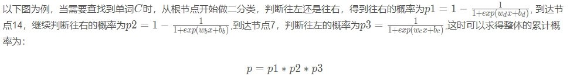

# 2. Approximate Training

- 负采样 (Negative Sampling) 通过考虑相互独立的事件来构造损失函数，这些事件同时涉及正例和负例。训练的计算量与每一步的噪声词数成线性关系。
- 分层softmax使用二叉树中从根节点到叶节点的路径构造损失函数。训练的计算成本取决于词表大小的对数。

**RECALL**  [Section 1](#1.word2vec). The main idea of Skip-Gram model is using `softmax` operations to calculate the conditional probability of generating a context word $w_o$ based on the given center word $w_c$ in [Eq(1.4)](tag{1.4}).

$\color{red}\text{Drawback}$: due to the nature of the `softmax` operation, it contains the summation of items as many as the entire size of the vocabulary. Unfortunately, the computational cost is huge! 计算量巨大

$\color{red}\text{Motivation}$: reduce the aforementioned computational complexity, this sectoin will introduce two approximate training methods:

- negative sampling
- hierachical softmax

## 2.1 Negative Sampling

This method **modifies** the **original objective function**.  (In other word, 定义了新的学习问题)

* 举例：one sequence："I want a glass of `orange juice` to go along with my cereal,"
  positive sample: `orange juice, y=1`
  negative sample: `orange ____, y=0` 从字典里采样K次，例如可得到：`orange book`, `orange king`, ...等等

Given the context window of a center word $w_c$ , the fact that any (context) word $w_o$ comes from this context window is considered as an event with the probability modeled by

$$
P(y=1|w_c, w_o) = \sigma(u^T_o v_c), \tag{2.1}

$$

where $\sigma$ uses the definition of the sigmoid activation function:

$$
\sigma(x) = \frac{1}{1+exp(-x)}  \tag{2.2}

$$

Let us begin by maximizing the joint probability of all such events in text sequences to train word embeddings. Specifically, given a text sequence of length $T$, denote by $w^{t}$ as the word at time step $t$ and let the context window size be $m$, consider maximizing the joint probability

$$
\prod^T_{t=1}\prod_{-m\leq j\leq m,\ j\neq0} P(y=1|w^{t}, w^{t+j}). \tag{2.3}

$$

However, [Eq(2.3)](\tag{2.3}) only considers those event that involve **positive examples**. As a result, the joint probability in [Eq(2.3)](\tag{2.3}) is maximized to 1 only if all the word vectors are equal to infinity. Of course, such results are meaningless. (??)

To make the objective function more meaningful, negative sampling adds negative examples sampled from a predefined distribution.

- Denote by $S$ the event that a context word $w_o$ comes from the context window of a center word $w_c$.
- For this event involving $w_o$, from a predefined distribution $P(w)$ sample $K$ noise words that are **not** from this context window. Denote by $N_k$ the event that a noise word $w_k, (k=1, ..., K)$ does not come from this context window of $w_c$.

Assume that these events involving **both** the positive example and negative examples $S, N_1, ..., N_K$ are mutually independent. Negative sampling rewrites the joint probability (involving only positive examples) in [Eq(2.3)](\tag{2.3}) as:

$$
\prod^T_{t=1}\prod_{-m\leq j\leq m,\ j\neq0} P(w^{t+j}|w^{t}). \tag{2.4}

$$

where the conditional probability is approximated through events $S, N_1, ..., N_K$:

$$
P(w^{t+j} | w^t) = P(D=1|w^t, w^{t+j}) \prod^K_{k=1,\ w_k\sim P(w)}P(D=0 | w^t, w_k). \tag{2.5}

$$

Denote by $i_t$ and $h_k$ the indices of a word $w_t$ at time step $t$ of a text sequence and a noise word $w_k$, respectively. The logarithmic loss with respect to the conditional probabilities in [2.5](\tag{2.5}) is :

$$
\begin{aligned}\tag{2.6}
-log P(w^{t+j}|w^t) &= -log P(y=1|w^t, w^{t+j}) - \sum^K_{k=1, w_k \sim P(w)} logP(y=0|w^t, w_k) \\
&= -log\sigma (u^T_i{t+j}v_{i_t}) - \sum^K_{k=1, w_k \sim P(w)}log(1-\sigma(u^T_{h_k}v_{i_t})) \\
&= -log\sigma (u^T_i{t+j}v_{i_t}) - \sum^K_{k=1, w_k \sim P(w)}log(-\sigma(u^T_{h_k}v_{i_t}))
\end{aligned}

$$

We can see that now the computational cost  for gradients at each training step has notion to do with the dictionary size, but **linearly depends on $K$** When setting the hyperparameter $K$ to a smaller value, the computational cost for gradients at each training step with negative sampling is smaller.

## 2.2 Hierarchical Softmax

As an alternative approximate training method, *hierarchical softmax* uses the binary tree illustrated in [Fig 2.1](\tag{fig2.1}), where each leaf node of the tree represents a word in dictionary $V$. 其中树的每个叶节点表示词表V中的一个词。

    
     
    

      Fig 3 用于近似训练的分层softmax，其中树的每个叶节点表示词表中的一个词
  	

Denote by $L(w)$ as the number of nodes (including both ends，其实就是深度) on the path from the root node to the leaf node representing word $w$ in the binary tree. Let $n(w, j)$ be the $j^{th}$ node on this path, with its context word vector being $u_{n(w,j)}$. For example, $L(w_3)=4$ in above Fig 3.

Hierarchical softmax approximates the conditional probability in [Eq1.4](\tag{1.4}) as: 分层softmax将 [Eq1.4](\tag{1.4}) 的条件概率近似为

$$
P(w_o | w_c) =\prod^{L(w_o)-1}_{j=1}\sigma(bool[n(w_o, j+1)==leftChild(n(w_o,j))]\cdot u^T_{n(w_o, j)}v_c)

$$

where `leftChild(n)` is the left child node of node n, `bool[·]` represents `·` is true then `return 1`, else `return -1`.

To illustarte, tel us calculate the conditional probability of generating word $w_3$ given word $w_c$ in Fig above. This requires dot products between the word vector $v_c$ of $w_c$ and non-leaf node vectors on the path (the path in bold in Fig above) from the root to $w_3$, which is traversed left, right, then left:

$$
P(w_3|w_c) = \sigma(u^T_{n(w_3, 1）} v_c)\cdot \sigma(-u^T_{n(w_3, 2）} v_c)\cdot \sigma(u^T_{n(w_3,3）} v_c).\tag{2.8}

$$

Since $\sigma(x)+\sigma(-x)=1$, it holds that the conditional probabilities of generating all the words in dictionary $V$ based on any word $w_c$ sum up to one:

$$
\sum_{w\in V} P(w|w_c) = 1. \tag{2.9}

$$

Fortunately, since $L(w_o)$-1 is on the order of $O(log_2 |V|)$ due to the binary tree structure, when the dictionary size $V$ is huge, the compytational cost for each training step using hierachical softmax is significantly reduced compared with that without approximate training.
