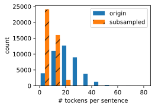

# 3. The Dataset for Pretraining Word Embeddings

- num_hiddens 表示词向量的维度
- 高频词在训练中可能不是那么有用。我们可以对他们进行下采样，以便在训练中加快速度。
- 为了提高计算效率，我们以小批量方式加载样本。我们可以定义其他变量来区分填充标记 (paddings) 和非填充标记 (non-paddings)，以及正例 (postive) 和负例 (negtive)。
- 本文实现了 skip-gram 与 negtive sampling 方法

Now that we know the technical details of the word2vec models and approximate training methods, let us walk through their implementations. Specifically, we will take the skip-gram model in [Section 1]() and negative sampling in [Section 2]() as an example. In this section, we begin with the dataset for pretraining the word embedding model: the original format of the data will be transformed into minibatches that can be iterated over during training.

```python
import math
import os
import random
import torch
from d2l_en.pytorch.d2l import torch as d2l
```

## 3.1 Reading the Dataset

the dataset that we use here is [Penn Tree](https://catalog.ldc.upenn.edu/LDC99T42). This corpus is sampled from Wall Street Journal articles, split into training, validation, and test sets.
Here we treat each word as a token.

```python
#@save
d2l.DATA_HUB['ptb'] = (d2l.DATA_URL + 'ptb.zip',
                       '319d85e578af0cdc590547f26231e4e31cdf1e42')
#@save
def read_ptb():
    """将PTB数据集加载到文本行的列表中"""
    data_dir = d2l.download_extract('ptb')
    # Readthetrainingset.
    with open(os.path.join(data_dir, 'ptb.train.txt')) as f:
        raw_text = f.read()
    return [line.split() for line in raw_text.split('\n')]

sentences = read_ptb()
f'# sentences数: {len(sentences)}'
```

```
# sentences数: 42069'
```

After reading the training set, we build a vocabulary for the corpus, where any word that appears less than 10 times is replced by the `<unk>` token.

Note that the original dataset also contains `<unk>` kokens that represent rare (unknown) words.

```python
vocab = d2l.Vocab(sentences, min_freq=10) # Vocab就是做一个按词频排序的map: {词：idx}
f'vocab size: {len(vocab)}'
```

```
'vocab size: 6719'
```

## 3.2 Subsampling (通过概率 降低 高频词 频率)

Text data typically have high-frequency words such as `"the", "a", and "in"`: they may even occur bilions of times in very large corpora.

**However**, these words often co-occur with many different words in context window, providing little useful signals.
**drawbacks are as follow:**

1. providing little useful signals.
2. training with vast amounts of (high-frequency) words is slow.

Thus, when training word embedding models, high-frequency words can be subsampled. Specifically, each indexed word $w_i$ in the dataset will be discarded with probability (下面这个 P 是丢弃概率，不是完全丢弃哦)

$$
P(w_i) = max\left(1-\sqrt{\frac{t}{f(w_i)}}, 0 \right) \tag{3.1}

$$

where $f(w_i)$ is the ratio of the number of words $w_i$ th the total number of words in the dataset, and the constant $t$ is a hyperparameter ($10^{-4}$ in the experiment).

We can see that only when the relative frequency $f(w_i) > t$ can the (high-frequency) word $w_i$ be **discarded**, and the higher the relative frequency of the word, the greater the probability of being discarded.

```python
def subsample(sentences:list, vocab:Vocab)->tuple:
    """
    Subsample high-frequency words

    :param sentences: a list including many sentences
    :param vocab: 单词表， Vocabulary for text
    :return:  a tuple: (sentences, counter：统计词频)
        new sentences not included UNK and decreased the occur times of high-frequency words
    """
    # Exclude unknown tokens '<unk>'
    sentences = [[token for token in line if vocab[token] != vocab.unk]
                 for line in sentences]
    counter = count_corpus(sentences)
    num_tokens = sum(counter.values())

    # return True if 'token' is kept during subsampling
    def keep(token):
        return (random.uniform(0, 1)<
                math.sqrt(1e-4 / counter[token] * num_tokens))
    return ([[token for token in line if keep(token)] for line in sentences],
            counter)


subsampled, counter = subsample(sentences, vocab)
```

The follwing code snippet plots the histogram of the nmber of tokens per sentence before and after subsampling.

```python
d2l.show_list_len_pair_hist(['origin', 'subsampled'], "# tockens per sentence",
                            "count", sentences, subsampled)
```



For individual tokens, the sampling rate of the high-frequency word "the" is less than 1/20.

```python
def compare_counts(token):
    return (f'"{token}"的数量：'
            f'之前={sum([l.count(token) for l in sentences])}, '
            f'之后={sum([l.count(token) for l in subsampled])}')

compare_counts('the')
```

```
'"the"的数量：之前=50770, 之后=2012'`
```

In contrast, low-frequency words "join" are completely kept

```python
compare_counts("join")
```

```
'"join"的数量：之前=45, 之后=45'
```

After subsamping, we map tokens to their indices for the corpus.

```python
corpus = [vocab[line] for line in subsampled]
corpus[:3]
```

```
[[], [392, 2115, 145, 18], [5277, 3054, 1580]]
```

## 3.3 Extracting Center Words and Context Words

The following `get_centers_and_contexts` function extracts all the center words and their context words from corpus. It uniformly samples an integer between `1` and `max_window_size` at random as the context window size ($\color{red}窗口大小：\text{[1, max window size]}$). For any center word, these words whose distance from it does not exceed the sampled context window size are its context words.

```python
def get_centers_and_contexts(corpus:list, max_window_size:int)->Tuple[list, list]:
    """
    Return center words and context words in skip-gram.

    :param corpus: 语料库 a List[list, list, ...]
    :param max_window_size: 最大窗口
    :return: a Tuple[list, List[list, list, ..., ]]
        centers = [2, 3, 12, ...],  shape = len(corpus)
        contexts = [[1,3,5], [...], ...], shape = (len(corpus), x), where x<=max window size
    """
    centers, contexts = [], []
    for line in corpus:
        # to form a "center words -- context word" pair, each sentence needs to
        # have at least 2 words
        if len(line)<2:
            continue
        centers += line
        for i in range(len(line)): # Context window centered at 'i'
            window_size = random.randint(1, max_window_size)
            indices = list(range(max(0, i-window_size), # max, min用于控制边界
                                 min(len(line), i + 1 + window_size)))
            indices.remove(i) # 从窗口里移除中心词
            contexts.append([line[idx] for idx in indices])
    return centers, contexts
```

Next, we create an artificial dataset containing two sentences of 7 and 3 words, respectively. Let the maximum context window size be 2 and print all the center words and their context words.

```python
tiny_dataset = [list(range(7)), list(range(7, 10))]
print('datset', tiny_dataset)
for center, context in zip(*get_centers_and_context(tiny_dataset, 2)):
    print('center', center, "has contexts", context)
```

```
datset [[0, 1, 2, 3, 4, 5, 6], [7, 8, 9]]
center 0 has contexts [1]
center 1 has contexts [0, 2]
center 2 has contexts [0, 1, 3, 4]
center 3 has contexts [2, 4]
center 4 has contexts [2, 3, 5, 6]
center 5 has contexts [4, 6]
center 6 has contexts [4, 5]
center 7 has contexts [8]
center 8 has contexts [7, 9]
center 9 has contexts [7, 8]
```

When training on the PTB dataset, we set the maximum context window size to 5. The following extracts all the center words and their contextwords in the dataset.

```python
all_centers, all_contexts = get_centers_and_context(corpus, 5)
f'# center-context pairs: {sum([len(contexts) for contexts in all_contexts])}'
```

```
'# center-context pairs: 1503020'
```

## 3.4 Negative Sampling （用来 近似训练的）

We use negative sampling for approximate training. To sample noise words according to predefined distribution, we define the folliwing `RandomGenerator` class, where the (possibly unnormalized) sampling distribution is passed via the argument `sampling_weights`

```python
class RandomGenerator:
    """
    Randomly draw among {1, ..., n} according to (n sampling weight, or 概率)
    an example like:
        generator = RandomGenerator([2, 3, 4]) # means 生成 1,2,3 的概率分别为：2/9, 3/9, 4/9
        [generator.draw() for _ in range(10)]
        ------------------------------------------------------------
        :return [3, 3, 2, 2, 2, 3, 2, 2, 3, 2]
    """
    def __init__(self, sampling_weights: list):
        # exclude
        self.population = list(range(1, len(sampling_weights)+1))
        self.sampling_weights = sampling_weights
        self.candidates = []
        self.i = 0 # i 是输出索引

    def draw(self) -> int:
        if self.i == len(self.candidates): # 当输出了候选词长度的单词时，重新生成候选词
            # Cache 'k' random sampling results
            self.candidates = random.choices(
                self.population, weights=self.sampling_weights, k=10000
            ) # 将population里的元素按sampling_weighes的概率来随机生成，生成10000词
            self.i = 0
        self.i += 1
        return self.candidates[self.i-1]
```

For example, we can draw 10 random variables $X$ among indices 1, 2, and 3 with sampling probabilities $P(X=1)=2/9,\ P(X=2)=3/9$, and $P(X=3)=4/9$ as follows.

```python
generator = RandomGenerator([2, 3, 4])
[generator.draw() for _ in range(10)]
```

```
[3, 3, 2, 2, 2, 3, 2, 2, 3, 2]
```

For a pair of center word and context word, we randomly sample K (5 in the experiment) noise words. According to the suggestions in the word2vec paper, the sampling probability $P(w)$ of a noise word $w$ is set to its relative frequency in the dictionary raised to the power of 0.75

```python
def get_negatives(all_contexts, vocab, counter, K):
    """Return noise words in negative sampling"""
    # Sampling weights for words with indices 1, 2, ... (index 0 is the
    # excluded unknown token) in the vocabulary
    sampling_weights = [counter[vocab.to_tokens(i)]**0.75
                        for i in range(1, len(vocab))]
    all_negatives, generator = [], RandomGenerator(sampling_weights)
    for contexts in all_contexts:
        negatives = []
        while len(negatives) < len(contexts) * K:
            neg = generator.draw()
            #Noise words cannot to be context words
            if neg not in contexts:
                negatives.append(neg)
        all_negatives.append(negatives)
    return all_negatives

all_negatives = get_negatives(all_contexts, vocab, counter, 5)
```

## 3.5 Loading Training Examples in Minibatches

After all the center words together with their context words and sampled noise words are extracted, they will be transformed into minibatches of examples that can be iteratively loaded during training.

In a minibatch, the $i^{th}$ example includes a center word and its $n_i$ context words and $m_i$ noise words. Due to varying context window sizes, $n_i+m_i$ varies for different $i$.

Thus, for each example we concatenate its context words and *noise words* in the `contexts_negatives` variable, and **pad zeros** until the concatenation length reaches $\max_i(n_i+m_i)$ **(max_len)**. To exclude paddings in the calculation of the loss, we define a mask variable `masks` （mask用法：有单词的地方=1，padding补上去的=0）. There is a one-to-one correspondence between elements in `masks` and elements in `contexts_negatives`, where zeros (otherwise ones) in `masks` correspond to paddings in `contexts_negatives`.

To distinguish between positive and negative examples, we separate context words from noise words in `contexts_negatives` via a `labels` variable. Similar to `masks`, there is also a one-to-one correspondence between elements in `labels` and elements in `contexts_negatives`, where ones (otherwise zeros) in `labels` correspond to context words (positive examples) in `contexts_negatives`.

The above idea is implemented in the following `batchify` function. Its input `data` is a list with length equal to the batch size, where each element is an example consisting of the center word `center`, its context words `context`, and its noise words `negative`. This function returns a minibatch that can be loaded for calculations during training, such as including the mask variable.

```python
def batchify(data):
    """
    Return a minibatch of examples for skip-gram with negative sampling.

    :param data: a list with length equal to the batch size, where each element is an example
        consisting of the center word `center`, its context words `context`, and its noise words `negative`
    :return: a minibatch that can be loaded for calculations during training, such as including the mask variable.
        (centers, contexts_negatives, mask, labels)

    an example like :
            x_1 = (1, [2, 2], [3, 3, 3, 3])
            x_2 = (1, [2, 2, 2], [3, 3])
            batch = batchify((x_1, x_2))

            names = ['centers', 'contexts_negatives', 'mask', 'labels']
            for name, data in zip(names, batch):
                print(name, '=', data)
            -------------------------------------------------------------
            centers = tensor([[1],
                    [1]])
            contexts_negatives = tensor([[2, 2, 3, 3, 3, 3],
                    [2, 2, 2, 3, 3, 0]])
            mask = tensor([[1, 1, 1, 1, 1, 1],
                    [1, 1, 1, 1, 1, 0]])
            labels = tensor([[1, 1, 0, 0, 0, 0],
                    [1, 1, 1, 0, 0, 0]])
    """
    max_len = max(len(c) + len(n) for _, c, n in data)
    centers, contexts_negatives, masks, labels = [],[],[],[]
    for center, context, negative in data:
        cur_len =  len(context) + len(negative)
        centers += [center]
        contexts_negatives += [context + negative + [0]*(max_len-cur_len)]
        masks += [[1]*cur_len + [0]*(max_len-cur_len)]
        labels += [[1]*len(context) + [0]*(max_len-len(context))]
    return  (torch.tensor(centers).reshape((-1, 1)), torch.tensor(
        contexts_negatives), torch.tensor(masks), torch.tensor(labels))
```

Let us test this function using a minibatch of two examples.

```python
x_1 = (1, [2, 2], [3, 3, 3, 3])
x_2 = (1, [2, 2, 2], [3, 3])
batch = batchify((x_1, x_2))

names = ['centers', 'contexts_negatives', 'mask', 'labels']
for name, data in zip(names, batch):
    print(name, '=', data)
```

centers = tensor([[1],
[1]])
contexts_negatives = tensor([[2, 2, 3, 3, 3, 3],
[2, 2, 2, 3, 3, 0]])
mask = tensor([[1, 1, 1, 1, 1, 1],
[1, 1, 1, 1, 1, 0]])
labels = tensor([[1, 1, 0, 0, 0, 0],
[1, 1, 1, 0, 0, 0]])

## 3.6 Putting All Things Togeter

Last, we define the `load_data_ptb` function that reads the PTB dataset and returns the data iterator and the vocabulary.

```python
def load_data_ptb(batch_size, max_window_size, num_noise_words):
    """
    Download the PTB dataset and then load it into memory.

    :param batch_size:
    :param max_window_size:
    :param num_noise_words:
    :return:
    """
    num_workers = d2l.get_dataloader_workers() # return 4
    sentences = read_ptb()
    vocab = d2l.Vocab(sentences, min_freq=10)
    subsampled, counter = subsample(sentences, vocab)
    corpus = [vocab[line] for line in subsampled]
    all_centers, all_contexts = get_centers_and_contexts(
        corpus, max_window_size
    )
    all_negatives = get_negatives(
        all_contexts, vocab, counter, num_noise_words
    )

    class PTBDataset(torch.utils.data.Dataset):
        def __init__(self, centers, contexts, negatives):
            assert len(centers) == len(contexts) == len(negatives)
            self.centers = centers
            self.contexts = contexts
            self.negatives = negatives

        def __getitem__(self, item):
            return (self.centers[item], self.contexts[item],
                    self.negatives[item])

        def __len__(self):
            return len(self.centers)

    dataset = PTBDataset(all_centers, all_contexts, all_negatives)

    data_iter = torch.utils.data.DataLoader(dataset, batch_size, shuffle=True,
                                            collate_fn=batchify)
    return data_iter, vocab

```

Let us print the first minibatch of the data iterator

```python
data_iter, vocab = load_data_ptb(512, 5, 5)
names = ['centers', 'contexts_negatives', 'mask', 'labels']
for batch in data_iter:
    for name, data in zip(names, batch):
        print(name, "shape", data.shape)
    break
```

centers shape torch.Size([512, 1])
contexts_negatives shape torch.Size([512, 60])
mask shape torch.Size([512, 60])
labels shape torch.Size([512, 60])

```python

```
