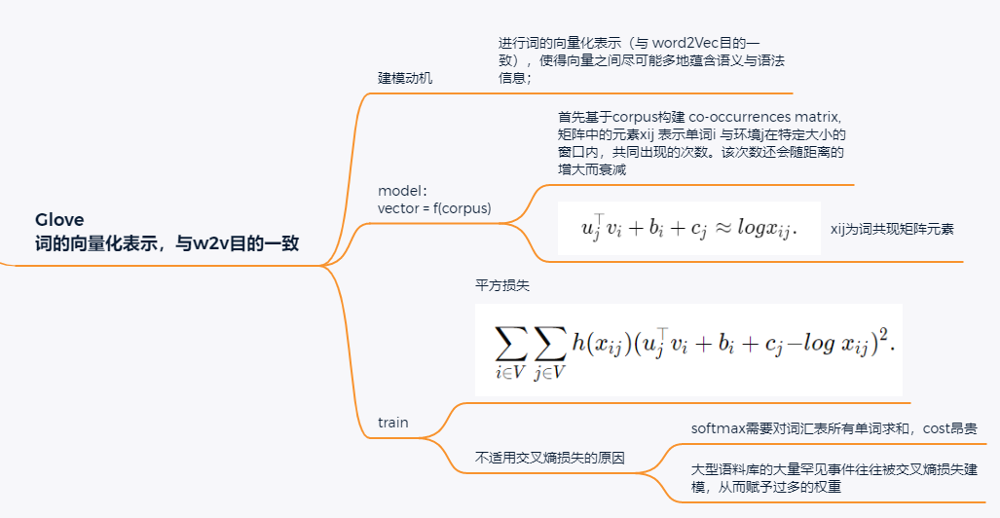

# 5 Word Embedding with Global Vector (GloVe)

- 模型总结：
  - **目标**：进行词的向量化表示（与 word2Vec目的一致），使得向量之间尽可能多地蕴含语义与语法信息；
  - **输入**：corpus 语料库
  - **输出**：词向量
  - **方法概述**：首先基于语料库构建的 co-occurrences matrix，然后基于该矩阵和 GloVe 模型学习词向量
- 诸如 Word-word co-occurrences计数的 $\color{red}\text{全局语料库统计}$ 可以来解释 skip-gram model。
- Cross-Entropy 可能不是衡量两种概率分布差异的好选择，特别是对于大型语料库。GloVe使用 $\color{red}\text{Squared Loss}$ 平方损失 来拟合 **预先计算** 的全局语料库统计数据。
- 对于GloVe中的任意词，中心词向量（center word）和上下文词向量 (context word) 在数学上是等价的。
- GloVe可以从词-词共现概率的比率来解释。

$\color{red}\text{Co-ocurrence Matrix}$:

**矩阵中的每一个元素 $X_{ij}$ 代表单词 $i$ 和上下文单词 $j$ 在特定大小的上下文窗口（context window）内共同出现的次数。** 一般而言，这个次数的最小单位是1，但是GloVe不这么认为：它根据两个单词在上下文窗口的距离  *d* ，提出了一个衰减函数（decreasing weighting）：*decay=1/d* 用于计算权重，也就是说 **距离越远的两个单词所占总计数（total count）的权重越小** 。

$\color{red}\text{Word-word co-occurrences (词-词共现)}$ within context windows may carry rich semantic information. For example, in a large corpus word “solid” is more likely to co-occur with “ice” than “steam”, but word “gas” probably co-occurs with “steam” more frequently than “ice”. Besides, global corpus statistics of such co-occurrences can be precomputed: this can lead to more efficient training. To leverage statistical information in the entire corpus for word embedding, let us first revisit the `skip-gram` model in [1_word2Vec.md](1_word2Vec.md), but interpreting it **using global corpus statistics** such as co-occurrence counts.

## 5.1 Skip-Gram with Global Corpus Statistics

Denoting by $q_{ij}$ the conditional probability $P(w_j∣w_i)$ of word $w_j$ given word $w_i$ in the `skip-gram` model, we have

$$
q_{ij} = \frac{exp(u_j^Tv_i)}{\sum_{k\in V} exp(u_k^T)v_i} \tag{5.1}

$$

where for any index $i$ vectors $v_i$ and $u_i$ represent word $w_i$ as the center word and context word, respectively, and $V=\{0,1,…,|V|−1\}$ is the index set of the vocabulary.

Consider word $w_i$ that may $\color{red}\text{occur multiple times}$ in the corpus. In the entire corpus, all the context words wherever $w_i$ is taken as their center word form $a$ *multiset* $C_i$ of word indices that  $\color{red}\text{allows for multiple instances of the same element}$ . For any element, its number of instances is called its  $\color{red}\text{multiplicity (重数)}$.

- To illustrate with **an example**, suppose that word $w_i$ occurs `twice` in the corpus and indices of the context words that take $w_i$ as their center word in the two context windows are $k,j,m,k$ and $k,l,k,j$.
- Thus, multiset $C_i={j,j,k,k,k,k,l,m}$, where $\color{red}\text{multiplicities}$ of elements $j,k,l,m$ are 2, 4, 1, 1, respectively.

Now let us denote the $\color{red}\text{multiplicity}$ of element $j$ in multiset $C_i$ as $\color{red}x_{ij}$. This is *the global co-occurrence count (共同出现次数)* of word $w_j$ (as the context word) and word $w_i$ (as the center word) in the same context window in the entire corpus. Using such global corpus statistics, the **loss function** of the `skip-gram model` is equivalent to

$$
-\sum_{i\in V}\sum_{j\in V}x_{ij}log\ q_{ij}. \tag{5.2}

$$

We further denote by $x_i$ the number of all the context words in the context windows where $w_i$ occurs as their center word, which is equivalent to $|Ci|$. Letting $p_{ij}$ be the conditional probability $x_{ij}/x_i$ for generating context word $w_j$ given center word $w_i$, [(5.2)](\tag{5.2}) can be rewritten as

$$
-\sum_{i\in V} x_{ij}\sum_{j\in V} p_{ij} log\ q_{ij}. \tag{5.3}

$$

In [(5.3)](), $-\sum_{j\in V}p_{ij}log\ q_{ij}$ calculates the `cross-entropy` of the conditional distribution $p_{ij}$ of global corpus statistics and the conditional distribution $q_{ij} $of model predictions. This loss is also weighted by $x_i$ as explained above. Minimizing the loss function in [(5.3)]() will allow the predicted conditional distribution to get close to the conditional distribution from the global corpus statistics. (即，交叉熵的作用，使得p~q)

Though being commonly used for measuring the distance between probability distributions, the `cross-entropy` loss function **may not be a good choice 不好的原因** here.

- On one hand, as we mentioned in [Section 2](,\readme.md), the cost of properly normalizing $q_{ij}$ results in the sum over the entire vocabulary, which can be **computationally expensive 求和的计算代价昂贵**.
- On the other hand, a large number of **rare events** from a large corpus are often modeled by the cross-entropy loss to be assigned with too much weight. 建模了一些稀有事件（可能与任务无关）

## 5.2 the GloVe Model

In view of this, the `GloVe` model makes **three changes** to the skip-gram model based on $\color{red}\textbf{squared loss}$ [[Pennington et al., 2014]](https://d2l.ai/chapter_references/zreferences.html#pennington-socher-manning-2014): 这部分的推到，看 5.3

1. Use variables $p_{ij}^′=x_{ij}$ and $q_{ij}^′=exp⁡(u_j^⊤v_i)$ that are **not probability distributions** and take the **logarithm** of both, so the **squared loss** term is $(log\ p_{ij}^′−log\ q_{ij}^′)^2=(u_j^⊤v_i−log\ x_{ij})^2$.
2. Add $\color{red}\textbf{two scalar model parameters}$ for each word $w_i$:
   1. the center word bias $b_i$ and
   2. the context word bias $c_i$.
3. $\colorbox{black}{\text{\color{yellow}Replace}}$ the weight of each loss term $\colorbox{black}{\text{\color{yellow}with}}$ the weight function $h(x_{ij})$, where $h(x)$ is increasing in the interval of $[0,1]$.

Putting all things together, training `GloVe` is to minimize the following $\colorbox{black}{\text{\color{yellow}loss function}}$:

$$
\sum_{i\in V}\sum_{j\in V}h(x_{ij})(u_j^⊤v_i+b_i+c_j−log\ x_{ij})^2. \tag{5.4}

$$

For the weight function, a suggested choice $(e.g., \alpha=0.75, c=100)$ is:

$$
h(x)=\left\{
\begin{aligned}
\begin{matrix}
 (x/c)^α , &if\ x<c \\
 1, &other\\
\end{matrix}
\end{aligned}
\right.

$$

In this case, because $h(0)=0$, the `squared loss` term for any $x_{ij}=0$ ($x_{ij}$ 是中心词$w_i$与环境词$w_j$的共同出现频次) can be omitted for computational efficiency. **For example**, when using minibatch `stochastic gradient descent` for training, at each iteration we randomly sample a minibatch of *non-zero* $x_{ij}$ to calculate gradients and update the model parameters. Note that these non-zero $x_{ij}$ are **precomputed** global corpus statistics; thus, the model is called `GloVe` for  `Global Vectors` .

It should be emphasized that if word $w_i$ appears in the context window of word $w_j$, then  *vice versa* . Therefore, $x_{ij}=x_{ji}$. **Unlike** `word2vec` that fits the asymmetric conditional probability $p_{ij}$, `GloVe` fits the symmetric $log\ x_{ij}$. Therefore, the center word vector and the context word vector of any word are **mathematically equivalent** in the GloVe model. **However** in practice, owing to different initialization values, the same word may still get different values in these two vectors after training: `GloVe` sums them up as the output vector.

## 5.3. Interpreting GloVe from the Ratio of Co-occurrence Probabilities

We can also interpret the `GloVe` model from another perspective. Using the same notation in [Section 5.1](), let $p_{ij}\overset{def}{=}P(w_j∣w_i)$ be the conditional probability of generating the $\color{blue}\text{context words } w_j$ given $\color{Red}w_i$ as the$\color{red}\text{center word}$ in the corpus. [Section 5.3]() lists several co-occurrence probabilities given words “ice” and “steam” and their ratios based on statistics from a large corpus.

| $w_k$=             | solid    | gas      | water  | fashion  |
| -------------------- | ---------- | ---------- | -------- | ---------- |
| p1=P($w_k$∣ice)   | 0.00019  | 0.000066 | 0.003  | 0.000017 |
| p2=P($w_k$∣steam) | 0.000022 | 0.00078  | 0.0022 | 0.000018 |
| p1/p2              | 8.9      | 0.085    | 1.36   | 0.96     |

We can observe the following from [Section 5.3](): (比值越接近1，则说明二者同时出现的概率越大)

* For a word $w_k$ that is related to “ice” but unrelated to “steam”, such as $w_k=solid$, we expect a larger ratio of co-occurence probabilities, such as 8.9.
* For a word $w_k$ that is related to “steam” but unrelated to “ice”, such as $w_k=gas$, we expect a smaller ratio of co-occurence probabilities, such as 0.085.
* For a word $w_k$ that is related to both “ice” and “steam”, such as $w_k=water$, we expect a ratio of co-occurence probabilities that is close to 1, such as 1.36.
* For a word $w_k$ that is unrelated to both “ice” and “steam”, such as $w_k=fashion$, we expect a ratio of co-occurence probabilities that is close to 1, such as 0.96.

It can be seen that the ratio of co-occurrence probabilities can intuitively express the relationship between words. 

- $p_{ij}/p_{ik}$ 越大，说明中心词 i 与 环境词 j 相关，与 k 不相关；
- $p_{ij}/p_{ik}$ = 1，说明 中心词 i 与 两个环境词都相关

Thus, we can $\colorbox{black}{\text{\color{yellow}design a function}}$ of three word vectors $\colorbox{black}{\text{\color{yellow}to fit}}$ this ratio. For the ratio of co-occurrence probabilities $p_{ij}/p_{ik}$ with $\color{Red}w_i$ being the $\color{red}\text{center word}$ and $\color{blue}w_j$ and $\color{blue}w_k$ being the $\color{blue}\text{context words}$, we want to fit this ratio using some function $f$:（f就是用来计算co-occurrence的）

$$
f(u_j,u_k,v_i)≈ \frac{p_{ij}}{p_{ik}}.\tag{5.5}

$$

Among many possible designs for $f$, we only pick a reasonable choice in the following. Since the ratio of co-occurrence probabilities is a $\color{magenta}scalar$, we require that $\color{magenta}f$ be a $\color{magenta}scalar\ function$,

- such as $f(u_j,u_k,v_i)=f((u_j−u_k)^⊤v_i)$.

Switching word indices $j$ and $k$ in [(5.5)](), it must hold that $f(x)f(−x)=1$, so one possibility is $f(x)=exp⁡(x)$, i.e.,

$$
f(u_j,u_k,v_i)= \frac{exp⁡(u_j^⊤v_i)}{exp⁡(u_k^⊤v_i)}≈\frac{p_{ij}}{p_{ik}}.

$$

- Now let us pick $exp⁡(u_j^⊤v_i)≈αp_{ij}$, where $α$ is a constant. 分子等于分子，分母等于分母。

Since $p_{ij}=x_{ij}/x_i$ （$x_i$ 表示上下文窗口中的所有上下文词的数量，其中 $w_i$ 作为它们的中心词出现）, after taking the $logarithm$ on both sides we get $u_j^⊤v_i≈logα+logx_{ij}−logx_i$. We may use additional bias terms to fit $−logα+logx_i$, such as the center word bias $b_i$ and the context word bias $c_j$:

$$
u_j^⊤v_i+b_i+c_j≈logx_{ij}.

$$

Measuring the squared error of [(5.7)]() with weights, the GloVe loss function in [(5.4)]() is obtained.

## 5.4. Summary

* The `skip-gram` model can be interpreted using global corpus statistics such as word-word co-occurrence counts.
* The *cross-entropy loss* may **not be a good choice** for measuring the difference of two probability distributions, especially for a large corpus. `GloVe` uses *squared loss* to fit precomputed global corpus statistics.
* The center word vector and the context word vector are mathematically equivalent for any word in `GloVe`.
* `GloVe` can be interpreted from the ratio of word-word co-occurrence probabilities.
