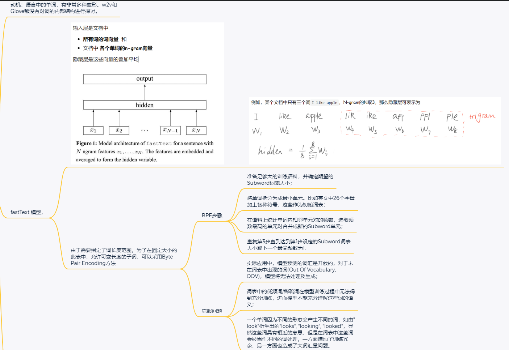

# 6. Subword Embedding 子词嵌入

- **fastText模型** 提出了一种子词嵌入方法：基于 **word2vec** 中的跳元模型 **skip-gram** ，改进：它将中心词表示为$\color{red}其子词向量之和$。
- **字节对编码BPE（压缩算法）** 执行训练数据集的统计分析，以发现词内的公共符号。作为一种贪心方法，字节对编码迭代地合并最频繁的连续符号对。
- 子词嵌入可以提高稀有词和词典外词的表示质量。
- `<UNK>`, fastText 与 BPE 都可以解决 英文OOV (out of vocab) 问题



In English, words such as “helps”, “helped”, and “helping” are inflected forms of **the same word** “help”. The relationship between “dog” and “dogs” is the **same as** that between “cat” and “cats”, and the relationship between “boy” and “boyfriend” is the **same as** that between “girl” and “girlfriend”. In other languages such as French and Spanish, many verbs have over 40 inflected forms, while in Finnish, a noun may have up to 15 cases. In linguistics, morphology studies word formation and word relationships.

${\color{red}语言中的单词，有非常多种变形。w2v和Glove都没有对词的内部结构进行探讨。}$

However, the internal structure of words was neither explored in `word2vec` nor in `GloVe`.

## 6.1. The fastText Model

Recall how words are represented in `word2vec`. In both the `skip-gram` model and the `CBOW` model, different inflected forms of the same word are directly represented by $\colorbox{black}{{\color{yellow}\text{different vectors}}}$ $\colorbox{black}{{\color{yellow}\text{without shared parameters}}}$.

To use morphological information (形态信息), the `fastText` model proposed a **subword embedding approach**, where a subword is a character $n$-gram [Bojanowski et al., 2017]. **Instead of** learning word-level vector representations, `fastText` can be considered as the `subword-level skip-gram`, where each center word is represented by the $\color{red}sum$ of its subword vectors.

Let us illustrate how to obtain subwords for each center word in fastText using the word “where”.

1. First, add special characters `“<”` and `“>”` at the **beginning** and **end** of the word to **distinguish prefixes and suffixes** from other subwords.
2. Then, extract character $n$-grams from the word.

$\color{red}\text{fastText}$举例, when $n=3$, we obtain all subwords of length 3: `“<wh”, “whe”, “her”, “ere”, “re>”`, and the special subword `“<where>”`.

输入层是文档中

- **所有词的词向量**  和
- 文档中 **各个单词的n-gram向量**

隐藏层是这些向量的叠加平均


例如，某个文档中只有三个词`I like apple`，N-gram的N取3，那么隐藏层可表示为


In $\color{red}\text{fastText}$, for any word $w$, denote by $\mathcal{G}_w$ the union of all its subwords of length between 3 and 6 and its special subword. The vocabulary is the union of the subwords of all words （词表，是所有词的子词集合）. Letting $z_g$ be the vector of subword $g$ in the dictionary, the vector $v_w$ for word $w$ as a center word in the `skip-gram` model is the sum of its subword vectors:

$$
v_w = \sum_{g\in \mathcal{g}_w}z_g

$$

The rest of fastText is the same as the `skip-gram` model. $\color{red}\text{Compared with}$ the `skip-gram` model,

- the vocabulary in `fastText` is larger, resulting in **more model parameters**.
- Besides, to calculate the representation of a word, all its subword vectors have to be summed, leading to higher computational complexity. 每个单词的词表示，都要求和所有的子词向量，即$v_w = \sum_{g\in \mathcal{g}_w}z_g$。
- However, thanks to $\color{red}\text{shared parameters}$ from subwords among words with similar structures, rare words and even out-of-vocabulary words may obtain better vector representations in fastText. 具有相似结构的词之间共享子词的参数，所以fastText可能获得更好的向量表示。

## 6.2. Byte Pair Encoding 字节对编码

In fastText, all the extracted subwords have to be of the *specified lengths*, such as 3 to 6, thus the vocabulary size cannot be predefined. To allow for variable-length subwords in a fixed-size vocabulary, we can apply a compression algorithm called **byte pair encoding (BPE)** to extract subwords [[Sennrich et al., 2015]](https://d2l.ai/chapter_references/zreferences.html#sennrich-haddow-birch-2015).

$$
\begin{aligned}
&{\color{red}\text{fastText 需要指定子词长度范围，例如3}\le{len}\le6，因此词表大小无法预先定义。}\\
&\color{red}\text{为了在固定大小的词表中，允许可变长度的子词，可以采用BPE}
\end{aligned}

$$

**BPE** performs a statistical analysis of the training dataset to discover common symbols within a word, such as consecutive characters of arbitrary length.

- Starting from symbols of length 1, **BPE** iteratively $\text{\colorbox{black}{\color{yellow}merges}}$ the $\color{red}\text{most frequent pair}$ of consecutive symbols $\text{\colorbox{black}{\color{yellow}to}}$ produce new longer symbols.
- Note that for efficiency, pairs crossing word boundaries (跨越单词边界的 pairs) are not considered.
- **In the end**, we can use such symbols as subwords to *segment words*.

1. 准备足够大的训练语料，并确定期望的Subword词表大小；
2. 将单词拆分为成最小单元。比如英文中26个字母加上各种符号，这些作为初始词表；
3. 在语料上统计单词内相邻单元对的频数，选取频数最高的单元对合并成新的Subword单元；
4. 重复第3步直到达到第1步设定的Subword词表大小或下一个最高频数为1.

**BPE** and its variants has been used for input representations in popular NLP pretraining models such as **GPT-2** [[Radford et al., 2019]](https://d2l.ai/chapter_references/zreferences.html#radford-wu-child-ea-2019) and **RoBERTa** [[Liu et al., 2019]](https://d2l.ai/chapter_references/zreferences.html#liu-ott-goyal-ea-2019).

In the following, we will illustrate **how BPE works**.

First, we **initialize** the vocabulary of symbols as all the English lowercase （小写） characters, a special end-of-word symbol `'_'` （用来分割单词）, and a special unknown symbol `'[UNK]'`.

```python
import collections

symbols = ['a', 'b', 'c', 'd', 'e', 'f', 'g', 'h', 'i', 'j', 'k', 'l', 'm',
           'n', 'o', 'p', 'q', 'r', 's', 't', 'u', 'v', 'w', 'x', 'y', 'z',
           '_', '[UNK]']

```

Since we do not consider symbol pairs that cross boundaries of words, we only need a dictionary `raw_token_freqs` that **maps** words **to** their $\color{red}\text{frequencies}$ (number of occurrences) in a dataset.

- Note that the special symbol （1. `'_'` 用来分割单词; 2. 单词切片直接用`空格`分割） is appended to each word so that we can easily **recover** a word sequence (e.g., `“a taller man”`) from a sequence of output symbols ( e.g., `“a_tall er_ man”`).

Since we start the merging process from a vocabulary of only single characters and special symbols, space is **inserted between** every pair of consecutive characters within each word (keys of the dictionary `token_freqs`).

In other words, space is the delimiter 分隔符 between symbols within a word.

```python
raw_token_freqs = {"fast_": 4, "faster_": 3, "tall_": 5, "taller_": 4}
token_freqs = {}
for token, freq in raw_token_freqs.items():
    token_freqs[' '.join(list(token))] = freq
  
token_freqs
```

```
{'f a s t _': 4, 'f a s t e r _': 3, 't a l l _': 5, 't a l l e r _': 4}
```

We define the following  `get_amx_freq_pair` function that returns **the most frequent pair** of consecutive symbols within a word, where words come from keys of the input dictionary`token_freqs`.

```python
def get_max_freq_pair (token_freqs: dict)->tuple:

    """ 返回频次最高的连续符号对

    :param token_freqs:  the input dictionary,
        such as {'f a s t _': 4, 'f a s t e r _': 3, 't a l l _': 5, 't a l l e r _': 4}
    :return: the most frequent pair of consecutive symbols within a word
        assume that the Variable pairs = {('f', 'a'): 7, ('a', 's'): 7, ('s', 't'): 7, ('t', '_'): 4, ('t', 'e'): 3,
        ('e', 'r'): 7, ('r', '_'): 7, ('t', 'a'): 9, ('a', 'l'): 9, ('l', 'l'): 9, ('l', '_'): 5, ('l', 'e'): 4}),
        then the return is  ('t', 'a').
    """
    pairs = collections.defaultdict(int)            # 默认返回 0
    for token, freq in token_freqs.items():
        symbols = token.split()                        # ['f', 'a', 's', 't', '_']
        for i in range(len(symbols) - 1):           # 将元素两两配对，生成n-1对
            # Key of ' pairs ' is a tuple of two consecutive symbols
            pairs[symbols[i], symbols[i+1]] += freq # 两个key 默认转成 tuple
    return max(pairs, key=pairs.get) # dict().get() 函数返回指定键的值
```

As a greedy approach based on frequency of consecutive symbols, **BPE** will use the following `merge_symbols` function to merge the most frequent pair of consecutive symbols to produce new symbols.

```python
def merge_symbols(max_freq_pair: tuple, token_freqs: dict, symbols: list)->dict:
    ''' merge the most frequent pair of consecutive symbols to produce new symbols

    :param max_freq_pair:  the most frequent pair of consecutive symbols within a word
        for example, ('t', 'a')
    :param token_freqs:  the input dictionary,
        such as: {'f a s t _': 4, 'f a s t e r _': 3, 't a l l _': 5, 't a l l e r _': 4}
    :param symbols: alphabet
        such as: {'a', 'b', 'c', 'd', 'e', 'f', 'g', 'h', 'i', 'j', 'k', 'l', 'm',
           'n', 'o', 'p', 'q', 'r', 's', 't', 'u', 'v', 'w', 'x', 'y', 'z',
           '_', '[UNK]'}
    :return: the new dictionary, 新加入了最高频率的字母组合
    '''
    symbols.append(''.join(max_freq_pair)) # 字母表中添加新元素 ,例如”ab“
    new_token_freqs = dict()
    for token, freq in token_freqs.items():
        new_token = token.replace(' '.join(max_freq_pair),
                                  ''.join(max_freq_pair))
        new_token_freqs[new_token] = token_freqs[token]
    return new_token_freqs
```

Now we iteratively perform the **BPE** algorithm over the keys of the dictionary `token_freqs`.

- In the first iteration, the most frequent pair of consecutive symbols are `'t'` and `'a'`, thus **BPE** merges them to produce a new symbol `'ta'`.
- In the second iteration, **BPE** continues to merge `'ta'` and `'l'` to result in another new symbol `'tal'`.

```python
num_merges = 10
token_freqs = {'f a s t _': 4, 'f a s t e r _': 3, 't a l l _': 5, 't a l l e r _': 4}
for i in range(num_merges):
    max_freq_pair = get_max_freq_pair(token_freqs)
    token_freqs = merge_symbols(max_freq_pair, token_freqs, symbols)
    print(f'merge #{i + 1}:', max_freq_pair)
    print(token_freqs)
```

```
merge #1: ('t', 'a')
{'f a s t _': 4, 'f a s t e r _': 3, 'ta l l _': 5, 'ta l l e r _': 4}
merge #2: ('ta', 'l')
{'f a s t _': 4, 'f a s t e r _': 3, 'tal l _': 5, 'tal l e r _': 4}
merge #3: ('tal', 'l')
{'f a s t _': 4, 'f a s t e r _': 3, 'tall _': 5, 'tall e r _': 4}
merge #4: ('f', 'a')
{'fa s t _': 4, 'fa s t e r _': 3, 'tall _': 5, 'tall e r _': 4}
merge #5: ('fa', 's')
{'fas t _': 4, 'fas t e r _': 3, 'tall _': 5, 'tall e r _': 4}
merge #6: ('fas', 't')
{'fast _': 4, 'fast e r _': 3, 'tall _': 5, 'tall e r _': 4}
merge #7: ('e', 'r')
{'fast _': 4, 'fast er _': 3, 'tall _': 5, 'tall er _': 4}
merge #8: ('er', '_')
{'fast _': 4, 'fast er_': 3, 'tall _': 5, 'tall er_': 4}
merge #9: ('tall', '_')
{'fast _': 4, 'fast er_': 3, 'tall_': 5, 'tall er_': 4}
merge #10: ('fast', '_')
{'fast_': 4, 'fast er_': 3, 'tall_': 5, 'tall er_': 4}
```

After 10 iterations of **BPE**, we can see that list `symbols` now contains 10 more symbols that are iteratively merged from **other symbols**.

```python
print(symbols, '\n', f'the size of symbol is: {len(symbols)}')
```

```
['a', 'b', 'c', 'd', 'e', 'f', 'g', 'h', 'i', 'j', 'k', 'l', 'm', 'n', 'o', 'p', 'q', 'r', 's', 't', 'u', 'v', 'w', 'x', 'y', 'z', '_', '[UNK]', 'ta', 'tal', 'tall', 'fa', 'fas', 'fast', 'er', 'er_', 'tall_', 'fast_']
the size of symbol is: 38
```

For the same dataset specified in the keys of the dictionary `raw_token_freqs`, each word in the dataset is now segmented by subwords `“fast_”, “fast”, “er_”, “tall_”`, and `“tall”` as a result of the byte pair encoding algorithm. For instance, words `“faster_”` and `“taller_”` are segmented as `“fast er_”` and `“tall er_”`, respectively.

```python
print(list(token_freqs.keys()))
```

```
['fast_', 'fast er_', 'tall_', 'tall er_']
```

Note that the result of **BPE** depends on the dataset being used.

We can also use the subwords learned from one dataset to segment words of another dataset (使用训练好的子词 `symbols`，来切分另一个数据集的单词). As a greedy approach, the following `segment_BPE`function tries to break words into the longest possible subwords from the input argument`symbols`.

```python
def segment_BPE(tokens, symbols):
    """to break words into the longest possible subwords from the input argument symbols.
   
    :param tokens:  单词本
    :param symbols:  alphabet
    :return:   the longest possible subwords from the input argument symbols.
    """
    outputs = []
    for token in tokens:
        start, end = 0, len(token)
        cur_output = []
        # Segment token with the longest possible subwords from symbols
        while start < len(token) and start < end:  # 双指针找最大不重复匹配字符串
            if token[start: end] in symbols:
                cur_output.append(token[start: end])
                start = end
                end = len(token)
            else:
                end -= 1
        if start < len(token):
            cur_output.append('[UNK]')
        outputs.append(' '.join(cur_output))
    return outputs
```

In the following, we use the subwords in list `symbols`, which is learned from the aforementioned dataset, to segment ` tokens` that represent another dataset.

```python
tokens = ['tallest_', 'fatter_']
print(segment_BPE(tokens, symbols))
```

['tall e s t _', 'fa t t er_']
