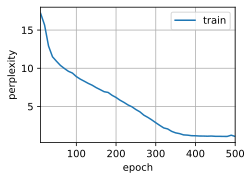
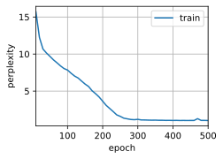

# Gated Recurrent Units (GRU)

:label:`sec_gru`

* 门控循环神经网络可以更好地捕获时间步距离很长的序列上的依赖关系。
* 重置门 有助于捕获序列中的 短期依赖关系。
* 更新门 有助于捕获序列中的 长期依赖关系。
* 重置门打开时，门控循环单元包含基本循环神经网络；更新门打开时，门控循环单元可以跳过子序列。

在 [8.7节](https://zh.d2l.ai/chapter_recurrent-neural-networks/bptt.html#sec-bptt) 中， 我们讨论了如何在循环神经网络中计算梯度， 以及矩阵连续乘积可以导致梯度消失或梯度爆炸的问题。 下面我们简单思考一下这种梯度异常在实践中的意义：

* 我们可能会遇到这样的情况：$\color{Red}早期观测值$ 对预测所有未来观测值具有非常$\color{Red}重要的意义$。 考虑一个极端情况，其中第一个观测值包含一个校验和， 目标是在序列的末尾辨别校验和是否正确。 在这种情况下，第一个词元的影响至关重要。 我们希望有某些机制能够在一个记忆元里存储重要的早期信息。 如果没有这样的机制，我们将不得不给这个观测值指定一个非常大的梯度， 因为它会影响所有后续的观测值。
* 我们可能会遇到这样的情况：$\color{Red}一些词元没有相关的观测值$。 例如，在对网页内容进行情感分析时， 可能有一些辅助HTML代码与网页传达的情绪无关。 我们希望有一些机制来 $\text{\color{yellow}\colorbox{black}{跳过}}$ 隐状态表示中的此类词元。
* 我们可能会遇到这样的情况：序列的$\color{Red}各个部分之间存在逻辑中断$。 例如，书的章节之间可能会有过渡存在， 或者证券的熊市和牛市之间可能会有过渡存在。 在这种情况下，最好有一种方法来*重置*我们的内部状态表示。

在学术界已经提出了许多方法来解决这类问题。 其中最早的方法是”长短期记忆”（long-short-term memory，LSTM） [[Hochreiter &amp; Schmidhuber, 1997]](https://zh.d2l.ai/chapter_references/zreferences.html#hochreiter-schmidhuber-1997)， 我们将在 [9.2节](https://zh.d2l.ai/chapter_recurrent-modern/lstm.html#sec-lstm)中讨论。 门控循环单元（gated recurrent unit，GRU） [[Cho et al., 2014a]](https://zh.d2l.ai/chapter_references/zreferences.html#cho-van-merrienboer-bahdanau-ea-2014) 是一个稍微简化的变体，通常能够提供同等的效果， 并且计算 [[Chung et al., 2014]](https://zh.d2l.ai/chapter_references/zreferences.html#chung-gulcehre-cho-ea-2014)的速度明显更快。 由于门控循环单元更简单，我们从它开始解读。

## Gated Hidden State

The $\color{Red}\text{key distinction}$ between vanilla RNNs and $\color{Red}\text{GRUs}$ is that the latter $\color{Red}\text{support gating of the hidden state}$.
这意味着模型有专门的机制来确定应该何时更新隐状态， 以及应该何时重置隐状态。

这些机制是可学习的，并且能够解决了上面列出的问题。 例如，如果第一个词元非常重要， 模型将学会在第一次观测之后不更新隐状态。 同样，模型也可以学会跳过不相关的临时观测。 最后，模型还将学会在需要的时候重置隐状态。 下面我们将详细讨论各类门控。

### 9.1.1.1. 重置门和更新门 Reset Gate and Update Gate

我们首先介绍 *重置门* （reset gate）和 *更新门* （update gate）。 我们把它们设计成 $(0,1)$ 区间中的向量， 这样我们就可以进行凸组合。

- reset gate 允许我们控制 “可能还想记住” 的过去状态的数量；
- update gate 将允许我们控制新状态中有多少个是旧状态的副本。

我们从构造这些门控开始。 [图9.1.1](https://zh.d2l.ai/chapter_recurrent-modern/gru.html#fig-gru-1) 描述了门控循环单元中的重置门和更新门的输入， 输入是由当前时间步的输入和前一时间步的隐状态给出。 两个门的输出是由使用sigmoid激活函数的两个全连接层给出。

<center>
    
    <br>
    <div style="color:orange; border-bottom: 1px solid #d9d9d9;
    display: inline-block;
    color: #999;
    padding: 2px;">
     图9.1.1 在门控循环单元模型中计算重置门和更新门
  	</div>
</center>

Mathematically, for a given time step $t$, suppose that the input is

- a minibatch $\mathbf{X}_t \in \mathbb{R}^{n \times d}$ (number of examples: $n$, number of inputs: $d$) and
- the hidden state of the previous time step is $\mathbf{H}_{t-1} \in \mathbb{R}^{n \times h}$ (number of hidden units: $h$).

Then, the reset gate $\mathbf{R}_t \in \mathbb{R}^{n \times h}$ and update gate $\mathbf{Z}_t \in \mathbb{R}^{n \times h}$ are computed as follows:

$$
\begin{aligned}
\mathbf{R}_t = \sigma(\mathbf{X}_t \mathbf{W}_{xr} + \mathbf{H}_{t-1} \mathbf{W}_{hr} + \mathbf{b}_r),\\
\mathbf{Z}_t = \sigma(\mathbf{X}_t \mathbf{W}_{xz} + \mathbf{H}_{t-1} \mathbf{W}_{hz} + \mathbf{b}_z),
\end{aligned}

$$

where $\mathbf{W}_{xr}, \mathbf{W}_{xz} \in \mathbb{R}^{d \times h}$ and $\mathbf{W}_{hr}, \mathbf{W}_{hz} \in \mathbb{R}^{h \times h}$ are weight parameters and $\mathbf{b}_r, \mathbf{b}_z \in \mathbb{R}^{1 \times h}$ are biases.

请注意，在求和过程中会触发广播机制 （请参阅 [2.1.3节](https://zh.d2l.ai/chapter_preliminaries/ndarray.html#subsec-broadcasting)）. 我们使用sigmoid函数（如 [4.1节](https://zh.d2l.ai/chapter_multilayer-perceptrons/mlp.html#sec-mlp)中介绍的） 将输入值转换到区间(0,1)。

### Candidate Hidden State

Next, let us integrate the reset gate $\mathbf{R}_t$ with the regular latent state updating mechanism [(8.4.5)](https://zh.d2l.ai/chapter_recurrent-neural-networks/rnn.html#equation-rnn-h-with-state). It leads to the following
*candidate hidden state* $\tilde{\mathbf{H}}_t \in \mathbb{R}^{n \times h}$ at time step $t$:

$$
\tilde{\mathbf{H}}_t = \tanh(\mathbf{X}_t \mathbf{W}_{xh} + \left(\mathbf{R}_t \odot \mathbf{H}_{t-1}\right) \mathbf{W}_{hh} + \mathbf{b}_h),

$$

where $\mathbf{W}_{xh} \in \mathbb{R}^{d \times h}$ and $\mathbf{W}_{hh} \in \mathbb{R}^{h \times h}$ are weight parameters, $\mathbf{b}_h \in \mathbb{R}^{1 \times h}$ is the bias, and the symbol $\odot$ is the Hadamard (elementwise) product operator. Here we use a nonlinearity in the form of tanh to ensure that the values in the candidate hidden state remain in the interval $(-1, 1)$.

与 [(8.4.5)](https://zh.d2l.ai/chapter_recurrent-neural-networks/rnn.html#equation-rnn-h-with-state)相比， [(9.1.2)](https://zh.d2l.ai/chapter_recurrent-modern/gru.html#equation-gru-tilde-h)中的Rt和Ht−1 的元素相乘可以减少以往状态的影响。 每当重置门Rt中的项接近1时， 我们恢复一个如 [(8.4.5)](https://zh.d2l.ai/chapter_recurrent-neural-networks/rnn.html#equation-rnn-h-with-state)中的普通的循环神经网络。 对于重置门Rt中所有接近0的项， 候选隐状态是以Xt作为输入的多层感知机的结果。 因此，任何预先存在的隐状态都会被*重置*为默认值。

[图9.1.2](https://zh.d2l.ai/chapter_recurrent-modern/gru.html#fig-gru-2)说明了应用重置门之后的计算流程。

<center>
    
    <br>
    <div style="color:orange; border-bottom: 1px solid #d9d9d9;
    display: inline-block;
    color: #999;
    padding: 2px;">
     图9.1.2 在门控循环单元模型中计算候选隐状态¶
  	</div>
</center>

### Hidden State

Finally, we need to incorporate the effect of the update gate $\mathbf{Z}_t$. This determines the extent to which the new hidden state $\mathbf{H}_t \in \mathbb{R}^{n \times h}$ is just the old state $\mathbf{H}_{t-1}$ and by how much the new candidate state $\tilde{\mathbf{H}}_t$ is used.
The update gate $\mathbf{Z}_t$ can be used for this purpose, simply by taking elementwise convex combinations between both $\mathbf{H}_{t-1}$ and $\tilde{\mathbf{H}}_t$. This leads to the final update equation for the GRU:

$$
\mathbf{H}_t = \mathbf{Z}_t \odot \mathbf{H}_{t-1}  + (1 - \mathbf{Z}_t) \odot \tilde{\mathbf{H}}_t.

$$

- 每当更新门 $Z_t$ 接近 $1$ 时，模型就倾向只保留旧状态。此时，来自 $X_t$ 的信息基本上被忽略， 从而有效地跳过了依赖链条中的时间步 $t$。
- In contrast, whenever $\mathbf{Z}_t$ is close to 0, the new latent state $\mathbf{H}_t$ approaches the candidate latent state $\tilde{\mathbf{H}}_t$.

These designs can help us cope with the vanishing gradient problem in RNNs and better capture dependencies for sequences with large time step distances.

For instance, if the update gate has been close to 1 for all the time steps of an entire subsequence, the old hidden state at the time step of its beginning will be easily retained and passed to its end, regardless of the length of the subsequence.

[图9.1.3](https://zh.d2l.ai/chapter_recurrent-modern/gru.html#fig-gru-3)说明了更新门起作用后的计算流。

<center>
    
    <br>
    <div style="color:orange; border-bottom: 1px solid #d9d9d9;
    display: inline-block;
    color: #999;
    padding: 2px;">
     图9.1.3 计算门控循环单元模型中的隐状态¶
  	</div>
</center>

总之，门控循环单元具有以下两个显著特征：

* 重置门有助于捕获序列中的短期依赖关系。
* 更新门有助于捕获序列中的长期依赖关系。

## Implementation from Scratch

为了更好地理解门控循环单元模型，我们从零开始实现它。 首先，我们读取 [8.5节](https://zh.d2l.ai/chapter_recurrent-neural-networks/rnn-scratch.html#sec-rnn-scratch)中使用的时间机器数据集：

```python
import torch
from torch import nn
from d2l import torch as d2l

batch_size, num_steps = 32, 35
train_iter, vocab = d2l.load_data_time_machine(batch_size, num_steps)
```

### (**Initializing Model Parameters**)

The next step is to initialize the model parameters.
We draw the weights from a Gaussian distribution
with standard deviation to be 0.01 and set the bias to 0. The hyperparameter `num_hiddens` defines the number of hidden units.
We instantiate all weights and biases relating to the update gate, the reset gate, the candidate hidden state,
and the output layer.

```python
def get_params(vocab_size, num_hiddens, device):
    num_inputs = num_outputs = vocab_size

    def normal(shape):
        return torch.randn(size=shape, device=device)*0.01

    def three():
        return (normal((num_inputs, num_hiddens)),
                normal((num_hiddens, num_hiddens)),
                torch.zeros(num_hiddens, device=device))

    W_xz, W_hz, b_z = three()  # Update gate parameters
    W_xr, W_hr, b_r = three()  # Reset gate parameters
    W_xh, W_hh, b_h = three()  # Candidate hidden state parameters
    # Output layer parameters
    W_hq = normal((num_hiddens, num_outputs))
    b_q = torch.zeros(num_outputs, device=device)
    # Attach gradients
    params = [W_xz, W_hz, b_z, W_xr, W_hr, b_r, W_xh, W_hh, b_h, W_hq, b_q]
    for param in params:
        param.requires_grad_(True)
    return params
```

### Defining the Model

Now we will define [**the hidden state initialization function**] `init_gru_state`. Just like the `init_rnn_state` function defined in :numref:`sec_rnn_scratch`, this function returns a tensor with a shape (batch size, number of hidden units) whose values are all zeros.

```python
def init_gru_state(batch_size, num_hiddens, device):
    return (torch.zeros((batch_size, num_hiddens), device=device), )
```

Now we are ready to [**define the GRU model**].
Its structure is the same as that of the basic RNN cell, except that the update equations are more complex.

```python
def gru(inputs, state, params):
    W_xz, W_hz, b_z, W_xr, W_hr, b_r, W_xh, W_hh, b_h, W_hq, b_q = params
    H, = state
    outputs = []
    for X in inputs:
        Z = torch.sigmoid((X @ W_xz) + (H @ W_hz) + b_z)
        R = torch.sigmoid((X @ W_xr) + (H @ W_hr) + b_r)
        H_tilda = torch.tanh((X @ W_xh) + ((R * H) @ W_hh) + b_h)
        H = Z * H + (1 - Z) * H_tilda
        Y = H @ W_hq + b_q
        outputs.append(Y)
    return torch.cat(outputs, dim=0), (H,)
```

### Training and Predicting

[**Training**] and prediction work in exactly the same manner as in :numref:`sec_rnn_scratch`.
After training,
we print out the perplexity on the training set
and the predicted sequence following
the provided prefixes "time traveller" and "traveller", respectively.

```python
vocab_size, num_hiddens, device = len(vocab), 256, d2l.try_gpu()
num_epochs, lr = 500, 1
model = d2l.RNNModelScratch(len(vocab), num_hiddens, device, get_params,
                            init_gru_state, gru)
d2l.train_ch8(model, train_iter, vocab, lr, num_epochs, device)
```

perplexity 1.1, 26805.4 tokens/sec on cuda:0
time travelleryou can show black is white by argument said filby
travelleryou can show black is white by argument said filby


## [**Concise Implementation**]

In high-level APIs,
we can directly
instantiate a GPU model.
This encapsulates all the configuration detail that we made explicit above.
The code is significantly faster as it uses compiled operators rather than Python for many details that we spelled out before.

```python
num_inputs = vocab_size
gru_layer = nn.GRU(num_inputs, num_hiddens)
model = d2l.RNNModel(gru_layer, len(vocab))
model = model.to(device)
d2l.train_ch8(model, train_iter, vocab, lr, num_epochs, device)
```

perplexity 1.0, 334686.7 tokens/sec on cuda:0
time traveller for so it will be convenient to speak of himwas e
travelleryou can show black is white by argument said filby


## Summary

* Gated RNNs can better capture dependencies for sequences with large time step distances.
* Reset gates help capture short-term dependencies in sequences.
* Update gates help capture long-term dependencies in sequences.
* GRUs contain basic RNNs as their extreme case whenever the reset gate is switched on. They can also skip subsequences by turning on the update gate.

## Exercises

1. Assume that we only want to use the input at time step $t'$ to predict the output at time step $t > t'$. What are the best values for the reset and update gates for each time step?
2. Adjust the hyperparameters and analyze the their influence on running time, perplexity, and the output sequence.
3. Compare runtime, perplexity, and the output strings for `rnn.RNN` and `rnn.GRU` implementations with each other.
4. What happens if you implement only parts of a GRU, e.g., with only a reset gate or only an update gate?

[Discussions](https://discuss.d2l.ai/t/1056)
