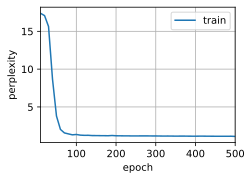

# 4. Bidirectional Recurrent Neural Networks

:label:`sec_bi_rnn`

In sequence learning, so far we assumed that $\color{yellow}\text{\colorbox{black}{our goal}}$ is to model the $\color{yellow}\text{\colorbox{black}{next}}$ output given what we have seen so far, e.g., in the context of a time series or in the context of a language model. 虽然这是一个典型情景，但不是唯一的。 还可能发生什么其它的情况呢？ 我们考虑以下三个在文本序列中填空的任务：

* I am `___`.
* I am `___` hungry.
* I am `___` hungry, and I can eat half a pig.

Depending on the amount of information available, we might fill in the blanks with very different words such as "happy", "not", and "very".
Clearly the end of the phrase (if available) conveys significant information about which word to pick.
A sequence model that is incapable of taking advantage of this will perform poorly on related tasks.
例如，如果要做好命名实体识别 （例如，识别“Green”指的是“格林先生”还是绿色）， 不同长度的上下文范围重要性是相同的。 为了获得一些解决问题的灵感，让我们先迂回到概率图模型。

## 4.1 Dynamic Programming in Hidden Markov Models

这一小节是用来说明动态规划问题的， 具体的技术细节对于理解深度学习模型并不重要， 但它有助于我们思考为什么要使用深度学习， 以及为什么要选择特定的架构。

If we want to solve the problem using $\color{red}\text{\colorbox{black}{probabilistic graphical models}}$ we could for instance design a $\color{red}\text{\colorbox{black}{latent variable model}}$ as follows. 以下三个参数，为 HMM 模型的表征参数：

- $\color{red}\text{\colorbox{white}{initial state probability}}$ $\pi =P(h_{1}=s)$.
- At any time step $t$, we assume that there exists some latent variable $h_t$ that governs our observed emission $x_t$ via $\color{red}\text{\colorbox{white}{output observation probability }}$ $P(x_t \mid h_t)$.
- Moreover, any transition $h_t \to h_{t+1}$ is given by some $\color{red}\text{\colorbox{white}{state transition probability}}$ $P(h_{t+1} \mid h_{t})$.

This probabilistic graphical model is then a $\color{red}\text{\colorbox{black}{hidden Markov model，HMM}}$ （确定一个HMM，需要结构信息：联合概率分布 + 三个表征参数） as in [图9.4.1](). （齐次马尔可夫：横向箭头 + 观测独立假设：竖向箭头）


<center>
    
    <br>
    <div style="color:orange; border-bottom: 1px solid #d9d9d9;
    display: inline-block;
    color: #999;
    padding: 2px;">
      Fig. 9.4.1 A hidden Markov model.
  	</div>
</center>


Thus, for a sequence of $T$ observations we have the following joint probability distribution 联合概率分布 over the observed and hidden states:

$$
P(x_1, \ldots, x_T, h_1, \ldots, h_T) = \prod_{t=1}^T P(h_t \mid h_{t-1}) P(x_t \mid h_t), \text{ where } P(h_1 \mid h_0) = P(h_1).\tag{9.4.1}

$$

Now assume that we observe all $x_i$ with the exception of some $x_j$ and it is $\color{yellow}\text{\colorbox{black}{our goal 1：Evaluation}}$ to compute $P(x_j \mid x_{-j})$, where $x_{-j} = (x_1, \ldots, x_{j-1}, x_{j+1}, \ldots, x_{T})$. Since there is no latent variable in $P(x_j \mid x_{-j})$, we consider summing over $\color{yellow}\text{\colorbox{black}{all the possible combinations}}$ of choices for $h_1, \ldots, h_T$. In case any $h_i$ can take on $k$ distinct values (a finite number of states), this means that we need to sum over $k^T$ terms---usually mission impossible! Fortunately there is an elegant solution for this: $\color{red}\text{\colorbox{black}{dynamic programming}}$.

To see how it works, consider summing over latent variables $h_1, \ldots, h_T$ in turn (依次求和). According to [(9.4.1)](), this yields:

$$
\begin{aligned}
    &P(x_1, \ldots, x_T) \\
    =& \sum_{h_1, \ldots, h_T} P(x_1, \ldots, x_T, h_1, \ldots, h_T) \\
    =& \sum_{h_1, \ldots, h_T} \prod_{t=1}^T P(h_t \mid h_{t-1}) P(x_t \mid h_t) \\
    =& \sum_{h_2, \ldots, h_T} \underbrace{\left[\sum_{h_1} P(h_1) P(x_1 \mid h_1) P(h_2 \mid h_1)\right]}_{\pi_2(h_2) \stackrel{\mathrm{def}}{=}}
    P(x_2 \mid h_2) \prod_{t=3}^T P(h_t \mid h_{t-1}) P(x_t \mid h_t) \\
    =& \sum_{h_3, \ldots, h_T} \underbrace{\left[\sum_{h_2} \pi_2(h_2) P(x_2 \mid h_2) P(h_3 \mid h_2)\right]}_{\pi_3(h_3)\stackrel{\mathrm{def}}{=}}
    P(x_3 \mid h_3) \prod_{t=4}^T P(h_t \mid h_{t-1}) P(x_t \mid h_t)\\
    =& \dots \\
    =& \sum_{h_T} \pi_T(h_T) P(x_T \mid h_T).
\end{aligned}

$$

In general we have the $\color{red}\text{\colorbox{white}{forward recursion 前向递归}}$ as

$$
\pi_{t+1}(h_{t+1}) = \sum_{h_t} \pi_t(h_t) P(x_t \mid h_t) P(h_{t+1} \mid h_t).

$$

The recursion is initialized as $\pi_1(h_1) = P(h_1)$. In abstract terms this can be written as $\pi_{t+1} = f(\pi_t, x_t)$, where $f$ is some learnable function. 这看起来就像我们在 RNNs 中讨论的 latent variable models 中的更新方程。

Entirely analogously to the forward recursion, we can also sum over the same set of latent variables with a $\color{blue}\text{\colorbox{white}{backward recursion}}$. This yields:

$$
\begin{aligned}
    & P(x_1, \ldots, x_T) \\
     =& \sum_{h_1, \ldots, h_T} P(x_1, \ldots, x_T, h_1, \ldots, h_T) \\
    =& \sum_{h_1, \ldots, h_T} \prod_{t=1}^{T-1} P(h_t \mid h_{t-1}) P(x_t \mid h_t) \cdot P(h_T \mid h_{T-1}) P(x_T \mid h_T) \\
    =& \sum_{h_1, \ldots, h_{T-1}} \prod_{t=1}^{T-1} P(h_t \mid h_{t-1}) P(x_t \mid h_t) \cdot
    \underbrace{\left[\sum_{h_T} P(h_T \mid h_{T-1}) P(x_T \mid h_T)\right]}_{\rho_{T-1}(h_{T-1})\stackrel{\mathrm{def}}{=}} \\
    =& \sum_{h_1, \ldots, h_{T-2}} \prod_{t=1}^{T-2} P(h_t \mid h_{t-1}) P(x_t \mid h_t) \cdot
    \underbrace{\left[\sum_{h_{T-1}} P(h_{T-1} \mid h_{T-2}) P(x_{T-1} \mid h_{T-1}) \rho_{T-1}(h_{T-1}) \right]}_{\rho_{T-2}(h_{T-2})\stackrel{\mathrm{def}}{=}} \\
    =& \ldots \\
    =& \sum_{h_1} P(h_1) P(x_1 \mid h_1)\rho_{1}(h_{1}).
\end{aligned}

$$

We can thus write the $\color{blue}\text{\colorbox{white}{backward recursion}}$ as

$$
\rho_{t-1}(h_{t-1})= \sum_{h_{t}} P(h_{t} \mid h_{t-1}) P(x_{t} \mid h_{t}) \rho_{t}(h_{t}),

$$

with initialization $\rho_T(h_T) = 1$. Both the $\color{red}\text{\colorbox{white}{forward}}$ and $\color{blue}\text{\colorbox{white}{backward recursions}}$ $\color{yellow}\text{\colorbox{black}{allow us to sum}}$ over $T$ latent variables $\color{yellow}\text{\colorbox{black}{in}} \mathcal{O}(kT)\text{\colorbox{black}{(linear) time}}$ over all values of $(h_1, \ldots, h_T)$ rather than in exponential time.
这是使用图模型 (graphical models) 进行概率推理 (probabilistic inference) 的巨大好处之一。
它也是通用消息传递算法 [[Aji & McEliece, 2000]](https://zh.d2l.ai/chapter_references/zreferences.html#aji-mceliece-2000)的一个非常特殊的例子。 结合前向和后向递归，我们能够计算

$$
P(x_j \mid x_{-j}) \propto \sum_{h_j} \pi_j(h_j) \rho_j(h_j) P(x_j \mid h_j).

$$

Note that in abstract terms （简化符号） the $\color{blue}\text{\colorbox{white}{backward recursion}}$ can be written as $\rho_{t-1} = g(\rho_t, x_t)$, where $g$ is a learnable function. 同样，这看起来非常像一个更新方程， 只是不像我们在 RNNs 中看到的那样前向运算，而是后向计算。 Indeed, $\color{red}\textbf{\colorbox{black}{hidden Markov models}}$ benefit from knowing future data when it is available. Signal processing scientists distinguish between the two cases of knowing and not knowing future observations as interpolation (内插) v.s. extrapolation (外插).
See the introductory chapter of the book on $\color{red}\textbf{\colorbox{black}{sequential Monte Carlo algorithms}}$ for more details [[Doucet et al., 2001]](https://zh.d2l.ai/chapter_references/zreferences.html#doucet-de-freitas-gordon-2001)。

## 4.2 Bidirectional Model

If we want to have a mechanism in RNNs that offers comparable look-ahead ability as in HMM, we need to modify the RNN design that we have seen so far. Fortunately, this is easy conceptually. Instead of running an RNN only in the forward mode starting from the first token, we start another one from the last token running from back to front.
*Bidirectional RNNs* add a hidden layer that passes information in a backward direction to more flexibly process such information. :numref:`fig_birnn` illustrates the architecture of a bidirectional RNN with a single hidden layer.


:label:`fig_birnn`

In fact, this is not too dissimilar to the forward and backward recursions in the dynamic programing of hidden Markov models.
The main distinction is that in the previous case these equations had a specific statistical meaning.
Now they are devoid of such easily accessible interpretations and we can just treat them as
generic and learnable functions.
This transition epitomizes many of the principles guiding the design of modern deep networks: first, use the type of functional dependencies of classical statistical models, and then parameterize them in a generic form.

### Definition

Bidirectional RNNs were introduced by :cite:`Schuster.Paliwal.1997`.
For a detailed discussion of the various architectures see also the paper :cite:`Graves.Schmidhuber.2005`.
Let us look at the specifics of such a network.

For any time step $t$,
given a minibatch input $\mathbf{X}_t \in \mathbb{R}^{n \times d}$ (number of examples: $n$, number of inputs in each example: $d$) and let the hidden layer activation function be $\phi$. In the bidirectional architecture, we assume that the forward and backward hidden states for this time step are $\overrightarrow{\mathbf{H}}_t  \in \mathbb{R}^{n \times h}$ and $\overleftarrow{\mathbf{H}}_t  \in \mathbb{R}^{n \times h}$, respectively,
where $h$ is the number of hidden units.
The forward and backward hidden state updates are as follows:

$$
\begin{aligned}
\overrightarrow{\mathbf{H}}_t &= \phi(\mathbf{X}_t \mathbf{W}_{xh}^{(f)} + \overrightarrow{\mathbf{H}}_{t-1} \mathbf{W}_{hh}^{(f)}  + \mathbf{b}_h^{(f)}),\\
\overleftarrow{\mathbf{H}}_t &= \phi(\mathbf{X}_t \mathbf{W}_{xh}^{(b)} + \overleftarrow{\mathbf{H}}_{t+1} \mathbf{W}_{hh}^{(b)}  + \mathbf{b}_h^{(b)}),
\end{aligned}

$$

where the weights $\mathbf{W}_{xh}^{(f)} \in \mathbb{R}^{d \times h}, \mathbf{W}_{hh}^{(f)} \in \mathbb{R}^{h \times h}, \mathbf{W}_{xh}^{(b)} \in \mathbb{R}^{d \times h}, \text{ and } \mathbf{W}_{hh}^{(b)} \in \mathbb{R}^{h \times h}$, and biases $\mathbf{b}_h^{(f)} \in \mathbb{R}^{1 \times h} \text{ and } \mathbf{b}_h^{(b)} \in \mathbb{R}^{1 \times h}$ are all the model parameters.

Next, we concatenate the forward and backward hidden states $\overrightarrow{\mathbf{H}}_t$ and $\overleftarrow{\mathbf{H}}_t$
to obtain the hidden state $\mathbf{H}_t \in \mathbb{R}^{n \times 2h}$ to be fed into the output layer.
In deep bidirectional RNNs with multiple hidden layers,
such information
is passed on as *input* to the next bidirectional layer. Last, the output layer computes the output $\mathbf{O}_t \in \mathbb{R}^{n \times q}$ (number of outputs: $q$):

$$
\mathbf{O}_t = \mathbf{H}_t \mathbf{W}_{hq} + \mathbf{b}_q.

$$

Here, the weight matrix $\mathbf{W}_{hq} \in \mathbb{R}^{2h \times q}$ and the bias $\mathbf{b}_q \in \mathbb{R}^{1 \times q}$ are the model parameters of the output layer. In fact, the two directions can have different numbers of hidden units.

### Computational Cost and Applications

One of the key features of a bidirectional RNN is that information from both ends of the sequence is used to estimate the output. That is, we use information from both future and past observations to predict the current one.
In the case of next token prediction this is not quite what we want.
After all, we do not have the luxury of knowing the next to next token when predicting the next one. Hence, if we were to use a bidirectional RNN naively we would not get a very good accuracy: during training we have past and future data to estimate the present. During test time we only have past data and thus poor accuracy. We will illustrate this in an experiment below.

To add insult to injury, bidirectional RNNs are also exceedingly slow.
The main reasons for this are that
the forward propagation
requires both forward and backward recursions
in bidirectional layers
and that the backpropagation is dependent on the outcomes of the forward propagation. Hence, gradients will have a very long dependency chain.

In practice bidirectional layers are used very sparingly and only for a narrow set of applications, such as filling in missing words, annotating tokens (e.g., for named entity recognition), and encoding sequences wholesale as a step in a sequence processing pipeline (e.g., for machine translation).
In :numref:`sec_bert` and :numref:`sec_sentiment_rnn`,
we will introduce how to use bidirectional RNNs
to encode text sequences.

## (**Training a Bidirectional RNN for a Wrong Application**)

If we were to ignore all advice regarding the fact that bidirectional RNNs use past and future data and simply apply it to language models,
we will get estimates with acceptable perplexity. Nonetheless, the ability of the model to predict future tokens is severely compromised as the experiment below illustrates.
Despite reasonable perplexity, it only generates gibberish even after many iterations.
We include the code below as a cautionary example against using them in the wrong context.

```python
import torch
from torch import nn
from d2l import torch as d2l

# Load data
batch_size, num_steps, device = 32, 35, d2l.try_gpu()
train_iter, vocab = d2l.load_data_time_machine(batch_size, num_steps)
# Define the bidirectional LSTM model by setting `bidirectional=True`
vocab_size, num_hiddens, num_layers = len(vocab), 256, 2
num_inputs = vocab_size
lstm_layer = nn.LSTM(num_inputs, num_hiddens, num_layers, bidirectional=True)
model = d2l.RNNModel(lstm_layer, len(vocab))
model = model.to(device)
# Train the model
num_epochs, lr = 500, 1
d2l.train_ch8(model, train_iter, vocab, lr, num_epochs, device)
```

perplexity 1.1, 119331.5 tokens/sec on cuda:0
time travellerererererererererererererererererererererererererer
travellerererererererererererererererererererererererererer


The output is clearly unsatisfactory for the reasons described above.
For a
discussion of more effective uses of bidirectional RNNs, please see the sentiment
analysis application
in :numref:`sec_sentiment_rnn`.

## Summary

* In bidirectional RNNs, the hidden state for each time step is simultaneously determined by the data prior to and after the current time step.
* Bidirectional RNNs bear a striking resemblance with the forward-backward algorithm in probabilistic graphical models.
* Bidirectional RNNs are mostly useful for sequence encoding and the estimation of observations given bidirectional context.
* Bidirectional RNNs are very costly to train due to long gradient chains.

## Exercises

1. If the different directions use a different number of hidden units, how will the shape of $\mathbf{H}_t$ change?
2. Design a bidirectional RNN with multiple hidden layers.
3. Polysemy is common in natural languages. For example, the word "bank" has different meanings in contexts “i went to the bank to deposit cash” and “i went to the bank to sit down”. How can we design a neural network model such that given a context sequence and a word, a vector representation of the word in the context will be returned? What type of neural architectures is preferred for handling polysemy?

[Discussions](https://discuss.d2l.ai/t/1059)
