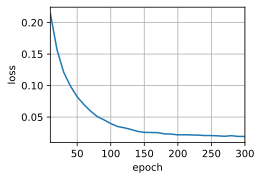

# 7 Sequence to Sequence Learning

:label:`sec_seq2seq`

- 根据“编码器-解码器”架构的设计， 我们可以使用两个循环神经网络来设计一个序列到序列学习的模型。
- 在实现编码器和解码器时，我们可以使用多层循环神经网络。
- 我们可以使用 mask 来过滤不相关的计算，例如在计算损失时。
- 在“编码器－解码器”**训练中**，**强制教学**方法将原始输出序列（而非预测结果）输入解码器。
- **BLEU**是一种常用的**评估方法**，它通过测量预测序列和标签序列之间的元语法的匹配度来评估预测。

As we have discussed in [Section 9.5](https://d2l.ai/chapter_recurrent-modern/machine-translation-and-dataset.html#sec-machine-translation), machine translation is $\color{red}\text{a major problem}$ domain for sequence transduction models, whose input and output are both $\color{red}\textbf{variable-length sequences}$. To handle this type of inputs and outputs, we can design an architecture with two major components.

- The first component is an  $\color{red}encoder$ : it takes a variable-length sequence as the input and transforms it into $\color{magenta}\text{a state with a fixed shape}$. （固定形状的隐状态）
- The second component is a  $\color{red}decoder$ : it **maps** the encoded state of a fixed shape **to** a $\color{magenta}\text{variable-length sequence}$.

This is called an `encoder-decoder` architecture, which is depicted in [Fig. 9.6.1](https://d2l.ai/chapter_recurrent-modern/encoder-decoder.html#fig-encoder-decoder).

Following the design principle of the `encoder-decoder` architecture,

- the $\color{red}\text{RNN encoder}$ can take a **variable-length sequence** as the input and transforms it into a **fixed-shape hidden state**. In other words, information of the input (source) sequence is *encoded* in the hidden state of the RNN encoder.
- To generate the output sequence token by token, a separate $\color{red}\text{RNN decoder}$ can **predict** the next token based on what tokens have been seen (such as in language modeling) or **generated**, together with the encoded information of the input sequence. (输入是已经观测的单词，以及Encoder的隐状态信息)

[Fig. 9.7.1](https://d2l.ai/chapter_recurrent-modern/seq2seq.html#fig-seq2seq) illustrates how to use **two RNNs** for sequence to sequence learning in machine translation.

<center>
    
    <br>
    <div style="color:orange; border-bottom: 1px solid #d9d9d9;
    display: inline-block;
    color: #999;
    padding: 2px;">
      Fig. 9.7.1 Sequence to sequence learning with an RNN encoder and an RNN decoder
  	</div>
</center>

In [Fig. 9.7.1](https://d2l.ai/chapter_recurrent-modern/seq2seq.html#fig-seq2seq), the special `"<eos>"` token marks the $\color{red}\textbf{e}$nd $\color{red}\textbf{o}$f the $\color{red}\textbf{s}$equence. The model can stop making predictions once this token is generated. At the initial time step of the RNN decoder, there are two special design decisions.

- First, the special $\color{red}\textbf{b}$eginning-$\color{red}\textbf{o}$f-$\color{red}\textbf{s}$equence `"<bos>"` token is an input.
- Second, the $\text{\colorbox{black}{\color{yellow}final}}$ hidden state of the RNN $\color{red}encoder$ （Encoder的最终隐状态） is used to $\text{\colorbox{black}{\color{yellow}initiate}}$ the hidden state of the $\color{magenta}decoder$ (Decoder的初始状态).

举例子：In designs such as [[Sutskever et al., 2014]](https://d2l.ai/chapter_references/zreferences.html#sutskever-vinyals-le-2014), this is exactly how the encoded input sequence information is fed into the decoder for generating the output (target) sequence. In some other designs such as [[Cho et al., 2014b]](https://d2l.ai/chapter_references/zreferences.html#cho-van-merrienboer-gulcehre-ea-2014), the final hidden state of the encoder is also fed into the decoder as part of the inputs at every time step as shown in [Fig. 9.7.1](https://d2l.ai/chapter_recurrent-modern/seq2seq.html#fig-seq2seq). Similar to the training of language models in [Section 8.3](https://d2l.ai/chapter_recurrent-neural-networks/language-models-and-dataset.html#sec-language-model), we can allow the labels to be the original output sequence, shifted by one token: `"<bos>"`, `“Ils”`, `“regardent”`, `“.”` → `“Ils”`, `“regardent”`, `“.”`, `“<eos>”`.

In the following, we will explain the design of [Fig. 9.7.1](https://d2l.ai/chapter_recurrent-modern/seq2seq.html#fig-seq2seq) in greater detail. We will train this model for machine translation on the English-French dataset as introduced in [Section 9.5](https://d2l.ai/chapter_recurrent-modern/machine-translation-and-dataset.html#sec-machine-translation).

```python
import collections
import math
import torch
from torch import nn
from d2l import torch as d2l
```

## 7.1. Encoder

Technically speaking, the $\color{red}encoder$ $\text{\colorbox{black}{\color{yellow}transforms}}$ an input sequence of variable length $\text{\colorbox{black}{\color{yellow}into}}$ a fixed-shape *context variable* c, and $\text{\colorbox{black}{\color{yellow}encodes}}$ the input sequence information $\text{\colorbox{black}{\color{yellow}in}}$ this context variable. As depicted in [Fig. 9.7.1](https://d2l.ai/chapter_recurrent-modern/seq2seq.html#fig-seq2seq), we can use an `RNN` to design the encoder.

Let us consider a sequence example (`batch size: 1`). Suppose that the input sequence is $x_1, \ldots, x_T$, such that $x_t$ is the $t^{\mathrm{th}}$ token in the input text sequence. At time step $t$, the $\color{red}RNN$ $\text{\colorbox{black}{\color{yellow}transforms}}$ the input feature vector $\mathbf{x}_t$ for $x_t$ and the hidden state $\mathbf{h} _{t-1}$ from the previous time step $\text{\colorbox{black}{\color{yellow}into}}$ the current hidden state $\mathbf{h}_t$. We can use a function $f$ to express the transformation of the RNN's recurrent layer:

$$
\mathbf{h}_t = f(\mathbf{x}_t, \mathbf{h}_{t-1}).

$$

In general, the $\color{red}encoder$ $\text{\colorbox{black}{\color{yellow}transforms}}$ the hidden states at all the time steps $\text{\colorbox{black}{\color{yellow}into}}$ the context variable through a customized function $q$:

$$
\mathbf{c} =  q(\mathbf{h}_1, \ldots, \mathbf{h}_T).

$$

For example, when choosing $q(\mathbf{h}_1, \ldots, \mathbf{h}_T) = \mathbf{h}_T$ such as in [Fig. 9.7.1](https://d2l.ai/chapter_recurrent-modern/seq2seq.html#fig-seq2seq), the context variable is just the hidden state $h_T$ of the input sequence at the $\color{yellow}final$ time step.

- So far we have used a `unidirectional RNN` (单向RNN) to design the **encoder**, where a hidden state **only depends on** the input subsequence at and before the time step of the hidden state. （只能看到第 $t$ 步**之前**的输入子序列）
- We can also construct **encoders** using `bidirectional RNNs` （双向RNN）. In this case, a hidden state depends on the subsequence **before and after** the time step (including the input at the current time step)（能看到**前、后**的子序列）, which encodes the information of the entire sequence.

Now let us [ **implement the RNN encoder** ]. Note that we use an `embedding layer` to obtain the feature vector for each token in the input sequence. The weight of an embedding layer is a matrix whose number of rows equals to the size of the input vocabulary (`vocab_size`) and number of columns equals to the feature vector's dimension (`embed_size`). For any input token index $\textbf{i}$, the embedding layer fetches the $i^{th}$ row (starting from 0) of the weight matrix to return its feature vector. Besides, here we choose a multilayer GRU to implement the encoder.

```python
#@save
class Seq2SeqEncoder(d2l.Encoder):
    """The RNN encoder for sequence to sequence learning."""
    def __init__(self, vocab_size, embed_size, num_hiddens, num_layers,
                 dropout=0, **kwargs):
        super(Seq2SeqEncoder, self).__init__(**kwargs)
        # Embedding layer
        self.embedding = nn.Embedding(vocab_size, embed_size)
        self.rnn = nn.GRU(embed_size, num_hiddens, num_layers,
                          dropout=dropout)

    def forward(self, X, *args):
        # The output `X` shape: (`batch_size`, `num_steps`, `embed_size`)
        X = self.embedding(X)
        # In RNN models, the first axis corresponds to time steps
        X = X.permute(1, 0, 2)
        # When state is not mentioned, it defaults to zeros
        output, state = self.rnn(X)
        # `output` shape: (`num_steps`, `batch_size`, `num_hiddens`)
        # `state` shape: (`num_layers`, `batch_size`, `num_hiddens`)
        return output, state
```

The returned variables of recurrent layers have been explained in [Section 8.6](https://d2l.ai/chapter_recurrent-neural-networks/rnn-concise.html#sec-rnn-concise). Let us still use a concrete example to [ **illustrate the above encoder implementation.** ] Below we instantiate a two-layer $\text{GRU encoder}$ whose number of hidden units is 16.

- `input`：Given a minibatch of sequence inputs `X` (`batch size: 4`, `number of time steps: 7`),
- `output`：the hidden states of the last layer **at all the time steps** (`output` return by the encoder's recurrent layers) are a tensor of shape (`number of time steps`, `batch size`, `number of hidden units`).

```python
encoder = Seq2SeqEncoder(vocab_size=10, embed_size=8, num_hiddens=16,
                         num_layers=2)
encoder.eval() # BN层、Dropout 失效
X = torch.zeros((4, 7), dtype=torch.long)
output, state = encoder(X)
output.shape
```

```
torch.Size([7, 4, 16])
```

- `GRU state`：Since a GRU is employed here, the shape of the **multilayer hidden states** at **the final time step** is (`number of hidden layers`, `batch size`, `number of hidden units`). If an LSTM is used, memory cell information will also be contained in `state`.

```python
state.shape
```

torch.Size([2, 4, 16])

## 7.2. Decoder

- 由于本文的Decoder是由RNN搭建的，因此输入已经考虑时序性（RNN内部机理实现）
- 如果使用attention机制，则需手动设置mask操作，用以实现时序关系

As we just mentioned, the **context variable** $\mathbf{c}$ of the $\color{red}encoder$'s output encodes the entire input sequence $x_1, \ldots, x_T$. Given the output sequence $y_1, y_2, \ldots, y_{T'}$ from the training dataset, for each time step $\color{magenta}t'$ (the symbol differs from the time step $\color{red}t$ of input sequences or encoders), the probability of the $\color{magenta}decoder$ output $y_{t'}$ is conditional on (取决于) the $\color{black}\text{\colorbox{yellow}{previous output subsequence}}$ $y_1, \ldots, y_{t'-1}$ and the $\color{black}\text{\colorbox{yellow}{context variable }}$ $\mathbf{c}$, i.e., $P(y_{t'} \mid y_1, \ldots, y_{t'-1}, \mathbf{c})$.

To model this conditional probability on sequences, we can use another RNN as the $\color{magenta}decoder$. At any time step $\color{magenta}t'$ on the output sequence, the RNN

- **takes** the $\color{magenta}\text{output } y_{t^\prime-1}$ from the previous time step and the $\color{red}\text{context variable }\mathbf{c}$ **as** its $\text{\colorbox{black}{\color{yellow}input}}$,
- then $\text{\colorbox{black}{\color{yellow}transforms}}$ them and the previous hidden state $\mathbf{s}_{t^\prime-1}$ $\text{\colorbox{black}{\color{yellow}into}}$ the hidden state $\mathbf{s}_{t^\prime}$ at the current time step.

As a result, we can use a function $g$ to express the transformation of the decoder's hidden layer:

$$
\mathbf{s}_{t^\prime} = g(y_{t^\prime-1}, \mathbf{c}, \mathbf{s}_{t^\prime-1}). \tag{9.7.3}

$$

- $y_{t^\prime-1}$: the output from the previous time step（decoder 上一个step的输出or预测值）
- $\mathbf{c}$：the context variable （来自encoder最后一层的隐状态）
- $\mathbf{s}_{t^\prime-1}$：the previous hidden state，（来自decoder的隐状态）

After obtaining the hidden state of the $\color{magenta}decoder$, we can use an output layer and the softmax operation to compute the conditional probability distribution
$P(y_{t^\prime} \mid y_1, \ldots, y_{t^\prime-1}, \mathbf{c})$ for the output at time step $t^\prime$.

Following [Fig. 9.7.1](https://d2l.ai/chapter_recurrent-modern/seq2seq.html#fig-seq2seq), when implementing the decoder as follows,

- we directly use the hidden state at the $\text{\colorbox{black}{\color{yellow}final}}$ time step of the $\color{red}encoder$ to initialize the hidden state of the $\color{magenta}decoder$. This requires that the **RNN encoder** and the **RNN decoder** have the **same number** of layers and hidden units.
- To further incorporate the encoded input sequence information, the `context variable` is $\text{\colorbox{black}{\color{yellow}concatenated with}}$ the `decoder input` at all the time steps. (每一时间步都要拼接 c)
- To predict the probability distribution of the output token, a `fully-connected layer` is used to transform the hidden state at the $\color{red}\text{\colorbox{white}{final}}$ layer of the RNN $\color{magenta}decoder$.

```python
class Seq2SeqDecoder(d2l.Decoder):
    """The RNN decoder for sequence to sequence learning."""
    def __init__(self, vocab_size, embed_size, num_hiddens, num_layers,
                 dropout=0, **kwargs):
        super(Seq2SeqDecoder, self).__init__(**kwargs)
        self.embedding = nn.Embedding(vocab_size, embed_size)
        self.rnn = nn.GRU(embed_size + num_hiddens, num_hiddens, num_layers,
                          dropout=dropout)
        self.dense = nn.Linear(num_hiddens, vocab_size)

    def init_state(self, enc_outputs, *args):
        return enc_outputs[1]

    def forward(self, X, state):
        # The output `X` shape: (`num_steps`, `batch_size`, `embed_size`)
        X = self.embedding(X).permute(1, 0, 2)
        # Broadcast `context` so it has the same `num_steps` as `X`
        context = state[-1].repeat(X.shape[0], 1, 1)
        X_and_context = torch.cat((X, context), 2)
        output, state = self.rnn(X_and_context, state)
        output = self.dense(output).permute(1, 0, 2)
        # `output` shape: (`batch_size`, `num_steps`, `vocab_size`)
        # `state` shape: (`num_layers`, `batch_size`, `num_hiddens`)
        return output, state
```

To [ **illustrate the implemented decoder** ], below we instantiate it with the same hyperparameters from the aforementioned encoder. As we can see,

- `output after FC layer`：the output shape of the decoder becomes (`batch size`, `number of time steps`, `vocabulary size`), where the $\color{red}\text{\colorbox{white}{last}}$ dimension of the tensor stores $\color{red}\text{\colorbox{white}{the predicted token distribution}}$.
- `state` : (`num_layers`, `batch_size`, `num_hiddens`) 记录的还是最后个时间步的输出，这时候state其实没用了，主要看output

```python
decoder = Seq2SeqDecoder(vocab_size=10, embed_size=8, num_hiddens=16,
                         num_layers=2)
decoder.eval()
state = decoder.init_state(encoder(X))
output, state = decoder(X, state)
output.shape, state.shape
```

```
(torch.Size([4, 7, 10]), torch.Size([2, 4, 16]))
```

To summarize, the layers in the above RNN encoder-decoder model are illustrated in [Fig. 9.7.2](https://d2l.ai/chapter_recurrent-modern/seq2seq.html#fig-seq2seq-details).

<center>
    
    <br>
    <div style="color:orange; border-bottom: 1px solid #d9d9d9;
    display: inline-block;
    color: #999;
    padding: 2px;">
      Fig. 9.7.2 Layers in an RNN encoder-decoder model.¶
  	</div>
</center>

## 7.3. Loss Function

At each time step, the $\color{magenta}decoder$ predicts a $\color{magenta}\text{probability distribution}$ for the output tokens.

Similar to **language modeling**, we can

- apply `softmax` to obtain the distribution and
- calculate the `cross-entropy loss` for optimization. (注意，torch.nn.CorssEntropy() 包含 softmax操作)

Recall [Section 9.5](https://d2l.ai/chapter_recurrent-modern/machine-translation-and-dataset.html#sec-machine-translation) that the **special padding tokens** are appended to the $\color{red}e$nd $\color{red}o$f $\color{red}s$equences, so sequences of **varying lengths** can be efficiently loaded in minibatches of the same shape. **However**, prediction of padding tokens should be excluded from loss calculations. （由于设置了special padding tokens，所以我们的句子长度可以不同，但是计算 Loss 的时候，还是要将这些  填充tokens $\color{red}排除$ 出去）

To this end, we can use the following `sequence_mask` function to [ $\color{red}\text{mask irrelevant entries} $ with $\color{red}\text{zero}$ $\color{red}\text{values}$ ] so later multiplication of any irrelevant prediction with zero equals to zero. $\color{black}\text{\colorbox{yellow}{For example}}$, if the $\color{blue}\text{\colorbox{white}{valid length}}$ of two sequences excluding padding tokens are $\color{blue}\text{\colorbox{white}{one}}$ and $\color{blue}\text{\colorbox{white}{two}}$, respectively, the remaining entries after the first one and the first two entries are cleared to zeros (除了这1、2个有效单词，后面的单词全被置为0).

```python
def sequence_mask(X: torch.tensor, valid_len: torch.tensor, value=0):
    """ Mask irrelevant entries in sequences.

    :param X: tensor, (batch, sequences, num_hidden)
    :param valid_len: tensor, (batch, int)
    :param value:
    :return: tensor, (batch, sequences, num_hidden)
    """
    maxlen = X.size(1) # 返回：当前tesor 列的维度
    # torch.arange() 相当于 range函数
    mask = torch.arange((maxlen), dtype=torch.float32,
                        device=X.device)[None, :] < valid_len[:, None]
    X[~mask] = value
    return Xdef sequence_mask(X, valid_len, value=0):
    """Mask irrelevant entries in sequences."""
    maxlen = X.size(1)
    mask = torch.arange((maxlen), dtype=torch.float32,
                        device=X.device)[None, :] < valid_len[:, None]
    X[~mask] = value # 大于valid_len的token全部置零
    return X

X = torch.tensor([[1, 2, 3], [4, 5, 6]])
sequence_mask(X, torch.tensor([1, 2]))
```

```
tensor([[1, 0, 0],
[4, 5, 0]])
```

( **We can also mask all the entries across the last few axes.** ) If you like, you may even **specify 可以自己指定值来替换** to replace such entries with a non-zero value.

```python
X = torch.ones(2, 3, 4)
sequence_mask(X, torch.tensor([1, 2]), value=-1)
```

```
tensor([[[ 1.,  1.,  1.,  1.],
[-1., -1., -1., -1.],
[-1., -1., -1., -1.]],

[[ 1.,  1.,  1.,  1.],
[ 1.,  1.,  1.,  1.],
[-1., -1., -1., -1.]]])
```

Now we can [ **extend the softmax cross-entropy loss to allow the masking of irrelevant predictions.** ]

- Initially, masks for all the predicted tokens are set to one. 首先，单词全置为1
- Once the valid length is given, the mask corresponding to any padding token will be cleared to zero. （一旦超过有效长度，后面的单词置0）
- In the end, the loss for all the tokens will be multipled by the mask to filter out irrelevant predictions of padding tokens in the loss. 所有token的loss 乘以 mask

```python
#@save
class MaskedSoftmaxCELoss(nn.CrossEntropyLoss):
    """The softmax cross-entropy loss with masks."""
    # `pred` shape: (`batch_size`, `num_steps`, `vocab_size`)
    # `label` shape: (`batch_size`, `num_steps`)
    # `valid_len` shape: (`batch_size`,)
    def forward(self, pred, label, valid_len):
        weights = torch.ones_like(label)
        weights = sequence_mask(weights, valid_len)
        self.reduction='none'
        unweighted_loss = super(MaskedSoftmaxCELoss, self).forward(
            pred.permute(0, 2, 1), label) # 调用父类，nn.CrossEntropyLoss.forward() 方法
        weighted_loss = (unweighted_loss * weights).mean(dim=1)
        return weighted_loss
```

- For [ **a sanity check** 健全性检查], we can create three identical sequences.
- Then we can specify that the valid lengths of these sequences are 4, 2, and 0, respectively.
- As a result, the loss of the 第一个句子 should be twice as large as that of 第二个句子, while 第三个句子 should have a zero loss.

```python
loss = MaskedSoftmaxCELoss()
loss(torch.ones(3, 4, 10), torch.ones((3, 4), dtype=torch.long),
     torch.tensor([4, 2, 0]))
```

tensor([2.3026, 1.1513, 0.0000])

## 7.4. Training 训练过程

In the following $\color{black}\text{\colorbox{yellow}{training loop}}$, we $\text{\colorbox{black}{\color{yellow}concatenate}}$ the special $\color{red}b$eginning-$\color{red}o$f-$\color{red}s$equence token `"<bos>"` $\text{\colorbox{black}{\color{yellow}and}}$ the original output sequence （翻译答案Y） $\text{\colorbox{black}{\color{yellow}excluding}}$ (剔除掉) the $\color{red}\text{final}$ token `"<eos>"` $\text{\colorbox{black}{\color{yellow}as the input}}$ to the $\color{magenta}decoder$, as shown in [Fig. 9.7.1](https://d2l.ai/chapter_recurrent-modern/seq2seq.html#fig-seq2seq).

- This is called $\color{black}\text{\colorbox{yellow}{teacher forcing}}$ because the $\color{blue}\text{\colorbox{white}{original}}$ output sequence (token labels 答案) is fed into the $\color{magenta}decoder$.
- Alternatively, we could also feed the $\color{blue}\text{\colorbox{white}{predicted}}$ token ($\color{magenta}decoder$ 自己生成的) from the previous time step as the current input to the $\color{magenta}decoder$.

```python
#@save
def train_seq2seq(net, data_iter, lr, num_epochs, tgt_vocab, device):
    """Train a model for sequence to sequence."""
    def xavier_init_weights(m):
        if type(m) == nn.Linear:
            nn.init.xavier_uniform_(m.weight)
        if type(m) == nn.GRU:
            for param in m._flat_weights_names:
                if "weight" in param:
                    nn.init.xavier_uniform_(m._parameters[param])
    net.apply(xavier_init_weights)
    net.to(device)
    optimizer = torch.optim.Adam(net.parameters(), lr=lr)
    loss = MaskedSoftmaxCELoss()
    net.train()
    animator = d2l.Animator(xlabel='epoch', ylabel='loss',
                            xlim=[10, num_epochs])
    for epoch in range(num_epochs):
        timer = d2l.Timer()
        metric = d2l.Accumulator(2)  # Sum of training loss, no. of tokens
                for batch in data_iter:
            X, X_valid_len, Y, Y_valid_len = [x.to(device) for x in batch]
            # 将 <bos> 与 (label Y) concatenate起来，并去掉 <ens>
            bos = torch.tensor([tgt_vocab['<bos>']] * Y.shape[0],
                               device=device).reshape(-1, 1)
            dec_input = torch.cat([bos, Y[:, :-1]], 1)  # 强制教学，teacher forcing
            # 1. forward
            Y_hat, _ = net(X, dec_input, X_valid_len)
            # 2. 计算loss
            l = loss(Y_hat, Y, Y_valid_len)
            # 3. backward
            optimizer.zero_grad()
            l.sum().backward()  # Make the loss scalar for `backward`
            d2l.grad_clipping(net, 1)
            num_tokens = Y_valid_len.sum()
            # 4. 更新参数
            optimizer.step()
            with torch.no_grad():
                metric.add(l.sum(), num_tokens)
        if (epoch + 1) % 10 == 0:
            animator.add(epoch + 1, (metric[0] / metric[1],))
    print(f'loss {metric[0] / metric[1]:.3f}, {metric[1] / timer.stop():.1f} '
          f'tokens/sec on {str(device)}')
```

Now we can [ **create and train an RNN encoder-decoder model** ] for sequence to sequence learning on the machine translation dataset.

```python
embed_size, num_hiddens, num_layers, dropout = 32, 32, 2, 0.1
batch_size, num_steps = 64, 10
lr, num_epochs, device = 0.005, 300, d2l.try_gpu()

train_iter, src_vocab, tgt_vocab = d2l.load_data_nmt(batch_size, num_steps)
encoder = Seq2SeqEncoder(
    len(src_vocab), embed_size, num_hiddens, num_layers, dropout)
decoder = Seq2SeqDecoder(
    len(tgt_vocab), embed_size, num_hiddens, num_layers, dropout)
net = d2l.EncoderDecoder(encoder, decoder)
train_seq2seq(net, train_iter, lr, num_epochs, tgt_vocab, device)
```

loss 0.019, 11254.5 tokens/sec on cuda:0


## 7.5. Prediction 预测过程 （greedy search）

To predict the output sequence token by token, at each decoder time step the predicted token $\color{blue}\text{\colorbox{white}{from the previous}}$ time step is fed into the $\color{magenta}decoder$ as an input.

- Similar to training, at the initial time step the $\color{red}b$eginning-$\color{red}o$f-$\color{red}s$equence (`“<bos>”`) token is fed into the decoder. This prediction process is illustrated in [Fig. 9.7.3](https://d2l.ai/chapter_recurrent-modern/seq2seq.html#fig-seq2seq-predict).  （`“<bos>”`在初始时间步，被输入到解码器中）
- When the $\color{red}e$nd-$\color{red}o$f-$\color{red}s$equence (`“<eos>”`) token is predicted, the prediction of the output sequence is complete. （当输出序列预测出 结束词元`“<eos>”`，预测结束）

<center>
    
    <br>
    <div style="color:orange; border-bottom: 1px solid #d9d9d9;
    display: inline-block;
    color: #999;
    padding: 2px;">
      Fig. 9.7.3 Predicting the output sequence token by token using an RNN encoder-decoder.
  	</div>
</center>

We will introduce different strategies for sequence generation (序列生成策略) in [Section 9.8](https://d2l.ai/chapter_recurrent-modern/beam-search.html#sec-beam-search).

```python
#@save
def predict_seq2seq(net, src_sentence, src_vocab, tgt_vocab, num_steps,
                    device, save_attention_weights=False):
    """ Predict for sequence to sequence.

    :param net:
    :param src_sentence:
    :param src_vocab:
    :param tgt_vocab:
    :param num_steps: 预测句子的最大长度 T'
    :param device:
    :param save_attention_weights:
    :return:
    """
    # Set `net` to eval mode for inference
    net.eval()
    src_tokens = src_vocab[src_sentence.lower().split(' ')] + [
        src_vocab['<eos>']]
    enc_valid_len = torch.tensor([len(src_tokens)], device=device)
    src_tokens = d2l.truncate_pad(src_tokens, num_steps, src_vocab['<pad>'])
    # Add the batch axis
    enc_X = torch.unsqueeze(
        torch.tensor(src_tokens, dtype=torch.long, device=device), dim=0)
    enc_outputs = net.encoder(enc_X, enc_valid_len)
    dec_state = net.decoder.init_state(enc_outputs, enc_valid_len)
    # Add the batch axis
    dec_X = torch.unsqueeze(torch.tensor(
        [tgt_vocab['<bos>']], dtype=torch.long, device=device), dim=0)
    output_seq, attention_weight_seq = [], []
    for _ in range(num_steps): # 预测句子的最大长度 T'
        Y, dec_state = net.decoder(dec_X, dec_state)
        # We use the token with the highest prediction likelihood as the input
        # of the decoder at the next time step
        dec_X = Y.argmax(dim=2) # 贪心
        pred = dec_X.squeeze(dim=0).type(torch.int32).item()
        # Save attention weights (to be covered later)
        if save_attention_weights:
            attention_weight_seq.append(net.decoder.attention_weights)
        # Once the end-of-sequence token is predicted, the generation of the
        # output sequence is complete
        if pred == tgt_vocab['<eos>']:
            break
        output_seq.append(pred)
    return ' '.join(tgt_vocab.to_tokens(output_seq)), attention_weight_seq
```

## 7.6. Evaluation of Predicted Sequences

我们可以通过与真实的标签序列进行比较来评估预测序列。 虽然 [[Papineni et al., 2002]](https://zh.d2l.ai/chapter_references/zreferences.html#papineni-roukos-ward-ea-2002) 提出的BLEU（bilingual evaluation understudy） 最先是用于评估机器翻译的结果， 但现在它已经被广泛用于测量许多应用的输出序列的质量。 原则上说，对于预测序列中的任意n元语法（n-grams）， BLEU的评估都是这个 n-grams 是否出现在标签序列中。

Denote by $p_n$ the precision of $n$-grams, which is the **ratio** of the number of matched $n$-grams in the predicted and label sequences to the number of $n$-grams in the predicted sequence. **To explain**, given a label sequence $A$, $B$, $C$, $D$, $E$, $F$, and a predicted sequence $A$, $B$, $B$, $C$, $D$, we have $p_1 = 4/5$,  $p_2 = 3/4$, $p_3 = 1/3$, and $p_4 = 0$. Besides, let $\mathrm{len}_{\text{label}}$ and $\mathrm{len}_{\text{pred}}$ be the numbers of tokens in the label sequence and the predicted sequence, respectively.
Then, BLEU is defined as

$$
\exp\left(\min\left(0, 1 - \frac{\mathrm{len}_{\text{label}}}{\mathrm{len}_{\text{pred}}}\right)\right) \prod_{n=1}^k p_n^{1/2^n}, \tag{9.7.4}

$$

where $k$ is the longest $n$-grams for matching.

- Based on the definition of BLEU in [(9.7.4)](https://d2l.ai/chapter_recurrent-modern/seq2seq.html#equation-eq-bleu),whenever the predicted sequence is the same as the label sequence, BLEU is 1.
- Moreover, since matching longer $n$-grams is more difficult, BLEU assigns **a greater weight** to a longer $n$-gram precision (n 越大，则匹配难度越大，因此在BLEU中，n越大则权重越大). Specifically, when $p_n$ is fixed, $p_n^{1/2^n}$ increases as $n$ grows (the original paper uses $p_n^{1/n}$).
- Furthermore, since **predicting shorter sequences** tends to obtain a higher $p_n$ value, the coefficient before the multiplication term in [(9.7.4)](https://d2l.ai/chapter_recurrent-modern/seq2seq.html#equation-eq-bleu) penalizes shorter predicted sequences. （预测序列越短获得的$p_n$值很高，因此我们做了个 $\text{exp}$ 惩罚项） **For example**, when $k=2$, given the label sequence $A$, $B$, $C$, $D$, $E$, $F$ and the predicted sequence $A$, $B$, although $p_1 = p_2 = 1$, the penalty factor $\exp(1-6/2) \approx 0.14$ lowers the BLEU. We [**implement the BLEU measure**] as follows.

```python
def bleu(pred_seq, label_seq, k):  #@save
    """Compute the BLEU."""
    pred_tokens, label_tokens = pred_seq.split(' '), label_seq.split(' ')
    len_pred, len_label = len(pred_tokens), len(label_tokens)
    score = math.exp(min(0, 1 - len_label / len_pred))
    for n in range(1, k + 1):
        num_matches, label_subs = 0, collections.defaultdict(int)
        for i in range(len_label - n + 1):
            label_subs[' '.join(label_tokens[i: i + n])] += 1
        for i in range(len_pred - n + 1):
            if label_subs[' '.join(pred_tokens[i: i + n])] > 0:
                num_matches += 1
                label_subs[' '.join(pred_tokens[i: i + n])] -= 1
        score *= math.pow(num_matches / (len_pred - n + 1), math.pow(0.5, n))
    return score
```

最后，利用训练好的循环神经网络“编码器－解码器”模型， 将几个英语句子翻译成法语，并计算BLEU的最终结果。

```python
engs = ['go .', "i lost .", 'he\'s calm .', 'i\'m home .']
fras = ['va !', 'j\'ai perdu .', 'il est calme .', 'je suis chez moi .']
for eng, fra in zip(engs, fras):
    translation, attention_weight_seq = predict_seq2seq(
        net, eng, src_vocab, tgt_vocab, num_steps, device)
    print(f'{eng} => {translation}, bleu {bleu(translation, fra, k=2):.3f}')
```

```
go . => va !, bleu 1.000
i lost . => j'ai <unk> rouler !, bleu 0.000
he's calm . => il est paresseux prie ., bleu 0.548
i'm home . => je suis chez moi ., bleu 1.000
```

## Summary

* Following the design of the encoder-decoder architecture, we can use two RNNs to design a model for sequence to sequence learning.
* When implementing the encoder and the decoder, we can use multilayer RNNs.
* We can use masks to filter out irrelevant computations, such as when calculating the loss.
* In encoder-decoder training, the teacher forcing approach feeds original output sequences (in contrast to predictions) into the decoder.
* BLEU is a popular measure for evaluating output sequences by matching $n$-grams between the predicted sequence and the label sequence.

## Exercises

1. Can you adjust the hyperparameters to improve the translation results?
2. Rerun the experiment without using masks in the loss calculation. What results do you observe? Why?
3. If the encoder and the decoder differ in the number of layers or the number of hidden units, how can we initialize the hidden state of the decoder?
4. In training, replace teacher forcing with feeding the prediction at the previous time step into the decoder. How does this influence the performance?
5. Rerun the experiment by replacing GRU with LSTM.
6. Are there any other ways to design the output layer of the decoder?

[Discussions](https://discuss.d2l.ai/t/1062)

:label:`fig_seq2seq_details`
