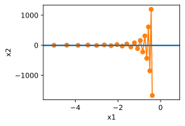

# 10 Adam

:label:`sec_adam`

In the discussions leading up to this section we encountered a number of techniques for efficient optimization. Let us recap them in detail here:

* 在 [11.4节](4_sgd.md)中，我们学习了：$\text{\color{red}\colorbox{black}{SGD}}$ 在解决优化问题时比 $\text{\color{red}\colorbox{black}{GD}}$ 更有效。
* 在 [11.5节](5_minibatch-sgd.md)中，我们学习了：$\text{\color{red}\colorbox{black}{mini-batch SGD}}$， 在一个小批量中使用更大的观测值集，可以通过向量化提供额外效率。这是高效的多机、多GPU和整体并行处理的关键。
* 在 [11.6节](6_momentum.md)中，我们学习了：$\text{\color{red}\colorbox{black}{momentum method}}$，添加了一种机制，用于 $\text{\color{magenta}\colorbox{black}{汇总过去梯度的历史}}$以加速收敛。
* 针对 $\text{\color{yellow}\colorbox{black}{学习率}}$ 的优化：
  * 在 [11.7节](7_adagrad.md)中，我们学习了：$\text{\color{red}\colorbox{black}{Adagrad}}$，通过 $\text{\color{magenta}\colorbox{black}{对每个坐标缩放}}$ 来实现高效计算的预处理器。
  * 在 [11.8节](8_rmsprop.md)中，我们学习了：$\text{\color{red}\colorbox{black}{RMSprop = Adagrad+2-order momentum}}$，通过学习率的调整来分离每个坐标的缩放。
* 本文 $\text{\color{red}\colorbox{black}{Adam = 1-oreder momentum for gradient + RMSprop}}$

Adam算法 [[Kingma &amp; Ba, 2014]](https://zh.d2l.ai/chapter_references/zreferences.html#kingma-ba-2014)将 所有这些技术汇总到一个高效的学习算法中。 不出预料，作为深度学习中使用的更强大和有效的优化算法之一，它非常受欢迎。 但是它并非没有问题，尤其是 [[Reddi et al., 2019]](https://zh.d2l.ai/chapter_references/zreferences.html#reddi-kale-kumar-2019)表明，有时Adam算法可能由于方差控制不良而发散。 在完善工作中， [[Zaheer et al., 2018]](https://zh.d2l.ai/chapter_references/zreferences.html#zaheer-reddi-sachan-ea-2018)给Adam算法提供了一个称为Yogi的热补丁来解决这些问题。 下面我们了解一下Adam算法。


## 10.1 The Algorithm

One of the key components of Adam is that it uses $\text{\color{red}\colorbox{black}{exponential weighted moving averages}}$ (also known as leaky averaging) to obtain an estimate of $\text{\color{yellow}\colorbox{black}{both}}$ the $\text{\color{magenta}\colorbox{black}{momentum}}$ and also the $\text{\color{magenta}\colorbox{black}{ second moment}}$ of the gradient. That is, it uses the state variables

$$
\begin{aligned}
    \mathbf{v}_t & \leftarrow \beta_1 \mathbf{v}_{t-1} + (1 - \beta_1) \mathbf{g}_t, \text{\color{magenta}针对梯度更新}\\
    \mathbf{s}_t & \leftarrow \beta_2 \mathbf{s}_{t-1} + (1 - \beta_2) \mathbf{g}_t^2. \text{\color{magenta}针对学习率更新}
\end{aligned}

$$

Here $\beta_1$ and $\beta_2$ are nonnegative weighting parameters. Common choices for them are $\beta_1 = 0.9$ and $\beta_2 = 0.999$. That is, the variance estimate moves *much more slowly* than the momentum term. Note that if we initialize $\mathbf{v}_0 = \mathbf{s}_0 = 0$ we have a significant amount of bias initially towards smaller values. This can be addressed by using the fact that $\sum_{i=0}^t \beta^i = \frac{1 - \beta^t}{1 - \beta}$ to re-normalize terms. Correspondingly the normalized state variables are given by

$$
\hat{\mathbf{v}}_t = \frac{\mathbf{v}_t}{1 - \beta_1^t} \text{ and } \hat{\mathbf{s}}_t = \frac{\mathbf{s}_t}{1 - \beta_2^t}.

$$

有了正确的估计，我们现在可以写出更新方程。 首先，我们以非常类似于 RMSProp算法 的方式重新缩放梯度以获得

$$
\mathbf{g}_t' = \frac{\eta \hat{\mathbf{v}}_t}{\sqrt{\hat{\mathbf{s}}_t} + \epsilon}.

$$

Unlike RMSProp our update uses the momentum $\hat{\mathbf{v}}_t$ rather than the gradient itself. Moreover, there is a slight cosmetic difference as the rescaling happens using $\frac{1}{\sqrt{\hat{\mathbf{s}}_t} + \epsilon}$ instead of $\frac{1}{\sqrt{\hat{\mathbf{s}}_t + \epsilon}}$. The former works arguably slightly better in practice, hence the deviation from RMSProp. Typically we pick $\epsilon = 10^{-6}$ for a good trade-off between numerical stability and fidelity.

Now we have all the pieces in place to compute updates. This is slightly anticlimactic and we have a simple update of the form

$$
\mathbf{x}_t \leftarrow \mathbf{x}_{t-1} - \mathbf{g}_t' = \mathbf{x}_{t-1} -\frac{\eta \hat{\mathbf{v}}_t}{\sqrt{\hat{\mathbf{s}}_t} + \epsilon}.

$$

Reviewing the design of $\color{red}Adam$ its inspiration is clear.

- Momentum and scale are clearly visible in the state variables. Their rather peculiar definition forces us to debias terms (this could be fixed by a slightly different initialization and update condition).
- Second, the combination of both terms is pretty straightforward, given RMSProp.
- Last, the explicit learning rate $\eta$ allows us to control the step length to address issues of convergence.

## Implementation

Implementing Adam from scratch is not very daunting. For convenience we store the time step counter $t$ in the `hyperparams` dictionary. Beyond that all is straightforward.

```python
%matplotlib inline
import torch
from d2l import torch as d2l


def init_adam_states(feature_dim):
    v_w, v_b = torch.zeros((feature_dim, 1)), torch.zeros(1)
    s_w, s_b = torch.zeros((feature_dim, 1)), torch.zeros(1)
    return ((v_w, s_w), (v_b, s_b))

def adam(params, states, hyperparams):
    beta1, beta2, eps = 0.9, 0.999, 1e-6
    for p, (v, s) in zip(params, states):
        with torch.no_grad():
            v[:] = beta1 * v + (1 - beta1) * p.grad
            s[:] = beta2 * s + (1 - beta2) * torch.square(p.grad)
            v_bias_corr = v / (1 - beta1 ** hyperparams['t'])
            s_bias_corr = s / (1 - beta2 ** hyperparams['t'])
            p[:] -= hyperparams['lr'] * v_bias_corr / (torch.sqrt(s_bias_corr)
                                                       + eps)
        p.grad.data.zero_()
    hyperparams['t'] += 1
```

We are ready to use Adam to train the model. We use a learning rate of $\eta = 0.01$.

```python
data_iter, feature_dim = d2l.get_data_ch11(batch_size=10)
d2l.train_ch11(adam, init_adam_states(feature_dim),
               {'lr': 0.01, 't': 1}, data_iter, feature_dim);
```

loss: 0.242, 0.015 sec/epoch


A more concise implementation is straightforward since `adam` is one of the algorithms provided as part of the Gluon `trainer` optimization library. Hence we only need to pass configuration parameters for an implementation in Gluon.

```python
trainer = torch.optim.Adam
d2l.train_concise_ch11(trainer, {'lr': 0.01}, data_iter)
```
loss: 0.243, 0.014 sec/epoch


## Yogi

One of the problems of Adam is that it can fail to converge even in convex settings when the second moment estimate in $\mathbf{s}_t$ blows up. As a fix :cite:`Zaheer.Reddi.Sachan.ea.2018` proposed a refined update (and initialization) for $\mathbf{s}_t$. To understand what's going on, let us rewrite the Adam update as follows:

$$
\mathbf{s}_t \leftarrow \mathbf{s}_{t-1} + (1 - \beta_2) \left(\mathbf{g}_t^2 - \mathbf{s}_{t-1}\right).

$$

Whenever $\mathbf{g}_t^2$ has high variance or updates are sparse, $\mathbf{s}_t$ might forget past values too quickly. A possible fix for this is to replace $\mathbf{g}_t^2 - \mathbf{s}_{t-1}$ by $\mathbf{g}_t^2 \odot \mathop{\mathrm{sgn}}(\mathbf{g}_t^2 - \mathbf{s}_{t-1})$. Now the magnitude of the update no longer depends on the amount of deviation. This yields the Yogi updates

$$
\mathbf{s}_t \leftarrow \mathbf{s}_{t-1} + (1 - \beta_2) \mathbf{g}_t^2 \odot \mathop{\mathrm{sgn}}(\mathbf{g}_t^2 - \mathbf{s}_{t-1}).

$$

The authors furthermore advise to initialize the momentum on a larger initial batch rather than just initial pointwise estimate. We omit the details since they are not material to the discussion and since even without this convergence remains pretty good.

```python
def yogi(params, states, hyperparams):
    beta1, beta2, eps = 0.9, 0.999, 1e-3
    for p, (v, s) in zip(params, states):
        with torch.no_grad():
            v[:] = beta1 * v + (1 - beta1) * p.grad
            s[:] = s + (1 - beta2) * torch.sign(
                torch.square(p.grad) - s) * torch.square(p.grad)
            v_bias_corr = v / (1 - beta1 ** hyperparams['t'])
            s_bias_corr = s / (1 - beta2 ** hyperparams['t'])
            p[:] -= hyperparams['lr'] * v_bias_corr / (torch.sqrt(s_bias_corr)
                                                       + eps)
        p.grad.data.zero_()
    hyperparams['t'] += 1

data_iter, feature_dim = d2l.get_data_ch11(batch_size=10)
d2l.train_ch11(yogi, init_adam_states(feature_dim),
               {'lr': 0.01, 't': 1}, data_iter, feature_dim);
```
loss: 0.244, 0.016 sec/epoch


## Summary

* Adam combines features of many optimization algorithms into a fairly robust update rule.
* Created on the basis of RMSProp, Adam also uses EWMA on the minibatch stochastic gradient.
* Adam uses bias correction to adjust for a slow startup when estimating momentum and a second moment.
* For gradients with significant variance we may encounter issues with convergence. They can be amended by using larger minibatches or by switching to an improved estimate for $\mathbf{s}_t$. Yogi offers such an alternative.

## Exercises

1. Adjust the learning rate and observe and analyze the experimental results.
2. Can you rewrite momentum and second moment updates such that it does not require bias correction?
3. Why do you need to reduce the learning rate $\eta$ as we converge?
4. Try to construct a case for which Adam diverges and Yogi converges?

[Discussions](https://discuss.d2l.ai/t/1078)
