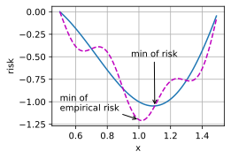
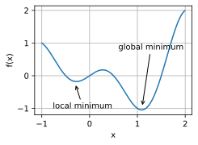
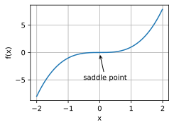
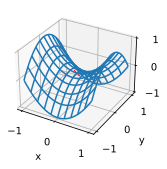
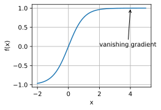

# 1 Optimization and Deep Learning

* 最小化训练误差并不能保证我们找到最佳的参数集，用来最小化泛化误差。
* 优化问题可能有许多局部最小值。
* 鞍点：函数的所有梯度都消失但既不是全局最小值也不是局部最小值的任何位置
* 问题可能有更多的鞍点，因为通常问题不是凸的。
* 梯度消失可能会导致优化停滞，重参数化通常会有所帮助。对参数进行良好的初始化也可能是有益的。

In this section, we will discuss the relationship between optimization and deep learning as well as the challenges of using optimization in deep learning.
For a deep learning problem, we will usually define a $\color{red}\text{loss function}$ first. Once we have the loss function, we can use an $\color{red}\text{optimization algorithm}$ in attempt to minimize the loss.
In optimization, a loss function is often referred to as the $\color{red}\text{objective function}$ of the optimization problem. By tradition and convention most optimization algorithms are concerned with $\color{red}\text{minimization}$. If we ever need to maximize an objective there is a simple solution: just flip the sign on the objective.

## 1.1 Goal of Optimization

Although optimization provides a way to minimize the loss function for deep learning, in essence, the $\text{\color{yellow}\colorbox{black}{goals}}$ of $\color{red}\text{optimization}$ and $\color{magenta}\text{deep learning}$ are fundamentally different.

- The former is primarily concerned with $\color{red}\text{minimizing an objective}$
- whereas the latter is concerned with $\color{magenta}\text{finding a suitable model, given a finite amount of data}$.

In [Section 3.6](https://d2l.ai/chapter_linear-regression/generalization.html#sec-generalization-basics), we discussed the difference between these two goals in detail. For instance, $\color{red}\text{training error}$ and $\color{magenta}\text{generalization error}$ generally differ:

- since the objective function of the optimization algorithm is usually a loss function $\color{red}\text{based on the training dataset}$, the goal of optimization is to $\color{red}\text{reduce the training error}$.
- However, the goal of deep learning (or more broadly, statistical inference) is to $\color{magenta}\text{reduce the generalization error}$.

为了实现后者，除了使用优化算法来减少训练误差之外，我们还需要注意过拟合。

```python
%matplotlib inline
import numpy as np
import torch
from mpl_toolkits import mplot3d
from d2l import torch as d2l
```

To illustrate the aforementioned different goals, let’s consider the empirical risk and the risk. As described in [Section 4.7.3.1](https://d2l.ai/chapter_linear-classification/environment-and-distribution-shift.html#subsec-empirical-risk-and-risk),

- the empirical risk is an $\color{red}\text{average loss on the training dataset}$ (训练数据集的平均损失)
- while the risk is the $\color{magenta}\text{expected loss on the entire population of data}$. (整个数据群的预期损失)

Below we define two functions: the risk function `f` and the empirical risk function `g`. Suppose that we have only a finite amount of training data. As a result, here `g` is less smooth than `f`.

```python
def f(x):
    return x * torch.cos(np.pi * x)

def g(x):
    return f(x) + 0.2 * torch.cos(5 * np.pi * x)
```

下图说明，训练数据集的最低经验风险可能与最低风险（泛化误差）不同。

```python
def annotate(text, xy, xytext):  #@save
    d2l.plt.gca().annotate(text, xy=xy, xytext=xytext,
                           arrowprops=dict(arrowstyle='->'))

x = torch.arange(0.5, 1.5, 0.01)
d2l.set_figsize((4.5, 2.5))
d2l.plot(x, [f(x), g(x)], 'x', 'risk')
annotate('min of\nempirical risk', (1.0, -1.2), (0.5, -1.1))
annotate('min of risk', (1.1, -1.05), (0.95, -0.5))
```



## 1.2 Optimization Challenges in Deep Learning

在本章中，我们将特别关注优化算法在最小化目标函数方面的性能，而不是模型的泛化误差。在 [3.1节](https://zh.d2l.ai/chapter_linear-networks/linear-regression.html#sec-linear-regression)中，我们区分了优化问题中的解析解和数值解。在深度学习中，大多数目标函数都很复杂，没有解析解。相反，我们必须使用数值优化算法。本章中的优化算法都属于此类别。

深度学习优化存在许多挑战。其中一些最令人烦恼的是

- local minima,
- saddle points (鞍点), and
- vanishing gradients。

让我们来看看它们。

### 1.2.1 Local Minima

For any objective function $f(x)$, if the value of $f(x)$ at $x$ is smaller than the values of $f(x)$ at any other points in the vicinity of $x$, then $f(x)$ could be a $\color{red}\text{local minimum}$. If the value of $f(x)$ at $x$ is the minimum of the objective function over the entire domain, then $f(x)$ is the $\color{red}\text{global minimum}$.

For example, given the function

$$
f(x) = x \cdot \text{cos}(\pi x) \text{ for } -1.0 \leq x \leq 2.0,

$$

we can approximate the local minimum and global minimum of this function.

```python
x = torch.arange(-1.0, 2.0, 0.01)
d2l.plot(x, [f(x), ], 'x', 'f(x)')
annotate('local minimum', (-0.3, -0.25), (-0.77, -1.0))
annotate('global minimum', (1.1, -0.95), (0.6, 0.8))
```



深度学习模型的目标函数通常有许多局部最优解。当优化问题的数值解接近局部最优值时，随着目标函数解的梯度接近或变为零，通过最终迭代获得的数值解可能仅使目标函数*局部*最优，而不是*全局*最优。只有一定程度的噪声可能会使参数超出局部最小值。事实上，这是小批量随机梯度下降的有利特性之一，在这种情况下，小批量上梯度的自然变化能够将参数从局部极小值中移出。

### 1.2.2 Saddle Points

Besides local minima, saddle points are another reason for gradients to vanish.

- A $\color{red}\text{saddle point}$ is any location where all gradients of a function vanish but which is neither a global nor a local minimum.
- 函数的所有梯度都消失但既不是全局最小值也不是局部最小值的任何位置

Consider the function $f(x) = x^3$. Its first and second derivative vanish for $x=0$. Optimization might stall at this point, even though it is not a minimum.

```python
x = torch.arange(-2.0, 2.0, 0.01)
d2l.plot(x, [x**3], 'x', 'f(x)')
annotate('saddle point', (0, -0.2), (-0.52, -5.0))
```



Saddle points in higher dimensions are even more insidious, as the example below shows. Consider the function $f(x, y) = x^2 - y^2$. It has its saddle point at $(0, 0)$. This is a maximum with respect to $y$ and a minimum with respect to $x$. Moreover, it *looks* like a saddle, which is where this mathematical property got its name.

```python
x, y = torch.meshgrid(
    torch.linspace(-1.0, 1.0, 101), torch.linspace(-1.0, 1.0, 101))
z = x**2 - y**2

ax = d2l.plt.figure().add_subplot(111, projection='3d')
ax.plot_wireframe(x, y, z, **{'rstride': 10, 'cstride': 10})
ax.plot([0], [0], [0], 'rx')
ticks = [-1, 0, 1]
d2l.plt.xticks(ticks)
d2l.plt.yticks(ticks)
ax.set_zticks(ticks)
d2l.plt.xlabel('x')
d2l.plt.ylabel('y');
```

/home/d2l-worker/miniconda3/envs/d2l-en-release-0/lib/python3.8/site-packages/torch/functional.py:568: UserWarning: torch.meshgrid: in an upcoming release, it will be required to pass the indexing argument. (Triggered internally at  ../aten/src/ATen/native/TensorShape.cpp:2228.)
return _VF.meshgrid(tensors, **kwargs)  # type: ignore[attr-defined]


我们假设函数的输入是k维向量，其输出是标量，因此其Hessian矩阵（也称黑塞矩阵）将有k特征值（参考[online appendix on eigendecompositions](https://d2l.ai/chapter_appendix-mathematics-for-deep-learning/eigendecomposition.html))。函数的解决方案可以是局部最小值、局部最大值或函数梯度为零的位置处的鞍点：

* 当函数在零梯度位置处的Hessian矩阵的特征值全部为正值时，我们有该函数的局部最小值。
* 当函数在零梯度位置处的Hessian矩阵的特征值全部为负值时，我们有该函数的局部最大值。
* 当函数在零梯度位置处的Hessian矩阵的特征值为负值和正值时，我们对函数有一个鞍点。

对于高维度问题，至少*部分*特征值为负的可能性相当高。这使得鞍点比局部最小值更有可能。我们将在下一节介绍凸性时讨论这种情况的一些例外情况。简而言之，凸函数是Hessian函数的特征值永远不是负值的函数。不幸的是，大多数深度学习问题并不属于这个类别。尽管如此，它还是研究优化算法的一个很好的工具。

### 1.2.3 Vanishing Gradients

Probably the most insidious (隐蔽) problem to encounter is the $\color{red}\text{vanishing gradient}$. Recall our commonly-used activation functions and their derivatives (衍生) in [4.1.2节](https://zh.d2l.ai/chapter_multilayer-perceptrons/mlp.html#subsec-activation-functions).
For instance, assume that we want to minimize the function $f(x) = \tanh(x)$ and we happen to get started at $x = 4$. As we can see, the gradient of $f$ is close to nil. More specifically, $f'(x) = 1 - \tanh^2(x)$ and thus $f'(4) = 0.0013$. Consequently, optimization will get stuck for a long time before we make progress. 因此，在我们取得进展之前，优化将会停滞很长一段时间。事实证明，这是在引入ReLU激活函数之前训练深度学习模型相当棘手的原因之一。

```python
x = torch.arange(-2.0, 5.0, 0.01)
d2l.plot(x, [torch.tanh(x)], 'x', 'f(x)')
annotate('vanishing gradient', (4, 1), (2, 0.0))
```



正如我们所看到的那样，深度学习的优化充满挑战。幸运的是，有一系列强大的算法表现良好，即使对于初学者也很容易使用。此外，没有必要找到最佳解决方案。局部最优解或其近似解仍然非常有用。

## Summary

* Minimizing the training error does *not* guarantee that we find the best set of parameters to minimize the generalization error.
* The optimization problems may have many local minima.
* The problem may have even more saddle points, as generally the problems are not convex.
* Vanishing gradients can cause optimization to stall. Often a reparameterization of the problem helps. Good initialization of the parameters can be beneficial, too.

## Exercises

1. Consider a simple MLP with a single hidden layer of, say, $d$ dimensions in the hidden layer and a single output. Show that for any local minimum there are at least $d!$ equivalent solutions that behave identically.
2. Assume that we have a symmetric random matrix $\mathbf{M}$ where the entries
   $M_{ij} = M_{ji}$ are each drawn from some probability distribution
   $p_{ij}$. Furthermore assume that $p_{ij}(x) = p_{ij}(-x)$, i.e., that the
   distribution is symmetric (see e.g., :cite:`Wigner.1958` for details).
   1. Prove that the distribution over eigenvalues is also symmetric. That is, for any eigenvector $\mathbf{v}$ the probability that the associated eigenvalue $\lambda$ satisfies $P(\lambda > 0) = P(\lambda < 0)$.
   2. Why does the above *not* imply $P(\lambda > 0) = 0.5$?
3. What other challenges involved in deep learning optimization can you think of?
4. Assume that you want to balance a (real) ball on a (real) saddle.
   1. Why is this hard?
   2. Can you exploit this effect also for optimization algorithms?

[Discussions](https://discuss.d2l.ai/t/487)
