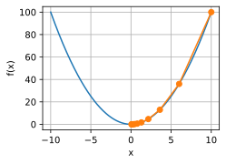
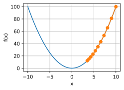
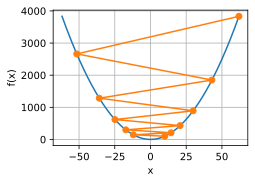
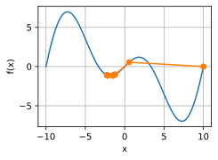
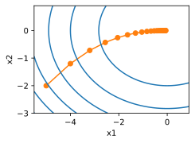
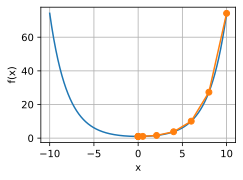
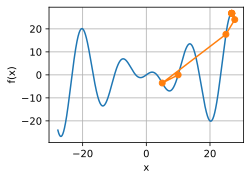
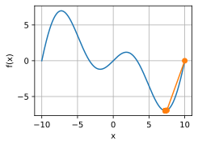

# 3 Gradient Descent

:label:`sec_gd`


* 学习率的大小很重要：学习率太大会使模型发散，学习率太小会没有进展。
* 梯度下降会可能陷入局部极小值，而得不到全局最小值。
* 在高维模型中，调整学习率是很复杂的。
* 预处理有助于调节比例。
* 牛顿法在凸问题中一旦开始正常工作，速度就会快得多。
* 对于非凸问题，不能直接使用牛顿法 （二阶梯度过大，学习率什么的需要做调整）。


尽管 *梯度下降* （gradient descent）很少直接用于深度学习， 但了解它是理解下一节随机梯度下降算法的关键。 例如，由于学习率过大，优化问题可能会发散，这种现象早已在梯度下降中出现。 同样地， *预处理* （preconditioning）是梯度下降中的一种常用技术， 还被沿用到更高级的算法中。 让我们从简单的一维梯度下降开始。

## 3.1 One-Dimensional Gradient Descent

为什么梯度下降算法可以优化目标函数？ 一维中的梯度下降给我们很好的启发。

Consider some continuously differentiable real-valued function $f: \mathbb{R} \rightarrow \mathbb{R}$. Using a Taylor expansion we obtain

$$
f(x + \epsilon) = f(x) + \epsilon f'(x) + \mathcal{O}(\epsilon^2).

$$

That is, in first-order approximation $f(x+\epsilon)$ is given by the function value $f(x)$ and the first derivative $f'(x)$ at $x$. It is not unreasonable to assume that for small $\epsilon$ moving in the direction of the negative gradient will decrease $f$. To keep things simple we pick a fixed step size $\eta > 0$ and choose $\epsilon = -\eta f'(x)$. Plugging this into the Taylor expansion above we get

$$
f(x - \eta f'(x)) = f(x) - \eta f'^2(x) + \mathcal{O}(\eta^2 f'^2(x)).

$$

If the derivative $f'(x) \neq 0$ does not vanish we make progress since $\eta f'^2(x)>0$.

Moreover, we can always choose $\eta$ $\color{red}\text{small enough}$ for the higher-order terms to become irrelevant. Hence we arrive at

$$
f(x - \eta f'(x)) \lessapprox f(x).

$$

$\text{\color{yellow}\colorbox{black}{This means that}}$, if we use

$$
x \leftarrow x - \eta f'(x)

$$

to iterate $x$, the value of function $f(x)$ $\text{\color{yellow}\colorbox{black}{might decline (下降)}}$. 因此，在梯度下降中，我们首先选择初始值 $x$ 和常数 $η>0$， 然后使用它们连续迭代 $x$，直到停止条件达成。For example, when the magnitude of the gradient $|f'(x)|$ is small enough or the number of iterations has reached a certain value.

For simplicity we choose the objective function $f(x)=x^2$ to illustrate how to implement gradient descent. Although we know that $x=0$ is the solution to minimize $f(x)$, we still use this simple function to observe how $x$ changes.

```python
%matplotlib inline
import numpy as np
import torch
from d2l import torch as d2l
```

```python
def f(x):  # Objective function
    return x ** 2

def f_grad(x):  # Gradient (derivative) of the objective function
    return 2 * x
```

Next, we use $x=10$ as the initial value and assume $\eta=0.2$. Using gradient descent to iterate $x$ for 10 times we can see that, eventually, the value of $x$ approaches the optimal solution.

```python
def gd(eta, f_grad):
    x = 10.0
    results = [x]
    for i in range(10):
        x -= eta * f_grad(x)
        results.append(float(x))
    print(f'epoch 10, x: {x:f}')
    return results

results = gd(0.2, f_grad)
```

epoch 10, x: 0.060466
The progress of optimizing over $x$ can be plotted as follows.

```python
def show_trace(results, f):
    n = max(abs(min(results)), abs(max(results)))
    f_line = torch.arange(-n, n, 0.01)
    d2l.set_figsize()
    d2l.plot([f_line, results], [[f(x) for x in f_line], [
        f(x) for x in results]], 'x', 'f(x)', fmts=['-', '-o'])

show_trace(results, f)
```



### 3.1.1 Learning Rate

:label:`subsec_gd-learningrate`

*学习率* （learning rate）决定目标函数能否收敛到局部最小值，以及何时收敛到最小值。 学习率 $η$ 可由算法设计者设置。 请注意，如果我们使用的学习率太小，将导致 $x$ 的更新非常缓慢，需要更多的迭代。 例如，考虑同一优化问题中 $η=0.05$ 的进度。 如下所示，尽管经过了 $10$ 个步骤，我们仍然离最优解很远。

```python
show_trace(gd(0.05, f_grad), f)
```

epoch 10, x: 3.486784


Conversely, 如果我们使用过高的学习率, $\left|\eta f'(x)\right|$ might be too large for the first-order Taylor expansion formula. That is, the term $\mathcal{O}(\eta^2 f'^2(x))$ in [(11.3.1)](https://zh.d2l.ai/chapter_optimization/gd.html#equation-gd-taylor) might become significant. In this case, we cannot guarantee that the iteration of $x$ will be able to lower the value of $f(x)$. For example, when we set the learning rate to $\eta=1.1$, $x$ overshoots the optimal solution $x=0$ and gradually diverges.

```python
show_trace(gd(1.1, f_grad), f)
```

epoch 10, x: 61.917364


### 3.1.2 Local Minima

To illustrate what happens for nonconvex functions (非凸函数) consider the case of $f(x) = x \cdot \cos(cx)$ for some constant $c$. 这个函数有无穷多个局部最小值。 根据我们选择的学习率，我们最终可能只会得到许多解的一个。 下面的例子说明了（不切实际的）高学习率如何导致较差的局部最小值。

```python
c = torch.tensor(0.15 * np.pi)

def f(x):  # Objective function
    return x * torch.cos(c * x)

def f_grad(x):  # Gradient of the objective function
    return torch.cos(c * x) - c * x * torch.sin(c * x)

show_trace(gd(2, f_grad), f)
```

epoch 10, x: -1.528166


## 3.2 Multivariate Gradient Descent

Now that we have a better intuition of the univariate (单变量) case, let us consider the situation where $\mathbf{x} = [x_1, x_2, \ldots, x_d]^\top$. That is, the $\color{red}\text{\colorbox{black}{objective function }}f: \mathbb{R}^d \to \mathbb{R}$ $\text{\color{yellow}\colorbox{black}{maps}}$ vectors $\text{\color{yellow}\colorbox{black}{into}}$ scalars. Correspondingly its gradient is multivariate, too. It is a vector consisting of $d$ partial derivatives:

$$
\nabla f(\mathbf{x}) = \bigg[\frac{\partial f(\mathbf{x})}{\partial x_1}, \frac{\partial f(\mathbf{x})}{\partial x_2}, \ldots, \frac{\partial f(\mathbf{x})}{\partial x_d}\bigg]^\top.

$$

Each partial derivative element $\partial f(\mathbf{x})/\partial x_i$ in the gradient $\text{\color{yellow}\colorbox{black}{indicates}}$ the rate of change of $f$ at $\mathbf{x}$ $\text{\color{yellow}\colorbox{black}{with respect to}}$ the input $x_i$. 和先前单变量的情况一样，我们可以对多变量函数使用相应的泰勒近似来思考。 In particular, we have that

$$
f(\mathbf{x} + \boldsymbol{\epsilon}) = f(\mathbf{x}) + \mathbf{\boldsymbol{\epsilon}}^\top \nabla f(\mathbf{x}) + \mathcal{O}(\|\boldsymbol{\epsilon}\|^2).

$$

In other words, up to second-order terms in $\boldsymbol{\epsilon}$ the direction of steepest descent is given by the negative gradient $-\nabla f(\mathbf{x})$. Choosing a suitable learning rate $\eta > 0$ yields the prototypical gradient descent algorithm:

$$
\mathbf{x} \leftarrow \mathbf{x} - \eta \nabla f(\mathbf{x}).

$$

To see how the algorithm behaves in practice let us construct an objective function $f(\mathbf{x})=x_1^2+2x_2^2$ with a two-dimensional vector $\mathbf{x} = [x_1, x_2]^\top$ as input and a scalar as output. The gradient is given by $\nabla f(\mathbf{x}) = [2x_1, 4x_2]^\top$. We will observe the trajectory of $\mathbf{x}$ by gradient descent from the initial position $[-5, -2]$.

我们还需要两个辅助函数： 第一个是 update 函数，并将其应用于初始值20次； 第二个函数会显示 $x$ 的轨迹。

```python
def train_2d(trainer, steps=20, f_grad=None):  #@save
    """Optimize a 2D objective function with a customized trainer."""
    # `s1` and `s2` are internal state variables that will be used later
    x1, x2, s1, s2 = -5, -2, 0, 0
    results = [(x1, x2)]
    for i in range(steps):
        if f_grad:
            x1, x2, s1, s2 = trainer(x1, x2, s1, s2, f_grad)
        else:
            x1, x2, s1, s2 = trainer(x1, x2, s1, s2)
        results.append((x1, x2))
    print(f'epoch {i + 1}, x1: {float(x1):f}, x2: {float(x2):f}')
    return results

def show_trace_2d(f, results):  #@save
    """Show the trace of 2D variables during optimization."""
    d2l.set_figsize()
    d2l.plt.plot(*zip(*results), '-o', color='#ff7f0e')
    x1, x2 = torch.meshgrid(torch.arange(-5.5, 1.0, 0.1),
                          torch.arange(-3.0, 1.0, 0.1))
    d2l.plt.contour(x1, x2, f(x1, x2), colors='#1f77b4')
    d2l.plt.xlabel('x1')
    d2l.plt.ylabel('x2')
```

接下来，我们观察学习率 $η=0.1$ 时优化变量 $x$ 的轨迹。 可以看到，经过 $20$ 步之后，$x$ 的值接近其位于 $[0,0]$ 的最小值。 虽然进展相当顺利，但相当缓慢。

```python
def f_2d(x1, x2):  # Objective function
    return x1 ** 2 + 2 * x2 ** 2

def f_2d_grad(x1, x2):  # Gradient of the objective function
    return (2 * x1, 4 * x2)

def gd_2d(x1, x2, s1, s2, f_grad):
    g1, g2 = f_grad(x1, x2)
    return (x1 - eta * g1, x2 - eta * g2, 0, 0)

eta = 0.1
show_trace_2d(f_2d, train_2d(gd_2d, f_grad=f_2d_grad))
```

```
epoch 20, x1: -0.057646, x2: -0.000073
/home/d2l-worker/miniconda3/envs/d2l-en-release-0/lib/python3.8/site-packages/torch/functional.py:568: UserWarning: torch.meshgrid: in an upcoming release, it will be required to pass the indexing argument. (Triggered internally at  ../aten/src/ATen/native/TensorShape.cpp:2228.)
return _VF.meshgrid(tensors, **kwargs)  # type: ignore[attr-defined]
```




## 3.3 Adaptive Methods 自适应方法

As we could see in [Section 12.3.1.1](https://d2l.ai/chapter_optimization/gd.html#subsec-gd-learningrate), getting the $\color{red}\text{\colorbox{black}{learning rate }} \eta $ "just right" is tricky.

- If we pick it too $\color{yellow}\text{\colorbox{black}{small}}$, we make little progress.
- If we pick it too $\color{yellow}\text{\colorbox{black}{large}}$, the solution oscillates and in the worst case it might even diverge.

What if we could determine $\eta$ $\color{yellow}\text{\colorbox{black}{automatically}}$ or get rid of having to select a learning rate at all?
$\color{red}\text{\colorbox{black}{Second-order methods}}$ that look not only at the value and gradient of the objective function but also at its *curvature* can help in this case. 虽然由于计算代价的原因，这些方法不能直接应用于深度学习，但它们为如何设计高级优化算法提供了有用的思维直觉，这些算法可以模拟下面概述的算法的许多理想特性。

### 3.3.1 Newton's Method (二阶法)

Reviewing the Taylor expansion of some function $f: \mathbb{R}^d \rightarrow \mathbb{R}$ there is no need to stop after the first term. In fact, we can write it as

$$
f(\mathbf{x} + \boldsymbol{\epsilon}) = f(\mathbf{x}) + \boldsymbol{\epsilon}^\top \nabla f(\mathbf{x}) + \frac{1}{2} \boldsymbol{\epsilon}^\top \nabla^2 f(\mathbf{x}) \boldsymbol{\epsilon} + \mathcal{O}(\|\boldsymbol{\epsilon}\|^3). \tag{11.3.8}

$$

To avoid cumbersome notation we define $\color{red} \mathbf{H} \stackrel{\mathrm{def}}{=} \nabla^2 f(\mathbf{x})$ to be the $\color{red}\text{\colorbox{black}{Hessian}}$ of $f$, which is a $d \times d$ matrix.

- For small $d$ and simple problems $\mathbf{H}$ is easy to compute.
- For $\color{yellow}\text{\colorbox{black}{deep}}$ neural networks, on the other hand, $\mathbf{H}$ may be prohibitively $\color{yellow}\text{\colorbox{black}{large}}$, due to the cost of storing $\mathcal{O}(d^2)$ entries.

此外通过反向传播进行计算可能雪上加霜。 然而，我们姑且先忽略这些考量，看看会得到什么算法。

After all, the minimum of $f$ satisfies $\nabla f = 0$. 遵循 [2.4节](https://zh.d2l.ai/chapter_preliminaries/calculus.html#sec-calculus)中的微积分规则， 通过取 $ϵ$ 对 [(11.3.8)]() 的导数， 再忽略不重要的高阶项，我们便得到

$$
\nabla f(\mathbf{x}) + \mathbf{H} \boldsymbol{\epsilon} = 0 \text{ and hence }
\boldsymbol{\epsilon} = -\mathbf{H}^{-1} \nabla f(\mathbf{x}).

$$

That is, we need to $\color{yellow}\text{\colorbox{black}{invert （求逆） the Hessian}}$ $\mathbf{H}$ as part of the optimization problem.

As a simple example, for $f(x) = \frac{1}{2} x^2$ we have $\nabla f(x) = x$ and $\mathbf{H} = 1$. Hence for any $x$ we obtain $\epsilon = -x$. 换言之，单单一步就足以完美地收敛，而无须任何调整。 Alas, we got a bit lucky here: the Taylor expansion was exact (确定的) since $f(x+\epsilon)= \frac{1}{2} x^2 + \epsilon x + \frac{1}{2} \epsilon^2$.

让我们看看其他问题。 Given a convex hyperbolic cosine function $f(x) = \cosh(cx)$ for some constant $c$, we can see that the global minimum at $x=0$ is reached after a few iterations.

```python
c = torch.tensor(0.5)

def f(x):  # Objective function
    return torch.cosh(c * x)

def f_grad(x):  # Gradient of the objective function
    return c * torch.sinh(c * x)

def f_hess(x):  # Hessian of the objective function
    return c**2 * torch.cosh(c * x)

def newton(eta=1):
    x = 10.0
    results = [x]
    for i in range(10):
        x -= eta * f_grad(x) / f_hess(x)
        results.append(float(x))
    print('epoch 10, x:', x)
    return results

show_trace(newton(), f)
```

epoch 10, x: tensor(0.)


现在让我们考虑一个非凸函数, such as $f(x) = x \cos(c x)$ for some constant $c$. 请注意在牛顿法中，我们最终将除以Hessian。 这意味着如果二阶导数是负的，f的值可能会趋于增加。 这是这个算法的致命缺陷！ 让我们看看实践中会发生什么。

```python
c = torch.tensor(0.15 * np.pi)

def f(x):  # Objective function
    return x * torch.cos(c * x)

def f_grad(x):  # Gradient of the objective function
    return torch.cos(c * x) - c * x * torch.sin(c * x)

def f_hess(x):  # Hessian of the objective function
    return - 2 * c * torch.sin(c * x) - x * c**2 * torch.cos(c * x)

show_trace(newton(), f)
```

epoch 10, x: tensor(26.8341)


这发生了惊人的错误。我们怎样才能修正它？

- 一种方法是用 $\color{magenta}\text{\colorbox{black}{取Hessian的绝对值}}$ 来修正，
- 另一个策略是 $\color{magenta}\text{\colorbox{black}{重新引入学习率}}$。

这似乎违背了初衷，但不完全是 —— $\color{black}\text{\colorbox{yellow}{拥有二阶信息}}$ 可以使我们

- 在曲率较大时保持谨慎，
- 而在目标函数较平坦时则采用较大的学习率。

让我们看看在学习率稍小的情况下它是如何生效的，比如 $η=0.5$。 如我们所见，我们有了一个相当高效的算法。

```python
show_trace(newton(0.5), f)
```

epoch 10, x: tensor(7.2699)


### 3.3.2 Convergence Analysis

在此，我们以部分目标凸函数 $f$ 为例，分析它们的牛顿法收敛速度。 这些目标凸函数三次可微，而且二阶导数不为零，即 $f″>0$。 由于多变量情况下的证明是对以下一维参数情况证明的直接拓展，对我们理解这个问题不能提供更多帮助，因此我们省略了多变量情况的证明。

Denote by $x^{(k)}$ the value of $x$ at the $k^\mathrm{th}$ iteration and let $e^{(k)} \stackrel{\mathrm{def}}{=} x^{(k)} - x^*$ be the distance from optimality at the $k^\mathrm{th}$ iteration. By Taylor  expansion we have that the condition $f'(x^*) = 0$ can be written as

$$
0 = f'(x^{(k)} - e^{(k)}) = f'(x^{(k)}) - e^{(k)} f''(x^{(k)}) + \frac{1}{2} (e^{(k)})^2 f'''(\xi^{(k)}),

$$

which holds for some $\xi^{(k)} \in [x^{(k)} - e^{(k)}, x^{(k)}]$. Dividing the above expansion by $f''(x^{(k)})$ yields

$$
e^{(k)} - \frac{f'(x^{(k)})}{f''(x^{(k)})} = \frac{1}{2} (e^{(k)})^2 \frac{f'''(\xi^{(k)})}{f''(x^{(k)})}.

$$

Recall that we have the update $x^{(k+1)} = x^{(k)} - f'(x^{(k)}) / f''(x^{(k)})$.
Plugging in this update equation and taking the absolute value of both sides, we have

$$
\left|e^{(k+1)}\right| = \frac{1}{2}(e^{(k)})^2 \frac{\left|f'''(\xi^{(k)})\right|}{f''(x^{(k)})}.

$$

Consequently, whenever we are in a region of bounded $\left|f'''(\xi^{(k)})\right| / (2f''(x^{(k)})) \leq c$, we have a quadratically decreasing error

$$
\left|e^{(k+1)}\right| \leq c (e^{(k)})^2.

$$

As an aside, optimization researchers call this $\color{black}\text{\colorbox{yellow}{本例是 linear convergence}}$, whereas a condition such as $\left|e^{(k+1)}\right| \leq \alpha \left|e^{(k)}\right|$ would be called a $\color{black}\text{\colorbox{yellow}{constant rate of convergence.}}$
请注意，我们无法估计整体收敛的速度，但是一旦我们接近极小值，收敛将变得非常快。 另外，这种分析要求f在高阶导数上表现良好，即确保f在如何变化它的值方面没有任何“超常”的特性。

### 3.3.3 Preconditioning 预处理

计算和存储完整的Hessian非常昂贵，而改善这个问题的一种方法是“预处理”。 它回避了计算整个Hessian，而只计算“对角线”项，即如下的算法更新：

$$
\mathbf{x} \leftarrow \mathbf{x} - \eta \mathrm{diag}(\mathbf{H})^{-1} \nabla f(\mathbf{x}).

$$

虽然这不如完整的牛顿法精确，但它仍然比不使用要好得多。 为什么预处理有效呢？ 假设一个变量以毫米表示高度，另一个变量以公里表示高度的情况。 假设这两种自然尺度都以米为单位，那么我们的参数化就出现了严重的不匹配。 幸运的是，使用预处理可以消除这种情况。 梯度下降的有效预处理相当于为每个变量选择不同的学习率（矢量 $x$ 的坐标）。 我们将在后面一节看到，预处理推动了随机梯度下降优化算法的一些创新。

### 3.3.4 Gradient Descent with Line Search 线搜索

梯度下降的一个关键问题是我们可能会超过目标或进展不足， 解决这一问题的简单方法是 $\color{black}\text{\colorbox{yellow}{结合使用}}$ $\color{red}线搜索$ 和 $\color{red}梯度下降$。That is, we use the direction given by $\nabla f(\mathbf{x})$ and then perform $\color{red}\text{\colorbox{yellow}{binary search}}$ as to which learning rate $\eta$ minimizes $f(\mathbf{x} - \eta \nabla f(\mathbf{x}))$.

有关分析和证明，此算法收敛迅速（请参见 [[Boyd &amp; Vandenberghe, 2004]](https://zh.d2l.ai/chapter_references/zreferences.html#boyd-vandenberghe-2004)）。 然而，对深度学习而言，这不太可行。 因为线搜索的每一步都需要评估整个数据集上的目标函数，实现它的方式太昂贵了。

## Summary

* Learning rates matter. Too large and we diverge, too small and we do not make progress.
* Gradient descent can get stuck in local minima.
* In high dimensions adjusting the learning rate is complicated.
* Preconditioning can help with scale adjustment.
* Newton's method is a lot faster once it has started working properly in convex problems.
* Beware of using Newton's method without any adjustments for nonconvex problems.

## Exercises

1. Experiment with different learning rates and objective functions for gradient descent.
2. Implement line search to minimize a convex function in the interval $[a, b]$.
   1. Do you need derivatives for binary search, i.e., to decide whether to pick $[a, (a+b)/2]$ or $[(a+b)/2, b]$.
   2. How rapid is the rate of convergence for the algorithm?
   3. Implement the algorithm and apply it to minimizing $\log (\exp(x) + \exp(-2x -3))$.
3. Design an objective function defined on $\mathbb{R}^2$ where gradient descent is exceedingly slow. Hint: scale different coordinates differently.
4. Implement the lightweight version of Newton's method using preconditioning:
   1. Use diagonal Hessian as preconditioner.
   2. Use the absolute values of that rather than the actual (possibly signed) values.
   3. Apply this to the problem above.
5. Apply the algorithm above to a number of objective functions (convex or not). What happens if you rotate coordinates by $45$ degrees?

[Discussions](https://discuss.d2l.ai/t/351)
