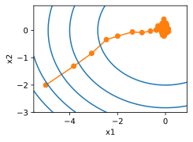
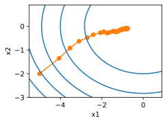
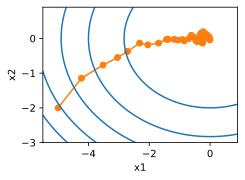

# 4 Stochastic Gradient Descent


* 对于凸问题，我们可以证明，对于广泛的学习率选择，随机梯度下降将收敛到最优解。
* 对于深度学习而言，情况通常并非如此。但是，对凸问题的分析使我们能够深入了解如何进行优化，即逐步降低学习率，尽管不是太快。
* 如果学习率太小或太大，就会出现问题。实际上，通常只有经过多次实验后才能找到合适的学习率。
* 当训练数据集中有更多样本时，计算梯度下降的每次迭代的代价更高，因此在这些情况下，首选随机梯度下降。
* 随机梯度下降的最优性保证在非凸情况下一般不可用，因为需要检查的局部最小值的数量可能是指数级的。


:label:`sec_sgd`

但是，在前面的章节中，我们一直在训练过程中使用随机梯度下降，但没有解释它为什么起作用。为了澄清这一点，我们刚在 [11.3节](https://zh.d2l.ai/chapter_optimization/gd.html#sec-gd)中描述了梯度下降的基本原则。在本节中，我们继续更详细地说明 *随机梯度下降* （stochastic gradient descent）。

```python
%matplotlib inline
import math
import torch
from d2l import torch as d2l
```

## 4.1 Stochastic Gradient Updates

在深度学习中，目标函数通常是训练数据集中每个样本的损失函数的平均值。给定 $n$ 个样本的训练数据集，我们假设 $f_i(x)$ 是关于索引i的训练样本的损失函数，其中 $x$ 是参数向量。然后我们得到目标函数

$$
f(\mathbf{x}) = \frac{1}{n} \sum_{i = 1}^n f_i(\mathbf{x}).

$$

The gradient of the objective function at $\mathbf{x}$ is computed as

$$
\nabla f(\mathbf{x}) = \frac{1}{n} \sum_{i = 1}^n \nabla f_i(\mathbf{x}).

$$

如果使用梯度下降法，则每个自变量迭代的计算代价为 $O(n)$，它随 $n$ 线性增长。因此，当训练数据集较大时，每次迭代的梯度下降$\text{\color{yellow}\colorbox{black}{计算代价将较高}}$。

$\text{\color{red}\colorbox{black}{Stochastic gradient descent (SGD)}}$ reduces computational cost at each iteration. At each iteration of stochastic gradient descent, we uniformly sample an index $i\in\{1,\ldots, n\}$ for data examples at random, and compute the gradient $\nabla f_i(\mathbf{x})$ to update $\mathbf{x}$:

$$
\mathbf{x} \leftarrow \mathbf{x} - \eta \nabla f_i(\mathbf{x}),

$$

where $\eta$ is the learning rate. We can see that the $\text{\color{black}\colorbox{yellow}{computational cost}}$ for each iteration $\text{\color{yellow}\colorbox{black}{drops from}}$ $\mathcal{O}(n)$ of the gradient descent $\text{\color{yellow}\colorbox{black}{to}}$ the constant $\mathcal{O}(1)$. Moreover, we want to emphasize that the stochastic gradient $\nabla f_i(\mathbf{x})$ is an $\text{\color{red}\colorbox{black}{unbiased estimate}}$ of the full gradient $\nabla f(\mathbf{x})$ because

$$
\mathbb{E}_i \nabla f_i(\mathbf{x}) = \frac{1}{n} \sum_{i = 1}^n \nabla f_i(\mathbf{x}) = \nabla f(\mathbf{x}).

$$


这意味着，平均而言，随机梯度是对梯度的良好估计。

现在，我们将把它与梯度下降进行比较，方法是向梯度添加均值为0、方差为1的随机噪声，以模拟随机梯度下降。

```python
def f(x1, x2):  # Objective function
    return x1 ** 2 + 2 * x2 ** 2

def f_grad(x1, x2):  # Gradient of the objective function
    return 2 * x1, 4 * x2
```

```python
def sgd(x1, x2, s1, s2, f_grad):
    g1, g2 = f_grad(x1, x2)
    # Simulate noisy gradient
    g1 += torch.normal(0.0, 1, (1,))
    g2 += torch.normal(0.0, 1, (1,))
    eta_t = eta * lr()
    return (x1 - eta_t * g1, x2 - eta_t * g2, 0, 0)
```

```python
def constant_lr():
    return 1

eta = 0.1
lr = constant_lr  # Constant learning rate
d2l.show_trace_2d(f, d2l.train_2d(sgd, steps=50, f_grad=f_grad))
```

epoch 50, x1: 0.129825, x2: -0.037771
/home/d2l-worker/miniconda3/envs/d2l-en-release-0/lib/python3.8/site-packages/numpy/core/shape_base.py:65: VisibleDeprecationWarning: Creating an ndarray from ragged nested sequences (which is a list-or-tuple of lists-or-tuples-or ndarrays with different lengths or shapes) is deprecated. If you meant to do this, you must specify 'dtype=object' when creating the ndarray.
  ary = asanyarray(ary)
/home/d2l-worker/miniconda3/envs/d2l-en-release-0/lib/python3.8/site-packages/torch/functional.py:568: UserWarning: torch.meshgrid: in an upcoming release, it will be required to pass the indexing argument. (Triggered internally at  ../aten/src/ATen/native/TensorShape.cpp:2228.)
  return _VF.meshgrid(tensors, **kwargs)  # type: ignore[attr-defined]


正如我们所看到的，随机梯度下降中变量的轨迹比我们在 [11.3节](https://zh.d2l.ai/chapter_optimization/gd.html#sec-gd) 中观察到的梯度下降中观察到的轨迹嘈杂得多。这是由于梯度的随机性质。也就是说，即使我们接近最小值，我们仍然受到通过 $η∇f_i(x)$ 的瞬间梯度所注入的不确定性的影响。即使经过 $50$ 次迭代，质量仍然不那么好。更糟糕的是，经过额外的步骤，它不会得到改善（我们鼓励你尝试更多的步骤来确认这一点）。这给我们留下了唯一的选择：$\text{\color{black}\colorbox{yellow}{改变学习率}}$ $η$。

- 但是，如果我们选择的学习率太小，我们一开始就不会取得任何有意义的进展。
- 另一方面，如果我们选择的学习率太大，我们将无法获得一个好的解决方案，如上所示。

解决这些相互冲突的目标的唯一方法是在优化过程中 $\text{\color{red}\colorbox{yellow}{动态降低学习率}}$。

This is also the reason for adding a $\text{\color{red}\colorbox{yellow}{learning rate function 学习率函数}}$ `lr` into the `sgd` step function. In the example above any functionality for learning rate scheduling lies dormant as we set the associated `lr` function to be constant.

## 4.2 Dynamic Learning Rate

Replacing $\eta$ with a time-dependent learning rate $\eta(t)$ $\text{\color{yellow}\colorbox{black}{adds to the complexity}}$ of controlling convergence of an optimization algorithm. In particular, we need to figure out how rapidly $\eta$ should decay. If it is too quick, we will stop optimizing prematurely. If we decrease it too slowly, we waste too much time on optimization.

以下是随着时间推移调整 $η$ 时使用的一些基本策略（稍后我们将讨论更高级的策略）：

$$
\begin{aligned}
    \eta(t) & = \eta_i \text{ if } t_i \leq t \leq t_{i+1}  && \text{piecewise constant 分段常数} \\
    \eta(t) & = \eta_0 \cdot e^{-\lambda t} && \text{exponential decay 指数衰减} \\
    \eta(t) & = \eta_0 \cdot (\beta t + 1)^{-\alpha} && \text{polynomial decay}
\end{aligned}

$$

- In the first $\text{\color{red}\colorbox{black}{piecewise constant}}$ scenario we decrease the learning rate, e.g., whenever progress in optimization stalls (停顿). 这是训练深度网络的常见策略。

- Alternatively we could decrease it much more aggressively by an $\text{\color{red}\colorbox{black}{exponential decay}}$. 不幸的是，这往往会导致算法收敛之前过早停止。

- A popular choice is $\text{\color{red}\colorbox{black}{polynomial decay}}$ with $\alpha = 0.5$. 在凸优化的情况下，有许多证据表明这种速率表现良好。

Let us see what the $\text{\color{red}\colorbox{black}{exponential decay}}$ looks like in practice.

```python
def exponential_lr():
    # Global variable that is defined outside this function and updated inside
    global t
    t += 1
    return math.exp(-0.1 * t)

t = 1
lr = exponential_lr
d2l.show_trace_2d(f, d2l.train_2d(sgd, steps=1000, f_grad=f_grad))
```
epoch 1000, x1: -0.769652, x2: -0.093216


正如预期的那样，参数的方差大大减少。但是，这是以未能收敛到最优解 $x=(0,0)$ 为代价的。即使经过 $1000$ 个迭代步骤，我们仍然离最优解很远。事实上，该算法根本无法收敛。

另一方面，如果我们使用 $\text{\color{red}\colorbox{black}{polynomial decay}}$，其中学习率随迭代次数的平方根倒数衰减，那么仅在 $50$ 次迭代之后，收敛就会更好。

```python
def polynomial_lr():
    # Global variable that is defined outside this function and updated inside
    global t
    t += 1
    return (1 + 0.1 * t) ** (-0.5)

t = 1
lr = polynomial_lr
d2l.show_trace_2d(f, d2l.train_2d(sgd, steps=50, f_grad=f_grad))
```
epoch 50, x1: -0.012226, x2: -0.037868


关于如何设置学习率，还有更多的选择。例如，我们可以从较小的学习率开始，然后使其迅速上涨，再让它降低，尽管这会更慢。我们甚至可以在较小和较大的学习率之间切换。这样的计划各种各样。现在，让我们专注于可以进行全面理论分析的学习率计划，即凸环境下的学习率。对于一般的非凸问题，很难获得有意义的收敛保证，因为总的来说，最大限度地减少非线性非凸问题是 $NP困难$的。有关的研究调查，请参阅例如2015年Tibshirani的优秀[讲义笔记](https://www.stat.cmu.edu/~ryantibs/convexopt-F15/lectures/26-nonconvex.pdf)。

## 4.3 Convergence Analysis for Convex Objectives

以下对凸目标函数的随机梯度下降的收敛性分析是可选的，主要用于传达对问题的更多直觉。我们只限于最简单的证明之一 [[Nesterov &amp; Vial, 2000]](https://zh.d2l.ai/chapter_references/zreferences.html#nesterov-vial-2000)。Significantly more advanced proof techniques exist, e.g., whenever the objective function is particularly well behaved.

Suppose that the objective function $f(\boldsymbol{\xi}, \mathbf{x})$ is convex in $\mathbf{x}$
for all $\boldsymbol{\xi}$.
More concretely,
we consider the stochastic gradient descent update:

$$
\mathbf{x}_{t+1} = \mathbf{x}_{t} - \eta_t \partial_\mathbf{x} f(\boldsymbol{\xi}_t, \mathbf{x}),

$$

where $f(\boldsymbol{\xi}_t, \mathbf{x})$
is the objective function
with respect to the training example $\boldsymbol{\xi}_t$
drawn from some distribution
at step $t$ and $\mathbf{x}$ is the model parameter.
Denote by

$$
R(\mathbf{x}) = E_{\boldsymbol{\xi}}[f(\boldsymbol{\xi}, \mathbf{x})]

$$

the expected risk and by $R^*$ its minimum with regard to $\mathbf{x}$. Last let $\mathbf{x}^*$ be the minimizer (we assume that it exists within the domain where $\mathbf{x}$ is defined). In this case we can track the distance between the current parameter $\mathbf{x}_t$ at time $t$ and the risk minimizer $\mathbf{x}^*$ and see whether it improves over time:

$$
\begin{aligned}    &\|\mathbf{x}_{t+1} - \mathbf{x}^*\|^2 \\ =& \|\mathbf{x}_{t} - \eta_t \partial_\mathbf{x} f(\boldsymbol{\xi}_t, \mathbf{x}) - \mathbf{x}^*\|^2 \\    =& \|\mathbf{x}_{t} - \mathbf{x}^*\|^2 + \eta_t^2 \|\partial_\mathbf{x} f(\boldsymbol{\xi}_t, \mathbf{x})\|^2 - 2 \eta_t    \left\langle \mathbf{x}_t - \mathbf{x}^*, \partial_\mathbf{x} f(\boldsymbol{\xi}_t, \mathbf{x})\right\rangle.   \end{aligned}

$$

:eqlabel:`eq_sgd-xt+1-xstar`

We assume that the $L_2$ norm of stochastic gradient $\partial_\mathbf{x} f(\boldsymbol{\xi}_t, \mathbf{x})$ is bounded  by some  constant $L$, hence we have that

$$
\eta_t^2 \|\partial_\mathbf{x} f(\boldsymbol{\xi}_t, \mathbf{x})\|^2 \leq \eta_t^2 L^2.

$$

:eqlabel:`eq_sgd-L`

We are mostly interested in how the distance between $\mathbf{x}_t$ and $\mathbf{x}^*$ changes *in expectation*. In fact, for any specific sequence of steps the distance might well increase, depending on whichever $\boldsymbol{\xi}_t$ we encounter. Hence we need to bound the dot product.
Since for any convex function $f$ it holds that
$f(\mathbf{y}) \geq f(\mathbf{x}) + \langle f'(\mathbf{x}), \mathbf{y} - \mathbf{x} \rangle$
for all $\mathbf{x}$ and $\mathbf{y}$,
by convexity we have

$$
f(\boldsymbol{\xi}_t, \mathbf{x}^*) \geq f(\boldsymbol{\xi}_t, \mathbf{x}_t) + \left\langle \mathbf{x}^* - \mathbf{x}_t, \partial_{\mathbf{x}} f(\boldsymbol{\xi}_t, \mathbf{x}_t) \right\rangle.

$$

:eqlabel:`eq_sgd-f-xi-xstar`

Plugging both inequalities :eqref:`eq_sgd-L` and :eqref:`eq_sgd-f-xi-xstar` into :eqref:`eq_sgd-xt+1-xstar` we obtain a bound on the distance between parameters at time $t+1$ as follows:

$$
\|\mathbf{x}_{t} - \mathbf{x}^*\|^2 - \|\mathbf{x}_{t+1} - \mathbf{x}^*\|^2 \geq 2 \eta_t (f(\boldsymbol{\xi}_t, \mathbf{x}_t) - f(\boldsymbol{\xi}_t, \mathbf{x}^*)) - \eta_t^2 L^2.

$$

:eqlabel:`eqref_sgd-xt-diff`

This means that we make progress as long as the  difference between current loss and the optimal loss outweighs $\eta_t L^2/2$. Since this difference is bound to converge to zero it follows that the learning rate $\eta_t$ also needs to *vanish*.

Next we take expectations over :eqref:`eqref_sgd-xt-diff`. This yields

$$
E\left[\|\mathbf{x}_{t} - \mathbf{x}^*\|^2\right] - E\left[\|\mathbf{x}_{t+1} - \mathbf{x}^*\|^2\right] \geq 2 \eta_t [E[R(\mathbf{x}_t)] - R^*] -  \eta_t^2 L^2.

$$

The last step involves summing over the inequalities for $t \in \{1, \ldots, T\}$. Since the sum telescopes and by dropping the lower term we obtain

$$
\|\mathbf{x}_1 - \mathbf{x}^*\|^2 \geq 2 \left (\sum_{t=1}^T   \eta_t \right) [E[R(\mathbf{x}_t)] - R^*] - L^2 \sum_{t=1}^T \eta_t^2.

$$

:eqlabel:`eq_sgd-x1-xstar`

Note that we exploited that $\mathbf{x}_1$ is given and thus the expectation can be dropped. Last define

$$
\bar{\mathbf{x}} \stackrel{\mathrm{def}}{=} \frac{\sum_{t=1}^T \eta_t \mathbf{x}_t}{\sum_{t=1}^T \eta_t}.

$$

Since

$$
E\left(\frac{\sum_{t=1}^T \eta_t R(\mathbf{x}_t)}{\sum_{t=1}^T \eta_t}\right) = \frac{\sum_{t=1}^T \eta_t E[R(\mathbf{x}_t)]}{\sum_{t=1}^T \eta_t} = E[R(\mathbf{x}_t)],

$$

by Jensen's inequality (setting $i=t$, $\alpha_i = \eta_t/\sum_{t=1}^T \eta_t$ in :eqref:`eq_jensens-inequality`) and convexity of $R$ it follows that $E[R(\mathbf{x}_t)] \geq E[R(\bar{\mathbf{x}})]$, thus

$$
\sum_{t=1}^T \eta_t E[R(\mathbf{x}_t)] \geq \sum_{t=1}^T \eta_t  E\left[R(\bar{\mathbf{x}})\right].

$$

Plugging this into the inequality :eqref:`eq_sgd-x1-xstar` yields the bound

$$
\left[E[\bar{\mathbf{x}}]\right] - R^* \leq \frac{r^2 + L^2 \sum_{t=1}^T \eta_t^2}{2 \sum_{t=1}^T \eta_t},

$$

where $r^2 \stackrel{\mathrm{def}}{=} \|\mathbf{x}_1 - \mathbf{x}^*\|^2$ is a bound on the distance between the initial choice of parameters and the final outcome. In short, the speed of convergence depends on how
the norm of stochastic gradient is bounded ($L$) and how far away from optimality the initial parameter value is ($r$). Note that the bound is in terms of $\bar{\mathbf{x}}$ rather than $\mathbf{x}_T$. This is the case since $\bar{\mathbf{x}}$ is a smoothed version of the optimization path.
Whenever $r, L$, and $T$ are known we can pick the learning rate $\eta = r/(L \sqrt{T})$. This yields as upper bound $rL/\sqrt{T}$. That is, we converge with rate $\mathcal{O}(1/\sqrt{T})$ to the optimal solution.

## 4.4 Stochastic Gradients and Finite Samples

到目前为止，在谈论随机梯度下降时，我们进行得有点快而松散。 We posited that we draw instances $x_i$, typically with labels $y_i$ from some distribution $p(x, y)$ and that we use this to update the model parameters in some manner. In particular, for a finite sample size we simply argued that the discrete distribution $p(x, y) = \frac{1}{n} \sum_{i=1}^n \delta_{x_i}(x) \delta_{y_i}(y)$
for some functions $\delta_{x_i}$ and $\delta_{y_i}$
allows us to perform stochastic gradient descent over it.

However, this is not really what we did. In the toy examples in the current section we simply added noise to an otherwise non-stochastic gradient, i.e., we pretended to have pairs $(x_i, y_i)$. It turns out that this is justified here (see the exercises for a detailed discussion). More troubling is that in all previous discussions we clearly did not do this. Instead we iterated over all instances *exactly once*. To see why this is preferable consider the converse, namely that we are sampling $n$ observations from the discrete distribution *with replacement*. The probability of choosing an element $i$ at random is $1/n$. Thus to choose it *at least* once is

$$
P(\mathrm{choose~} i) = 1 - P(\mathrm{omit~} i) = 1 - (1-1/n)^n \approx 1-e^{-1} \approx 0.63.

$$

A similar reasoning shows that the probability of picking some sample (i.e., training example) *exactly once* is given by

$$
{n \choose 1} \frac{1}{n} \left(1-\frac{1}{n}\right)^{n-1} = \frac{n}{n-1} \left(1-\frac{1}{n}\right)^{n} \approx e^{-1} \approx 0.37.

$$

This leads to an increased variance and decreased data efficiency relative to sampling *without replacement*. Hence, in practice we perform the latter (and this is the default choice throughout this book). Last note that repeated passes through the training dataset traverse it in a *different* random order.

## Summary

* For convex problems we can prove that for a wide choice of learning rates stochastic gradient descent will converge to the optimal solution.
* For deep learning this is generally not the case. However, the analysis of convex problems gives us useful insight into how to approach optimization, namely to reduce the learning rate progressively, albeit not too quickly.
* Problems occur when the learning rate is too small or too large. In practice  a suitable learning rate is often found only after multiple experiments.
* When there are more examples in the training dataset, it costs more to compute each iteration for gradient descent, so stochastic gradient descent is preferred in these cases.
* Optimality guarantees for stochastic gradient descent are in general not available in nonconvex cases since the number of local minima that require checking might well be exponential.

## Exercises

1. Experiment with different learning rate schedules for stochastic gradient descent and with different numbers of iterations. In particular, plot the distance from the optimal solution $(0, 0)$ as a function of the number of iterations.
2. Prove that for the function $f(x_1, x_2) = x_1^2 + 2 x_2^2$ adding normal noise to the gradient is equivalent to minimizing a loss function $f(\mathbf{x}, \mathbf{w}) = (x_1 - w_1)^2 + 2 (x_2 - w_2)^2$ where $\mathbf{x}$ is drawn from a normal distribution.
3. Compare convergence of stochastic gradient descent when you sample from $\{(x_1, y_1), \ldots, (x_n, y_n)\}$ with replacement and when you sample without replacement.
4. How would you change the stochastic gradient descent solver if some gradient (or rather some coordinate associated with it) was consistently larger than all the other gradients?
5. Assume that $f(x) = x^2 (1 + \sin x)$. How many local minima does $f$ have? Can you change $f$ in such a way that to minimize it one needs to evaluate all the local minima?

[Discussions](https://discuss.d2l.ai/t/497)
