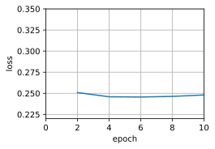
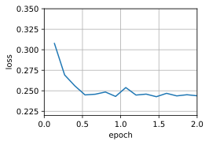
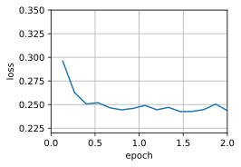
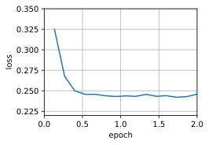
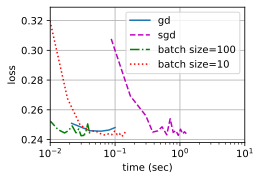
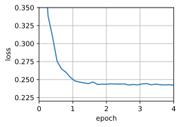

# 5 Minibatch Stochastic Gradient Descent

:label:`sec_minibatch_sgd`


* 由于减少了深度学习框架的额外开销，使用更好的内存定位以及CPU和GPU上的缓存，向量化使代码更加高效。
* 随机梯度下降的“统计效率”与大批量一次处理数据的“计算效率”之间存在权衡。小批量随机梯度下降提供了两全其美的答案：计算和统计效率。
* 在小批量随机梯度下降中，我们处理通过训练数据的随机排列获得的批量数据（即每个观测值只处理一次，但按随机顺序）。
* 在训练期间降低学习率有助于训练。
* 一般来说，小批量随机梯度下降比随机梯度下降和梯度下降的速度快，收敛风险较小。


到目前为止，我们在基于梯度的学习方法中遇到了两个极端情况：

- [3_gd.md](3_gd.md) 中使用完整数据集来计算梯度并更新参数，
- [4_sgd.md](4_sgd.md) 中一次处理一个训练样本来取得进展。

二者各有利弊：每当数据非常相似时，梯度下降并不是非常“数据高效”。 而由于CPU和GPU无法充分利用向量化，随机梯度下降并不特别“计算高效”。 这暗示了两者之间可能有折中方案，这便涉及到 $\text{\color{black}\colorbox{yellow}{小批量随机梯度下降 （minibatch gradient descent）}}$。

## 5.1 Vectorization and Caches

At the heart of the decision to use minibatches is $\text{\color{red}{computational efficiency}}$。 当考虑与多个GPU和多台服务器并行处理时，这一点最容易被理解。在这种情况下，我们需要向每个GPU发送至少一张图像。 有了每台服务器8个GPU和16台服务器，我们就能得到大小为128的小批量。

Things are a bit more subtle (微妙) when it comes to single GPUs or even CPUs （单个GPU，甚至是CPU时）. These devices have $\text{\color{red}multiple types of memory}$, often multiple type of compute units and $\text{\color{red}different bandwidth constraints}$ between them. 例如，一个CPU有少量寄存器（register），L1和L2缓存，以及L3缓存（在不同的处理器内核之间共享）。 随着缓存的大小的增加，它们的延迟也在增加，同时带宽在减少。 可以说，处理器能够执行的操作远比主内存接口所能提供的多得多。

* A 2GHz CPU with 16 cores and AVX-512 vectorization can process up to $2 \cdot 10^9 \cdot 16 \cdot 32 = 10^{12}$ bytes per second. The capability of GPUs easily exceeds this number by a factor of 100. 而另一方面，中端服务器处理器的 bandwidth 可能不超过100Gb/s，即不到处理器满负荷所需的十分之一。 更糟糕的是，并非所有的内存入口都是相等的：内存接口通常为64位或更宽（例如，在最多384位的GPU上）。 因此读取单个字节会导致由于更宽的存取而产生的代价。
* 其次，第一次存取的额外开销很大，而按序存取（sequential access）或突发读取（burst read）相对开销较小。 有关更深入的讨论，请参阅此[维基百科文章](https://en.wikipedia.org/wiki/Cache_hierarchy)。

减轻这些限制的方法是使用足够快的CPU缓存层次结构来为处理器提供数据。 这是深度学习中批量处理背后的推动力。 举一个简单的例子：矩阵-矩阵乘法。 比如 $A=BC$，我们有很多方法来计算 $A$。例如，我们可以尝试以下方法：

1. We could compute $\mathbf{A}_{ij} = \mathbf{B}_{i,:} \mathbf{C}_{:,j}^\top$, i.e., 我们可以通过点积进行逐元素计算。
2. We could compute $\mathbf{A}_{:,j} = \mathbf{B} \mathbf{C}_{:,j}^\top$, i.e., 我们可以一次计算一列. Likewise we could compute $\mathbf{A}$ one row $\mathbf{A}_{i,:}$ at a time.
3. We could simply compute $\mathbf{A} = \mathbf{B} \mathbf{C}$.
4. We could break $\mathbf{B}$ and $\mathbf{C}$ into smaller block (矩阵分块) matrices and compute $\mathbf{A}$ one block at a time.

If we follow the $\text{\color{yellow}\colorbox{black}{first option}}$, we will need to copy one row and one column vector into the CPU each time we want to compute an element $\mathbf{A}_{ij}$. Even worse, due to the fact that matrix elements are aligned sequentially we are thus required to access many disjoint locations for one of the two vectors as we read them from memory. The $\text{\color{yellow}\colorbox{black}{second option}}$ is much more favorable. In it, we are able to keep the column vector $\mathbf{C}_{:,j}$ in the CPU cache while we keep on traversing through $B$. This halves the memory bandwidth requirement with correspondingly faster access. Of course, $\text{\color{yellow}\colorbox{black}{option 3}}$ is most desirable. Unfortunately, most matrices might not entirely fit into cache (this is what we are discussing after all). However, $\text{\color{yellow}\colorbox{black}{option 4}}$ offers a practically $\text{\color{red}useful alternative}$: we can move blocks of the matrix into cache and multiply them locally. Optimized libraries take care of this for us. 让我们来看看这些操作在实践中的效率如何。

除了计算效率之外，Python和深度学习框架本身带来的额外开销也是相当大的。 回想一下，每次我们执行代码时，Python解释器都会向深度学习框架发送一个命令，要求将其插入到计算图中并在调度过程中处理它。 这样的额外开销可能是非常不利的。 总而言之，我们最好用向量化（和矩阵）。

```python
%matplotlib inline
import numpy as np
import torch
from torch import nn
from d2l import torch as d2l

timer = d2l.Timer()
A = torch.zeros(256, 256)
B = torch.randn(256, 256)
C = torch.randn(256, 256)
```

Element-wise assignment simply iterates over all rows and columns of $\mathbf{B}$ and $\mathbf{C}$ respectively to assign the value to $\mathbf{A}$.

```python
# Compute A = BC one element at a time
timer.start()
for i in range(256):
    for j in range(256):
        A[i, j] = torch.dot(B[i, :], C[:, j])
timer.stop()
```

1.2135522365570068
A faster strategy is to perform column-wise assignment.

```python
# Compute A = BC one column at a time
timer.start()
for j in range(256):
    A[:, j] = torch.mv(B, C[:, j])
timer.stop()
```
0.009257078170776367
Last, the most effective manner is to perform the entire operation in one block. Let us see what the respective speed of the operations is.

```python
# Compute A = BC in one go
timer.start()
A = torch.mm(B, C)
timer.stop()

# Multiply and add count as separate operations (fused in practice)
gigaflops = [2/i for i in timer.times]
print(f'performance in Gigaflops: element {gigaflops[0]:.3f}, '
      f'column {gigaflops[1]:.3f}, full {gigaflops[2]:.3f}')
```
performance in Gigaflops: element 1.648, column 216.051, full 801.357
## 5.2 Minibatches

:label:`sec_minibatches`

之前我们会理所当然地读取数据的 minibatches ，而不是观测单个数据来更新参数，现在简要解释一下原因。 处理单个观测值需要我们执行许多单一 matrix-vector（甚至 vector-vector）乘法，这耗费相当大，而且对应深度学习框架也要巨大的开销。 这既适用于计算梯度以更新参数时，也适用于用神经网络预测。 That is, this applies whenever we perform $\mathbf{w} \leftarrow \mathbf{w} - \eta_t \mathbf{g}_t$ where

$$
\mathbf{g}_t = \partial_{\mathbf{w}} f(\mathbf{x}_{t}, \mathbf{w})

$$

我们可以通过将其应用于一个小批量观测值来提高此操作的 *计算* 效率。 也就是说，我们将梯度 $g_t$ 替换为一个小批量而不是单个观测值

$$
\mathbf{g}_t = \partial_{\mathbf{w}} \frac{1}{|\mathcal{B}_t|} \sum_{i \in \mathcal{B}_t} f(\mathbf{x}_{i}, \mathbf{w})

$$

Let us see what this does to the statistical properties of $\mathbf{g}_t$: since both $\mathbf{x}_t$ and also all elements of the minibatch $\mathcal{B}_t$ are drawn uniformly at random from the training set, the expectation of the gradient remains unchanged. The variance, on the other hand, is reduced significantly. Since the minibatch gradient is composed of $b := |\mathcal{B}_t|$ independent gradients which are being averaged, its standard deviation is reduced by a factor of $b^{-\frac{1}{2}}$. This, by itself, is a good thing, since it means that the updates are more reliably aligned with the full gradient.

Naively this would indicate that choosing a large minibatch $\mathcal{B}_t$ would be universally desirable. Alas, after some point, the additional reduction in standard deviation is minimal when compared to the linear increase in computational cost. In practice we pick a minibatch that is large enough to offer good computational efficiency while still fitting into the memory of a GPU. To illustrate the savings let us have a look at some code. In it we perform the same matrix-matrix multiplication, but this time broken up into "minibatches" of 64 columns at a time.

```python
timer.start()
for j in range(0, 256, 64):
    A[:, j:j+64] = torch.mm(B, C[:, j:j+64])
timer.stop()
print(f'performance in Gigaflops: block {2 / timer.times[3]:.3f}')
```
performance in Gigaflops: block 2126.929
显而易见，小批量上的计算基本上与完整矩阵一样有效。 需要注意的是，在 [7.5节](https://zh.d2l.ai/chapter_convolutional-modern/batch-norm.html#sec-batch-norm)中，我们使用了一种在很大程度上取决于小批量中的方差的正则化。 随着后者增加，方差会减少，随之而来的是批量规范化带来的噪声注入的好处。 关于实例，请参阅 [[Ioffe, 2017]](https://zh.d2l.ai/chapter_references/zreferences.html#ioffe-2017)，了解有关如何重新缩放并计算适当项目。

## 5.3 Reading the Dataset

让我们来看看如何从数据中有效地生成小批量。 下面我们使用NASA开发的测试机翼的数据集[不同飞行器产生的噪声](https://archive.ics.uci.edu/ml/datasets/Airfoil+Self-Noise)来比较这些优化算法。 为方便起见，我们只使用前1,500样本。 数据已作预处理：我们移除了均值并将方差重新缩放到每个坐标为1。

```python
#@save
d2l.DATA_HUB['airfoil'] = (d2l.DATA_URL + 'airfoil_self_noise.dat',
                           '76e5be1548fd8222e5074cf0faae75edff8cf93f')

#@save
def get_data_ch11(batch_size=10, n=1500):
    data = np.genfromtxt(d2l.download('airfoil'),
                         dtype=np.float32, delimiter='\t')
    data = torch.from_numpy((data - data.mean(axis=0)) / data.std(axis=0))
    data_iter = d2l.load_array((data[:n, :-1], data[:n, -1]),
                               batch_size, is_train=True)
    return data_iter, data.shape[1]-1
```
## 5.4 Implementation from Scratch

[3.2节](3_gd.md) 一节中已经实现过小批量随机梯度下降算法。 我们在这里将它的输入参数变得更加通用，主要是为了方便本章后面介绍的其他优化算法也可以使用同样的输入。 具体来说，我们添加了一个状态输入`states`并将超参数放在字典`hyperparams`中。 此外，我们将在训练函数里对各个小批量样本的损失求平均，因此优化算法中的梯度不需要除以批量大小。

```python
def sgd(params, states, hyperparams):
    for p in params:
        p.data.sub_(hyperparams['lr'] * p.grad)
        p.grad.data.zero_()
```
下面实现一个通用的训练函数，以方便本章后面介绍的其他优化算法使用。 它初始化了一个线性回归模型，然后可以使用小批量随机梯度下降以及后续小节介绍的其他算法来训练模型。

```python
#@save
def train_ch11(trainer_fn, states, hyperparams, data_iter,
               feature_dim, num_epochs=2):
    # Initialization
    w = torch.normal(mean=0.0, std=0.01, size=(feature_dim, 1),
                     requires_grad=True)
    b = torch.zeros((1), requires_grad=True)
    net, loss = lambda X: d2l.linreg(X, w, b), d2l.squared_loss
    # Train
    animator = d2l.Animator(xlabel='epoch', ylabel='loss',
                            xlim=[0, num_epochs], ylim=[0.22, 0.35])
    n, timer = 0, d2l.Timer()
    for _ in range(num_epochs):
        for X, y in data_iter:
            l = loss(net(X), y).mean()
            l.backward()
            trainer_fn([w, b], states, hyperparams)
            n += X.shape[0]
            if n % 200 == 0:
                timer.stop()
                animator.add(n/X.shape[0]/len(data_iter),
                             (d2l.evaluate_loss(net, data_iter, loss),))
                timer.start()
    print(f'loss: {animator.Y[0][-1]:.3f}, {timer.avg():.3f} sec/epoch')
    return timer.cumsum(), animator.Y[0]
```
让我们来看看批量梯度下降的优化是如何进行的。 这可以通过将小批量设置为1500（即样本总数）来实现。 因此，模型参数每个迭代轮数只迭代一次。

```python
def train_sgd(lr, batch_size, num_epochs=2):
    data_iter, feature_dim = get_data_ch11(batch_size)
    return train_ch11(
        sgd, None, {'lr': lr}, data_iter, feature_dim, num_epochs)

gd_res = train_sgd(1, 1500, 10)
```
loss: 0.248, 0.020 sec/epoch


当批量大小为1时，优化使用的是随机梯度下降。 为了简化实现，我们选择了很小的学习率。 在随机梯度下降的实验中，每当一个样本被处理，模型参数都会更新。 在这个例子中，这相当于每个迭代轮数有1500次更新。 可以看到，目标函数值的下降在1个迭代轮数后就变得较为平缓。 尽管两个例子在一个迭代轮数内都处理了1500个样本，但实验中随机梯度下降的一个迭代轮数耗时更多。 这是因为随机梯度下降更频繁地更新了参数，而且一次处理单个观测值效率较低。

```python
sgd_res = train_sgd(0.005, 1)
```
loss: 0.244, 0.084 sec/epoch


最后，当批量大小等于100时，我们使用小批量随机梯度下降进行优化。 每个迭代轮数所需的时间比随机梯度下降和批量梯度下降所需的时间短。

```python
mini1_res = train_sgd(.4, 100)
```
loss: 0.244, 0.003 sec/epoch


将批量大小减少到10，每个迭代轮数的时间都会增加，因为每批工作负载的执行效率变得更低。

```python
mini2_res = train_sgd(.05, 10)
```
loss: 0.246, 0.010 sec/epoch


现在我们可以比较前四个实验的时间与损失。 可以看出，尽管在处理的样本数方面，SGD 的收敛速度快于梯度下降，但与 GD 相比，它需要更多的时间来达到同样的损失，因为逐个样本来计算梯度并不那么有效。 mini-batch SGD 能够平衡收敛速度和计算效率。 大小为10的 mini-batch 比 SGD 更有效； 大小为100的 mini-batch 在运行时间上甚至优于GD。

```python
d2l.set_figsize([6, 3])
d2l.plot(*list(map(list, zip(gd_res, sgd_res, mini1_res, mini2_res))),
         'time (sec)', 'loss', xlim=[1e-2, 10],
         legend=['gd', 'sgd', 'batch size=100', 'batch size=10'])
d2l.plt.gca().set_xscale('log')
```


## 5.5 Concise Implementation

In Gluon, we can use the `Trainer` class to call optimization algorithms. 下面用深度学习框架自带算法实现一个通用的训练函数，我们将在本章中其它小节使用它。

```python
#@save
def train_concise_ch11(trainer_fn, hyperparams, data_iter, num_epochs=4):
    # Initialization
    net = nn.Sequential(nn.Linear(5, 1))
    def init_weights(m):
        if type(m) == nn.Linear:
            torch.nn.init.normal_(m.weight, std=0.01)
    net.apply(init_weights)

    optimizer = trainer_fn(net.parameters(), **hyperparams)
    loss = nn.MSELoss(reduction='none')
    animator = d2l.Animator(xlabel='epoch', ylabel='loss',
                            xlim=[0, num_epochs], ylim=[0.22, 0.35])
    n, timer = 0, d2l.Timer()
    for _ in range(num_epochs):
        for X, y in data_iter:
            optimizer.zero_grad()
            out = net(X)
            y = y.reshape(out.shape)
            l = loss(out, y)
            l.mean().backward()
            optimizer.step()
            n += X.shape[0]
            if n % 200 == 0:
                timer.stop()
                # `MSELoss` computes squared error without the 1/2 factor
                animator.add(n/X.shape[0]/len(data_iter),
                             (d2l.evaluate_loss(net, data_iter, loss) / 2,))
                timer.start()
    print(f'loss: {animator.Y[0][-1]:.3f}, {timer.avg():.3f} sec/epoch')
```
下面使用这个训练函数，复现之前的实验。

```python
data_iter, _ = get_data_ch11(10)
trainer = torch.optim.SGD
train_concise_ch11(trainer, {'lr': 0.01}, data_iter)
```
loss: 0.242, 0.011 sec/epoch


## Summary

* Vectorization makes code more efficient due to reduced overhead arising from the deep learning framework and due to better memory locality and caching on CPUs and GPUs.
* There is a trade-off between statistical efficiency arising from stochastic gradient descent and computational efficiency arising from processing large batches of data at a time.
* Minibatch stochastic gradient descent offers the best of both worlds: computational and statistical efficiency.
* In minibatch stochastic gradient descent we process batches of data obtained by a random permutation of the training data (i.e., each observation is processed only once per epoch, albeit in random order).
* It is advisable to decay the learning rates during training.
* In general, minibatch stochastic gradient descent is faster than stochastic gradient descent and gradient descent for convergence to a smaller risk, when measured in terms of clock time.

## Exercises

1. Modify the batch size and learning rate and observe the rate of decline for the value of the objective function and the time consumed in each epoch.
2. Read the MXNet documentation and use the `Trainer` class `set_learning_rate` function to reduce the learning rate of the minibatch stochastic gradient descent to 1/10 of its previous value after each epoch.
3. Compare minibatch stochastic gradient descent with a variant that actually *samples with replacement* from the training set. What happens?
4. An evil genie replicates your dataset without telling you (i.e., each observation occurs twice and your dataset grows to twice its original size, but nobody told you). How does the behavior of stochastic gradient descent, minibatch stochastic gradient descent and that of gradient descent change?

[Discussions](https://discuss.d2l.ai/t/1068)
