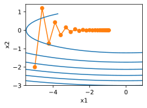
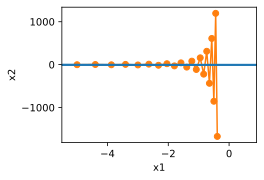

# 6 Momentum

:label:`sec_momentum`


* 动量法用过去梯度的平均值来替换梯度，这大大加快了收敛速度。
* 对于无噪声梯度下降和嘈杂随机梯度下降，动量法都是可取的。
* 动量法可以防止在随机梯度下降的优化过程停滞的问题。
* 由于对过去的数据进行了指数降权，有效梯度数为$\frac{1}{1−β}$。
* 在凸二次问题中，可以对动量法进行明确而详细的分析。
* 动量法的实现非常简单，但它需要我们存储额外的状态向量（动量v）。


在 [11.4节](https://zh.d2l.ai/chapter_optimization/sgd.html#sec-sgd)一节中，我们详述了如何执行随机梯度下降，即在只有嘈杂的梯度可用的情况下执行优化时会发生什么。 对于嘈杂的梯度，我们在选择学习率需要格外谨慎。 如果衰减速度太快，收敛就会停滞。 相反，如果太宽松，我们可能无法收敛到最优解。

## 6.1 Basics

在本节中，我们将探讨更有效的优化算法，尤其是针对实验中常见的某些类型的优化问题。

### 6.1.1 Leaky Averages 泄露平均值

The previous section saw us discussing $\text{\color{black}\colorbox{yellow}{minibatch SGD}}$ as a means for accelerating computation. It also had the nice side-effect that $\text{\color{red}\colorbox{black}{averaging gradients reduced the amount of variance}}$. The $\text{\color{black}\colorbox{yellow}{minibatch SGD}}$ can be calculated by:

$$
\mathbf{g}_{t, t-1} = \partial_{\mathbf{w}} \frac{1}{|\mathcal{B}_t|} \sum_{i \in \mathcal{B}_t} f(\mathbf{x}_{i}, \mathbf{w}_{t-1}) = \frac{1}{|\mathcal{B}_t|} \sum_{i \in \mathcal{B}_t} \mathbf{h}_{i, t-1}.

$$

To keep the notation simple, here we used $\mathbf{h}_{i, t-1} = \partial_{\mathbf{w}} f(\mathbf{x}_i, \mathbf{w}_{t-1})$ as the SGD for sample $i$ using the weights updated at time $t-1$.
如果我们能够从方差减少的影响中受益，甚至超过小批量上的梯度平均值，那很不错。 One option to accomplish this task is to replace the gradient computation by a $\text{\color{black}\colorbox{yellow}{``leaky average"}}$:

$$
\mathbf{v}_t = \beta \mathbf{v}_{t-1} + \mathbf{g}_{t, t-1}

$$

for some $\beta \in (0, 1)$. 这有效地将 instantaneous gradient(瞬时梯度) 替换为多个“过去”梯度的平均值。

$\color{red}\mathbf{v}$ is called $\text{\color{red}\colorbox{black}{momentum}}$. It accumulates past gradients similar to how a heavy ball rolling down the objective function landscape integrates over past forces. 为了更详细地解释，让我们递归地将 $v_t$ 扩展到

$$
\begin{aligned}
\mathbf{v}_t = \beta^2 \mathbf{v}_{t-2} + \beta \mathbf{g}_{t-1, t-2} + \mathbf{g}_{t, t-1}
= \ldots, = \sum_{\tau = 0}^{t-1} \beta^{\tau} \mathbf{g}_{t-\tau, t-\tau-1}.
\end{aligned}

$$

Large $\beta$ amounts to a long-range average, whereas small $\beta$ amounts to only a slight correction relative to a gradient method. 新的梯度替换 $\text{\color{red}\colorbox{black}{不再指向特定实例}}$下降最陡的方向，而是指向$\text{\color{red}\colorbox{black}{过去梯度}}$的加权平均值的方向。 这使我们能够实现对单批量计算平均值的大部分好处，而不产生实际计算其梯度的代价。 We will revisit this averaging procedure in more detail later.

上述推理构成了”加速”梯度方法的基础，例如具有动量的梯度。 在优化问题条件不佳的情况下（例如，有些方向的进展比其他方向慢得多，类似狭窄的峡谷），”加速” 梯度还额外享受更有效的好处。 此外，它们允许我们对随后的梯度计算平均值，以获得更稳定的下降方向。 诚然，即使是对于无噪声凸问题，加速度这方面也是动量如此起效的关键原因之一。

正如人们所期望的，由于其功效，动量是深度学习及其后优化中一个深入研究的主题。 例如，请参阅[文章](https://distill.pub/2017/momentum/%EF%BC%89%EF%BC%88%E4%BD%9C%E8%80%85%E6%98%AF%20:cite:%60Goh.2017%60)，观看深入分析和互动动画。 动量是由 [[Polyak, 1964]](https://zh.d2l.ai/chapter_references/zreferences.html#polyak-1964)提出的。 [[Nesterov, 2018]](https://zh.d2l.ai/chapter_references/zreferences.html#nesterov-2018)在凸优化的背景下进行了详细的理论讨论。 长期以来，深度学习的动量一直被认为是有益的。 有关实例的详细信息，请参阅 [[Sutskever et al., 2013]](https://zh.d2l.ai/chapter_references/zreferences.html#sutskever-martens-dahl-ea-2013)的讨论。

### 6.1.2 An Ill-conditioned Problem (病态条件问题)

To get a better understanding of the geometric properties of the momentum method we revisit gradient descent, albeit with a significantly less pleasant objective function. Recall that in [4_sgd](4_sgd.md) we used $f(\mathbf{x}) = x_1^2 + 2 x_2^2$, i.e., a moderately distorted ellipsoid objective (中度扭曲的椭球目标). We distort this function further by stretching (伸展) it out in the $x_1$ direction via

$$
f(\mathbf{x}) = 0.1 x_1^2 + 2 x_2^2.

$$

As before $f$ has its minimum at $(0, 0)$. This function is *very* flat in the direction of $x_1$. Let us see what happens when we perform gradient descent as before on this new function. We pick a learning rate of $0.4$.

```python
%matplotlib inline
import torch
from d2l import torch as d2l

eta = 0.4
def f_2d(x1, x2):
    return 0.1 * x1 ** 2 + 2 * x2 ** 2
def gd_2d(x1, x2, s1, s2):
    return (x1 - eta * 0.2 * x1, x2 - eta * 4 * x2, 0, 0)

d2l.show_trace_2d(f_2d, d2l.train_2d(gd_2d))
```

epoch 20, x1: -0.943467, x2: -0.000073
/home/d2l-worker/miniconda3/envs/d2l-en-release-0/lib/python3.8/site-packages/torch/functional.py:568: UserWarning: torch.meshgrid: in an upcoming release, it will be required to pass the indexing argument. (Triggered internally at  ../aten/src/ATen/native/TensorShape.cpp:2228.)
  return _VF.meshgrid(tensors, **kwargs)  # type: ignore[attr-defined]


By construction, the gradient in the $x_2$ direction is *much* higher and changes much more rapidly than in the horizontal $x_1$ direction. 因此，我们陷入两难：

- 如果选择较小的学习率，我们会确保解不会在 $x_2$ 方向发散，但要承受在 $x_1$ 方向的缓慢收敛。
- 相反，如果学习率较高，我们在 $x_1$ 方向上进展很快，但在 $x_2$ 方向将会发散。

The example below illustrates what happens even after a slight increase in learning rate from $0.4$ to $0.6$. Convergence in the $x_1$ direction improves but the overall solution quality is much worse.

```python
eta = 0.6
d2l.show_trace_2d(f_2d, d2l.train_2d(gd_2d))
```
epoch 20, x1: -0.387814, x2: -1673.365109


### 6.1.3 The Momentum Method

*动量法* （momentum）使我们能够解决上面描述的梯度下降问题。 观察上面的优化轨迹，我们可能会直觉到计算过去的平均梯度效果会很好。 After all,

- 在 $x_1$ 方向上，这将 aggregate well-aligned 梯度，thus increasing the distance we cover with every step。
- 在梯度振荡的 $x_2$ 方向，由于相互抵消了对方的振荡，an aggregate gradient 将减小步长大小。

Using $\mathbf{v}_t$ instead of the gradient $\mathbf{g}_t$ yields the following update equations:

$$
\begin{aligned}
\mathbf{v}_t &\leftarrow \beta \mathbf{v}_{t-1} + \mathbf{g}_{t, t-1}, \\
\mathbf{x}_t &\leftarrow \mathbf{x}_{t-1} - \eta_t \mathbf{v}_t.
\end{aligned}

$$

Note that for $\beta = 0$ we recover regular gradient descent. 在深入研究它的数学属性之前，让我们快速看一下算法在实验中的表现如何。

```python
def momentum_2d(x1, x2, v1, v2):
    v1 = beta * v1 + 0.2 * x1
    v2 = beta * v2 + 4 * x2
    return x1 - eta * v1, x2 - eta * v2, v1, v2

eta, beta = 0.6, 0.5
d2l.show_trace_2d(f_2d, d2l.train_2d(momentum_2d))
```
epoch 20, x1: 0.007188, x2: 0.002553


正如所见，尽管学习率与我们以前使用的相同，动量法仍然很好地收敛了。 让我们看看当降低动量参数时会发生什么。 Halving it (减半) to $\beta = 0.25$ 会导致一条几乎没有收敛的轨迹。 尽管如此，它比没有动量时解将会发散要好得多。

```python
eta, beta = 0.6, 0.25
d2l.show_trace_2d(f_2d, d2l.train_2d(momentum_2d))
```
epoch 20, x1: -0.126340, x2: -0.186632


请注意，我们可以将动量法与随机梯度下降，特别是小批量随机梯度下降结合起来。The only change is that in that case we replace the gradients $\mathbf{g}_{t, t-1}$ with $\mathbf{g}_t$. Last, for convenience we initialize $\mathbf{v}_0 = 0$ at time $t=0$. Let us look at what leaky averaging actually does to the updates.

### 6.1.4 Effective Sample Weight

Recall that $\mathbf{v}_t = \sum_{\tau = 0}^{t-1} \beta^{\tau} \mathbf{g}_{t-\tau, t-\tau-1}$. In the limit (极限条件下) the terms add up to $\sum_{\tau=0}^\infty \beta^\tau = \frac{1}{1-\beta}$. 换句话说，不同于在梯度下降或者随机梯度下降中取步长 $η$，我们 $\color{red} 选取步长 \frac{\eta}{1-\beta}$ ，同时处理潜在表现可能会更好的下降方向。 这是集两种好处于一身的做法。 为了说明 $β$ 的不同选择的权重效果如何，请参考下面的图表。

```python
d2l.set_figsize()
betas = [0.95, 0.9, 0.6, 0]
for beta in betas:
    x = torch.arange(40).detach().numpy()
    d2l.plt.plot(x, beta ** x, label=f'beta = {beta:.2f}')
d2l.plt.xlabel('time')
d2l.plt.legend();
```


## 6.2 Practical Experiments

让我们来看看动量法在实验中是如何运作的。 为此，我们需要一个更加可扩展的实现。

### 6.2.1 Implementation from Scratch

相比于小批量随机梯度下降，动量方法需要维护一组辅助变量，即速度。 它与梯度以及优化问题的变量具有相同的形状。 In the implementation below we call these variables `states`.

```python
def init_momentum_states(feature_dim):
    v_w = torch.zeros((feature_dim, 1))
    v_b = torch.zeros(1)
    return (v_w, v_b)
```
```python
def sgd_momentum(params, states, hyperparams):
    for p, v in zip(params, states):
        with torch.no_grad():
            v[:] = hyperparams['momentum'] * v + p.grad
            p[:] -= hyperparams['lr'] * v
        p.grad.data.zero_()
```
Let us see how this works in practice.

```python
def train_momentum(lr, momentum, num_epochs=2):
    d2l.train_ch11(sgd_momentum, init_momentum_states(feature_dim),
                   {'lr': lr, 'momentum': momentum}, data_iter,
                   feature_dim, num_epochs)

data_iter, feature_dim = d2l.get_data_ch11(batch_size=10)
train_momentum(0.02, 0.5)
```
loss: 0.242, 0.011 sec/epoch


When we increase the momentum hyperparameter `momentum` to 0.9, it amounts to a significantly larger effective sample size of $\frac{1}{1 - 0.9} = 10$. We reduce the learning rate slightly to $0.01$ to keep matters under control.

```python
train_momentum(0.01, 0.9)
```
loss: 0.257, 0.011 sec/epoch

Reducing the learning rate further addresses any issue of non-smooth optimization problems. Setting it to $0.005$ yields good convergence properties.

```python
train_momentum(0.005, 0.9)
```
loss: 0.243, 0.011 sec/epoch

### 6.2.2 Concise Implementation

There is very little to do in Gluon since the standard `sgd` solver already had momentum built in. Setting matching parameters yields a very similar trajectory.

```python
trainer = torch.optim.SGD
d2l.train_concise_ch11(trainer, {'lr': 0.005, 'momentum': 0.9}, data_iter)
```
loss: 0.245, 0.011 sec/epoch

## 6.3 Theoretical Analysis

So far the 2D example of $f(x) = 0.1 x_1^2 + 2 x_2^2$ seemed rather contrived. We will now see that this is actually quite representative of the types of problem one might encounter, at least in the case of minimizing convex quadratic objective functions.

### Quadratic Convex Functions

Consider the function

$$
h(\mathbf{x}) = \frac{1}{2} \mathbf{x}^\top \mathbf{Q} \mathbf{x} + \mathbf{x}^\top \mathbf{c} + b.

$$

This is a general quadratic function. For positive definite matrices $\mathbf{Q} \succ 0$, i.e., for matrices with positive eigenvalues this has a minimizer at $\mathbf{x}^* = -\mathbf{Q}^{-1} \mathbf{c}$ with minimum value $b - \frac{1}{2} \mathbf{c}^\top \mathbf{Q}^{-1} \mathbf{c}$. Hence we can rewrite $h$ as

$$
h(\mathbf{x}) = \frac{1}{2} (\mathbf{x} - \mathbf{Q}^{-1} \mathbf{c})^\top \mathbf{Q} (\mathbf{x} - \mathbf{Q}^{-1} \mathbf{c}) + b - \frac{1}{2} \mathbf{c}^\top \mathbf{Q}^{-1} \mathbf{c}.

$$

The gradient is given by $\partial_{\mathbf{x}} f(\mathbf{x}) = \mathbf{Q} (\mathbf{x} - \mathbf{Q}^{-1} \mathbf{c})$. That is, it is given by the distance between $\mathbf{x}$ and the minimizer, multiplied by $\mathbf{Q}$. Consequently also the momentum  is a linear combination of terms $\mathbf{Q} (\mathbf{x}_t - \mathbf{Q}^{-1} \mathbf{c})$.

Since $\mathbf{Q}$ is positive definite it can be decomposed into its eigensystem via $\mathbf{Q} = \mathbf{O}^\top \boldsymbol{\Lambda} \mathbf{O}$ for an orthogonal (rotation) matrix $\mathbf{O}$ and a diagonal matrix $\boldsymbol{\Lambda}$ of positive eigenvalues. This allows us to perform a change of variables from $\mathbf{x}$ to $\mathbf{z} := \mathbf{O} (\mathbf{x} - \mathbf{Q}^{-1} \mathbf{c})$ to obtain a much simplified expression:

$$
h(\mathbf{z}) = \frac{1}{2} \mathbf{z}^\top \boldsymbol{\Lambda} \mathbf{z} + b'.

$$

Here $b' = b - \frac{1}{2} \mathbf{c}^\top \mathbf{Q}^{-1} \mathbf{c}$. Since $\mathbf{O}$ is only an orthogonal matrix this does not perturb the gradients in a meaningful way. Expressed in terms of $\mathbf{z}$ gradient descent becomes

$$
\mathbf{z}_t = \mathbf{z}_{t-1} - \boldsymbol{\Lambda} \mathbf{z}_{t-1} = (\mathbf{I} - \boldsymbol{\Lambda}) \mathbf{z}_{t-1}.

$$

The important fact in this expression is that gradient descent *does not mix* between different eigenspaces. That is, when expressed in terms of the eigensystem of $\mathbf{Q}$ the optimization problem proceeds in a coordinate-wise manner. This also holds for momentum.

$$
\begin{aligned}
\mathbf{v}_t & = \beta \mathbf{v}_{t-1} + \boldsymbol{\Lambda} \mathbf{z}_{t-1} \\
\mathbf{z}_t & = \mathbf{z}_{t-1} - \eta \left(\beta \mathbf{v}_{t-1} + \boldsymbol{\Lambda} \mathbf{z}_{t-1}\right) \\
    & = (\mathbf{I} - \eta \boldsymbol{\Lambda}) \mathbf{z}_{t-1} - \eta \beta \mathbf{v}_{t-1}.
\end{aligned}

$$

In doing this we just proved the following theorem: Gradient Descent with and without momentum for a convex quadratic function decomposes into coordinate-wise optimization in the direction of the eigenvectors of the quadratic matrix.

### Scalar Functions

Given the above result let us see what happens when we minimize the function $f(x) = \frac{\lambda}{2} x^2$. For gradient descent we have

$$
x_{t+1} = x_t - \eta \lambda x_t = (1 - \eta \lambda) x_t.

$$

Whenever $|1 - \eta \lambda| < 1$ this optimization converges at an exponential rate since after $t$ steps we have $x_t = (1 - \eta \lambda)^t x_0$. This shows how the rate of convergence improves initially as we increase the learning rate $\eta$ until $\eta \lambda = 1$. Beyond that things diverge and for $\eta \lambda > 2$ the optimization problem diverges.

```python
lambdas = [0.1, 1, 10, 19]
eta = 0.1
d2l.set_figsize((6, 4))
for lam in lambdas:
    t = torch.arange(20).detach().numpy()
    d2l.plt.plot(t, (1 - eta * lam) ** t, label=f'lambda = {lam:.2f}')
d2l.plt.xlabel('time')
d2l.plt.legend();
```


To analyze convergence in the case of momentum we begin by rewriting the update equations in terms of two scalars: one for $x$ and one for the momentum $v$. This yields:

$$
\begin{bmatrix} v_{t+1} \\ x_{t+1} \end{bmatrix} =
\begin{bmatrix} \beta & \lambda \\ -\eta \beta & (1 - \eta \lambda) \end{bmatrix}
\begin{bmatrix} v_{t} \\ x_{t} \end{bmatrix} = \mathbf{R}(\beta, \eta, \lambda) \begin{bmatrix} v_{t} \\ x_{t} \end{bmatrix}.

$$

We used $\mathbf{R}$ to denote the $2 \times 2$ governing convergence behavior. After $t$ steps the initial choice $[v_0, x_0]$ becomes $\mathbf{R}(\beta, \eta, \lambda)^t [v_0, x_0]$. Hence, it is up to the eigenvalues of $\mathbf{R}$ to determine the speed of convergence. See the [Distill post](https://distill.pub/2017/momentum/) of :cite:`Goh.2017` for a great animation and :cite:`Flammarion.Bach.2015` for a detailed analysis. One can show that $0 < \eta \lambda < 2 + 2 \beta$ momentum converges. This is a larger range of feasible parameters when compared to $0 < \eta \lambda < 2$ for gradient descent. It also suggests that in general large values of $\beta$ are desirable. Further details require a fair amount of technical detail and we suggest that the interested reader consult the original publications.

## Summary

* Momentum replaces gradients with a leaky average over past gradients. This accelerates convergence significantly.
* It is desirable for both noise-free gradient descent and (noisy) stochastic gradient descent.
* Momentum prevents stalling of the optimization process that is much more likely to occur for stochastic gradient descent.
* The effective number of gradients is given by $\frac{1}{1-\beta}$ due to exponentiated downweighting of past data.
* In the case of convex quadratic problems this can be analyzed explicitly in detail.
* Implementation is quite straightforward but it requires us to store an additional state vector (momentum $\mathbf{v}$).

## Exercises

1. Use other combinations of momentum hyperparameters and learning rates and observe and analyze the different experimental results.
2. Try out GD and momentum for a quadratic problem where you have multiple eigenvalues, i.e., $f(x) = \frac{1}{2} \sum_i \lambda_i x_i^2$, e.g., $\lambda_i = 2^{-i}$. Plot how the values of $x$ decrease for the initialization $x_i = 1$.
3. Derive minimum value and minimizer for $h(\mathbf{x}) = \frac{1}{2} \mathbf{x}^\top \mathbf{Q} \mathbf{x} + \mathbf{x}^\top \mathbf{c} + b$.
4. What changes when we perform stochastic gradient descent with momentum? What happens when we use minibatch stochastic gradient descent with momentum? Experiment with the parameters?

[Discussions](https://discuss.d2l.ai/t/1070)
