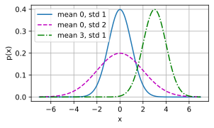

# 1. Linear Regression

:label:`sec_linear_regression`


* 机器学习模型中的关键要素是训练数据、损失函数、优化算法，还有模型本身。
* 矢量化使数学表达上更简洁，同时运行的更快。
* 最小化目标函数和执行极大似然估计等价。
* 线性回归模型也是一个简单的神经网络。


*回归* （regression）是能为一个或多个自变量与因变量之间关系建模的一类方法。 在自然科学和社会科学领域，回归经常用来表示输入和输出之间的关系。

在机器学习领域中的大多数任务通常都与 *预测* （prediction）有关。 当我们想预测一个数值时，就会涉及到回归问题。 常见的例子包括：预测价格（房屋、股票等）、预测住院时间（针对住院病人等）、 预测需求（零售销量等）。 但不是所有的*预测*都是回归问题。 在后面的章节中，我们将介绍分类问题。分类问题的目标是预测数据属于一组类别中的哪一个。

## 1.1 Basic Elements of Linear Regression

*线性回归* （linear regression）可以追溯到19世纪初， 它在回归的各种标准工具中最简单而且最流行。 线性回归基于几个简单的假设：

- 首先，假设自变量 $x$ 和因变量 $y$ 之间的关系是线性的， 即y可以表示为x中元素的加权和，这里通常允许包含观测值的一些噪声；
- 其次，我们假设任何噪声都比较正常，如噪声遵循正态分布。

为了解释 *线性回归* ，我们举一个实际的例子： 我们希望根据房屋的面积（平方英尺）和房龄（年）来估算房屋价格（美元）。 为了开发一个能预测房价的模型，我们需要收集一个真实的数据集。 这个数据集包括了房屋的销售价格、面积和房龄。 在机器学习的术语中，该数据集称为 *训练数据集* （training data set） 或 *训练集* （training set）。 每行数据（比如一次房屋交易相对应的数据）称为 *样本* （sample）， 也可以称为 *数据点* （data point）或 *数据样本* （data instance）。 我们把试图预测的目标（比如预测房屋价格）称为 *标签* （label）或 *目标* （target）。 预测所依据的自变量（面积和房龄）称为 *特征* （feature）或 *协变量* （covariate）。

Typically, we will use $n$ to denote the number of examples in our dataset. We index the data examples by $i$, denoting each input as $\mathbf{x}^{(i)} = [x_1^{(i)}, x_2^{(i)}]^\top$ and the corresponding label as $y^{(i)}$.

### 1.1.1 Linear Model

:label:`subsec_linear_model`

The linearity assumption just says that the target (price) can be expressed as a weighted sum of the features (area and age):

$$
\mathrm{price} = w_{\mathrm{area}} \cdot \mathrm{area} + w_{\mathrm{age}} \cdot \mathrm{age} + b.

$$

:eqlabel:`eq_price-area`

In [(3.1.1)](https://zh.d2l.ai/chapter_linear-networks/linear-regression.html#equation-eq-price-area),  $w_{\mathrm{area}}$ and $w_{\mathrm{age}}$ are called *$\color{red}weights$*, and $b$ is called a *$\color{red}bias$* (also called an *offset 偏移* or *intercept 截距*).

- The $\color{red}weights$ determine the influence of each feature on our prediction and
- the *$\color{red}bias$* just says what value the predicted price should take when all of the features take value 0.

Even if we will never see any homes with zero area, or that are precisely zero years old, we still need the bias or else we will limit the expressivity of our model. Strictly speaking, [(3.1.1)](https://zh.d2l.ai/chapter_linear-networks/linear-regression.html#equation-eq-price-area) is an *$\color{red}\text{affine transformation}$ (仿射变换)* of input features, which is characterized by a *linear transformation* of features via weighted sum, combined with a *translation* via the added bias.

给定一个数据集，我们的 $\text{\colorbox{black}{\color{yellow}目标}}$ 是寻找模型的权重 $w$ 和偏置 $b$， 使得根据模型做出的预测大体符合数据里的真实价格。 输出的预测值由输入特征通过*线性模型*的 $\color{red}\text{affine transformation}$ 决定，仿射变换由所选 *$\color{red}weights$* 和 *$\color{red}bias$* 确定。

在通常只关注具有少数特征的数据集的学科中，显式表达像这样的长格式模型是很常见的。In machine learning, we usually work with $\color{red}\text{high-dimensional datasets}$, so it is more convenient to employ linear algebra notation. When our inputs consist of $d$ features, we express our prediction $\hat{y}$ (in general the "hat" symbol denotes estimates) as

$$
\hat{y} = w_1  x_1 + ... + w_d  x_d + b.

$$

Collecting all features into a vector $\mathbf{x} \in \mathbb{R}^d$ and all weights into a vector $\mathbf{w} \in \mathbb{R}^d$, we can express our model compactly using a dot product:

$$
\hat{y} = \mathbf{w}^\top \mathbf{x} + b.\tag{3.1.3}

$$

In Eq (3.1.3), the vector $\mathbf{x}$ corresponds to features of $\color{red}\text{a single data example 单个样本}$. We will often find it convenient to refer to features of our entire dataset of $\color{red}n \text{ examples}$ via the *design matrix* $\mathbf{X} \in \mathbb{R}^{n \times d}$. Here, $\mathbf{X}$ 的每一行是一个样本，每一列是一种特征。

For a collection of features $\mathbf{X}$, the predictions $\hat{\mathbf{y}} \in \mathbb{R}^n$ can be expressed via the matrix-vector product:

$$
{\hat{\mathbf{y}}} = \mathbf{X} \mathbf{w} + b,

$$

这个过程中的求和将使用广播机制 （广播机制在 [2.1.3节](C2_preliminaries/2_1_torch_intro.md)中有详细介绍）。 Given features of a training dataset $\mathbf{X}$ and corresponding (known) labels $\mathbf{y}$, the goal of linear regression is to find the weight vector $\mathbf{w}$ and the bias term $b$ that given features of a new data example sampled from the same distribution as $\mathbf{X}$, the new example's label will (in expectation) be predicted with the lowest error.

加噪声的原因: Even if we believe that the best model for predicting $y$ given $\mathbf{x}$ is linear, we would not expect to find $\color{red}\text{a real-world}$ dataset of $n$ examples where $y^{(i)}$ exactly equals $\mathbf{w}^\top \mathbf{x}^{(i)}+b$ for all $1 \leq i \leq n$. For example, whatever instruments we use to observe the features $\mathbf{X}$ and labels $\mathbf{y}$ might suffer small amount of measurement error. Thus, even when we are confident that the underlying relationship is linear, we will incorporate a noise term to account for such errors.

Before we can go about searching for the best *parameters* (or *model parameters*) $\mathbf{w}$ and $b$, we will need two more things: 即相当于一个优化问题，找到目标函数（Loss Function）

- (i) a quality measure for some given model; 模型度量方式
- (ii) a procedure for updating the model to improve its quality. 更新模型的方法

### 1.1.2 Loss Function

在我们开始考虑如何用模型 *拟合* （fit）数据之前，我们需要确定一个拟合程度的度量。  *损失函数* （loss function）能够量化目标的*实际*值与*预测*值之间的差距。 通常我们会选择非负数作为损失，且数值越小表示损失越小，完美预测时的损失为0。回归问题中最常用的损失函数是 $\color{red}\text{平方误差函数 （the squared error）}$。When our prediction for an example $i$ is $\hat{y}^{(i)}$ and the corresponding true label is $y^{(i)}$, the squared error is given by:

$$
l^{(i)}(\mathbf{w}, b) = \frac{1}{2} \left(\hat{y}^{(i)} - y^{(i)}\right)^2.

$$

常数 $\frac{1}{2}$ 不会带来本质的差别, 但这样在形式上稍微简单一些 （因为当我们对损失函数求导后常数系数为1）。 由于训练数据集并不受我们控制，所以经验误差只是关于模型参数的函数。 为了进一步说明，来看下面的例子。 我们为一维情况下的回归问题绘制图像，如 [图3.1.1]() 所示。


<center>
    
    <br>
    <div style="color:orange; border-bottom: 1px solid #d9d9d9;
    display: inline-block;
    color: #999;
    padding: 2px;">
      图3.1.1 用线性模型拟合数据
  	</div>
</center>


Note that large differences between estimates $\hat{y}^{(i)}$ and observations $y^{(i)}$ lead to even larger contributions to the loss, due to the quadratic dependence.
To measure the quality of a model on the entire dataset of $n$ examples, we simply average (or equivalently, sum) the losses on the training set.

$$
L(\mathbf{w}, b) =\frac{1}{n}\sum_{i=1}^n l^{(i)}(\mathbf{w}, b) =\frac{1}{n} \sum_{i=1}^n \frac{1}{2}\left(\mathbf{w}^\top \mathbf{x}^{(i)} + b - y^{(i)}\right)^2.

$$

When training the model, we want to find parameters ($\mathbf{w}^*, b^*$) that minimize the total loss across all training examples:

$$
\mathbf{w}^*, b^* = \operatorname*{argmin}_{\mathbf{w}, b}\  L(\mathbf{w}, b).

$$

### 1.1.3 Analytic Solution 解析解

线性回归刚好是一个很简单的优化问题。 与我们将在本书中所讲到的其他大部分模型不同，线性回归的解可以用一个公式简单地表达出来， 这类解叫作解析解（analytical solution）。

- To start, we can subsume the bias $b$ into the parameter $\mathbf{w}$
- Then our prediction problem is to minimize $\|\mathbf{y} - \mathbf{X}\mathbf{w}\|^2$.
- There is just one critical point on the loss surface and it corresponds to the minimum of the loss over the entire domain.
- Taking the derivative of the loss with respect to $\mathbf{w}$ and setting it equal to zero yields the analytic (closed-form) solution: by appending a column to the design matrix consisting of all ones.

$$
\mathbf{w}^* = (\mathbf X^\top \mathbf X)^{-1}\mathbf X^\top \mathbf{y}.

$$

像线性回归这样的简单问题存在解析解，但并不是所有的问题都存在解析解。 解析解可以进行很好的数学分析，但解析解对问题的限制很严格，导致它无法广泛应用在深度学习里。

### 1.1.4 Minibatch Stochastic Gradient Descent


即使在我们无法得到解析解的情况下，我们仍然可以有效地训练模型。 在许多任务上，那些难以优化的模型效果要更好。 因此，弄清楚如何训练这些难以优化的模型是非常重要的。

本书中我们用到一种名为 $\color{red}\text{梯度下降（gradient descent）}$的方法， 这种方法几乎可以优化所有深度学习模型。 它通过不断地在损失函数递减的方向上更新参数来降低误差。

梯度下降最简单的用法是计算损失函数（数据集中所有样本的损失均值） 关于模型参数的导数（在这里也可以称为梯度）。 但 $\color{yellow}\colorbox{black}{\text{实际中的执行可能会非常慢}}$：因为在每一次更新参数之前，我们必须遍历整个数据集。 因此，我们通常会在每次需要计算更新的时候随机抽取一小批样本， 这种变体叫做 $\color{red}\text{小批量随机梯度下降（minibatch stochastic gradient descent）}$。

In each iteration,

- we first randomly sample a minibatch $\mathcal{B}$ consisting of a fixed number (固定数量) of training examples.
- We then compute the derivative (gradient) of the $\color{red}\text{average loss}$ on the minibatch with regard to the model parameters.
- Finally, we multiply the gradient by a predetermined positive value $\eta$ and subtract the resulting term from the current parameter values.

We can express the update mathematically as follows ($\partial$ denotes the partial derivative):

$$
(\mathbf{w},b) \leftarrow (\mathbf{w},b) - \frac{\eta}{|\mathcal{B}|} \sum_{i \in \mathcal{B}} \partial_{(\mathbf{w},b)} l^{(i)}(\mathbf{w},b).

$$

To summarize, steps of the algorithm are the following:

- (i) we $\color{yellow}\colorbox{black}{\text{initialize}}$ the values of the model parameters, typically at random;
- (ii) we $\color{yellow}\colorbox{black}{\text{iteratively}}$ sample random minibatches from the data, $\color{yellow}\colorbox{black}{\text{updating}}$ the parameters in the direction of the negative gradient.

For quadratic losses and affine 仿射 transformations, we can write this out explicitly as follows:

$$
\begin{aligned} \mathbf{w} &\leftarrow \mathbf{w} -   \frac{\eta}{|\mathcal{B}|} \sum_{i \in \mathcal{B}} \partial_{\mathbf{w}} l^{(i)}(\mathbf{w}, b) = \mathbf{w} - \frac{\eta}{|\mathcal{B}|} \sum_{i \in \mathcal{B}} \mathbf{x}^{(i)} \left(\mathbf{w}^\top \mathbf{x}^{(i)} + b - y^{(i)}\right),\\ b &\leftarrow b -  \frac{\eta}{|\mathcal{B}|} \sum_{i \in \mathcal{B}} \partial_b l^{(i)}(\mathbf{w}, b)  = b - \frac{\eta}{|\mathcal{B}|} \sum_{i \in \mathcal{B}} \left(\mathbf{w}^\top \mathbf{x}^{(i)} + b - y^{(i)}\right). \end{aligned} \tag{3.1.10}

$$

Note that $\mathbf{w}$ and $\mathbf{x}$ are vectors in 公式 [(3.1.10)](https://zh.d2l.ai/chapter_linear-networks/linear-regression.html#equation-eq-linreg-batch-update).
Here, the more elegant vector notation makes the math much more readable than expressing things in terms of coefficients, say $w_1, w_2, \ldots, w_d$.
The set cardinality $|\mathcal{B}|$ represents the number of examples in each minibatch (the *batch size*)
and $\eta$ denotes the *learning rate*.
批量大小和学习率的值通常是手动预先指定，而不是通过模型训练得到的。 这些可以调整但不在训练过程中更新的参数称为 *超参数* （hyperparameter）。  *调参* （hyperparameter tuning）是选择超参数的过程。 超参数通常是我们根据训练迭代结果来调整的， 而训练迭代结果是在独立的 *验证数据集* （validation dataset）上评估得到的。

在训练了预先确定的若干迭代次数后（或者直到满足某些其他停止条件后）， 我们记录下模型参数的估计值，表示为 $\hat{\mathbf{w}}, \hat{b}$. 但是，即使我们的函数确实是线性的且无噪声，这些估计值也不会使损失函数真正地达到最小值。 因为算法会使得损失向最小值缓慢收敛，但却不能在有限的步数内非常精确地达到最小值。

线性回归恰好是一个在整个域中只有一个最小值的学习问题。 但是对于像深度神经网络这样复杂的模型来说，损失平面上通常包含多个最小值。 深度学习实践者很少会去花费大力气寻找这样一组参数，使得在*训练集*上的损失达到最小。 事实上，更难做到的是找到一组参数，这组参数能够在我们从未见过的数据上实现较低的损失， 这一挑战被称为 *泛化* （generalization）。

### 1.1.5 Making Predictions with the Learned Model

Given the learned linear regression model $\hat{\mathbf{w}}^\top \mathbf{x} + \hat{b}$, we can now estimate the price of a new house (not contained in the training data) given its area $x_1$ and age $x_2$.
Estimating targets given features is commonly called $\color{red}\text{prediction}$ or $\color{red}\text{inference}$.

本书将尝试坚持使用 $\color{red}\text{prediction}$ 这个词。 虽然 $\color{red}\text{inference}$ 这个词已经成为深度学习的标准术语，但其实*推断*这个词有些用词不当。 在统计学中，$\color{red}\text{inference}$ 更多地表示基于数据集估计参数。 当深度学习从业者与统计学家交谈时，术语的误用经常导致一些误解。

## 1.2 Vectorization for Speed 矢量化加速

在训练我们的模型时，我们经常希望能够 $\color{yellow}\colorbox{black}{同时处理整个小批量的样本}$。 为了实现这一点，需要我们对计算进行矢量化， 从而利用 $\color{red}\text{线性代数库}$，而不是在Python中编写开销高昂的for循环。

```python
%matplotlib inline
import math
import time
import numpy as np
import torch
from d2l import torch as d2l
```

为了说明矢量化为什么如此重要，我们考虑对向量相加的两种方法。 我们实例化两个全为1的10000维向量。 在一种方法中，我们将使用Python的for循环遍历向量； 在另一种方法中，我们将依赖对 `+` 的调用。

```python
n = 10000
a = torch.ones(n)
b = torch.ones(n)
```

Since we will benchmark the running time frequently in this book,
[**let us define a timer**].

```python
class Timer:  #@save
    """Record multiple running times."""
    def __init__(self):
        self.times = []
        self.start()

    def start(self):
        """Start the timer."""
        self.tik = time.time()

    def stop(self):
        """Stop the timer and record the time in a list."""
        self.times.append(time.time() - self.tik)
        return self.times[-1]

    def avg(self):
        """Return the average time."""
        return sum(self.times) / len(self.times)

    def sum(self):
        """Return the sum of time."""
        return sum(self.times)

    def cumsum(self):
        """Return the accumulated time."""
        return np.array(self.times).cumsum().tolist()
```

Now we can benchmark the workloads. 现在我们可以对工作负载进行基准测试。

注意：List与（numpy.array、torch.tensor）的差别，后者对 `+ - * /` 重载了矢量化运算


First, [**we add them, one coordinate at a time, using a for-loop.**]

```python
c = torch.zeros(n)
timer = Timer()
for i in range(n):
    c[i] = a[i] + b[i]
f'{timer.stop():.5f} sec'
```

'0.10353 sec'
(**Alternatively, we rely on the reloaded `+` operator to compute the elementwise sum.**)

```python
timer.start()
d = a + b
f'{timer.stop():.5f} sec'
```
'0.00028 sec'
结果很明显，第二种方法比第一种方法快得多。 矢量化代码通常会带来数量级的加速。 另外，我们将更多的数学运算放到库中，而无须自己编写那么多的计算，从而减少了出错的可能性。

## 1.3 The Normal Distribution and Squared Loss

:label:`subsec_normal_distribution_and_squared_loss`

接下来，我们通过对噪声分布的假设来解读平方损失目标函数。

正态分布和线性回归之间的关系很密切。 正态分布（normal distribution），也称为 *高斯分布* （Gaussian distribution）， 最早由德国数学家高斯（Gauss）应用于天文学研究。

To refresh your memory, the probability density of a normal distribution with mean $\mu$ and variance $\sigma^2$ (standard deviation $\sigma$) is given as

$$
p(x) = \frac{1}{\sqrt{2 \pi \sigma^2}} \exp\left(-\frac{1}{2 \sigma^2} (x - \mu)^2\right).

$$

Below [**we define a Python function to compute the normal distribution**].

```python
def normal(x, mu, sigma):
    p = 1 / math.sqrt(2 * math.pi * sigma**2)
    return p * np.exp(-0.5 / sigma**2 * (x - mu)**2)
```
We can now (**visualize the normal distributions**).

```python
# Use numpy again for visualization
x = np.arange(-7, 7, 0.01)

# Mean and standard deviation pairs
params = [(0, 1), (0, 2), (3, 1)]
d2l.plot(x, [normal(x, mu, sigma) for mu, sigma in params], xlabel='x',
         ylabel='p(x)', figsize=(4.5, 2.5),
         legend=[f'mean {mu}, std {sigma}' for mu, sigma in params])
```



就像我们所看到的，改变均值会产生沿 $x$ 轴的偏移，增加 variance 将会分散分布、降低其峰值。

均方误差损失 MSE 函数（简称均方损失）可以用于线性回归的一个原因是： 我们假设了观测中包含噪声，其中噪声服从正态分布。 噪声正态分布如下式:

$$
y = \mathbf{w}^\top \mathbf{x} + b + \epsilon \text{ where } \epsilon \sim \mathcal{N}(0, \sigma^2).

$$

Thus, we can now write out the *likelihood* of seeing a particular $y$ for a given $\mathbf{x}$ via

$$
P(y \mid \mathbf{x}) = \frac{1}{\sqrt{2 \pi \sigma^2}} \exp\left(-\frac{1}{2 \sigma^2} (y - \mathbf{w}^\top \mathbf{x} - b)^2\right).

$$

Now, according to the principle of maximum likelihood, the best values of parameters $\mathbf{w}$ and $b$ are those
that maximize the *likelihood* of the entire dataset:

$$
P(\mathbf y \mid \mathbf X) = \prod_{i=1}^{n} p(y^{(i)}|\mathbf{x}^{(i)}).

$$

Estimators chosen according to the principle of maximum likelihood are called *maximum likelihood estimators*. While, maximizing the product of many exponential functions, might look difficult,
we can simplify things significantly, without changing the objective, by maximizing the log of the likelihood instead. For historical reasons, optimizations are more often expressed as minimization rather than maximization. So, without changing anything we can minimize the *negative log-likelihood* $-\log P(\mathbf y \mid \mathbf X)$. Working out the mathematics gives us:

$$
-\log P(\mathbf y \mid \mathbf X) = \sum_{i=1}^n \frac{1}{2} \log(2 \pi \sigma^2) + \frac{1}{2 \sigma^2} \left(y^{(i)} - \mathbf{w}^\top \mathbf{x}^{(i)} - b\right)^2.

$$

Now we just need one more assumption that $\sigma$ is some fixed constant. Thus we can ignore the first term because it does not depend on $\mathbf{w}$ or $b$. Now the second term is identical to the squared error loss introduced earlier, except for the multiplicative constant $\frac{1}{\sigma^2}$. Fortunately, the solution does not depend on $\sigma$. It follows that minimizing the mean squared error is equivalent to maximum likelihood estimation of a linear model under the assumption of additive Gaussian noise.

## 1.4 From Linear Regression to Deep Networks

到目前为止，我们只谈论了线性模型。 尽管神经网络涵盖了更多更为丰富的模型，我们依然可以用描述神经网络的方式来描述线性模型， 从而把线性模型看作一个神经网络。 首先，我们用 “Layer” 符号来重写这个模型。

### 1.4.1Neural Network Diagram

深度学习从业者喜欢绘制图表来可视化模型中正在发生的事情。 在 [图3.1.2](https://zh.d2l.ai/chapter_linear-networks/linear-regression.html#fig-single-neuron)中，我们将线性回归模型描述为一个神经网络。 需要注意的是，该图只显示连接模式，即只显示每个输入如何连接到输出，隐去了权重和偏置的值。


<center>
    
    <br>
    <div style="color:orange; border-bottom: 1px solid #d9d9d9;
    display: inline-block;
    color: #999;
    padding: 2px;">
      图3.1.2 Linear regression is a single-layer neural network.
  	</div>
</center>


For the neural network shown in [图3.1.2](),  the inputs are $x_1, \ldots, x_d$, so the *number of inputs* (or *feature dimensionality*) in the input layer is $d$. The output of the network in [图3.1.2]() is $o_1$,
so the *number of outputs* in the output layer is 1. Note that the input values are all *given* and there is just a single *computed* neuron. Focusing on where computation takes place, conventionally we do not consider the input layer when counting layers. That is to say, the *number of layers* for the neural network in [图3.1.2]() is 1. We can think of linear regression models as neural networks consisting of just a single artificial neuron, or as single-layer neural networks.

对于线性回归，每个输入都与每个输出（在本例中只有一个输出）相连， 我们将这种变换（ [图3.1.2](https://zh.d2l.ai/chapter_linear-networks/linear-regression.html#fig-single-neuron)中的输出层） 称为 *全连接层* （fully-connected layer）或称为 *稠密层* （dense layer）。 下一章将详细讨论由这些层组成的网络。

### Biology

线性回归发明的时间（1795年）早于计算神经科学，所以将线性回归描述为神经网络似乎不合适。 当控制学家、神经生物学家沃伦·麦库洛奇和沃尔特·皮茨开始开发人工神经元模型时， 他们为什么将线性模型作为一个起点呢？ 我们来看一张图片 [图3.1.3](https://zh.d2l.ai/chapter_linear-networks/linear-regression.html#fig-neuron)： 这是一张由 *树突* （dendrites，输入终端）、  *细胞核* （nucleu，CPU）组成的生物神经元图片。  *轴突* （axon，输出线）和 *轴突端子* （axon terminal，输出端子） 通过 *突触* （synapse）与其他神经元连接。


:label:`fig_Neuron`

Information $x_i$ arriving from other neurons
(or environmental sensors such as the retina)
is received in the dendrites.
In particular, that information is weighted by *synaptic weights* $w_i$
determining the effect of the inputs
(e.g., activation or inhibition via the product $x_i w_i$).
The weighted inputs arriving from multiple sources
are aggregated in the nucleus as a weighted sum $y = \sum_i x_i w_i + b$,
and this information is then sent for further processing in the axon $y$,
typically after some nonlinear processing via $\sigma(y)$.
From there it either reaches its destination (e.g., a muscle)
or is fed into another neuron via its dendrites.

Certainly, the high-level idea that many such units
could be cobbled together with the right connectivity
and right learning algorithm,
to produce far more interesting and complex behavior
than any one neuron alone could express
owes to our study of real biological neural systems.

At the same time, most research in deep learning today
draws little direct inspiration in neuroscience.
We invoke Stuart Russell and Peter Norvig who,
in their classic AI text book
*Artificial Intelligence: A Modern Approach* :cite:`Russell.Norvig.2016`,
pointed out that although airplanes might have been *inspired* by birds,
ornithology has not been the primary driver
of aeronautics innovation for some centuries.
Likewise, inspiration in deep learning these days
comes in equal or greater measure from mathematics,
statistics, and computer science.

## Summary

* Key ingredients in a machine learning model are training data, a loss function, an optimization algorithm, and quite obviously, the model itself.
* Vectorizing makes everything better (mostly math) and faster (mostly code).
* Minimizing an objective function and performing maximum likelihood estimation can mean the same thing.
* Linear regression models are neural networks, too.

## Exercises

1. Assume that we have some data $x_1, \ldots, x_n \in \mathbb{R}$. Our goal is to find a constant $b$ such that $\sum_i (x_i - b)^2$ is minimized.
   1. Find a analytic solution for the optimal value of $b$.
   2. How does this problem and its solution relate to the normal distribution?
2. Derive the analytic solution to the optimization problem for linear regression with squared error. To keep things simple, you can omit the bias $b$ from the problem (we can do this in principled fashion by adding one column to $\mathbf X$ consisting of all ones).
   1. Write out the optimization problem in matrix and vector notation (treat all the data as a single matrix, and all the target values as a single vector).
   2. Compute the gradient of the loss with respect to $w$.
   3. Find the analytic solution by setting the gradient equal to zero and solving the matrix equation.
   4. When might this be better than using stochastic gradient descent? When might this method break?
3. Assume that the noise model governing the additive noise $\epsilon$ is the exponential distribution. That is, $p(\epsilon) = \frac{1}{2} \exp(-|\epsilon|)$.
   1. Write out the negative log-likelihood of the data under the model $-\log P(\mathbf y \mid \mathbf X)$.
   2. Can you find a closed form solution?
   3. Suggest a stochastic gradient descent algorithm to solve this problem. What could possibly go wrong (hint: what happens near the stationary point as we keep on updating the parameters)? Can you fix this?

[Discussions](https://discuss.d2l.ai/t/258)
