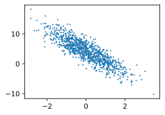

# 2 Linear Regression Implementation from Scratch

:label:`sec_linear_scratch`

* 我们学习了深度网络是如何实现和优化的。在这一过程中只使用张量和自动微分，不需要定义层或复杂的优化器。
* 这一节只触及到了表面知识。在下面的部分中，我们将基于刚刚介绍的概念描述其他模型，并学习如何更简洁地实现其他模型。

在了解线性回归的关键思想之后，我们可以开始通过代码来动手实现线性回归了。 在这一节中，我们将从零开始实现整个方法， 包括数据流水线、模型、损失函数和小批量随机梯度下降优化器。 虽然现代的深度学习框架几乎可以自动化地进行所有这些工作，但从零开始实现可以确保你真正知道自己在做什么。 同时，了解更细致的工作原理将方便我们自定义模型、自定义层或自定义损失函数。 在这一节中，我们将只使用张量和自动求导。 在之后的章节中，我们会充分利用深度学习框架的优势，介绍更简洁的实现方式。

```python
%matplotlib inline
import random
import torch
from d2l import torch as d2l
```

## 2.1 Generating the Dataset

为了简单起见，我们将根据带有噪声的线性模型构造一个人造数据集。 我们的任务是使用这个有限样本的数据集来恢复这个模型的参数。 我们将使用 低维数据，这样可以很容易地将其可视化。 在下面的代码中，我们生成一个包含 $1000$ 个样本的数据集， 每个样本包含从标准正态分布中采样的 $2$ 个特征。
Thus our synthetic dataset will be a matrix $\mathbf{X}\in \mathbb{R}^{1000 \times 2}$.

(**The true parameters generating our dataset will be $\mathbf{w} = [2, -3.4]^\top$ and $b = 4.2$, and**) our synthetic labels will be assigned according to the following linear model with the noise term $\epsilon$：

$$
\mathbf{y}= \mathbf{X} \mathbf{w} + b + \mathbf\epsilon.

$$

你可以将 ϵ 视为模型预测和标签时的潜在观测误差。 在这里我们认为标准假设成立，即 ϵ 服从均值为 0 的正态分布。 为了简化问题，我们将标准差设为0.01。 下面的代码生成合成数据集。

```python
def synthetic_data(w, b, num_examples):  #@save
    """Generate y = Xw + b + noise."""
    X = torch.normal(0, 1, (num_examples, len(w)))
    y = torch.matmul(X, w) + b
    y += torch.normal(0, 0.01, y.shape)
    return X, y.reshape((-1, 1))
```

```python
true_w = torch.tensor([2, -3.4])
true_b = 4.2
features, labels = synthetic_data(true_w, true_b, 1000)
```

Note that [**each row in `features` consists of a 2-dimensional data example
and that each row in `labels` consists of a 1-dimensional label value (a scalar).**]

```python
print('features:', features[0],'\nlabel:', labels[0])
```

features: tensor([-1.4598, -0.7918])
label: tensor([3.9780])
By generating a scatter plot using the second feature `features[:, 1]` and `labels`, we can clearly observe the linear correlation between the two.

```python
d2l.set_figsize()
# The semicolon is for displaying the plot only
d2l.plt.scatter(features[:, (1)].detach().numpy(), labels.detach().numpy(), 1);
```



## 2.2 Reading the Dataset

回想一下，训练模型时要对数据集进行遍历，每次抽取一小批量样本，并使用它们来更新我们的模型。 由于这个过程是训练机器学习算法的基础，所以有必要定义一个函数， 该函数能$\color{red}打乱数据集中的样本$并以$\color{red}小批量方式获取$数据。

In the following code, we [**define the `data_iter` function**] to demonstrate one possible implementation of this functionality. The function (

- takes a batch size, a matrix of features, and a vector of labels,
- yielding minibatches of the size `batch_size`.)

Each minibatch consists of a tuple of features and labels.

```python
def data_iter(batch_size, features, labels):
    num_examples = len(features)
    indices = list(range(num_examples))
    # 这些样本是随机的，没有特定顺序
    random.shuffle(indices)
    for i in range(0, num_examples, batch_size):
        batch_indices = torch.tensor(
            indices[i: min(i + batch_size, num_examples)]
        )
        # yield 类似于return，只有调用next函数才会继续进行
        yield features[batch_indices], labels[batch_indices]
```

通常，我们利用GPU并行运算的优势，处理合理大小的“小批量”。 每个样本都可以并行地进行模型计算，且每个样本损失函数的梯度也可以被并行计算。 GPU可以在处理几百个样本时，所花费的时间不比处理一个样本时多太多。

我们直观感受一下小批量运算：读取第一个小批量数据样本并打印。 每个批量的特征维度显示批量大小和输入特征数。 同样的，批量的标签形状与`batch_size` 相等

```python
batch_size = 10

for X, y in data_iter(batch_size, features, labels):
    print(X, '\n', y)
    break
```

```
tensor([[-1.0999,  0.4855],
[ 1.9538,  1.0919],
[ 1.5107, -0.2886],
[ 0.9734, -0.2309],
[ 0.6716, -1.0258],
[-0.9730, -0.7290],
[-0.6671, -0.8925],
[-0.7708, -0.3410],
[ 0.0294, -1.2729],
[-0.7009,  0.5991]])
tensor([[0.3487],
[4.4049],
[8.1914],
[6.9287],
[9.0329],
[4.7465],
[5.9153],
[3.8213],
[8.5887],
[0.7470]])
```


当我们运行迭代时，我们会连续地获得不同的小批量，直至遍历完整个数据集。 上面实现的迭代对于教学来说很好，但它的 $\color{red}执行效率很低$，可能会在实际问题上陷入麻烦。

- 例如，它要求我们将所有数据加载到内存中，并执行大量的随机内存访问。
- 在深度学习框架中实现的内置迭代器 `DataLoader` 效率要高得多， 它可以处理存储在文件中的数据和数据流提供的数据。

## 2.3 Initializing Model Parameters

在我们开始用小批量随机梯度下降优化我们的模型参数之前， 我们需要先有一些参数。 在下面的代码中，我们通过从均值为0、标准差为0.01的正态分布中采样随机数来初始化权重， 并将偏置初始化为0。

```python
w = torch.normal(0, 0.01, size=(2,1), requires_grad=True)
b = torch.zeros(1, requires_grad=True)
```

在初始化参数之后，我们的任务是更新这些参数，直到这些参数足够拟合我们的数据。 每次更新都需要计算损失函数关于模型参数的梯度。 有了这个梯度，我们就可以向减小损失的方向更新每个参数。 因为手动计算梯度很枯燥而且容易出错，所以没有人会手动计算梯度。 我们使用 [2.5节](../C2_preliminaries/2_5_autograd.md) 中引入的自动微分来计算梯度。

## 2.4 Defining the Model

接下来，我们必须定义模型，将模型的输入和参数同模型的输出关联起来。 回想一下，要计算线性模型的输出， 我们只需计算输入特征 $X $ 和模型权重 $w$ 的矩阵-向量乘法后加上偏置 $b$。 注意，上面的 $Xw$ 是一个向量，而 $b$ 是一个标量。 回想一下 [2.1.3节](https://zh.d2l.ai/chapter_preliminaries/ndarray.html#subsec-broadcasting) 中描述的广播机制： 当我们用一个向量加一个标量时，标量会被加到向量的每个分量上。

```python
def linreg(X, w, b):  #@save
    """The linear regression model."""
    return torch.matmul(X, w) + b
```

## 2.5 Defining the Loss Function

因为需要计算损失函数的梯度，所以我们应该先定义损失函数。 这里我们使用 [3_1_linear_regression.md](3_1_linear_regression.md) 中描述的平方损失函数。
In the implementation, we need to transform the true value `y` into the predicted value's shape `y_hat`. The result returned by the following function will also have the same shape as `y_hat`.

```python
def squared_loss(y_hat, y):  #@save
    """Squared loss."""
    return (y_hat - y.reshape(y_hat.shape)) ** 2 / 2
```

## 2.6 Defining the Optimization Algorithm

正如我们在 [3_1_linear_regression.md](3_1_linear_regression.md) 中讨论的，线性回归有解析解。 尽管线性回归有解析解，但本书中的其他模型却没有。 这里我们介绍 小批量随机梯度下降。

在每一步中，使用从数据集中随机抽取的一个小批量，然后根据参数计算损失的梯度。 接下来，朝着减少损失的方向更新我们的参数。 下面的函数实现小批量随机梯度下降更新。 该函数接受模型参数集合、学习速率和批量大小作为输入。

The size of the update step is determined by the learning rate `lr`. Because our loss is calculated as a sum over the minibatch of examples, we normalize our step size by the batch size (`batch_size`), so that the magnitude of a typical step size does not depend heavily on our choice of the batch size.

```python
def sgd(params, lr, batch_size):
    """mini batch SGD"""
    with torch.no_grad(): # 下面模块的计算，不会更新梯度
        for param in params:
            param -= lr*param.grad / batch_size
            param.grad.zero_()     # 上述语句用来“清除”x的梯度值，也就是重新赋值为0。
                                   #只有当x被求过一次梯度的时候，这个函数才能使用，否则会报错。
```

### 2.6.1 备注：`with torch.no_grad()`: 方法

- python 中的 `with` 语句适用于对资源进行访问的场合，确保不管使用过程中是否发生异常都会执行必要的“清理”操作，释放资源，比如文件使用后自动关闭／线程中锁的自动获取和释放等。

```python
file = open("１.txt")
data = file.read()
file.close()

```

存在问题如下：
（１）文件读取发生异常，但没有进行任何处理；
（２）可能忘记关闭文件句柄；

with 语句可以克服这些问题

```python
with open("１.txt") as file:
    data = file.read()

```

- 关于 torch.no_grad()

在该模块下，所有计算得出的 tensor 的 `requires_grad` 都自动设置为$\color{red}False$。反向传播时就不会自动求导了，可以大大节约显存

```python
x = torch.randn(10, 5, requires_grad = True)
y = torch.randn(10, 5, requires_grad = True)
z = torch.randn(10, 5, requires_grad = True)
with torch.no_grad():
    w = x + y + z
    print(w.requires_grad)
    print(w.grad_fn)
print(w.requires_grad)
---------------------------------------------------
False
None
False

```

## 2.7 Training

现在我们已经准备好了模型训练所有需要的要素，可以实现主要的训练过程部分了。 理解这段代码至关重要，因为从事深度学习后， 你会一遍又一遍地看到几乎相同的训练过程。

在每次迭代中，

1. 我们读取一小批量训练样本，并通过我们的模型来获得一组预测 (前向传播)。
2. 计算损失，
3. 对`loss func`反向传播，存储每个参数的梯度。
4. 最后，我们调用优化算法 `sgd` 来更新模型参数。

In summary, we will execute the following loop:

* $\color{red}\text{Initialize parameters}$ $(\mathbf{w}, b)$
* Repeat until done
  * $\color{red}\text{Compute gradient}$ $\mathbf{g} \leftarrow \partial_{(\mathbf{w},b)} \frac{1}{|\mathcal{B}|} \sum_{i \in \mathcal{B}} l(\mathbf{x}^{(i)}, y^{(i)}, \mathbf{w}, b)$
  * $\color{red}\text{Update parameters}$ $(\mathbf{w}, b) \leftarrow (\mathbf{w}, b) - \eta \mathbf{g}$

In each *epoch*, we will iterate through the entire dataset (using the `data_iter` function) once passing through every example in the training dataset (assuming that the number of examples is divisible by the batch size).

The number of epochs `num_epochs` and the learning rate `lr` are both hyperparameters, which we set here to 3 and 0.03, respectively. Unfortunately, 设置超参数很棘手，需要通过反复试验进行调整。 我们现在忽略这些细节，以后会在 [11节](https://zh.d2l.ai/chapter_optimization/index.html#chap-optimization)中详细介绍

```python
lr = 0.03
num_epochs = 3
net = linreg
loss = squared_loss
```

```python
# 训练 loop
for epoch in range(num_epochs):
    for X, y in data_iter(batch_size, features, labels):
        y_hat = net(X, w, b)                # 1. 获得模型预测值
        l = loss(y_hat, y)                  # 2. 计算损失
        l.sum().backward()                  # 3. 后向传播计算梯度，sum()表示对batch求和
        sgd([w, b], lr, batch_size)         # 4. 更新参数 （细节，传入列表引用）

    with torch.no_grad(): # 训练完一个 epoch 后, 打印结果
        train_l = loss(net(features, w, b), labels)
        print(f'epoch {epoch + 1}, loss {float(train_l.mean()):f}')

```

epoch 1, loss 0.035526
epoch 2, loss 0.000131
epoch 3, loss 0.000050
因为我们使用的是自己合成的数据集，所以我们知道真正的参数是什么。 因此，我们可以通过比较真实参数和通过训练学到的参数来评估训练的成功程度。 事实上，真实参数和通过训练学到的参数确实非常接近。

```python
print(f'error in estimating w: {true_w - w.reshape(true_w.shape)}')
print(f'error in estimating b: {true_b - b}')
```

error in estimating w: tensor([1.6928e-05, 1.8287e-04], grad_fn=<SubBackward0>)
error in estimating b: tensor([0.0004], grad_fn=<RsubBackward1>)
注意，我们不应该想当然地认为我们能够完美地求解参数。 在机器学习中，我们通常不太关心恢复真正的参数，而更关心如何高度准确预测参数。 幸运的是，即使是在复杂的优化问题上，随机梯度下降通常也能找到非常好的解。 其中一个原因是，在深度网络中存在许多参数组合能够实现高度精确的预测。

## Summary

* We saw how a deep network can be implemented and optimized from scratch, using just tensors and auto differentiation, without any need for defining layers or fancy optimizers.
* This section only scratches the surface of what is possible. In the following sections, we will describe additional models based on the concepts that we have just introduced and learn how to implement them more concisely.

## Exercises

1. What would happen if we were to initialize the weights to zero. Would the algorithm still work?
2. Assume that you are
   [Georg Simon Ohm](https://en.wikipedia.org/wiki/Georg_Ohm) trying to come up
   with a model between voltage and current. Can you use auto differentiation to learn the parameters of your model?
3. Can you use [Planck's Law](https://en.wikipedia.org/wiki/Planck%27s_law) to determine the temperature of an object using spectral energy density?
4. What are the problems you might encounter if you wanted to  compute the second derivatives? How would you fix them?
5. Why is the `reshape` function needed in the `squared_loss` function?
6. Experiment using different learning rates to find out how fast the loss function value drops.
7. If the number of examples cannot be divided by the batch size, what happens to the `data_iter` function's behavior?

[Discussions](https://discuss.d2l.ai/t/43)

$$


$$
