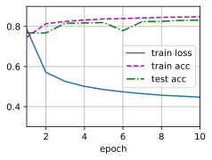
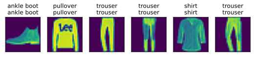

# 6 Implementation of Softmax Regression from Scratch

:label:`sec_softmax_scratch`

* 借助softmax回归，我们可以训练多分类的模型。
* 训练softmax回归循环模型与训练线性回归模型非常相似：先读取数据，再定义模型和损失函数，然后使用优化算法训练模型。大多数常见的深度学习模型都有类似的训练过程。

就像我们从零开始实现线性回归一样， 我们认为softmax回归也是重要的基础，因此你应该知道实现softmax回归的细节。 本节我们将使用刚刚在 [3.5节](https://zh.d2l.ai/chapter_linear-networks/image-classification-dataset.html#sec-fashion-mnist)中引入的Fashion-MNIST数据集， 并设置数据迭代器的批量大小为256。

```python
batch_size = 256
train_iter, test_iter = d2l.load_data_fashion_mnist(batch_size)
```

## 6.1 Initializing Model Parameters

和之前线性回归的例子一样，这里的每个样本都将用固定长度的向量表示。 原始数据集中的每个样本都是28×28的图像。 在本节中，我们将展平每个图像，把它们看作长度为784的向量。 在后面的章节中，我们将讨论能够利用图像空间结构的特征， 但现在我们暂时只把每个像素位置看作一个特征。

回想一下，在softmax回归中，我们的输出与类别一样多。 因为我们的数据集有10个类别，所以网络输出维度为10。 因此，权重将构成一个784×10的矩阵， 偏置将构成一个1×10的行向量。 与线性回归一样，我们将使用正态分布初始化我们的权重`W`，偏置初始化为0。

```python
num_inputs = 784
num_outputs = 10

W = torch.normal(0, 0.01, size=(num_inputs, num_outputs), requires_grad=True)
b = torch.zeros(num_outputs, requires_grad=True)
```

## 6.2 Defining the Softmax Operation

在实现softmax回归模型之前，我们简要 $\color{red}回顾$ 一下`sum`运算符如何沿着张量中的特定维度工作。 如 [2.3.6节](https://zh.d2l.ai/chapter_preliminaries/linear-algebra.html#subseq-lin-alg-reduction)和 [2.3.6.1节](https://zh.d2l.ai/chapter_preliminaries/linear-algebra.html#subseq-lin-alg-non-reduction)所述， 给定一个矩阵`X`，我们可以对所有元素求和（默认情况下）。 也可以只求同一个轴上的元素，即同一列（轴0）或同一行（轴1）。 如果`X`是一个形状为`(2, 3)`的张量，我们对列进行求和， 则结果将是一个具有形状`(3 ,)`的向量。 当调用`sum`运算符时，我们可以指定保持在原始张量的轴数，而不折叠求和的维度。 这将产生一个具有形状`(1, 3)`的二维张量。

```python
X = torch.tensor([[1.0, 2.0, 3.0], [4.0, 5.0, 6.0]])
X.sum(0, keepdim=True), X.sum(1, keepdim=True)
```

```python
(tensor([[5., 7., 9.]]),
tensor([[ 6.],
[15.]]))
```

We are now ready to (**implement the softmax operation**). Recall that softmax consists of three steps:

1. 对每个项求幂（使用`exp`）；
2. 对每一行求和（小批量中每个样本是一行），得到每个样本的规范化常数；
3. 将每一行除以其规范化常数，确保结果的和为1。

在查看代码之前，我们回顾一下这个表达式：

$$
\mathrm{softmax}(\mathbf{X})_{ij} = \frac{\exp(\mathbf{X}_{ij})}{\sum_k \exp(\mathbf{X}_{ik})}.

$$

分母或规范化常数，有时也称为 *配分函数 partition function* （其对数称为对数-配分函数）。 该名称来自[统计物理学](https://en.wikipedia.org/wiki/Partition_function_(statistical_mechanics))中一个模拟粒子群分布的方程。

```python
def softmax(X):
    X_exp = torch.exp(X)
    partition = X_exp.sum(1, keepdim=True)
    return X_exp / partition  # The broadcasting mechanism is applied here
```

正如你所看到的，对于任何随机输入，我们将每个元素变成一个非负数。 此外，依据概率原理，每行总和为1。

```python
X = torch.normal(0, 1, (2, 5))
X_prob = softmax(X)
X_prob, X_prob.sum(1)
```

```python
(tensor([[0.0622, 0.1872, 0.1356, 0.2527, 0.3623],
[0.1034, 0.1495, 0.3899, 0.3203, 0.0369]]),
tensor([1., 1.]))
```

注意，虽然这在数学上看起来是正确的，但我们在代码实现中有点草率。 矩阵中的非常大或非常小的元素可能造成数值上溢或下溢，但我们没有采取措施来防止这点。

## 6.3 Defining the Model

Now that we have defined the softmax operation, we can [**implement the softmax regression model.**]
下面的代码定义了输入如何通过网络映射到输出。 注意，将数据传递到模型之前，我们使用 `reshape` function
将每张原始图像 $flatten$ 为向量。

```python
def net(X):
    return softmax(torch.matmul(X.reshape((-1, W.shape[0])), W) + b)
```

## 6.4 Defining the Loss Function

接下来，我们实现 [3_4_softmax_regression.md](3_4_softmax_regression.md) 中引入的交叉熵损失函数。 这可能是深度学习中最常见的损失函数，因为目前分类问题的数量远远超过回归问题的数量。

$$
\color{magenta}l(\mathbf{y}, \hat{\mathbf{y}}) = H_{p^{predict}}(p^{true}) = - {\color{green}\sum_{j=1}^q y_j} \log \hat{y}_j

$$

回顾一下，交叉熵采用真实标签的预测概率的负对数似然。 这里我们不使用 Python 的 for 循环迭代预测（这往往是低效的）， 而是$\color{red}通过一个运算符选择所有元素$。

- 下面，我们创建一个数据样本`y_hat`，其中包含2个样本在3个类别的预测概率， 以及它们对应的标签`y=[0,2]`。
- 有了`y`，我们知道在第一个样本中，第 1 类是正确的预测； 而在第二个样本中，第 3 类是正确的预测。
- 然后使用`y`作为`y_hat`中概率的索引， 我们选择第一个样本中第 1 个类的概率和第二个样本中第 2 个类的概率。

```python
y = torch.tensor([0, 2])
y_hat = torch.tensor([[0.1, 0.3, 0.6], [0.3, 0.2, 0.5]])
y_hat[[0, 1], y]
```

```python
tensor([0.1000, 0.5000])
```

现在我们只需一行代码就可以实现交叉熵损失函数。

```python
def cross_entropy(y_hat, y):
    """选则 one-hot 编码 y 相应的标签的位置 idx_list，返回其 -torch.log(list, idx_list]

    :param y_hat: (batch size, num_class)
    :param y: (batch size, num_class)
    :return: (batch size)
    """
    return -torch.log(y_hat[range(len(y_hat)), y])
```

tensor([2.3026, 0.6931])

## 6.5 Classification Accuracy

Given the predicted probability distribution `y_hat`, 当我们必须输出硬预测（hard prediction）时， 我们通常选择预测概率最高的类。 许多应用都要求我们做出选择。如Gmail必须将电子邮件分类为“Primary（主要邮件）”、 “Social（社交邮件）”、“Updates（更新邮件）”或“Forums（论坛邮件）”。 Gmail做分类时可能在内部估计概率，但最终它必须在类中选择一个。

当预测与标签分类 `y` 一致时，即是正确的。 分类精度即正确预测数量与总预测数量之比。 虽然直接优化精度可能很困难（因为精度的计算不可导）， 但精度通常是我们最关心的性能衡量标准，我们在训练分类器时几乎总会关注它。

To compute accuracy we do the following.

- First, if `y_hat` is a matrix, we assume that the second dimension stores prediction scores for each class.
- We use `argmax` to obtain the predicted class by the index for the largest entry in each row.
- Then we [**compare the predicted class with the ground-truth `y` elementwise.**]
- Since the equality operator `==` is sensitive to data types, we convert `y_hat`'s data type to match that of `y`.
- The result is a tensor containing entries of 0 (false) and 1 (true). Taking the sum yields the number of correct predictions.

```python
def accuracy(y_hat, y):  #@save
    """Compute the number of correct predictions."""
    if len(y_hat.shape) > 1 and y_hat.shape[1] > 1:
        y_hat = y_hat.argmax(axis=1)
    cmp = y_hat.type(y.dtype) == y
    return float(cmp.type(y.dtype).sum())
```

We will continue to use the variables `y_hat` and `y` defined before as the predicted probability distributions and labels, respectively.
可以看到，第一个样本的预测类别是2（该行的最大元素为0.6，索引为2），这与实际标签0不一致。 第二个样本的预测类别是2（该行的最大元素为0.5，索引为2），这与实际标签2一致。 因此，这两个样本的分类精度率为0.5。

```python
accuracy(y_hat, y) / len(y)
```

0.5

[**Similarly, we can evaluate the accuracy for any model `net` on a dataset**] that is accessed via the data iterator `data_iter`.

```python
def evaluate_accuracy(net, data_iter):  #@save
    """计算在指定数据集上模型的精度"""
    if isinstance(net, torch.nn.Module):
        net.eval()  # 将模型设置为评估模式
    metric = Accumulator(2)  # 正确预测数、预测总数
    with torch.no_grad():
        for X, y in data_iter:
            metric.add(accuracy(net(X), y), y.numel()) # tensor().numel() return int, 表示张量中元素总个数
    return metric[0] / metric[1]
```

Here `Accumulator` is a utility class to $\color{red}\text{accumulate sums}$ over multiple variables. In the above `evaluate_accuracy` function, we create 2 variables in the `Accumulator` instance for storing both
the number of correct predictions and the number of predictions, respectively. Both will be accumulated over time as we iterate over the dataset.

```python
class Accumulator:  #@save
    """For accumulating sums over `n` variables."""
    def __init__(self, n):
        self.data = [0.0] * n

    def add(self, *args):
        self.data = [a + float(b) for a, b in zip(self.data, args)]

    def reset(self):
        self.data = [0.0] * len(self.data)

    def __getitem__(self, idx):
        return self.data[idx]
```

由于我们使用随机权重初始化`net`模型， 因此该模型的精度应接近于随机猜测。 例如在有10个类别情况下的精度为0.1。

```python
evaluate_accuracy(net, test_iter)
```

0.0967

## 6.6 Training

[**The training loop**] for softmax regression should look strikingly familiar if you read through our implementation of linear regression in [3_2_linear_regression_scratch.md](3_2_linear_regression_scratch.md).
在这里，我们重构训练过程的实现以使其可重复使用。 首先，我们定义一个函数来训练一个迭代周期。
Note that `updater` is a general function to $\color{red}\text{update the model parameters}$, which accepts the batch size as an argument. It can be either a wrapper of the `d2l.sgd` function or a framework's built-in optimization function.

```python
def train_epoch_ch3(net, train_iter, loss, updater):
    # 将模型设置为 训练模式
    if isinstance(net, torch.nn.Module):
        net.train()
    # 训练损失总和、训练精确度总和、样本数
    metric = Accumulator(3)
    for X, y in train_iter:
        # 计算梯度并更新参数
        y_hat = net(X)
        l = loss(y_hat, y)
        if isinstance(updater, torch.optim.Optimizer):
            updater.zero_grad()
            l.mean().backward()                     # 向量的反向传播，不过提前算了均值
            updater.step()
        else:
            # 使用 自定义 的优化器 和 loss function
            l.sum().backward()                      # 向量的反向传播
            updater(X.shape[0])                   # 对整个batchsize更新参数
        metric.add(float(l.sum()), accuracy(y_hat, y), y.numel())
    # 返回训练损失和训练精度
    return metric[0] / metric[2], metric[1] / metric[2]
```

在展示训练函数的实现之前，我们定义一个在动画中绘制数据的实用程序类 `Animator`, 它能够简化其余部分的代码

```python
class Animator:  #@save
    """For plotting data in animation."""
    def __init__(self, xlabel=None, ylabel=None, legend=None, xlim=None,
                 ylim=None, xscale='linear', yscale='linear',
                 fmts=('-', 'm--', 'g-.', 'r:'), nrows=1, ncols=1,
                 figsize=(3.5, 2.5)):
        # Incrementally plot multiple lines
        if legend is None:
            legend = []
        d2l.use_svg_display()
        self.fig, self.axes = d2l.plt.subplots(nrows, ncols, figsize=figsize)
        if nrows * ncols == 1:
            self.axes = [self.axes, ]
        # Use a lambda function to capture arguments
        self.config_axes = lambda: d2l.set_axes(
            self.axes[0], xlabel, ylabel, xlim, ylim, xscale, yscale, legend)
        self.X, self.Y, self.fmts = None, None, fmts

    def add(self, x, y):
        # Add multiple data points into the figure
        if not hasattr(y, "__len__"):
            y = [y]
        n = len(y)
        if not hasattr(x, "__len__"):
            x = [x] * n
        if not self.X:
            self.X = [[] for _ in range(n)]
        if not self.Y:
            self.Y = [[] for _ in range(n)]
        for i, (a, b) in enumerate(zip(x, y)):
            if a is not None and b is not None:
                self.X[i].append(a)
                self.Y[i].append(b)
        self.axes[0].cla()
        for x, y, fmt in zip(self.X, self.Y, self.fmts):
            self.axes[0].plot(x, y, fmt)
        self.config_axes()
        display.display(self.fig)
        display.clear_output(wait=True)
```

The following training function then trains a model `net` on a training dataset accessed via `train_iter`
for multiple epochs, which is specified by `num_epochs`. At the end of each epoch, the model is evaluated on a testing dataset accessed via `test_iter`. We will leverage the `Animator` class to visualize
the training progress.

```python
def train_ch3(net, train_iter, test_iter, loss, num_epochs, updater):  #@save
    """Train a model (defined in Chapter 3)."""
    animator = Animator(xlabel='epoch', xlim=[1, num_epochs], ylim=[0.3, 0.9],
                        legend=['train loss', 'train acc', 'test acc'])
    for epoch in range(num_epochs):
        train_metrics = train_epoch_ch3(net, train_iter, loss, updater)
        test_acc = evaluate_accuracy(net, test_iter)
        animator.add(epoch + 1, train_metrics + (test_acc,))
    train_loss, train_acc = train_metrics
    assert train_loss < 0.5, train_loss
    assert train_acc <= 1 and train_acc > 0.7, train_acc
    assert test_acc <= 1 and test_acc > 0.7, test_acc
```

作为一个从零开始的实现，我们使用 [3.2节](https://zh.d2l.ai/chapter_linear-networks/linear-regression-scratch.html#sec-linear-scratch)中定义的 小批量随机梯度下降来优化模型的损失函数，设置学习率为0.1。

```python
lr = 0.1

def updater(batch_size):
    return d2l.sgd([W, b], lr, batch_size)
```

Now we [**train the model with 10 epochs.**] Note that both the number of epochs (`num_epochs`), and learning rate (`lr`) are adjustable hyperparameters. By changing their values, we may be able to increase the classification accuracy of the model.

```python
num_epochs = 10
train_ch3(net, train_iter, test_iter, cross_entropy, num_epochs, updater)
```



## 6.7 Prediction

现在训练已经完成，我们的模型已经准备好对图像进行分类预测。 给定一系列图像，我们将比较它们的实际标签（文本输出的第一行）和模型预测（文本输出的第二行）。

```python
def predict_ch3(net, test_iter, n=6):  #@save
    """Predict labels (defined in Chapter 3)."""
    for X, y in test_iter:
        break
    trues = d2l.get_fashion_mnist_labels(y)
    preds = d2l.get_fashion_mnist_labels(net(X).argmax(axis=1))
    titles = [true +'\n' + pred for true, pred in zip(trues, preds)]
    d2l.show_images(
        X[0:n].reshape((n, 28, 28)), 1, n, titles=titles[0:n])

predict_ch3(net, test_iter)
```



## Summary

* With softmax regression, we can train models for multiclass classification.
* The training loop of softmax regression is very similar to that in linear regression: retrieve and read data, define models and loss functions, then train models using optimization algorithms. As you will soon find out, most common deep learning models have similar training procedures.

## Exercises

1. In this section, we directly implemented the softmax function based on the mathematical definition of the softmax operation. What problems might this cause? Hint: try to calculate the size of $\exp(50)$.
2. The function `cross_entropy` in this section was implemented according to the definition of the cross-entropy loss function.  What could be the problem with this implementation? Hint: consider the domain of the logarithm.
3. What solutions you can think of to fix the two problems above?
4. Is it always a good idea to return the most likely label? For example, would you do this for medical diagnosis?
5. Assume that we want to use softmax regression to predict the next word based on some features. What are some problems that might arise from a large vocabulary?

[Discussions](https://discuss.d2l.ai/t/51)
